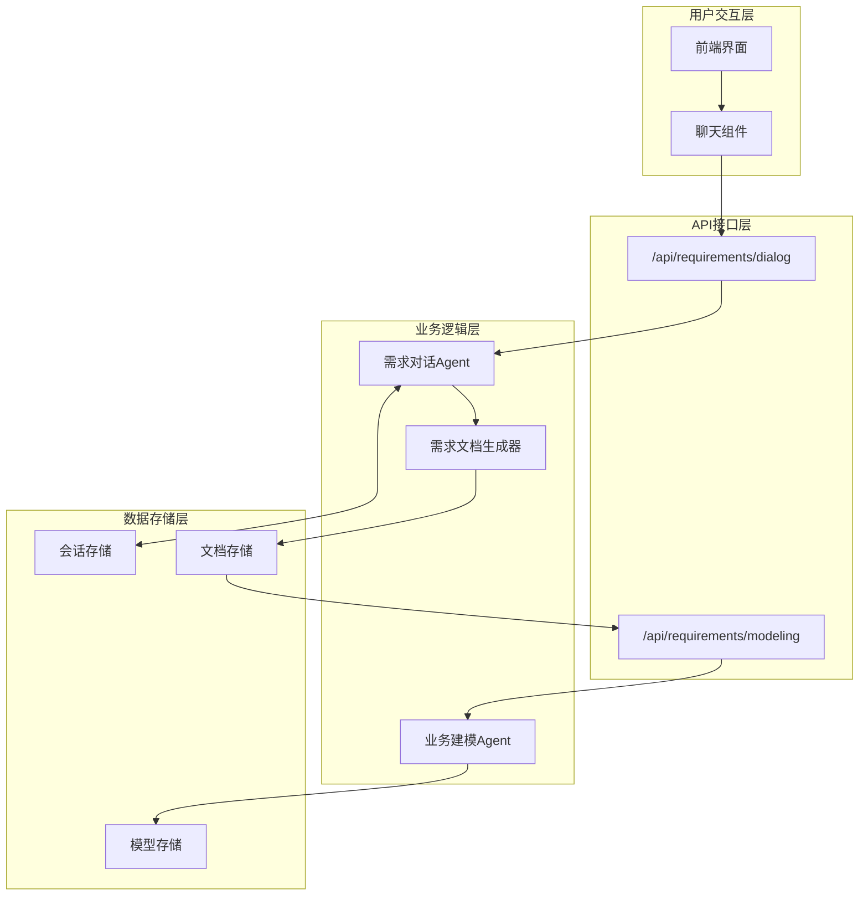
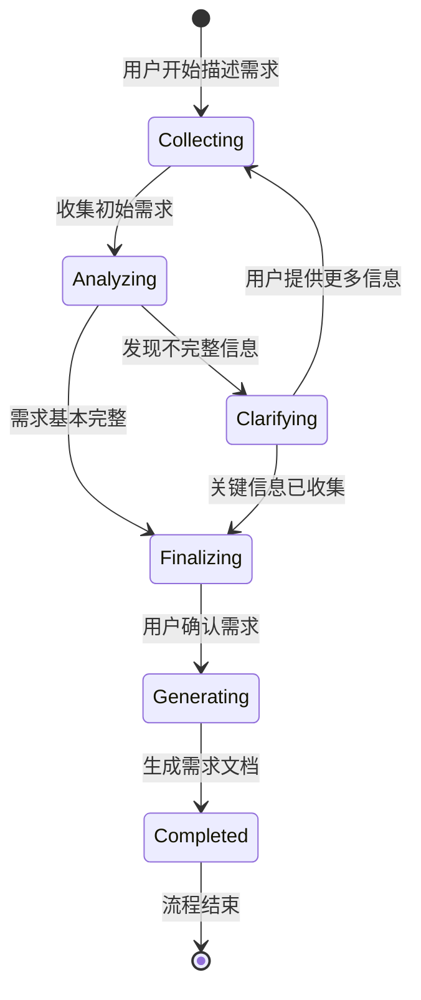
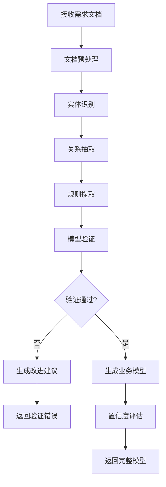

# 需求解析系统优化设计

## 系统概述

基于当前需求解析功能存在的API接口冗余和职责不清的问题，本设计提出了一个两阶段的需求解析优化方案：第一阶段通过多轮对话生成完整的需求说明文档，第二阶段基于该文档进行结构化业务建模。

### 核心问题分析

1. **API接口冗余**：当前存在独立的解析和澄清接口，导致交互流程复杂
2. **职责混乱**：结构化解析Agent承担了需求澄清的职责，应当分离
3. **用户体验差**：多个接口调用导致前端逻辑复杂，用户交互不连贯

### 优化目标

1. 统一API接口，提供流式多轮对话体验
2. 明确两个Agent的职责边界
3. 生成高质量的需求说明文档作为中间产物
4. 实现结构化业务建模的精确转换

## 系统架构

### 整体架构设计



### 核心组件设计

#### 1. 需求对话Agent (RequirementDialogAgent)

**职责**：
- 与用户进行多轮对话
- 识别需求中的模糊点和不完整信息
- 引导用户提供详细的业务描述
- 生成完整的需求说明文档

**核心能力**：
- 自然语言理解和对话管理
- 需求完整性评估
- 领域知识应用
- 文档结构化生成

#### 2. 业务建模Agent (BusinessModelingAgent)

**职责**：
- 基于完整的需求说明文档进行业务分析
- 生成结构化的业务模型
- 识别实体、关系和业务规则
- 提供置信度评估

**核心能力**：
- 业务实体识别
- 关系抽取和建模
- 业务规则提取
- 模型验证和优化

## API接口设计

### 需求对话接口

**端点**: `POST /api/requirements/dialog`

**设计原则**：
- 采用与`chat.post.ts`相同的流式设计模式
- 支持多轮对话上下文管理
- 提供对话状态跟踪

**请求结构**：
```typescript
interface RequirementDialogRequest {
  messages: ChatMessage[];
  model?: AvailableModelNames;
  conversationId?: string;
  context?: {
    domain?: string;
    previousRequirements?: string[];
  };
}
```

**响应结构**：
```typescript
interface RequirementDialogResponse {
  // 流式返回消息内容
  message: string;
  // 对话状态
  dialogState: 'collecting' | 'clarifying' | 'finalizing' | 'completed';
  // 需求完整性评分
  completeness?: number;
  // 生成的需求文档（完成时）
  requirementDocument?: RequirementDocument;
}
```

### 业务建模接口

**端点**: `POST /api/requirements/modeling`

**请求结构**：
```typescript
interface BusinessModelingRequest {
  requirementDocument: RequirementDocument;
  options?: {
    model?: AvailableModelNames;
    includeConfidenceAnalysis?: boolean;
    validationLevel?: 'basic' | 'strict';
  };
}
```

**响应结构**：
```typescript
interface BusinessModelingResponse {
  success: boolean;
  businessModel?: BusinessModel;
  confidence?: ConfidenceScore;
  validationErrors?: ValidationError[];
  suggestions?: string[];
}
```

## 数据模型设计

### 需求说明文档 (RequirementDocument)

```typescript
interface RequirementDocument {
  id: string;
  title: string;
  description: string;
  domain: string;
  
  // 功能需求
  functionalRequirements: FunctionalRequirement[];
  
  // 非功能需求  
  nonFunctionalRequirements: NonFunctionalRequirement[];
  
  // 业务约束
  businessConstraints: BusinessConstraint[];
  
  // 用户场景
  userScenarios: UserScenario[];
  
  // 术语表
  glossary: GlossaryItem[];
  
  // 元数据
  metadata: {
    createdAt: Date;
    updatedAt: Date;
    version: string;
    completeness: number;
    reviewStatus: 'draft' | 'reviewed' | 'approved';
  };
}
```

### 业务模型 (BusinessModel)

基于现有的`ParsedRequirement`结构，但去除澄清问题相关字段：

```typescript
interface BusinessModel {
  id: string;
  sourceDocumentId: string;
  
  // 业务实体
  entities: BusinessEntity[];
  
  // 实体关系
  relationships: EntityRelationship[];
  
  // 业务规则
  businessRules: BusinessRule[];
  
  // 领域信息
  domain: string;
  complexity: 'simple' | 'medium' | 'complex' | 'highly_complex';
  
  // 置信度评估
  confidence: number;
  confidenceFactors: ConfidenceFactors;
  
  // 验证结果
  validationStatus: 'valid' | 'invalid' | 'warning';
  validationMessages: string[];
}
```

## 业务流程设计

### 需求对话流程



**关键状态说明**：

1. **Collecting**：收集用户的初始需求描述
2. **Analyzing**：分析需求完整性和清晰度
3. **Clarifying**：针对模糊点提出具体问题
4. **Finalizing**：确认需求的最终版本
5. **Generating**：生成结构化的需求说明文档
6. **Completed**：对话完成，输出最终文档

### 业务建模流程



## 技术实现策略

### Agent职责重构

#### RequirementDialogAgent核心方法

```typescript
class RequirementDialogAgent {
  // 处理对话轮次
  async processDialogTurn(
    messages: ChatMessage[],
    context: DialogContext
  ): Promise<DialogResponse>;
  
  // 评估需求完整性
  async assessCompleteness(
    requirement: string,
    domain?: string
  ): Promise<CompletenessScore>;
  
  // 生成澄清问题
  async generateClarificationQuestions(
    requirement: string,
    context: DialogContext
  ): Promise<ClarificationQuestion[]>;
  
  // 生成需求文档
  async generateRequirementDocument(
    dialogHistory: ChatMessage[]
  ): Promise<RequirementDocument>;
}
```

#### BusinessModelingAgent优化

移除澄清相关功能，专注于建模：

```typescript
class BusinessModelingAgent {
  // 从文档解析业务模型
  async parseBusinessModel(
    document: RequirementDocument,
    options?: ModelingOptions
  ): Promise<BusinessModelingResult>;
  
  // 验证业务模型一致性
  async validateModel(
    model: BusinessModel
  ): Promise<ValidationResult>;
  
  // 优化模型结构
  async optimizeModel(
    model: BusinessModel
  ): Promise<BusinessModel>;
}
```

### 流式响应实现

参考`chat.post.ts`的设计，实现流式对话：

```typescript
export default defineEventHandler(async (event: H3Event) => {
  const request = await readBody<RequirementDialogRequest>(event);
  
  // 创建对话Agent实例
  const dialogAgent = new RequirementDialogAgent({
    model: request.model || DEFAULT_MODEL,
    domain: request.context?.domain
  });
  
  // 处理流式对话
  return streamText({
    model: llmProvider(request.model || DEFAULT_MODEL),
    messages: request.messages,
    tools: {
      // 添加需求分析相关工具
      assessCompleteness: tool({
        description: '评估需求完整性',
        parameters: z.object({
          requirement: z.string(),
          domain: z.string().optional()
        }),
        execute: async ({ requirement, domain }) => {
          return await dialogAgent.assessCompleteness(requirement, domain);
        }
      }),
      
      generateDocument: tool({
        description: '生成需求说明文档',
        parameters: z.object({
          finalizeDialog: z.boolean()
        }),
        execute: async ({ finalizeDialog }) => {
          if (finalizeDialog) {
            return await dialogAgent.generateRequirementDocument(request.messages);
          }
        }
      })
    }
  });
});
```

### 前端集成策略

利用现有的`useChat`组合式函数，通过URL切换实现功能复用：

```typescript
// 需求对话模式
const requirementChat = useChat({
  api: '/api/requirements/dialog',
  // 其他配置保持一致
});

// 业务建模调用
const generateBusinessModel = async (document: RequirementDocument) => {
  return await $fetch('/api/requirements/modeling', {
    method: 'POST',
    body: { requirementDocument: document }
  });
};
```

## 文档质量保证

### 需求文档生成规范

**文档结构标准**：
- 明确的标题和描述
- 完整的功能需求列表
- 具体的业务约束说明
- 详细的用户场景描述
- 专业术语定义

**质量评估指标**：
- 完整性评分（0-1）
- 清晰度评分（0-1）
- 可实现性评分（0-1）
- 一致性检查结果

### 建模准确性提升

**输入预处理**：
- 文档结构验证
- 关键信息提取
- 领域知识匹配

**输出后处理**：
- 模型一致性检查
- 实体关系验证
- 业务规则合理性评估

## 测试策略

### 对话流程测试

**测试场景**：
- 简单需求的完整对话流程
- 复杂需求的多轮澄清过程
- 模糊需求的引导式收集
- 不同领域需求的专业性对话

**验证标准**：
- 对话连贯性和自然度
- 问题的针对性和有效性
- 文档生成的完整性和准确性

### 建模精度测试

**测试数据**：
- 标准化的需求文档集合
- 不同复杂度的业务场景
- 多领域的业务模型样本

**评估指标**：
- 实体识别准确率
- 关系抽取精确度
- 业务规则完整性
- 整体置信度分布

## 部署与监控

### 性能优化

**响应时间控制**：
- 对话轮次：< 3秒
- 文档生成：< 10秒
- 业务建模：< 15秒

**资源使用优化**：
- 会话状态的内存管理
- 模型推理的批处理优化
- 缓存策略的合理应用

### 监控指标

**业务指标**：
- 对话成功完成率
- 文档生成质量评分
- 用户满意度反馈

**技术指标**：
- API响应时间分布
- 错误率和重试次数
- 资源消耗监控