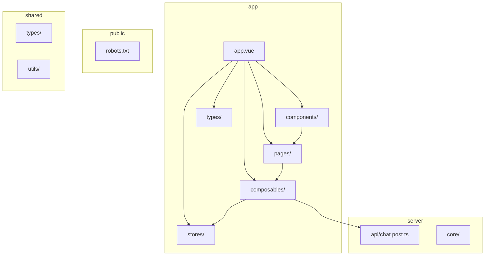
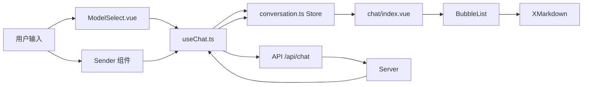
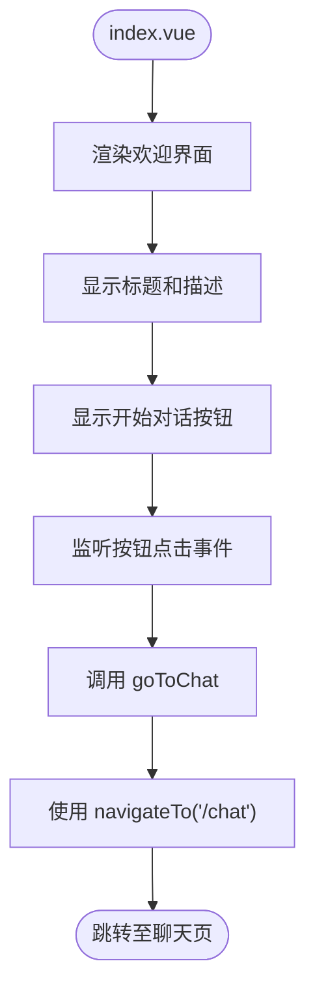
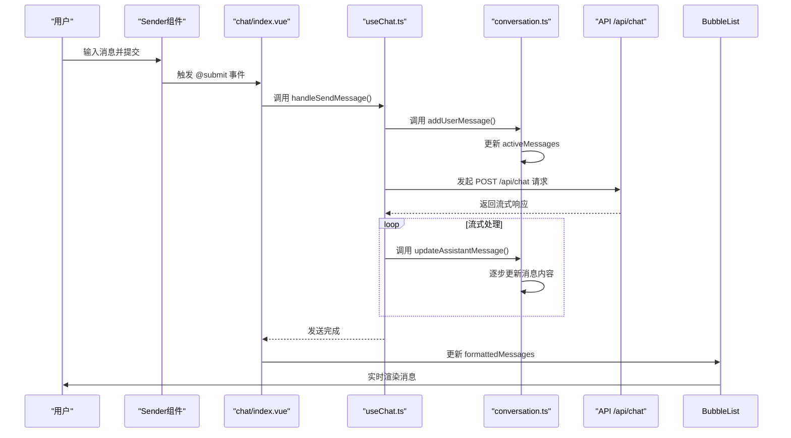
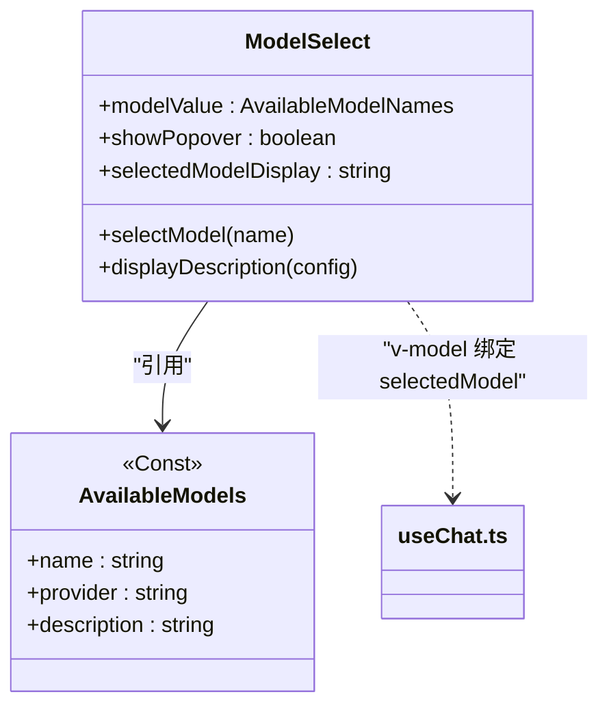
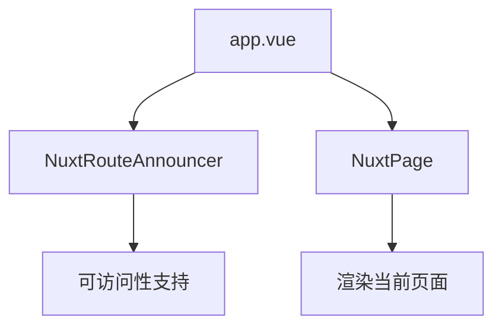

# 前端架构

<cite>
**本文档引用的文件**  
- [app.vue](file://app/app.vue)
- [index.vue](file://app/pages/index.vue)
- [chat/index.vue](file://app/pages/chat/index.vue)
- [CodePreview.vue](file://app/components/CodePreview.vue)
- [ModelSelect.vue](file://app/components/ModelSelect.vue)
- [useChat.ts](file://app/composables/useChat.ts)
- [conversation.ts](file://app/stores/conversation.ts)
- [conversation.ts](file://app/types/conversation.ts)
- [chat.ts](file://app/types/chat.ts)
- [conv-repos.ts](file://app/types/conv-repos.ts)
</cite>

## 目录
1. [简介](#简介)
2. [项目结构](#项目结构)
3. [核心组件](#核心组件)
4. [架构概览](#架构概览)
5. [详细组件分析](#详细组件分析)
6. [依赖分析](#依赖分析)
7. [性能考虑](#性能考虑)
8. [故障排除指南](#故障排除指南)
9. [结论](#结论)

## 简介
本文档全面阐述了基于 Nuxt 3 的 code_gen 前端架构设计原理与实现细节。重点分析了页面路由机制、核心组件构成、组合式函数逻辑以及状态管理机制。通过深入解析关键文件，展示了从用户交互到数据流处理的完整链路，涵盖主界面、聊天页、代码预览、模型选择等核心功能模块。

## 项目结构
code_gen 项目采用 Nuxt 3 的标准目录结构，以 `app` 目录为核心，组织页面、组件、组合式函数和状态管理模块。整体结构清晰，职责分明，遵循现代前端工程化最佳实践。



**图示来源**  
- [app](file://app)
- [server](file://server)
- [shared](file://shared)

**本节来源**  
- [app](file://app)
- [server](file://server)
- [shared](file://shared)

## 核心组件
本项目的核心组件包括：`app.vue` 作为根布局组件，`index.vue` 和 `chat/index.vue` 构成主界面与聊天页，`CodePreview.vue` 用于渲染和预览生成的代码块，`ModelSelect.vue` 实现模型切换交互。这些组件通过 `useChat.ts` 组合式函数与 `conversation.ts` Pinia store 协同工作，形成完整的会话管理闭环。

**本节来源**  
- [app.vue](file://app/app.vue)
- [index.vue](file://app/pages/index.vue)
- [chat/index.vue](file://app/pages/chat/index.vue)
- [CodePreview.vue](file://app/components/CodePreview.vue)
- [ModelSelect.vue](file://app/components/ModelSelect.vue)
- [useChat.ts](file://app/composables/useChat.ts)
- [conversation.ts](file://app/stores/conversation.ts)

## 架构概览
系统采用 Nuxt 3 的模块化架构，以 Composition API 为核心，结合 Pinia 进行状态管理。数据流从用户输入开始，经由 `useChat.ts` 封装的逻辑处理，最终更新到 UI 组件。整体架构清晰，响应式系统确保了数据与视图的同步。



**图示来源**  
- [chat/index.vue](file://app/pages/chat/index.vue)
- [useChat.ts](file://app/composables/useChat.ts)
- [conversation.ts](file://app/stores/conversation.ts)

## 详细组件分析
本节深入分析各个关键组件的实现细节，包括其功能、数据流和与其他组件的交互方式。

### 主界面分析
`index.vue` 是应用的首页，提供简洁的欢迎界面和导航入口。它通过 `navigateTo` 函数实现到聊天页的路由跳转。



**图示来源**  
- [index.vue](file://app/pages/index.vue#L30-L36)

**本节来源**  
- [index.vue](file://app/pages/index.vue)

### 聊天页分析
`chat/index.vue` 是应用的核心页面，实现了完整的聊天界面，包括会话管理、消息展示、输入发送和交互操作。

#### 组件关系图
```mermaid
classDiagram
class chat/index.vue {
+messages : ChatMessage[]
+loading : boolean
+error : string
+selectedModel : string
+inputMessage : string
+handleSendMessage()
+handleRegenerate()
+handleExtractCode()
+handlePreview()
+handleDownload()
}
class Conversations {
<<Component>>
+v-model : active
+items
+@change
+@menu-command
}
class BubbleList {
<<Component>>
+list
+#header
+#content
+#footer
}
class Sender {
<<Component>>
+v-model
+@submit
+#prefix
}
class ModelSelect {
<<Component>>
+v-model
}
class CodePreview {
<<Component>>
+openDialog()
}
chat/index.vue --> Conversations : "使用"
chat/index.vue --> BubbleList : "使用"
chat/index.vue --> Sender : "使用"
chat/index.vue --> ModelSelect : "使用"
chat/index.vue --> CodePreview : "使用"
Sender --> ModelSelect : "嵌套在 prefix 插槽"
```

**图示来源**  
- [chat/index.vue](file://app/pages/chat/index.vue)
- [ModelSelect.vue](file://app/components/ModelSelect.vue)
- [CodePreview.vue](file://app/components/CodePreview.vue)

#### 消息发送序列图


**图示来源**  
- [chat/index.vue](file://app/pages/chat/index.vue#L170-L187)
- [useChat.ts](file://app/composables/useChat.ts#L150-L290)

**本节来源**  
- [chat/index.vue](file://app/pages/chat/index.vue)
- [useChat.ts](file://app/composables/useChat.ts)

### CodePreview 组件分析
`CodePreview.vue` 组件利用 `@vue/repl` 提供在线代码预览功能，支持 Vue 3 组件的实时渲染。

```mermaid
flowchart TD
A[openDialog(code)] --> B[genPreviewCode(code)]
B --> C[componentCode.value = 生成的代码]
C --> D[dialogVisible.value = true]
D --> E[Repl 组件加载]
E --> F[store.setFiles()]
F --> G[设置 App.vue, element-plus.js 等]
G --> H[store.mainFile = PlaygroundMain.vue]
H --> I[Repl 渲染预览]
```

**图示来源**  
- [CodePreview.vue](file://app/components/CodePreview.vue#L40-L75)

**本节来源**  
- [CodePreview.vue](file://app/components/CodePreview.vue)
- [#shared/utils/repair-vue.ts](file://shared/utils/repair-vue.ts)
- [#shared/utils/code.ts](file://shared/utils/code.ts)

### ModelSelect 组件分析
`ModelSelect.vue` 组件通过 `el-popover` 实现下拉式模型选择界面，支持双向绑定。



**图示来源**  
- [ModelSelect.vue](file://app/components/ModelSelect.vue)
- [#shared/types/model.ts](file://shared/types/model.ts)

**本节来源**  
- [ModelSelect.vue](file://app/components/ModelSelect.vue)

### useChat 组合式函数分析
`useChat.ts` 是核心逻辑封装，管理聊天会话的完整生命周期。

#### 核心方法流程图
```mermaid
flowchart TD
A[sendMessage] --> B{内容为空?}
B --> |是| C[返回]
B --> |否| D[loading = true]
D --> E[addUserMessage]
E --> F[generateResponse]
F --> G[fetch /api/chat]
G --> H{响应成功?}
H --> |否| I[设置 error]
H --> |是| J[reader.read()]
J --> K{done?}
K --> |否| L[解析 data: 消息]
L --> M[updateAssistantMessage]
M --> J
K --> |是| N[loading = false]
I --> N
N --> O[完成]
```

**图示来源**  
- [useChat.ts](file://app/composables/useChat.ts#L150-L290)

#### 与 Pinia Store 协同关系
```mermaid
classDiagram
class useChat {
+messages : computed
+loading : ref
+error : ref
+selectedModel : ref
+sendMessage()
+regenerate()
+clearMessages()
}
class conversationStore {
<<Pinia Store>>
+conversations : ref
+activeConversationId : ref
+activeMessages : computed
+addMessage()
+updateMessage()
+clearMessages()
}
useChat --> conversationStore : "依赖注入"
useChat ..> chat/index.vue : "提供响应式数据和方法"
```

**图示来源**  
- [useChat.ts](file://app/composables/useChat.ts)
- [conversation.ts](file://app/stores/conversation.ts)

**本节来源**  
- [useChat.ts](file://app/composables/useChat.ts)
- [conversation.ts](file://app/stores/conversation.ts)

### app.vue 根组件分析
`app.vue` 作为应用的根组件，负责全局布局和路由渲染。



**图示来源**  
- [app.vue](file://app/app.vue)

**本节来源**  
- [app.vue](file://app/app.vue)

## 依赖分析
项目依赖关系清晰，核心依赖链如下：

```mermaid
graph TD
A[chat/index.vue] --> B[useChat.ts]
B --> C[conversation.ts]
C --> D[Pinia]
A --> E[ModelSelect.vue]
E --> F[#shared/types/model.ts]
A --> G[CodePreview.vue]
G --> H[@vue/repl]
G --> I[#shared/utils/repair-vue.ts]
B --> J[API /api/chat]
J --> K[Server]
```

**图示来源**  
- [chat/index.vue](file://app/pages/chat/index.vue)
- [useChat.ts](file://app/composables/useChat.ts)
- [conversation.ts](file://app/stores/conversation.ts)
- [ModelSelect.vue](file://app/components/ModelSelect.vue)
- [CodePreview.vue](file://app/components/CodePreview.vue)

**本节来源**  
- [chat/index.vue](file://app/pages/chat/index.vue)
- [useChat.ts](file://app/composables/useChat.ts)
- [conversation.ts](file://app/stores/conversation.ts)

## 性能考虑
- **响应式优化**：使用 `computed` 和 `readonly` 减少不必要的响应式开销。
- **流式渲染**：通过 `fetch` 流式读取 API 响应，实现消息的渐进式渲染。
- **资源预加载**：`Repl` 组件在对话框打开时才初始化，避免首屏加载过重。
- **内存管理**：在 `onUnmounted` 中清理 `ResizeObserver`，防止内存泄漏。

## 故障排除指南
- **消息发送失败**：检查 `error` 状态，确认网络连接和 API 可用性。
- **预览功能不工作**：确保 `componentCode` 被正确设置，且 `Repl` 所需依赖已加载。
- **模型选择无反应**：确认 `selectedModel` 在 `useChat` 和 `ModelSelect` 之间正确绑定。
- **会话数据丢失**：检查 `Pinia` store 的持久化配置（如有）。

**本节来源**  
- [useChat.ts](file://app/composables/useChat.ts#L220-L250)
- [CodePreview.vue](file://app/components/CodePreview.vue#L10-L15)
- [chat/index.vue](file://app/pages/chat/index.vue#L100-L110)

## 结论
code_gen 前端架构设计合理，充分利用了 Nuxt 3 和 Vue 3 的现代特性。通过 Composition API 封装业务逻辑，Pinia 管理全局状态，实现了高内聚、低耦合的组件体系。数据流清晰，从用户输入到 UI 更新的路径明确，便于维护和扩展。整体架构展现了良好的工程实践，为 AI 代码生成应用提供了稳定可靠的基础。