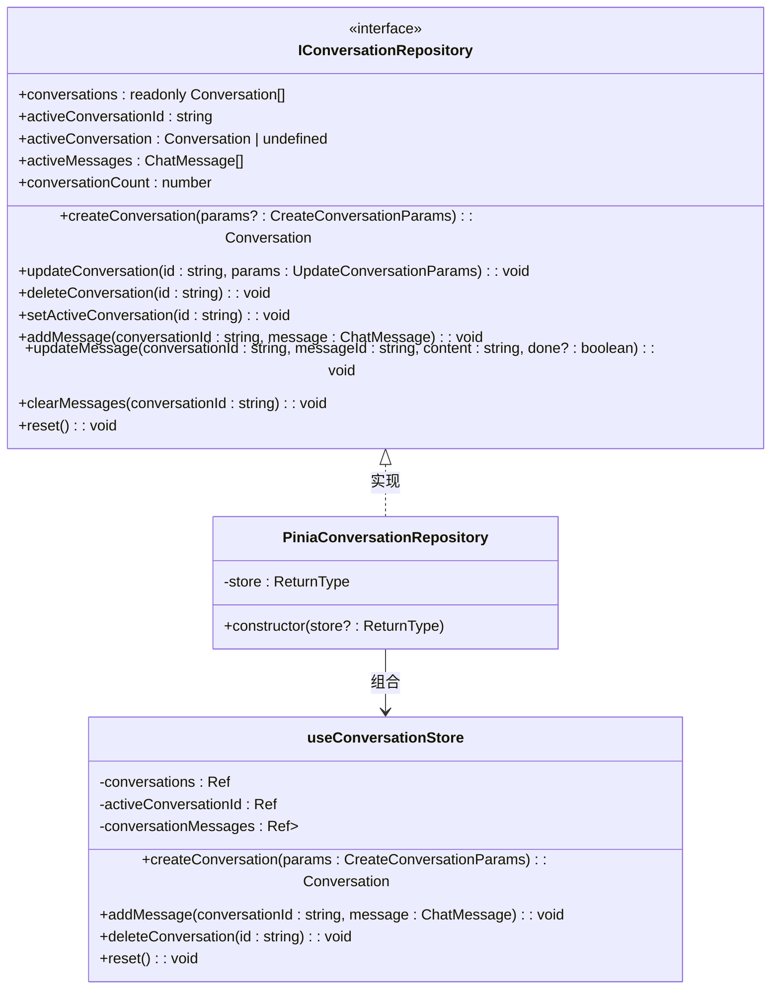

# 状态管理

<cite>
**本文档中引用的文件**  
- [conversation.ts](file://app/stores/conversation.ts)
- [conv-repos.ts](file://app/types/conv-repos.ts)
- [pinia-conv-repos.ts](file://app/utils/pinia-conv-repos.ts)
- [conversation.ts](file://app/types/conversation.ts)
</cite>

## 目录
1. [引言](#引言)
2. [会话Store结构](#会话store结构)
3. [会话的增删改查操作](#会话的增删改查操作)
4. [数据持久化机制](#数据持久化机制)
5. [数据访问抽象层：PiniaConversationRepository](#数据访问抽象层piniaconversationrepository)
6. [响应式更新与UI驱动](#响应式更新与ui驱动)
7. [状态调试与开发工具](#状态调试与开发工具)
8. [状态恢复与多标签页同步](#状态恢复与多标签页同步)
9. [状态管理最佳实践](#状态管理最佳实践)
10. [总结](#总结)

## 引言
本项目采用Pinia作为Vue应用的状态管理库，构建了一个结构清晰、可扩展性强的会话管理系统。该系统围绕`useConversationStore`核心Store，封装了会话的创建、切换、更新、删除以及消息管理等完整生命周期操作。通过`PiniaConversationRepository`适配器，实现了对Store的访问抽象，提升了代码的可测试性与可维护性。本文将系统性地文档化该状态管理架构，深入解析其设计原理与实现细节。

## 会话Store结构

`useConversationStore`是整个会话系统的状态中心，定义在`app/stores/conversation.ts`中。其核心状态字段包括：

- **conversations**：会话列表，存储所有会话元数据（如ID、标题、分组、配置等）。
- **activeConversationId**：当前活跃会话的唯一标识符。
- **conversationMessages**：一个`Map`结构，以会话ID为键，存储每个会话对应的消息数组。

Store还提供了多个计算属性来派生状态：
- `activeConversation`：基于`activeConversationId`从`conversations`中查找当前会话对象。
- `activeMessages`：获取当前活跃会话的消息列表。
- `conversationCount`：返回会话总数。

这些状态和计算属性共同构成了会话系统的单一数据源（Single Source of Truth）。

**Section sources**
- [conversation.ts](file://app/stores/conversation.ts#L6-L314)

## 会话的增删改查操作

Store通过一系列`actions`方法暴露了对会话和消息的完整操作接口。

### 会话管理
- **createConversation**：创建新会话。接收`CreateConversationParams`参数，生成唯一ID，设置默认标题，并将其插入会话列表头部，同时初始化其消息数组，并自动设为活跃会话。
- **updateConversation**：根据ID更新会话信息（如标题、分组、配置），并更新`updatedAt`时间戳。
- **deleteConversation**：根据ID删除会话及其消息。若删除的是当前活跃会话，则自动切换到剩余会话中的第一个。
- **setActiveConversation**：安全地切换活跃会话，确保目标会话存在于列表中。

### 消息管理
- **addMessage**：向指定会话添加新消息，并更新该会话的`lastMessage`摘要和`updatedAt`时间。
- **updateMessage**：更新指定消息的内容，常用于流式响应的逐字显示或编辑消息。
- **updateMessageReasoning**：专门用于更新消息的推理过程内容和状态。
- **deleteMessage** 和 **clearMessages**：分别用于删除单条消息和清空整个会话的消息。

这些方法确保了所有状态变更都通过受控的途径进行，便于追踪和调试。

**Section sources**
- [conversation.ts](file://app/stores/conversation.ts#L60-L314)
- [conversation.ts](file://app/types/conversation.ts#L0-L78)

## 数据持久化机制

当前代码库中，会话状态的持久化逻辑尚未在`conversation.ts`中直接实现。然而，系统已为持久化做好了架构准备：

1. **类型定义预留**：`types/conversation.ts`中定义了`ConversationStorage`接口，为未来接入`localStorage`、`IndexedDB`或后端API提供了契约。
2. **适配器模式**：`pinia-conv-repos.ts`中的`PiniaConversationRepository`类可以轻松替换为基于`IndexedDB`或其他持久化技术的实现，而上层业务代码无需修改。
3. **潜在实现**：结合搜索结果中出现的`persistent`关键字（如Node.js的`fs.watch`选项），可以推断未来可能通过`localStorage`或`IndexedDB` API实现持久化，例如在Store的`actions`执行后，调用`localStorage.setItem()`保存状态快照。

这种设计遵循了“关注点分离”原则，将状态管理与持久化逻辑解耦。

**Section sources**
- [conversation.ts](file://app/types/conversation.ts#L70-L78)
- [pinia-conv-repos.ts](file://app/utils/pinia-conv-repos.ts#L1-L114)

## 数据访问抽象层：PiniaConversationRepository

`app/utils/pinia-conv-repos.ts`中的`PiniaConversationRepository`类是系统架构的关键一环。它实现了`IConversationRepository`接口，将底层的Pinia Store封装为一个通用的“仓库”（Repository）。

### 设计目的
- **解耦**：业务组件（如Vue组件）不再直接依赖`useConversationStore`，而是依赖`IConversationRepository`接口。这使得Store的实现可以被替换（例如，用于单元测试的模拟仓库）。
- **抽象**：提供了一致的、面向对象的API来访问和操作会话数据，隐藏了Pinia的细节。

### 实现方式
该类通过组合（Composition）模式，持有一个`useConversationStore`实例，并将接口的所有方法委托给该实例的对应`actions`。例如：
```typescript
addMessage(conversationId: string, message: ChatMessage): void {
  this.store.addMessage(conversationId, message);
}
```

这使得上层代码可以通过依赖注入的方式使用仓库，极大地提升了代码的可测试性和可维护性。



**Diagram sources**
- [pinia-conv-repos.ts](file://app/utils/pinia-conv-repos.ts#L5-L114)
- [conv-repos.ts](file://app/types/conv-repos.ts#L5-L129)
- [conversation.ts](file://app/stores/conversation.ts#L6-L314)

## 响应式更新与UI驱动

Pinia与Vue的响应式系统深度集成，实现了状态变更到UI更新的自动驱动。

1. **响应式状态**：Store中的`conversations`和`activeConversationId`被`ref`包裹，是响应式的。
2. **计算属性**：`activeConversation`和`activeMessages`是`computed`属性，它们依赖于响应式状态。当`conversations`或`activeConversationId`变化时，这些计算属性会自动重新计算。
3. **UI绑定**：在Vue组件（如`chat/index.vue`）中，通过`useConversationStore()`获取Store实例，并直接将`activeMessages`等状态绑定到模板上。
4. **自动更新**：当调用`addMessage`等`action`时，`conversationMessages`这个`Map`被修改。由于Vue 3对`Map`和`Set`的原生响应式支持，依赖`activeMessages`的组件会立即收到通知并重新渲染。

这一过程无需手动触发更新，形成了一个高效、声明式的数据流。

**Section sources**
- [conversation.ts](file://app/stores/conversation.ts#L10-L314)

## 状态调试与开发工具

Pinia与Vue DevTools无缝集成，为状态调试提供了强大支持。

1. **安装Vue DevTools**：确保浏览器中安装了Vue DevTools扩展。
2. **查看Store**：在DevTools的"Pinia"或"State"标签页中，可以找到名为`conversation`的Store。
3. **实时监控**：可以实时查看`conversations`、`activeConversationId`等所有状态的当前值。
4. **Action追踪**：每次调用`createConversation`、`addMessage`等`action`，都会在DevTools的时间轴中记录一条事件，显示`action`名称和传递的参数。
5. **时间旅行调试**：部分版本的DevTools支持“时间旅行”，允许开发者回退到之前的状态，这对于调试复杂的状态变更序列非常有用。

通过这些工具，开发者可以直观地理解应用的状态流转，快速定位问题。

**Section sources**
- [conversation.ts](file://app/stores/conversation.ts#L6-L314)

## 状态恢复与多标签页同步

当前实现中，状态恢复和多标签页同步是潜在的挑战点。

### 状态恢复
- **问题**：页面刷新后，内存中的Pinia状态会丢失。
- **解决方案**：需要实现持久化。在应用启动时（如`initializeDefaultConversation`之前），从`localStorage`或`IndexedDB`读取保存的状态，并用其初始化Store。在状态变更时（或使用`pinia-plugin-persistedstate`插件），将状态序列化后保存。

### 多标签页同步
- **问题**：用户在多个标签页打开应用时，每个标签页都有独立的内存状态，导致数据不一致。
- **解决方案**：
  1. **BroadcastChannel API**：在一个标签页的状态变更时，通过`BroadcastChannel`发送消息，通知其他标签页同步更新。
  2. **Storage Event**：利用`localStorage`的`storage`事件。当一个标签页调用`setItem`时，会触发其他标签页的`storage`事件，从而可以监听并更新状态。
  3. **集中式存储**：所有标签页都从`IndexedDB`读取和写入，虽然`IndexedDB`本身是持久化的，但多个标签页同时访问仍需处理竞争条件。

目前代码库未实现这些机制，但`PiniaConversationRepository`的抽象为未来集成这些功能提供了便利。

**Section sources**
- [conversation.ts](file://app/stores/conversation.ts#L270-L274)

## 状态管理最佳实践

本系统的实现遵循了Pinia状态管理的最佳实践：

1. **单一数据源**：所有会话状态集中管理，避免了状态分散。
2. **State不可变性**：不直接修改`state`，而是通过`actions`进行变更。例如，`updateConversation`使用`Object.assign`来更新对象，而不是直接赋值属性。
3. **Actions的可测试性**：`actions`是纯函数（除了操作`state`），易于进行单元测试。`PiniaConversationRepository`进一步通过接口抽象，使得可以轻松注入模拟实现进行测试。
4. **避免直接操作State**：Store返回的`conversations`等状态使用`readonly()`包装，防止组件直接修改，强制通过`actions`进行变更。
5. **清晰的职责划分**：`conversation.ts`负责状态定义和逻辑，`pinia-conv-repos.ts`负责提供访问接口，`types`文件负责定义契约，各司其职。

遵循这些实践，确保了状态管理系统的健壮性和可维护性。

**Section sources**
- [conversation.ts](file://app/stores/conversation.ts#L6-L314)
- [pinia-conv-repos.ts](file://app/utils/pinia-conv-repos.ts#L1-L114)

## 总结
本文档系统性地分析了基于Pinia的会话状态管理架构。`useConversationStore`作为核心，定义了清晰的状态结构和操作接口。`PiniaConversationRepository`通过适配器模式提供了数据访问抽象，提升了代码的灵活性。系统利用Vue的响应式机制实现了高效的UI更新。虽然当前版本缺少持久化和多标签页同步功能，但其架构设计为这些功能的未来扩展奠定了坚实的基础。通过遵循状态管理的最佳实践，该系统为应用的稳定运行和持续演进提供了有力保障。