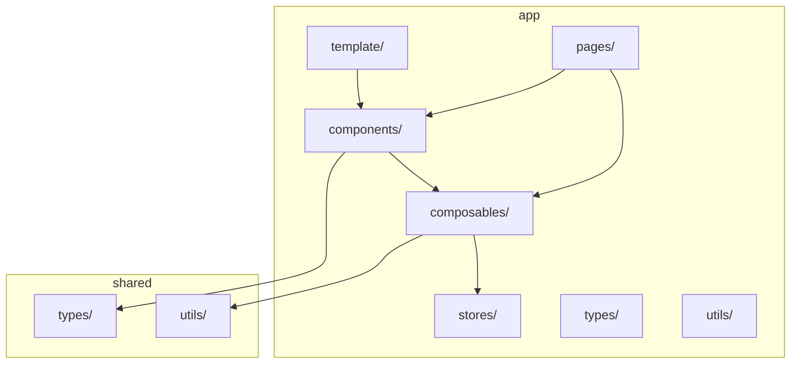
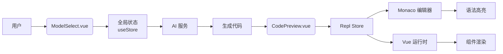
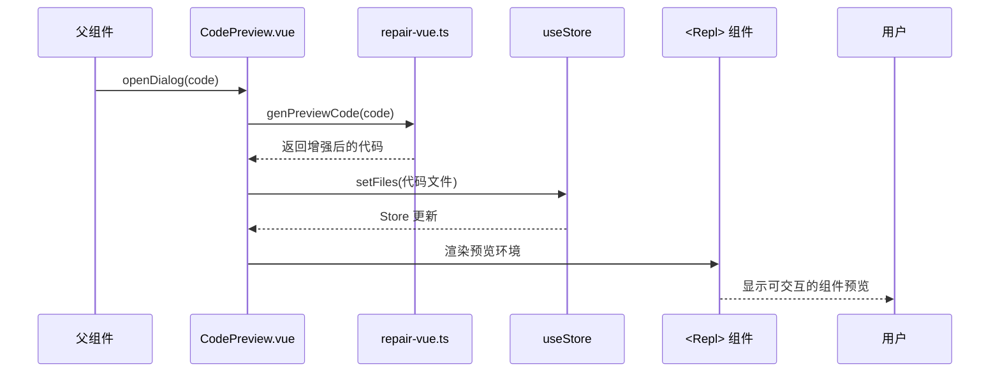
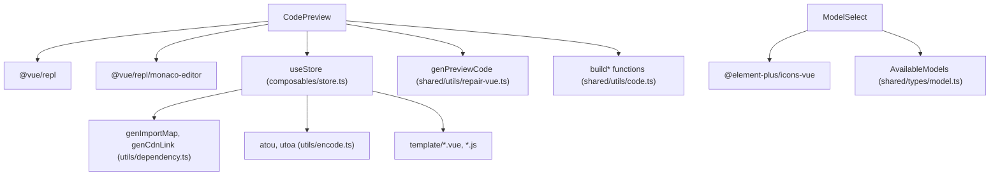

# 组件体系

<cite>
**本文档引用的文件**  
- [CodePreview.vue](file://app/components/CodePreview.vue)
- [ModelSelect.vue](file://app/components/ModelSelect.vue)
- [store.ts](file://app/composables/store.ts)
- [repair-vue.ts](file://shared/utils/repair-vue.ts)
- [model.ts](file://shared/types/model.ts)
- [code.ts](file://shared/utils/code.ts)
- [element-plus.js](file://app/template/element-plus.js)
- [main.vue](file://app/template/main.vue)
- [tsconfig.json](file://app/template/tsconfig.json)
- [welcome.vue](file://app/template/welcome.vue)
</cite>

## 目录
1. [简介](#简介)
2. [项目结构](#项目结构)
3. [核心组件](#核心组件)
4. [架构概览](#架构概览)
5. [详细组件分析](#详细组件分析)
6. [依赖分析](#依赖分析)
7. [性能考量](#性能考量)
8. [故障排除指南](#故障排除指南)
9. [结论](#结论)

## 简介
本文档深入解析 `code_gen` 前端组件体系的设计与实现，重点聚焦于 `CodePreview.vue` 和 `ModelSelect.vue` 两个核心组件。文档将详细阐述 `CodePreview.vue` 如何接收 AI 生成的代码字符串，利用 Vue Repl 和 Monaco 编辑器实现多语言代码渲染与交互式预览，并支持复制到剪贴板功能。同时，分析 `ModelSelect.vue` 组件的下拉选择交互逻辑，如何与全局状态同步当前选中的 AI 模型，并触发配置更新。文档还将说明这两个组件如何通过 `props`、`emit` 和 `v-model` 实现父子通信，以及如何通过 Element Plus UI 库进行样式定制。此外，提供组件使用示例、可访问性支持情况及响应式设计处理方案，并探讨组件复用性设计原则及其在项目中的扩展潜力。

## 项目结构
`code_gen` 项目采用基于 Nuxt 3 的模块化结构，组件、组合式函数、页面和共享工具被清晰地组织在不同的目录中。核心前端组件位于 `app/components` 目录下，组合式函数（composables）用于封装可复用的逻辑，页面（pages）定义了应用的路由和视图，而 `shared` 目录则存放跨模块共享的类型定义和工具函数。这种结构确保了代码的高内聚与低耦合，便于维护和扩展。



**图示来源**
- [CodePreview.vue](file://app/components/CodePreview.vue)
- [ModelSelect.vue](file://app/components/ModelSelect.vue)
- [store.ts](file://app/composables/store.ts)
- [model.ts](file://shared/types/model.ts)

**本节来源**
- [CodePreview.vue](file://app/components/CodePreview.vue)
- [ModelSelect.vue](file://app/components/ModelSelect.vue)

## 核心组件
本项目的核心组件 `CodePreview.vue` 和 `ModelSelect.vue` 分别承担了代码预览和模型选择的关键功能。`CodePreview.vue` 通过集成 Vue Repl 实现了一个功能完整的在线代码编辑和预览环境，能够动态加载和渲染 AI 生成的 Vue 组件代码。`ModelSelect.vue` 则提供了一个用户友好的界面，用于在多个可用的 AI 模型之间进行选择，并通过 `v-model` 双向绑定机制将选择结果同步到全局状态。这两个组件的设计充分体现了现代前端开发中组件化、状态管理和可复用性的最佳实践。

**本节来源**
- [CodePreview.vue](file://app/components/CodePreview.vue#L1-L84)
- [ModelSelect.vue](file://app/components/ModelSelect.vue#L1-L161)

## 架构概览
整个组件体系的架构围绕着用户交互、状态管理和代码渲染三大核心展开。用户通过 `ModelSelect.vue` 选择 AI 模型，该选择通过 `v-model` 更新全局状态。当 AI 生成代码后，`CodePreview.vue` 组件被调用，它接收代码字符串，利用 `genPreviewCode` 工具函数进行预处理，然后通过 `useStore` 创建的 Repl Store 将代码注入到一个隔离的 Vue 开发环境中进行实时预览。



**图示来源**
- [CodePreview.vue](file://app/components/CodePreview.vue#L1-L84)
- [ModelSelect.vue](file://app/components/ModelSelect.vue#L1-L161)
- [store.ts](file://app/composables/store.ts#L1-L294)

## 详细组件分析

### CodePreview.vue 组件分析
`CodePreview.vue` 组件的核心功能是为 AI 生成的代码提供一个交互式的预览环境。它并非直接使用 Prism 进行静态语法高亮，而是采用了更强大的 `@vue/repl` 库，该库内部集成了 Monaco 编辑器，从而提供了完整的代码编辑、语法高亮、错误检查和实时预览能力。

#### 通信机制
该组件通过 `defineExpose` 暴露 `openDialog` 方法，允许父组件（如聊天页面）传入 AI 生成的代码并触发预览对话框的打开。这是一种典型的父组件调用子组件方法的通信模式。

#### 代码处理与渲染
1.  **代码接收与预处理**：`openDialog` 方法接收原始代码字符串，并将其传递给 `genPreviewCode` 函数。
2.  **代码增强**：`genPreviewCode` 函数（位于 `repair-vue.ts`）会分析代码中使用的 Vue API（如 `ref`, `computed`），并自动在 `<script setup>` 标签中添加相应的 `import` 语句，确保代码在 Repl 环境中能够正确运行。
3.  **环境构建**：组件使用 `useStore` 创建一个 Repl Store 实例。通过 `watch` 监听 `componentCode` 的变化，将预处理后的代码、Element Plus 的初始化代码、主入口文件和 `import-map.json` 等文件动态注入到 Store 中。
4.  **渲染与交互**：最终，`<Repl>` 组件使用这个配置好的 Store 来渲染一个完整的、可交互的 Vue 开发环境，用户可以在其中查看组件的实际效果。



**图示来源**
- [CodePreview.vue](file://app/components/CodePreview.vue#L1-L84)
- [repair-vue.ts](file://shared/utils/repair-vue.ts#L1-L239)
- [store.ts](file://app/composables/store.ts#L1-L294)

**本节来源**
- [CodePreview.vue](file://app/components/CodePreview.vue#L1-L84)
- [repair-vue.ts](file://shared/utils/repair-vue.ts#L1-L239)

### ModelSelect.vue 组件分析
`ModelSelect.vue` 组件负责提供一个直观的界面，让用户从预定义的 AI 模型列表中进行选择。

#### 交互逻辑
该组件使用 `el-popover` 实现了一个点击触发的下拉菜单。菜单内容由 `AvailableModels` 常量（定义在 `model.ts`）驱动，通过 `v-for` 指令动态渲染每个模型的名称、描述和提供商信息。

#### 状态同步
组件的核心是 `defineModel` 宏，它创建了一个名为 `modelValue` 的双向绑定 prop。当用户点击某个模型项时，`selectModel` 方法会更新 `modelValue.value`，这会自动同步到父组件的绑定数据上，从而实现与全局状态的联动。选择完成后，`showPopover` 状态被设置为 `false`，以关闭下拉菜单。

#### UI 定制
组件通过 `scoped` 样式进行了深度定制，确保了与整体应用风格的一致性。它使用了 Element Plus 提供的 `el-button`、`el-icon` 和 `Check` 图标，并通过 CSS 变量（如 `var(--el-color-primary)`）来匹配主题色。`.model-item` 的 `:hover` 和 `.active` 状态提供了清晰的视觉反馈。

```mermaid
classDiagram
class ModelSelect {
+modelValue : AvailableModelNames
+showPopover : boolean
+selectedModelDisplay : ComputedRef
+selectModel(modelName)
+displayDescription(modelConfig)
}
class AvailableModels {
+id : string
+name : string
+description : string
+provider : string
+middleware : string | undefined
}
ModelSelect --> AvailableModels : "使用"
ModelSelect ..> "v-model" : "双向绑定"
```

**图示来源**
- [ModelSelect.vue](file://app/components/ModelSelect.vue#L1-L161)
- [model.ts](file://shared/types/model.ts#L1-L148)

**本节来源**
- [ModelSelect.vue](file://app/components/ModelSelect.vue#L1-L161)
- [model.ts](file://shared/types/model.ts#L1-L148)

## 依赖分析
`CodePreview.vue` 和 `ModelSelect.vue` 组件的实现依赖于项目内外的多个关键模块。



**图示来源**
- [CodePreview.vue](file://app/components/CodePreview.vue#L1-L84)
- [ModelSelect.vue](file://app/components/ModelSelect.vue#L1-L161)
- [store.ts](file://app/composables/store.ts#L1-L294)
- [repair-vue.ts](file://shared/utils/repair-vue.ts#L1-L239)
- [code.ts](file://shared/utils/code.ts#L1-L227)

**本节来源**
- [CodePreview.vue](file://app/components/CodePreview.vue#L1-L84)
- [ModelSelect.vue](file://app/components/ModelSelect.vue#L1-L161)
- [store.ts](file://app/composables/store.ts#L1-L294)

## 性能考量
`CodePreview.vue` 组件的性能主要受 Repl 环境初始化和代码编译的影响。通过 `watch` 的 `immediate: true` 选项，组件在创建时就准备好了 Repl Store，减少了用户首次打开预览时的等待时间。`genPreviewCode` 函数的逻辑虽然增加了代码分析的开销，但确保了生成代码的健壮性，避免了因缺少导入而导致的运行时错误，从长远看提升了用户体验。`ModelSelect.vue` 组件的性能开销极小，其渲染的模型列表是静态的，且数量有限。

## 故障排除指南
- **问题：代码预览对话框无法打开。**
  - **检查**：确保父组件正确调用了 `CodePreview` 组件暴露的 `openDialog` 方法。
  - **检查**：确认传入的代码字符串格式正确，包含有效的 `<template>` 和 `<script setup>` 标签。
- **问题：预览环境中的代码报错，提示缺少 Vue API。**
  - **检查**：`genPreviewCode` 函数可能未能正确检测到所有使用的 API。检查 `repair-vue.ts` 中的 `VUE_APIS` 数组是否完整。
- **问题：模型选择下拉菜单不显示或点击无反应。**
  - **检查**：确保 `AvailableModels` 数组在 `model.ts` 中正确定义且可被导入。
  - **检查**：确认 `v-model` 绑定的变量类型与 `AvailableModelNames` 类型一致。

**本节来源**
- [CodePreview.vue](file://app/components/CodePreview.vue#L1-L84)
- [ModelSelect.vue](file://app/components/ModelSelect.vue#L1-L161)
- [repair-vue.ts](file://shared/utils/repair-vue.ts#L1-L239)

## 结论
`CodePreview.vue` 和 `ModelSelect.vue` 是 `code_gen` 项目中设计精良、功能明确的核心组件。`CodePreview.vue` 通过集成 `@vue/repl`，超越了简单的语法高亮，提供了一个功能完整的在线开发环境，极大地提升了 AI 生成代码的可用性和可信度。`ModelSelect.vue` 则通过简洁的 UI 和高效的 `v-model` 通信，实现了模型选择的无缝集成。两个组件都充分运用了 Vue 3 的组合式 API 和 Element Plus 的强大 UI 组件，代码结构清晰，依赖管理得当，具有很高的复用性和扩展潜力。未来可以在此基础上，为 `CodePreview` 添加代码复制功能，或为 `ModelSelect` 添加搜索和分组功能，以进一步提升用户体验。