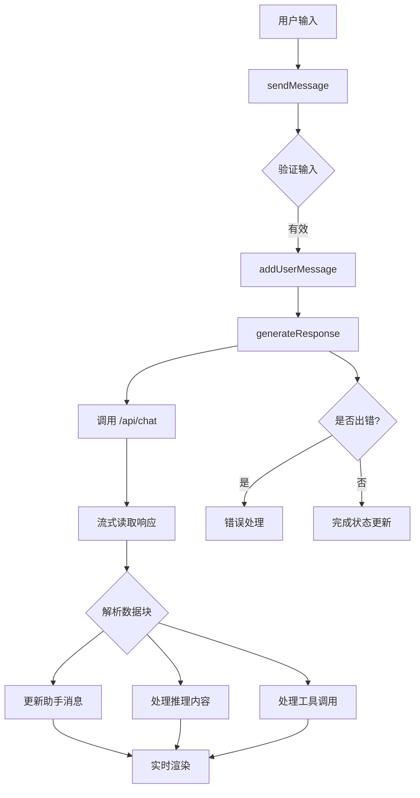
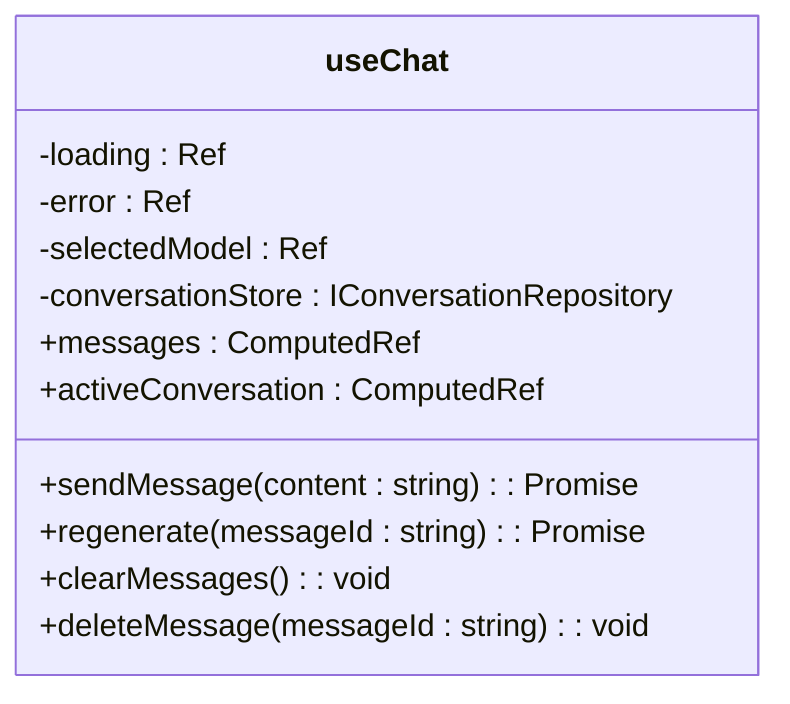
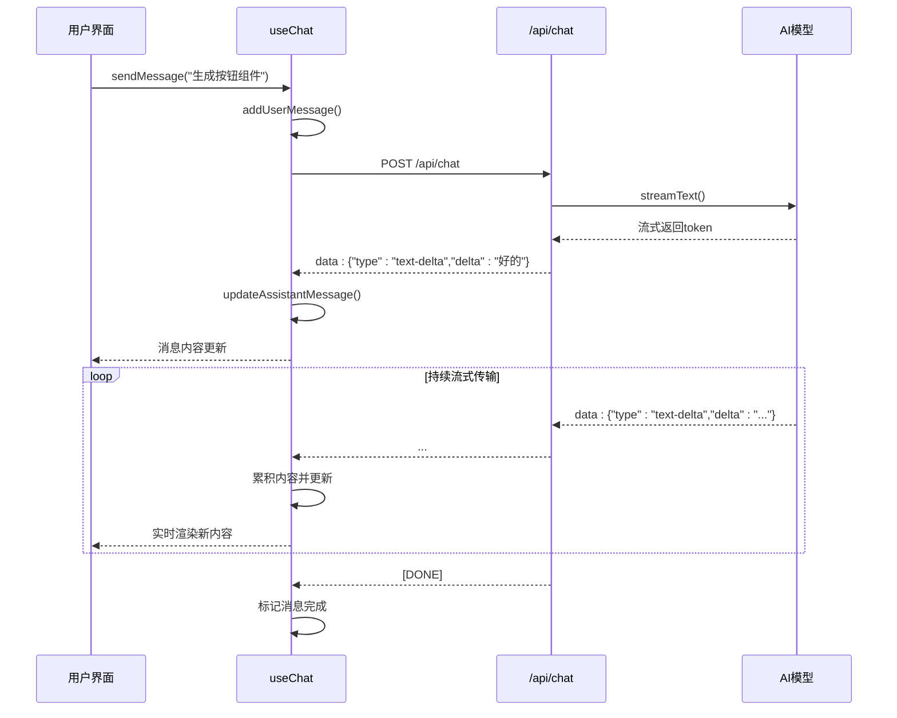
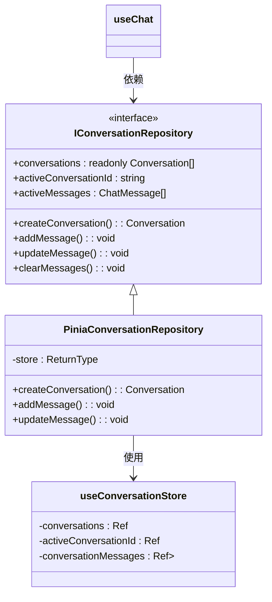

# 组合式函数

<cite>
**本文档中引用的文件**  
- [useChat.ts](file://app/composables/useChat.ts)
- [conversation.ts](file://app/stores/conversation.ts)
- [pinia-conv-repos.ts](file://app/utils/pinia-conv-repos.ts)
- [chat.post.ts](file://server/api/chat.post.ts)
- [chat.ts](file://shared/types/api/chat.ts)
- [conv-repos.ts](file://app/types/conv-repos.ts)
- [model.ts](file://shared/types/model.ts)
- [index.vue](file://app/pages/chat/index.vue)
</cite>

## 目录
1. [简介](#简介)
2. [核心功能概览](#核心功能概览)
3. [状态管理与响应式设计](#状态管理与响应式设计)
4. [消息发送与流式接收机制](#消息发送与流式接收机制)
5. [错误处理与重试逻辑](#错误处理与重试逻辑)
6. [与Pinia Store的协作机制](#与pinia-store的协作机制)
7. [实际调用示例](#实际调用示例)
8. [调试技巧与异常处理](#调试技巧与异常处理)
9. [性能监控建议](#性能监控建议)
10. [总结](#总结)

## 简介

`useChat` 是 `code_gen` 项目中的核心组合式函数，封装了完整的聊天会话逻辑。它通过响应式 API 管理本地状态，协调与后端 AI 服务的通信，并与 Pinia 状态管理仓库深度集成，确保会话数据的一致性与可维护性。该函数为前端组件提供了简洁、直观的接口，使页面无需关心底层实现细节即可实现完整的聊天功能。

**Section sources**
- [useChat.ts](file://app/composables/useChat.ts#L1-L391)

## 核心功能概览

`useChat` 函数主要提供以下核心能力：
- 发送用户消息并触发 AI 回复
- 流式接收 AI 响应并实时更新界面
- 支持重新生成回复、删除消息、清空会话等操作
- 处理网络错误与流解析异常
- 与会话状态仓库（`IConversationRepository`）协作管理数据

其设计遵循依赖注入原则，允许传入自定义的会话仓库实例，增强了可测试性与扩展性。



**Diagram sources**
- [useChat.ts](file://app/composables/useChat.ts#L1-L391)

## 状态管理与响应式设计

`useChat` 使用 Vue 的 `ref` 和 `computed` 实现响应式状态管理：

- `loading`：表示 AI 正在回复，控制发送组件禁用状态
- `error`：存储最近一次错误信息，用于界面提示
- `selectedModel`：当前选择的 AI 模型名称
- `messages`：计算属性，从仓库获取当前会话消息列表
- `activeConversation`：计算属性，反映当前活跃会话

所有状态均通过 `readonly` 包装对外暴露，防止外部直接修改，保证状态变更只能通过定义的方法进行。



**Diagram sources**
- [useChat.ts](file://app/composables/useChat.ts#L1-L391)

**Section sources**
- [useChat.ts](file://app/composables/useChat.ts#L1-L391)

## 消息发送与流式接收机制

`useChat` 的核心在于 `generateResponse` 方法，它实现了对 AI SDK 流式响应的完整处理：

1. **发起请求**：通过 `fetch` 调用 `/api/chat` 接口，传递当前会话消息与模型配置
2. **获取流读取器**：使用 `response.body.getReader()` 获取可读流
3. **逐块解析**：使用 `TextDecoder` 解码二进制流，按行分割数据
4. **事件处理**：识别不同类型的 `data:` 事件（如 `text-delta`, `reasoning-delta`, `tool-input-delta`），分别更新消息内容、推理过程或工具调用状态

这种流式处理机制使得 AI 的回复可以“逐字”呈现，极大提升用户体验。



**Diagram sources**
- [useChat.ts](file://app/composables/useChat.ts#L1-L391)
- [chat.post.ts](file://server/api/chat.post.ts#L1-L43)

**Section sources**
- [useChat.ts](file://app/composables/useChat.ts#L1-L391)
- [chat.post.ts](file://server/api/chat.post.ts#L1-L43)

## 错误处理与重试逻辑

`useChat` 在 `sendMessage` 和 `regenerate` 方法中使用 `try-catch-finally` 结构处理异常：

- **捕获错误**：包括 HTTP 状态错误、流读取失败、JSON 解析异常等
- **设置错误状态**：将错误信息暴露给 UI 层显示
- **清理状态**：在 `finally` 块中重置 `loading` 状态
- **恢复消息状态**：若 AI 消息已创建但流式响应失败，确保其 `loading` 和 `typing` 状态被正确关闭，或在内容为空时删除该消息

此外，`regenerate` 方法支持重新生成某条消息之后的所有回复，实现“重新思考”功能。

**Section sources**
- [useChat.ts](file://app/composables/useChat.ts#L1-L391)

## 与Pinia Store的协作机制

`useChat` 通过 `IConversationRepository` 接口与 Pinia Store 解耦：

- **接口定义**：`IConversationRepository` 接口抽象了会话与消息的 CRUD 操作
- **默认实现**：`PiniaConversationRepository` 类适配 `useConversationStore`，实现该接口
- **依赖注入**：`useChat` 可接受外部传入的仓库实例，便于单元测试或替换存储实现

这种设计实现了关注点分离，`useChat` 专注于聊天逻辑，而状态持久化由独立模块负责。



**Diagram sources**
- [conv-repos.ts](file://app/types/conv-repos.ts#L1-L129)
- [pinia-conv-repos.ts](file://app/utils/pinia-conv-repos.ts#L1-L114)
- [conversation.ts](file://app/stores/conversation.ts#L1-L314)

**Section sources**
- [conv-repos.ts](file://app/types/conv-repos.ts#L1-L129)
- [pinia-conv-repos.ts](file://app/utils/pinia-conv-repos.ts#L1-L114)
- [conversation.ts](file://app/stores/conversation.ts#L1-L314)

## 实际调用示例

在 `chat/index.vue` 页面中，`useChat` 被直接调用：

```ts
const {
  messages,
  loading,
  error,
  selectedModel,
  sendMessage,
  clearMessages,
  regenerate,
} = useChat();
```

页面组件通过 `v-model` 绑定输入框，调用 `sendMessage` 发送消息，并将 `messages` 传递给 `BubbleList` 组件渲染。错误信息通过 `el-alert` 组件展示。

该组合式函数的 API 极其简洁，页面无需了解任何关于流式处理、状态同步或错误恢复的细节。

**Section sources**
- [index.vue](file://app/pages/chat/index.vue#L1-L799)

## 调试技巧与异常处理

### 常见异常及处理
- **网络中断**：检查 `fetch` 请求是否成功，`response.ok` 状态
- **流读取失败**：确保 `response.body` 存在且 `getReader()` 可用
- **流解析失败**：在 `try-catch` 中解析 `data:` 行，避免单个错误导致整个流中断
- **JSON 解析错误**：打印原始 `line` 内容用于调试

### 调试建议
- 在 `console.warn` 中输出解析失败的原始数据行
- 使用浏览器开发者工具的 Network 面板查看 `/api/chat` 的 SSE 流
- 在关键状态变更处添加 `console.log`（如 `updateAssistantMessage` 调用）

## 性能监控建议

- **流式延迟监控**：记录从发送请求到收到第一个 `data:` 块的时间，评估 AI 响应速度
- **消息完成时间**：统计完整消息生成耗时，分析模型性能
- **错误率统计**：监控 `error.value` 设置频率，识别稳定性问题
- **内存使用**：长期会话可能积累大量消息，考虑实现消息分页或自动清理机制

## 总结

`useChat` 组合式函数是 `code_gen` 项目聊天功能的核心。它通过封装复杂的流式通信、状态管理与错误处理逻辑，为上层组件提供了简洁、可靠的 API。其与 Pinia Store 的解耦设计体现了良好的架构思想，使得功能扩展与单元测试更加容易。该函数充分展示了 Vue 3 组合式 API 在构建复杂交互功能时的强大能力。