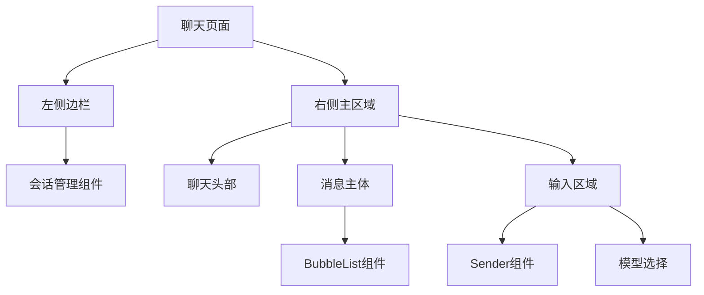

# 页面结构与路由

<cite>
**本文档引用的文件**  
- [app.vue](file://app/app.vue)
- [index.vue](file://app/pages/index.vue)
- [chat/index.vue](file://app/pages/chat/index.vue)
- [nuxt.config.ts](file://nuxt.config.ts)
- [useChat.ts](file://app/composables/useChat.ts)
- [conversation.ts](file://app/stores/conversation.ts)
</cite>

## 目录
1. [项目结构概览](#项目结构概览)
2. [Nuxt 3自动路由机制](#nuxt-3自动路由机制)
3. [首页结构与导航入口](#首页结构与导航入口)
4. [核心聊天页面结构](#核心聊天页面结构)
5. [根组件app.vue的作用](#根组件app.vue的作用)
6. [页面间导航与参数传递](#页面间导航与参数传递)
7. [异步数据加载模式](#异步数据加载模式)
8. [常见问题与解决方案](#常见问题与解决方案)
9. [性能优化建议](#性能优化建议)

## 项目结构概览

本项目基于Nuxt 3框架构建，采用模块化目录结构。核心页面位于`/app/pages/`目录下，遵循Nuxt的文件约定路由机制。项目包含组件、组合式函数、状态管理、工具函数等模块，通过清晰的分层实现功能解耦。

**Section sources**
- [app.vue](file://app/app.vue#L1-L7)
- [nuxt.config.ts](file://nuxt.config.ts#L1-L28)

## Nuxt 3自动路由机制

Nuxt 3基于文件系统自动生成路由配置。`/app/pages/`目录下的Vue文件会自动映射为对应的URL路径：
- `index.vue` → `/`
- `chat/index.vue` → `/chat`
- 子目录结构直接反映在URL路径中

该机制无需手动配置路由，通过文件命名和目录结构即可定义完整的路由体系，提升开发效率并降低配置错误风险。

```mermaid
graph TB
A[/app/pages/] --> B[index.vue]
A --> C[chat/]
C --> D[index.vue]
B --> URL1[/]
D --> URL2[/chat]
```

**Diagram sources**
- [index.vue](file://app/pages/index.vue#L1-L73)
- [chat/index.vue](file://app/pages/chat/index.vue#L1-L838)

## 首页结构与导航入口

`index.vue`作为应用的首页，承担着导航入口的角色。页面采用渐变背景的英雄区域设计，突出核心功能"开始对话"按钮。点击按钮后通过`navigateTo('/chat')`跳转至聊天页面，实现无刷新路由切换。

该页面作为用户进入应用的第一个界面，通过简洁直观的设计引导用户快速进入核心功能区。

**Section sources**
- [index.vue](file://app/pages/index.vue#L1-L73)

## 核心聊天页面结构

`chat/index.vue`是应用的核心功能页面，采用左右分栏布局：
- **左侧边栏**：集成`Conversations`组件，管理对话历史记录，支持新建、重命名、删除等操作
- **右侧主区域**：包含聊天头部、消息主体和输入区域三部分

消息展示使用`BubbleList`组件，支持AI回复的Markdown渲染、代码提取、预览和下载等功能。输入区域通过`Sender`组件实现，集成模型选择下拉框。



**Diagram sources**
- [chat/index.vue](file://app/pages/chat/index.vue#L1-L838)

## 根组件app.vue的作用

`app.vue`是Nuxt应用的根组件，负责全局布局和应用初始化。该组件包含：
- `NuxtRouteAnnouncer`：提供无障碍路由变更通知
- `NuxtPage`：动态渲染当前路由对应的页面组件

作为所有页面的容器，`app.vue`通过其模板结构确保了应用的一致性布局，并为全局样式注入和应用级逻辑提供了基础。

**Section sources**
- [app.vue](file://app/app.vue#L1-L7)

## 页面间导航与参数传递

页面导航通过Nuxt提供的`navigateTo`函数实现，支持声明式和编程式导航。在`index.vue`中通过`goToChat`方法实现到聊天页面的跳转。

参数传递可通过路由查询参数或状态管理实现。本项目使用Pinia存储会话状态，确保在页面切换时保持数据一致性。`useChat`组合式函数封装了聊天相关的状态和逻辑，被多个组件复用。

**Section sources**
- [index.vue](file://app/pages/index.vue#L25-L30)
- [useChat.ts](file://app/composables/useChat.ts#L1-L50)
- [conversation.ts](file://app/stores/conversation.ts#L1-L30)

## 异步数据加载模式

本项目采用组合式API的`setup`语法结合响应式引用实现异步数据管理。`useChat`组合式函数封装了消息发送、流式响应处理、错误处理等异步逻辑。

通过`computed`属性自动派生格式化后的消息列表，确保UI与数据状态同步。`onMounted`生命周期钩子中初始化默认会话，确保应用启动时有可用的上下文。

**Section sources**
- [chat/index.vue](file://app/pages/chat/index.vue#L150-L200)
- [useChat.ts](file://app/composables/useChat.ts#L20-L80)

## 常见问题与解决方案

### 路由跳转失败
**现象**：调用`navigateTo`无反应  
**解决方案**：检查是否在服务端渲染上下文中使用，确保在客户端执行导航逻辑

### 页面状态丢失
**现象**：刷新页面后聊天记录消失  
**解决方案**：本项目已使用Pinia持久化存储会话数据，确保页面刷新后数据可恢复

### 组件样式冲突
**现象**：全局样式影响组件表现  
**解决方案**：使用`scoped`样式属性，或通过`deep`选择器精确控制嵌套组件样式

**Section sources**
- [chat/index.vue](file://app/pages/chat/index.vue#L700-L750)
- [app.vue](file://app/app.vue#L1-L7)

## 性能优化建议

### 懒加载策略
对非首屏组件（如`CodePreview`）采用动态导入，减少初始包体积：
```ts
const previewRef = useTemplateRef<InstanceType<typeof CodePreview>>('previewRef')
```

### 预加载优化
利用Nuxt的自动代码分割特性，确保每个页面只加载必要代码。通过`nuxt.config.ts`中的模块配置，按需加载Element Plus等UI组件库。

### 内存管理
在`onUnmounted`钩子中清理`ResizeObserver`等资源，防止内存泄漏：
```ts
onUnmounted(() => {
  if (resizeObserver) {
    resizeObserver.disconnect()
    resizeObserver = null
  }
})
```

**Section sources**
- [chat/index.vue](file://app/pages/chat/index.vue#L750-L780)
- [nuxt.config.ts](file://nuxt.config.ts#L1-L28)