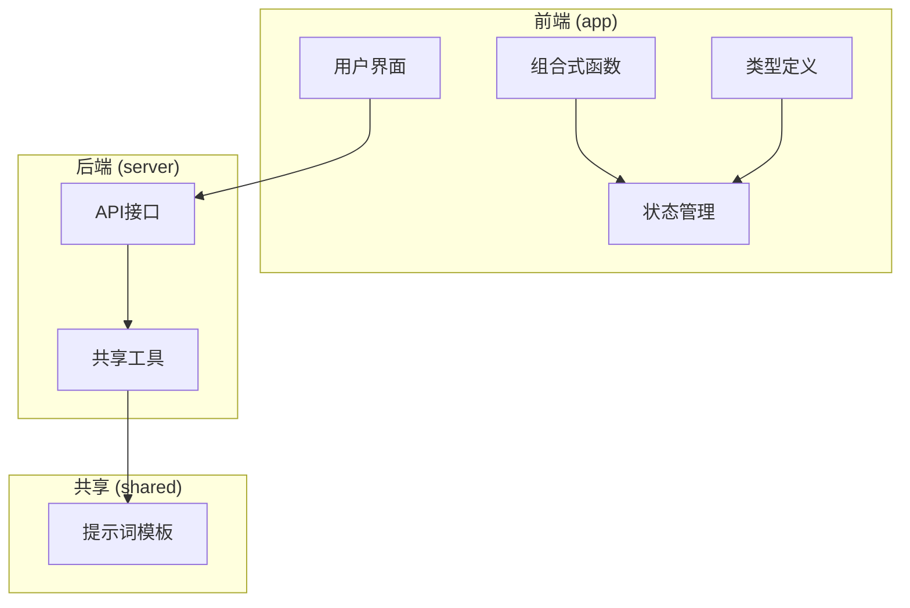
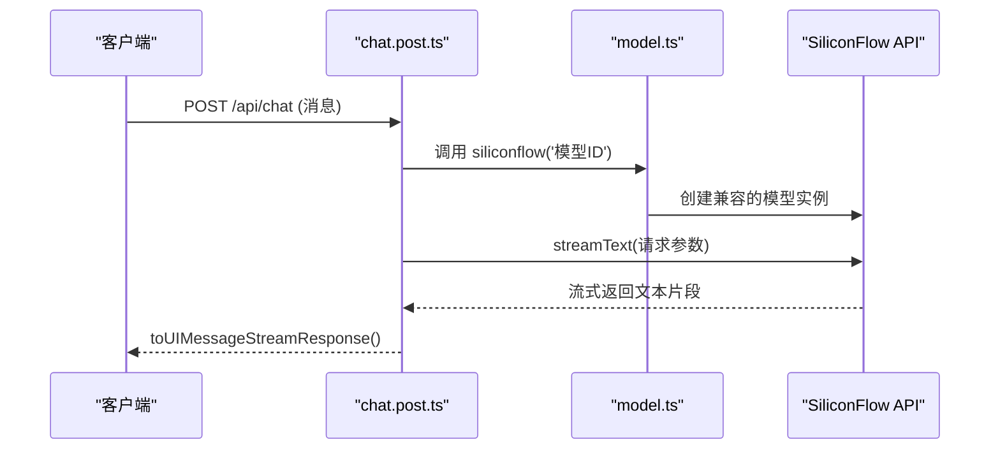
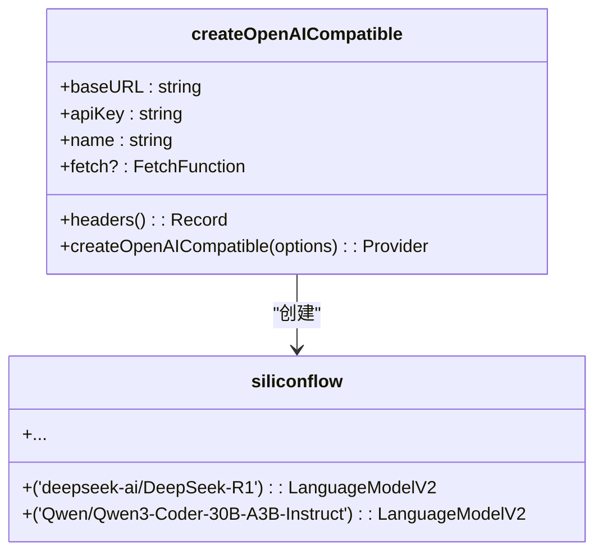
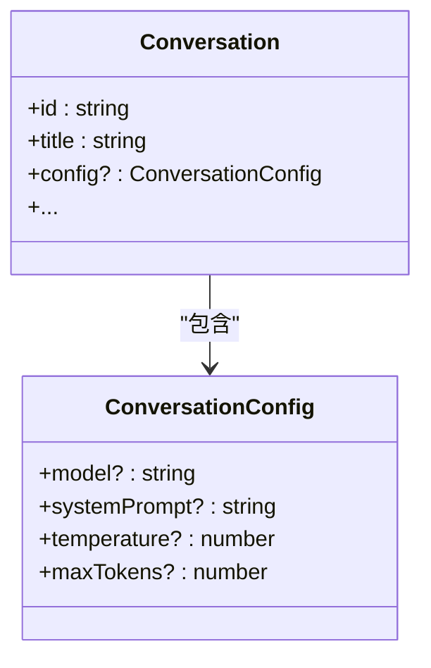

# AI模型配置管理

<cite>
**本文档引用的文件**  
- [model.ts](file://server/utils/model.ts)
- [chat.post.ts](file://server/api/chat.post.ts)
- [conversation.ts](file://app/types/conversation.ts)
- [nuxt.config.ts](file://nuxt.config.ts)
- [index.d.ts](file://node_modules/@ai-sdk/openai-compatible/dist/index.d.ts)
</cite>

## 目录
1. [简介](#简介)
2. [项目结构](#项目结构)
3. [核心组件](#核心组件)
4. [架构概览](#架构概览)
5. [详细组件分析](#详细组件分析)
6. [依赖分析](#依赖分析)
7. [性能考量](#性能考量)
8. [故障排除指南](#故障排除指南)
9. [结论](#结论)

## 简介
本文档深入分析了 `server/utils/model.ts` 文件中AI模型的配置逻辑，重点阐述了如何通过工厂模式封装和管理AI模型的选择、参数设置（如temperature、maxTokens）以及与SiliconFlow等供应商的集成。文档详细说明了模型工厂的设计思路、多模型动态切换的实现机制，以及如何根据用户需求或场景自动选择最优模型。结合代码示例，展示了模型实例化过程及其与 `chat.post.ts` 的调用关系。同时，涵盖了配置的扩展性、默认值设定、异常处理和性能考量（如连接池管理或超时设置）。

## 项目结构
项目采用分层架构，主要分为前端（app）、后端API（server）和共享资源（shared）三个部分。AI模型的核心配置位于 `server/utils/model.ts`，API接口定义在 `server/api/chat.post.ts`，而会话相关的类型定义则在 `app/types/conversation.ts` 中。运行时配置通过 `nuxt.config.ts` 注入。



**图示来源**
- [model.ts](file://server/utils/model.ts)
- [chat.post.ts](file://server/api/chat.post.ts)

**本节来源**
- [model.ts](file://server/utils/model.ts)
- [chat.post.ts](file://server/api/chat.post.ts)

## 核心组件
核心组件包括 `model.ts` 中定义的 `siliconflow` 模型工厂和 `chat.post.ts` 中的API处理逻辑。`siliconflow` 工厂负责创建与SiliconFlow API兼容的模型实例，而 `chat.post.ts` 则利用该工厂实例化具体模型并发起流式文本生成请求。

**本节来源**
- [model.ts](file://server/utils/model.ts#L1-L33)
- [chat.post.ts](file://server/api/chat.post.ts#L1-L25)

## 架构概览
系统采用客户端-服务器架构。前端通过HTTP请求调用后端的 `/api/chat` 接口。后端API处理请求，利用 `model.ts` 中定义的工厂模式创建AI模型实例，并通过 `ai` 库的 `streamText` 函数与SiliconFlow等AI服务提供商进行交互，最终将流式响应返回给前端。



**图示来源**
- [model.ts](file://server/utils/model.ts#L1-L33)
- [chat.post.ts](file://server/api/chat.post.ts#L1-L25)

## 详细组件分析

### AI模型工厂模式分析
`model.ts` 文件实现了模型工厂模式，通过 `createOpenAICompatible` 函数创建一个名为 `siliconflow` 的通用工厂。该工厂封装了与SiliconFlow API通信所需的基础URL、API密钥等配置，使得在应用的其他部分可以方便地通过模型ID来实例化具体的AI模型，而无需重复配置底层连接信息。



**图示来源**
- [model.ts](file://server/utils/model.ts#L1-L33)
- [index.d.ts](file://node_modules/@ai-sdk/openai-compatible/dist/index.d.ts#L1-L255)

**本节来源**
- [model.ts](file://server/utils/model.ts#L1-L33)

### 模型参数配置分析
系统支持配置如 `temperature` 和 `maxTokens` 等关键参数。这些参数在 `app/types/conversation.ts` 中被定义为 `ConversationConfig` 接口的一部分，允许在会话级别进行设置。`temperature` 控制生成文本的随机性，值越高输出越随机；`maxTokens` 限制生成内容的最大长度。



**图示来源**
- [conversation.ts](file://app/types/conversation.ts#L1-L78)

**本节来源**
- [conversation.ts](file://app/types/conversation.ts#L1-L78)

### API调用流程分析
`chat.post.ts` 文件定义了处理聊天请求的API。它首先从请求体中读取消息，然后调用 `siliconflow` 工厂获取指定模型的实例，并使用 `streamText` 函数发起流式请求。系统提示词（system prompt）来自共享的 `template-gen` 模块。

```mermaid
flowchart TD
A[收到POST请求] --> B[解析请求体]
B --> C[获取messages]
C --> D[调用siliconflow('模型ID')]
D --> E[调用streamText()]
E --> F[传入model, system, messages]
F --> G[返回流式响应]
```

**图示来源**
- [chat.post.ts](file://server/api/chat.post.ts#L1-L25)

**本节来源**
- [chat.post.ts](file://server/api/chat.post.ts#L1-L25)

## 依赖分析
项目依赖于 `@ai-sdk/openai-compatible` 库来实现与SiliconFlow等兼容OpenAI API的服务提供商的集成。`ai` 库提供了 `streamText` 等高级API，简化了流式文本生成的实现。运行时配置通过Nuxt框架的 `useRuntimeConfig()` 注入，确保了敏感信息（如API密钥）的安全性。

```mermaid
graph TD
A[chat.post.ts] --> B[siliconflow]
B --> C[model.ts]
C --> D[@ai-sdk/openai-compatible]
D --> E[SiliconFlow API]
C --> F[useRuntimeConfig]
F --> G[nuxt.config.ts]
```

**图示来源**
- [model.ts](file://server/utils/model.ts)
- [nuxt.config.ts](file://nuxt.config.ts)
- [pnpm-lock.yaml](file://pnpm-lock.yaml)

**本节来源**
- [model.ts](file://server/utils/model.ts)
- [nuxt.config.ts](file://nuxt.config.ts)

## 性能考量
系统采用流式响应（streaming response），可以边生成边传输，显著降低了用户的等待感知延迟。`createOpenAICompatible` 函数的实现可能内置了连接池或HTTP客户端复用机制，以优化与AI服务提供商的网络通信性能。超时设置通常由底层HTTP库或 `fetch` 函数的实现来处理。

## 故障排除指南
常见问题包括API密钥无效、网络连接失败或模型ID错误。应首先检查 `nuxt.config.ts` 中的 `siliconFlowApiKey` 和 `siliconFlowApiUrl` 配置是否正确。确保 `model.ts` 中使用的模型ID（如 `Qwen/Qwen3-Coder-30B-A3B-Instruct`）是SiliconFlow平台支持的。查看服务器日志以获取详细的错误信息。

**本节来源**
- [model.ts](file://server/utils/model.ts)
- [nuxt.config.ts](file://nuxt.config.ts)

## 结论
`server/utils/model.ts` 通过工厂模式优雅地封装了AI模型的配置和初始化逻辑，实现了与具体AI服务提供商（如SiliconFlow）的解耦。结合 `conversation.ts` 中的参数定义和 `chat.post.ts` 中的API调用，系统构建了一个灵活、可扩展的AI集成架构。该设计支持多模型动态切换，便于未来集成更多AI服务，同时通过流式响应和合理的依赖管理保证了良好的性能和用户体验。