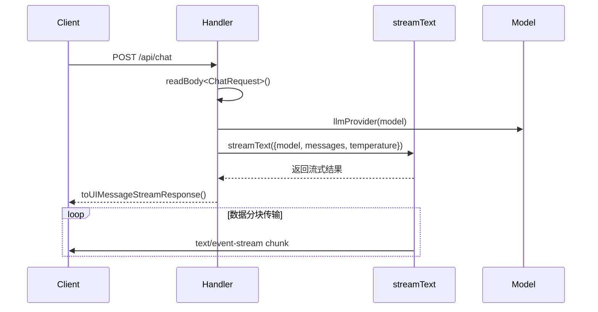

# API接口说明

<cite>
**本文档引用文件**  
- [chat.post.ts](file://server/api/chat.post.ts)
- [chat.ts](file://shared/types/api/chat.ts)
- [model.ts](file://server/utils/model.ts)
- [model.ts](file://shared/types/model.ts)
- [template-gen.ts](file://server/core/prompt/template-gen.ts)
</cite>

## 目录
1. [简介](#简介)
2. [核心功能与架构](#核心功能与架构)
3. [请求参数说明](#请求参数说明)
4. [流式响应机制](#流式响应机制)
5. [H3事件处理器实现](#h3事件处理器实现)
6. [客户端调用示例](#客户端调用示例)
7. [安全与错误处理](#安全与错误处理)
8. [开发调试建议](#开发调试建议)

## 简介
`/api/chat` 是一个基于 H3 框架的 POST 接口，用于接收前端发送的聊天消息请求，并通过 AI SDK 的 `streamText` 方法实现流式文本生成。该接口支持多种大模型选择、温度调节，并结合模板提示词系统实现高质量代码生成。适用于需要实时响应和低延迟反馈的对话式 AI 应用场景。

## 核心功能与架构

```mermaid
graph TB
Client[客户端] --> API[/api/chat POST]
API --> Parse[解析ChatRequest]
Parse --> Validate[验证输入参数]
Validate --> Config[读取runtimeConfig]
Config --> Model[实例化LLM模型]
Model --> Stream[调用streamText]
Stream --> Prompt[注入templateGenPrompt]
Prompt --> Response[返回UIMessage流]
Response --> Client
```

**Diagram sources**  
- [chat.post.ts](file://server/api/chat.post.ts#L1-L43)
- [model.ts](file://server/utils/model.ts#L1-L121)

**Section sources**  
- [chat.post.ts](file://server/api/chat.post.ts#L1-L43)
- [model.ts](file://server/utils/model.ts#L1-L121)

## 请求参数说明

### ChatRequest 结构定义
请求体为 JSON 格式，包含以下字段：

| 字段名 | 类型 | 必填 | 默认值 | 描述 |
|--------|------|------|--------|------|
| model | AvailableModelNames | 是 | - | 指定使用的语言模型名称 |
| messages | ModelMessage[] | 是 | - | 对话历史消息数组 |
| temperature | number | 否 | 0 | 生成文本的随机性控制（0~1） |

**Section sources**  
- [chat.ts](file://shared/types/api/chat.ts#L1-L16)
- [model.ts](file://shared/types/model.ts#L1-L148)

### 支持的模型列表
系统支持来自 SiliconFlow、Ollama、DeepSeek 和阿里百炼等多个平台的模型，包括：
- `DeepSeek-R1`：擅长数学与编程推理
- `Qwen2.5-72B`：大参数通用模型，支持128K上下文
- `Qwen3-Coder-480B`：专业级代码生成模型
- `Kimi-Dev-72B`：开源编程大模型
- `Qwen2.5-7B`：本地Ollama部署模型
- `DeepSeek-Chat`：DeepSeek通用对话模型

**Section sources**  
- [model.ts](file://shared/types/model.ts#L25-L148)

## 流式响应机制



**Diagram sources**  
- [chat.post.ts](file://server/api/chat.post.ts#L26-L38)
- [model.ts](file://server/utils/model.ts#L118-L121)

**Section sources**  
- [chat.post.ts](file://server/api/chat.post.ts#L26-L38)

### 响应格式（text/event-stream）
服务端采用 `text/event-stream` 协议进行流式输出，每个数据块格式如下：
```
data: {"type":"text-delta","text":"新生成的文本"}
data: {"type":"done","message":{...}}
```
客户端需监听 `data` 事件并逐步拼接内容。

## H3事件处理器实现

### 请求处理流程
1. 使用 `defineLazyEventHandler` 延迟初始化处理器
2. 调用 `initMcpTools` 和 `initLocalTools` 加载工具集
3. 通过 `readBody<ChatRequest>` 解析请求体
4. 调用 `llmProvider(model)` 获取对应模型实例
5. 执行 `streamText` 并注入系统提示词 `templateGenPrompt()`
6. 返回 `toUIMessageStreamResponse()` 流式响应

### 运行时配置与API密钥管理
模型API密钥通过 `useRuntimeConfig()` 从运行时环境变量中安全读取，包括：
- `siliconFlowApiKey`：硅基流动平台密钥
- `bailianApiKey`：阿里百炼平台密钥
- `deepseekApiKey`：DeepSeek平台密钥

这些配置在部署时注入，避免硬编码泄露风险。

### 模型实例化过程
`llmProvider` 函数根据传入的模型名称，在 `AvailableModels` 列表中查找对应配置，并动态创建适配不同提供商的模型实例：
- SiliconFlow → `createOpenAICompatible`
- Ollama → `ollama`
- DeepSeek → `createDeepSeek`
- 阿里百炼 → `createOpenAICompatible`

支持中间件扩展（如 `think` 模式），通过 `wrapLanguageModel` 包装增强能力。

**Section sources**  
- [chat.post.ts](file://server/api/chat.post.ts#L1-L43)
- [model.ts](file://server/utils/model.ts#L1-L121)

## 客户端调用示例

```javascript
const response = await fetch('/api/chat', {
  method: 'POST',
  headers: { 'Content-Type': 'application/json' },
  body: JSON.stringify({
    model: 'DeepSeek-R1',
    messages: [{ role: 'user', content: '写一个Vue3计数器组件' }],
    temperature: 0.7
  })
});

const reader = response.body.getReader();
let result = '';

while (true) {
  const { done, value } = await reader.read();
  if (done) break;
  const chunk = new TextDecoder().decode(value);
  const lines = chunk.split('\n').filter(line => line.startsWith('data: '));
  lines.forEach(line => {
    const data = JSON.parse(line.slice(6));
    if (data.type === 'text-delta') {
      result += data.text;
      console.log('实时输出:', data.text);
    }
  });
}
```

**Section sources**  
- [chat.post.ts](file://server/api/chat.post.ts#L26-L38)

## 安全与错误处理

### 输入校验
- 使用 TypeScript 接口 `ChatRequest` 强类型校验
- 缺失字段将抛出 400 错误
- 模型名称不在白名单时报错

### 常见错误码
| 状态码 | 原因 | 解决方案 |
|-------|------|---------|
| 400 | 请求体缺失或格式错误 | 检查JSON结构，确保必填字段存在 |
| 500 | 模型初始化失败或API密钥无效 | 检查 runtimeConfig 配置，确认密钥正确 |
| 502 | 第三方模型服务不可用 | 检查模型提供商状态，切换备用模型 |

### 速率限制建议
建议在 Nginx 或 API 网关层添加限流策略，例如：
- 单用户每分钟最多 30 次请求
- 使用 Redis 记录请求频次
- 对异常IP实施临时封禁

**Section sources**  
- [chat.post.ts](file://server/api/chat.post.ts#L1-L43)
- [model.ts](file://server/utils/model.ts#L1-L121)

## 开发调试建议

### 启用日志输出
在 `nuxt.config.ts` 中配置：
```ts
runtimeConfig: {
  public: {
    debug: true
  }
}
```

### 使用 curl 测试接口
```bash
curl -X POST http://localhost:3000/api/chat \
  -H "Content-Type: application/json" \
  -d '{
    "model": "DeepSeek-R1",
    "messages": [{"role": "user", "content": "你好"}],
    "temperature": 0
  }'
```

### 查看流式输出
使用 `text/event-stream` 兼容的浏览器开发者工具或专用客户端（如 Postman）查看分块传输效果。

### 模拟工具调用
可通过修改 `initMcpTools` 和 `initLocalTools` 返回值模拟工具执行结果，便于前端联调。

**Section sources**  
- [chat.post.ts](file://server/api/chat.post.ts#L1-L43)
- [nuxt.config.ts](file://nuxt.config.ts)