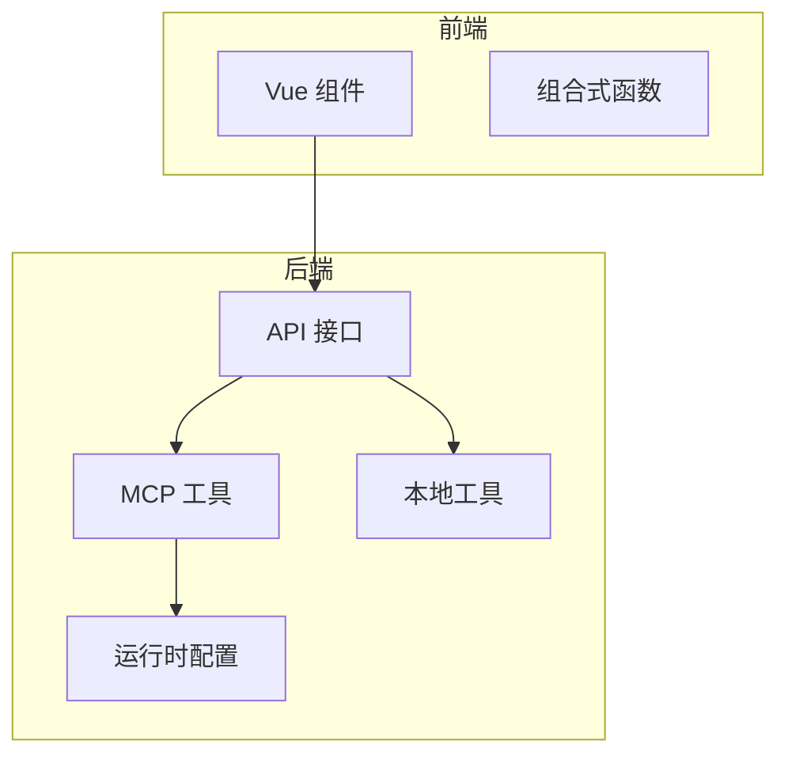
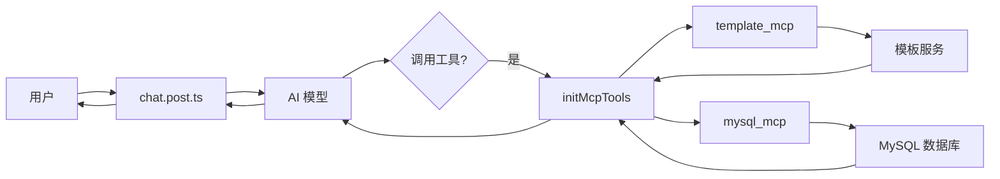
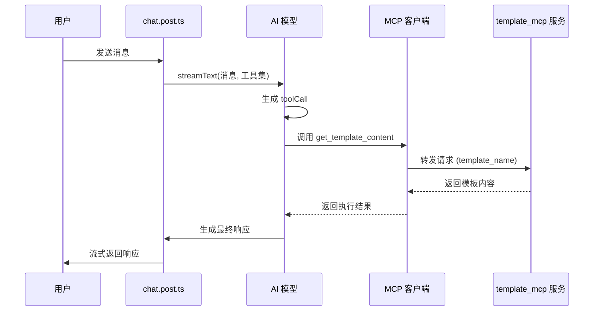

# MCP 工具

<cite>
**本文档引用的文件**  
- [mcp-tools.ts](file://server/core/tools/mcp-tools.ts)
- [chat.post.ts](file://server/api/chat.post.ts)
- [local-tools.ts](file://server/core/tools/local-tools.ts)
- [nuxt.config.ts](file://nuxt.config.ts)
</cite>

## 目录
1. [简介](#简介)
2. [项目结构](#项目结构)
3. [核心组件](#核心组件)
4. [架构概述](#架构概述)
5. [详细组件分析](#详细组件分析)
6. [依赖分析](#依赖分析)
7. [性能考虑](#性能考虑)
8. [故障排除指南](#故障排除指南)
9. [结论](#结论)

## 简介
本文档深入解析 `mcp-tools.ts` 中 Model Context Protocol（MCP）工具的实现机制。重点阐述 `initMcpTools` 函数如何加载外部 MCP 服务器的工具描述（tool schemas），解析其元数据（如工具名称、参数结构、功能描述），并将其动态注册为 AI 模型可识别和调用的工具集。同时说明 MCP 工具如何与外部系统（如数据库、模板服务）安全交互，包括请求转发、响应处理与错误映射。结合代码示例说明工具发现机制、类型安全校验（通过 zod）及其在 `chat.post.ts` 中的集成流程。最后讨论安全性与性能影响。

**Section sources**
- [mcp-tools.ts](file://server/core/tools/mcp-tools.ts#L1-L93)
- [chat.post.ts](file://server/api/chat.post.ts#L1-L43)

## 项目结构
项目采用典型的 Nuxt 3 分层架构，核心逻辑位于 `server` 目录下。MCP 工具相关实现位于 `server/core/tools/` 目录中，通过 `mcp-tools.ts` 统一管理外部 MCP 服务的连接与工具注册。AI 对话接口 `chat.post.ts` 位于 `server/api/` 下，负责集成本地与 MCP 工具，并通过流式响应返回结果。运行时配置（如 MCP 服务路径）在 `nuxt.config.ts` 中定义。



**Diagram sources**
- [mcp-tools.ts](file://server/core/tools/mcp-tools.ts#L1-L93)
- [chat.post.ts](file://server/api/chat.post.ts#L1-L43)
- [nuxt.config.ts](file://nuxt.config.ts#L1-L27)

**Section sources**
- [mcp-tools.ts](file://server/core/tools/mcp-tools.ts#L1-L93)
- [chat.post.ts](file://server/api/chat.post.ts#L1-L43)
- [nuxt.config.ts](file://nuxt.config.ts#L1-L27)

## 核心组件
`mcp-tools.ts` 是 MCP 工具的核心管理模块，负责初始化与外部 MCP 服务（如 `template_mcp` 和 `mysql_mcp`）的连接，并通过 `initMcpTools` 函数暴露受控的工具集。该函数利用 `experimental_createMCPClient` 创建客户端，通过 `StdioClientTransport` 与本地运行的 MCP 服务进程通信。工具的输入参数通过 zod 模式进行类型约束，确保 AI 调用时的输入合法性。

`chat.post.ts` 是 MCP 工具的集成入口，通过 `streamText` API 将 MCP 工具与本地工具（`local-tools.ts`）统一注册到 AI 模型的工具调用系统中。当模型生成 `toolCall` 时，服务端自动路由到对应工具执行并返回结果。

**Section sources**
- [mcp-tools.ts](file://server/core/tools/mcp-tools.ts#L1-L93)
- [chat.post.ts](file://server/api/chat.post.ts#L1-L43)
- [local-tools.ts](file://server/core/tools/local-tools.ts#L1-L19)

## 架构概述
系统采用模块化架构，AI 服务通过 MCP 协议桥接外部工具服务。`chat.post.ts` 作为 API 入口，初始化 MCP 客户端并注册工具。MCP 客户端通过标准输入输出与独立运行的 MCP 服务进程通信，实现安全隔离。工具调用流程为：用户请求 → AI 模型 → 工具选择 → MCP 客户端 → MCP 服务 → 执行 → 响应 → AI 模型 → 用户。



**Diagram sources**
- [mcp-tools.ts](file://server/core/tools/mcp-tools.ts#L1-L93)
- [chat.post.ts](file://server/api/chat.post.ts#L1-L43)

## 详细组件分析

### MCP 工具初始化分析
`initMcpTools` 函数是 MCP 工具的核心初始化逻辑。它首先创建两个 MCP 客户端：`templateClientPromise` 和 `mysqlClientPromise`，分别连接模板生成服务和 MySQL 上下文准备服务。这些客户端通过 `uv` 命令在指定目录（`MCP_SERVER_DIRECTORY`）下启动对应的服务进程。

#### 工具注册与类型安全
```mermaid
flowchart TD
Start([initMcpTools]) --> CreateClients["创建 MCP 客户端"]
CreateClients --> LoadTemplateTools["加载模板工具"]
LoadTemplateTools --> DefineSchema["定义 get_template_content 输入模式"]
DefineSchema --> EnumValues["枚举: domain, mapper, service..."]
LoadTemplateTools --> ReturnTemplateTools["返回模板工具对象"]
CreateClients --> LoadMysqlTools["加载 MySQL 工具"]
LoadMysqlTools --> DefineMysqlSchema["定义 prepare_template_context 输入模式"]
DefineMysqlSchema --> StringType["参数 table_name: string"]
LoadMysqlTools --> ReturnMysqlTools["返回 MySQL 工具对象"]
ReturnTemplateTools --> CombineTools["合并工具集"]
ReturnMysqlTools --> CombineTools
CombineTools --> End([返回 { ...templateTools, ...mysqlTools }])
```

**Diagram sources**
- [mcp-tools.ts](file://server/core/tools/mcp-tools.ts#L44-L92)

#### 工具调用流程分析


**Diagram sources**
- [mcp-tools.ts](file://server/core/tools/mcp-tools.ts#L44-L92)
- [chat.post.ts](file://server/api/chat.post.ts#L1-L43)

**Section sources**
- [mcp-tools.ts](file://server/core/tools/mcp-tools.ts#L1-L93)
- [chat.post.ts](file://server/api/chat.post.ts#L1-L43)

### 本地工具示例分析
本地工具通过 `initLocalTools` 函数定义，使用 `ai` 库的 `tool` 方法创建。每个工具包含描述、输入模式（zod）和执行函数。例如 `dateTime` 工具无输入参数，直接返回当前日期。

**Section sources**
- [local-tools.ts](file://server/core/tools/local-tools.ts#L1-L19)

## 依赖分析
MCP 工具依赖外部 MCP 服务进程的正常运行。`mcp-tools.ts` 依赖 `ai` 库的 `experimental_createMCPClient` 和 `@modelcontextprotocol/sdk/client/stdio.js` 的 `StdioClientTransport`。运行时配置依赖 `nuxt.config.ts` 中定义的 `mcpServerDirectory`。`chat.post.ts` 依赖 `mcp-tools.ts` 和 `local-tools.ts` 提供的工具集。

```mermaid
graph TD
A[mcp-tools.ts] --> B[ai]
A --> C[@modelcontextprotocol/sdk]
A --> D[nuxt.config.ts]
E[chat.post.ts] --> A
E --> F[local-tools.ts]
```

**Diagram sources**
- [mcp-tools.ts](file://server/core/tools/mcp-tools.ts#L1-L93)
- [chat.post.ts](file://server/api/chat.post.ts#L1-L43)
- [nuxt.config.ts](file://nuxt.config.ts#L1-L27)

**Section sources**
- [mcp-tools.ts](file://server/core/tools/mcp-tools.ts#L1-L93)
- [chat.post.ts](file://server/api/chat.post.ts#L1-L43)
- [nuxt.config.ts](file://nuxt.config.ts#L1-L27)

## 性能考虑
MCP 工具的性能受网络延迟和外部服务响应时间影响。由于通过进程间通信（stdio）调用外部服务，存在一定的序列化与反序列化开销。建议为 MCP 调用设置合理的超时机制，并在高并发场景下考虑连接池或缓存策略。`streamText` 的 `stopWhen` 选项可限制最大步骤数，防止无限循环调用。

## 故障排除指南
- **MCP 服务无法启动**：检查 `mcpServerDirectory` 路径是否正确，`uv` 命令是否可用，MCP 服务脚本是否存在。
- **工具调用失败**：检查输入参数是否符合 zod 模式定义，MCP 服务日志是否有错误输出。
- **环境变量缺失**：确保 `mysql_mcp` 所需的数据库连接信息（如 `MYSQL_HOST`）已正确设置。
- **类型校验错误**：确认 `inputSchema` 定义与 AI 模型期望的参数结构一致。

**Section sources**
- [mcp-tools.ts](file://server/core/tools/mcp-tools.ts#L1-L93)
- [nuxt.config.ts](file://nuxt.config.ts#L1-L27)

## 结论
`mcp-tools.ts` 实现了一套灵活且安全的外部工具集成机制。通过 MCP 协议，系统能够动态加载和调用外部服务，扩展 AI 模型的能力。结合 zod 类型校验，确保了工具调用的安全性与可靠性。在 `chat.post.ts` 中的集成方式简洁高效，支持流式响应。未来可进一步优化错误处理、超时控制和工具发现机制，提升整体稳定性和用户体验。