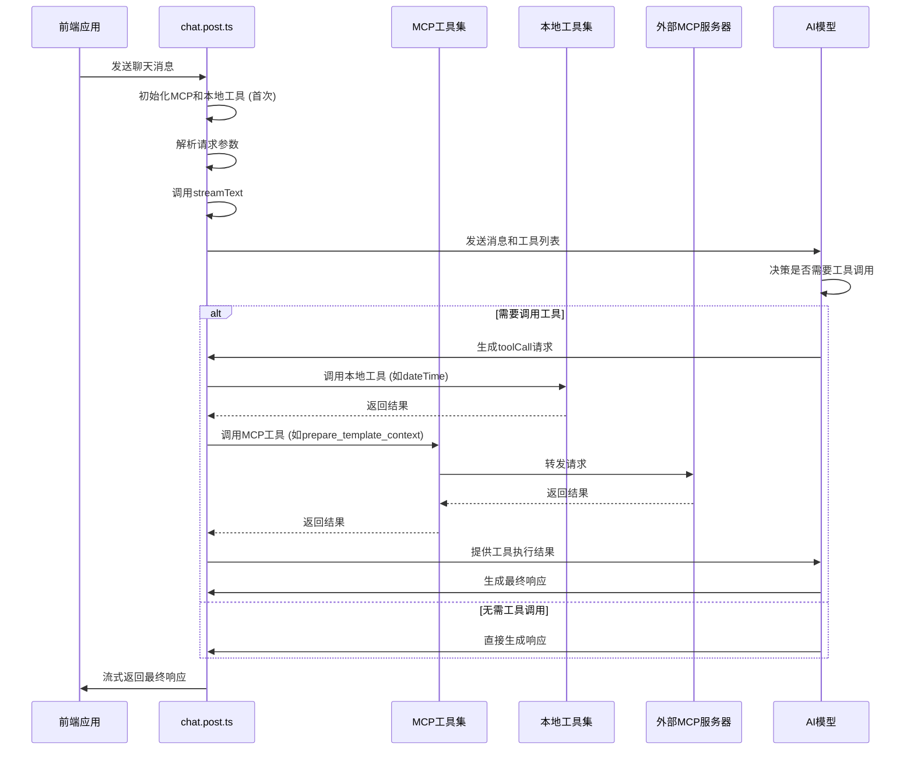

<cite>
**本文档中引用的文件**   
- [mcp-tools.ts](file://server/core/tools/mcp-tools.ts)
- [local-tools.ts](file://server/core/tools/local-tools.ts)
- [chat.post.ts](file://server/api/chat.post.ts)
</cite>

## 目录
1. [引言](#引言)
2. [MCP工具系统](#mcp工具系统)
3. [本地工具系统](#本地工具系统)
4. [工具调用集成流程](#工具调用集成流程)
5. [新增工具实现示例](#新增工具实现示例)
6. [安全性与权限控制](#安全性与权限控制)
7. [性能考量](#性能考量)
8. [结论](#结论)

## 引言
本文档旨在全面阐述项目中的工具调用能力，涵盖MCP（Model Context Protocol）工具与本地工具两大类别。文档将详细解析`initMcpTools`函数如何加载外部MCP服务器描述文件，`initLocalTools`函数如何定义本地工具，以及这些工具如何在`chat.post.ts`中被集成和调用，形成一个完整的AI交互闭环。

## MCP工具系统

`mcp-tools.ts`文件实现了对MCP（Model Context Protocol）工具的初始化与管理。该系统通过`experimental_createMCPClient`创建与外部MCP服务器的连接，利用`StdioClientTransport`通过标准输入输出与服务器进程通信。目前系统集成了两个MCP服务器：模板服务器（`template_mcp`）和MySQL服务器（`mysql_mcp`），其可执行命令由`uv`工具在指定目录下运行。

`initMcpTools`函数是MCP工具的核心入口，其主要职责是筛选并约束外部服务器暴露的工具集，以确保安全性和协议一致性。该函数通过`.tools()`方法从已建立的客户端连接中获取工具，并使用`schemas`参数对工具的输入参数进行严格的Zod模式校验。例如，`get_template_content`工具的`template_name`参数被限制为一个包含14个特定模板名称的枚举类型，防止了无效或恶意的输入。同样，`prepare_template_context`工具要求`table_name`必须为字符串。通过这种方式，系统仅暴露了`template_mcp`的模板内容获取功能和`mysql_mcp`的模板上下文准备功能，而屏蔽了后者可能包含的其他通用MySQL操作，实现了最小权限原则。

**Section sources**
- [mcp-tools.ts](file://server/core/tools/mcp-tools.ts#L44-L92)

## 本地工具系统

`local-tools.ts`文件定义了在应用服务器内部直接执行的本地工具。与MCP工具不同，本地工具无需外部进程通信，执行效率更高，适用于简单的、与外部服务无关的逻辑。

`initLocalTools`函数负责创建和返回本地工具集。每个工具通过`tool`函数进行定义，包含三个核心部分：`description`（描述）、`inputSchema`（输入模式）和`execute`（执行逻辑）。以`dateTime`工具为例，其描述为“获取当前日期和时间”，输入模式为一个空对象（`z.object()`），表示无需任何参数。其执行逻辑简单地返回当前日期的ISO字符串格式的日期部分。这种模式使得AI模型能够清晰地理解工具的功能和调用方式。本地工具的定义方式灵活，可以轻松扩展以支持更多内部功能。

**Section sources**
- [local-tools.ts](file://server/core/tools/local-tools.ts#L6-L18)

## 工具调用集成流程

工具调用的完整生命周期在`chat.post.ts`文件中实现，形成了一个从用户请求到AI响应的闭环。

1.  **初始化**：当API首次被调用时，`defineLazyEventHandler`会异步执行一次初始化逻辑。在此阶段，`initMcpTools`和`initLocalTools`被调用，分别获取MCP工具集和本地工具集。
2.  **请求处理**：对于每一个具体的聊天请求（`defineEventHandler`），系统会解析请求体中的`messages`、`model`等参数。
3.  **流式响应生成**：系统调用`streamText`函数，传入LLM模型、温度参数、系统提示词（`templateGenPrompt()`）以及合并后的工具集（`{ ...mcpTools, ...localTools }`）。
4.  **AI决策与工具调用**：AI模型在生成响应的过程中，如果判断需要调用工具来获取信息（例如，需要当前日期或数据库表结构），它会生成一个`toolCall`请求，指定要调用的工具名称和参数。
5.  **工具执行与结果返回**：服务端接收到`toolCall`后，会在本地工具集或MCP工具集中查找对应的工具并执行。对于本地工具，直接运行`execute`函数；对于MCP工具，则通过已建立的客户端连接将请求转发给外部服务器。执行结果被返回给AI模型。
6.  **最终响应**：AI模型结合工具返回的结果，继续生成最终的自然语言响应，并通过`toUIMessageStreamResponse()`以流式方式返回给前端。



**Diagram sources**
- [chat.post.ts](file://server/api/chat.post.ts#L29-L39)
- [mcp-tools.ts](file://server/core/tools/mcp-tools.ts#L44-L92)
- [local-tools.ts](file://server/core/tools/local-tools.ts#L6-L18)

**Section sources**
- [chat.post.ts](file://server/api/chat.post.ts#L29-L39)

## 新增工具实现示例

### 新增本地工具
要新增一个本地工具，需在`local-tools.ts`的`initLocalTools`函数返回的对象中添加新条目。例如，添加一个获取随机数的工具：
```typescript
randomNumber: tool({
  description: 'Generate a random number between min and max',
  inputSchema: z.object({
    min: z.number().default(0),
    max: z.number().default(100)
  }),
  execute: ({ min, max }) => {
    return Math.floor(Math.random() * (max - min + 1)) + min;
  }
})
```

### 新增MCP工具
新增MCP工具需要两步：
1.  **部署MCP服务器**：开发并部署一个新的MCP服务器（或扩展现有服务器），使其支持新的功能。
2.  **在客户端注册**：在`mcp-tools.ts`中，为新的MCP服务器创建一个新的`experimental_createMCPClient`实例（如果需要），然后在`initMcpTools`函数中，通过`.tools()`方法注册新工具，并为其定义严格的`inputSchema`。

## 安全性与权限控制

本系统通过多层机制保障工具调用的安全性：
1.  **输入验证**：所有工具，无论是本地还是MCP，都通过Zod库进行严格的输入参数校验。这能有效防止注入攻击和无效参数导致的错误。
2.  **最小权限暴露**：`initMcpTools`函数明确指定了只暴露特定的工具（如`get_template_content`和`prepare_template_context`），即使MCP服务器提供了更多功能，这些功能也不会被AI模型发现和调用。
3.  **环境隔离**：MCP工具在独立的进程（由`uv`启动）中运行，与主应用进程隔离，降低了主应用被攻击的风险。
4.  **配置化**：MCP服务器的目录和数据库连接信息通过`useRuntimeConfig()`从运行时配置中读取，避免了硬编码，便于在不同环境间安全地管理敏感信息。

## 性能考量

工具调用的性能开销主要体现在以下几个方面：
1.  **MCP工具延迟**：调用MCP工具涉及进程间通信（IPC），存在一定的网络延迟和序列化开销，其性能低于本地工具。对于高频或低延迟要求的场景，应优先考虑实现为本地工具。
2.  **初始化开销**：`initMcpTools`在首次调用时会建立与MCP服务器的连接，这个过程可能耗时。使用`defineLazyEventHandler`确保了连接只初始化一次，后续请求可复用，优化了性能。
3.  **AI决策成本**：每次`toolCall`都会增加一次与AI模型的往返通信，延长了整体响应时间。因此，应设计工具使其功能明确，避免不必要的工具调用。

## 结论

本项目的工具系统通过整合MCP和本地工具，极大地扩展了AI模型的能力边界。`mcp-tools.ts`和`local-tools.ts`提供了清晰的工具定义和注册机制，而`chat.post.ts`则实现了工具调用的无缝集成。该设计在功能、安全性和性能之间取得了良好的平衡，为构建复杂的AI驱动应用奠定了坚实的基础。未来可通过引入更精细的权限控制和工具调用监控来进一步增强系统的健壮性。