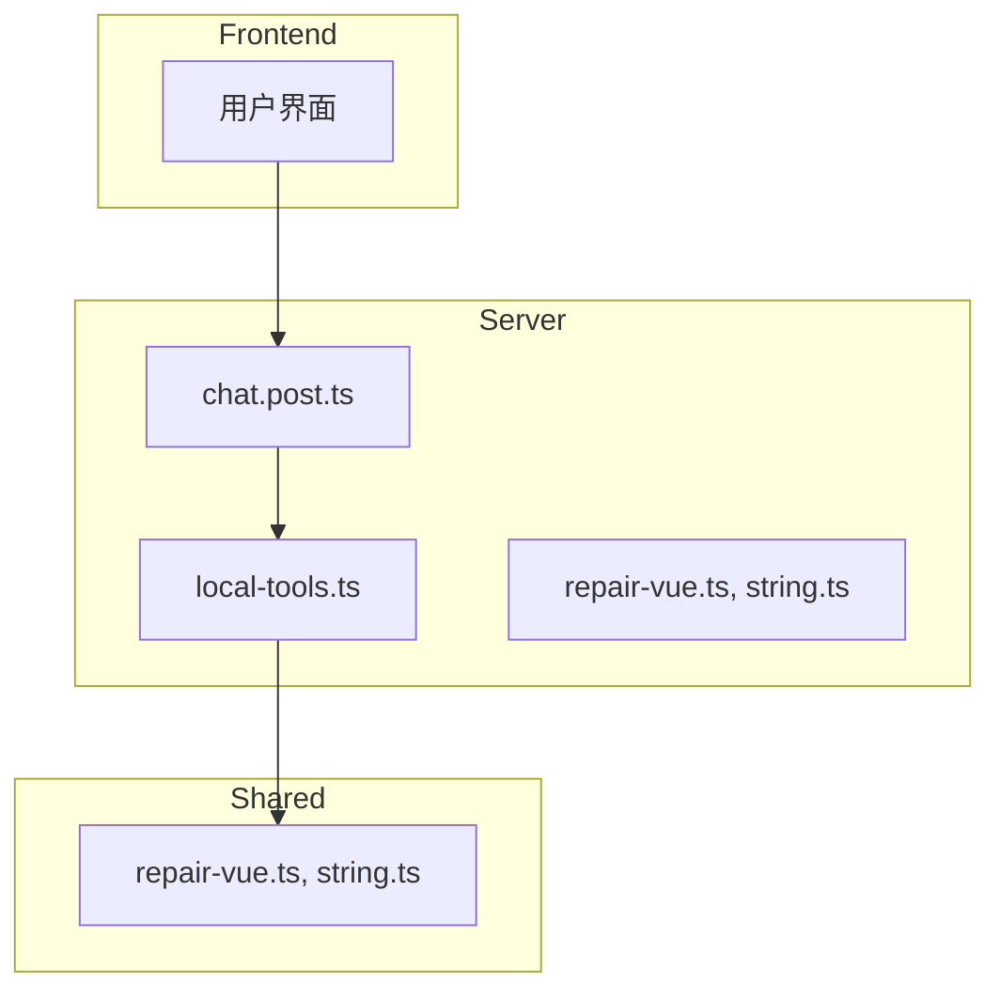
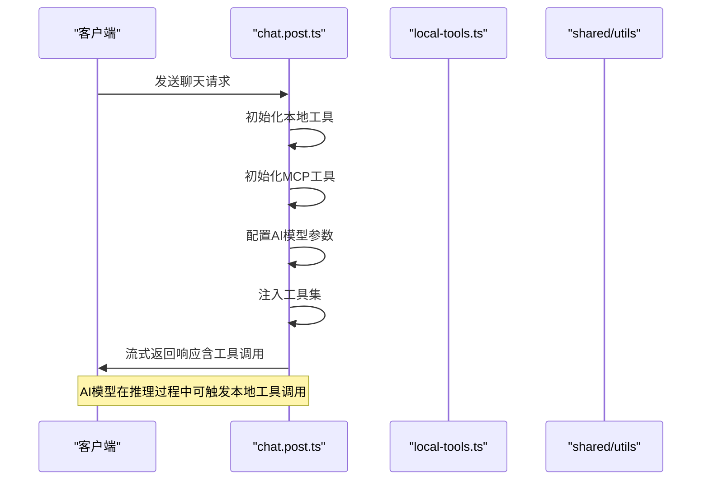
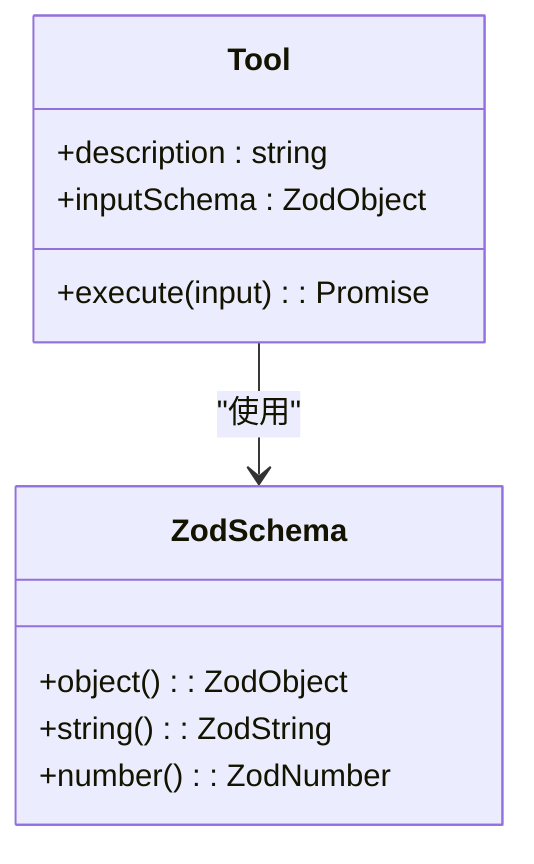
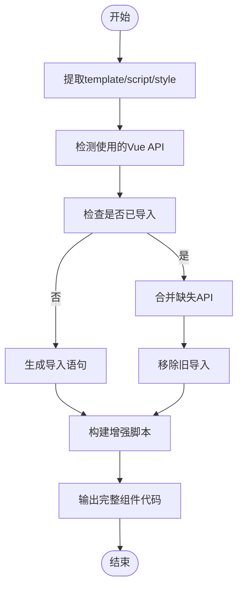
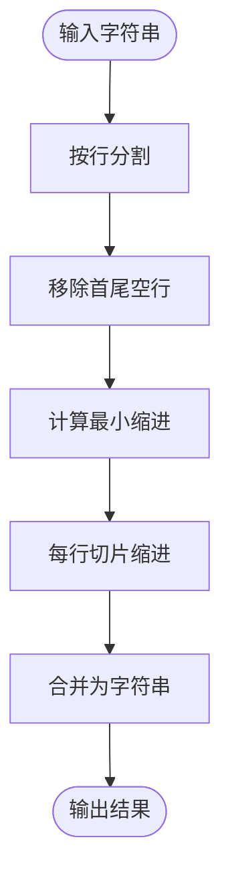
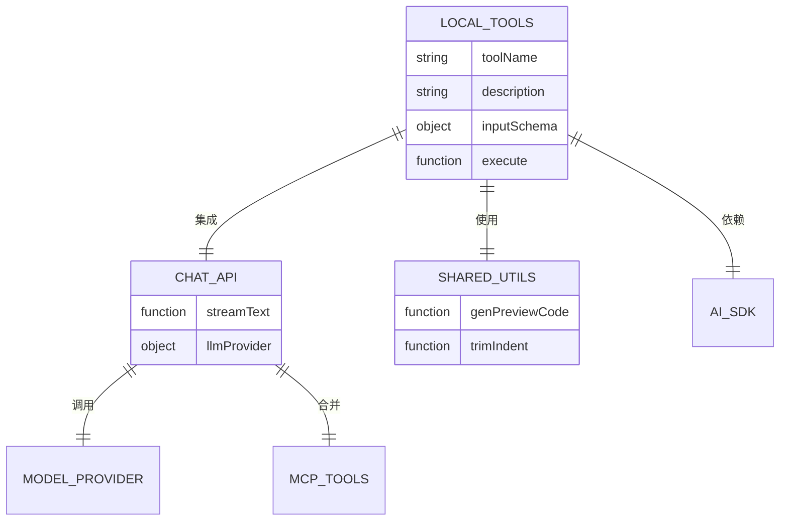

# 本地工具

<cite>
**本文档引用的文件**  
- [local-tools.ts](file://server/core/tools/local-tools.ts)
- [chat.post.ts](file://server/api/chat.post.ts)
- [repair-vue.ts](file://shared/utils/repair-vue.ts)
- [string.ts](file://shared/utils/string.ts)
- [mcp-tools.ts](file://server/core/tools/mcp-tools.ts)
</cite>

## 目录
1. [简介](#简介)
2. [项目结构](#项目结构)
3. [核心组件](#核心组件)
4. [架构概述](#架构概述)
5. [详细组件分析](#详细组件分析)
6. [依赖分析](#依赖分析)
7. [性能考虑](#性能考虑)
8. [故障排除指南](#故障排除指南)
9. [结论](#结论)

## 简介
本文档全面解析 `local-tools.ts` 中定义的本地工具系统，涵盖其注册机制、执行流程、与 AI 模型的集成方式，以及新增工具的开发步骤。同时对比 MCP 工具，讨论安全风险及防范措施。

## 项目结构
本项目采用分层架构，主要分为前端（`app/`）、服务端（`server/`）和共享工具（`shared/`）三大部分。本地工具定义于服务端核心模块中，通过 API 接口暴露给 AI 引擎调用。

**图示来源**  
- [local-tools.ts](file://server/core/tools/local-tools.ts#L6-L19)
- [chat.post.ts](file://server/api/chat.post.ts#L14-L19)
- [repair-vue.ts](file://shared/utils/repair-vue.ts#L0-L240)
- [string.ts](file://shared/utils/string.ts#L0-L28)

**本节来源**  
- [local-tools.ts](file://server/core/tools/local-tools.ts#L1-L20)
- [chat.post.ts](file://server/api/chat.post.ts#L1-L44)

## 核心组件
本地工具系统由 `initLocalTools` 函数初始化，返回一组可被 AI 调用的工具对象。每个工具包含描述、输入校验规则和执行逻辑。当前示例为 `dateTime` 工具，用于获取当前日期时间。

**本节来源**  
- [local-tools.ts](file://server/core/tools/local-tools.ts#L6-L19)

## 架构概述
本地工具系统作为 AI 推理过程中的扩展能力，由 `chat.post.ts` 在初始化时加载，并与 MCP 工具合并后注入 AI 模型。当 AI 判断需要调用本地功能时，会触发对应工具执行，结果返回至对话流。

**图示来源**  
- [chat.post.ts](file://server/api/chat.post.ts#L14-L35)
- [local-tools.ts](file://server/core/tools/local-tools.ts#L6-L19)

## 详细组件分析

### 本地工具注册机制
本地工具通过 `tool` 函数封装，需提供描述、输入 schema 和执行函数。Zod 用于定义严格的参数校验规则，确保输入安全。

#### 工具定义结构

**图示来源**  
- [local-tools.ts](file://server/core/tools/local-tools.ts#L9-L18)

**本节来源**  
- [local-tools.ts](file://server/core/tools/local-tools.ts#L6-L19)

### 现有工具实现分析

#### 代码修复工具（genPreviewCode）
该工具用于增强 Vue 组件代码的可预览性，自动补全缺失的 Vue API 导入。

**图示来源**  
- [repair-vue.ts](file://shared/utils/repair-vue.ts#L150-L239)

**本节来源**  
- [repair-vue.ts](file://shared/utils/repair-vue.ts#L0-L240)

#### 字符串处理工具（trimIndent）
用于移除字符串首行和末行的空行，并统一缩进。

**图示来源**  
- [string.ts](file://shared/utils/string.ts#L10-L27)

**本节来源**  
- [string.ts](file://shared/utils/string.ts#L1-L28)

### 新增本地工具步骤
开发者可通过以下步骤新增本地工具：

1. 编写业务逻辑函数
2. 使用 Zod 定义输入校验规则
3. 调用 `tool()` 封装工具
4. 注册到 `initLocalTools` 返回对象中

**本节来源**  
- [local-tools.ts](file://server/core/tools/local-tools.ts#L6-L19)

## 依赖分析
本地工具系统依赖 AI SDK 的 `tool` 函数进行封装，并依赖共享工具库中的字符串和 Vue 处理函数。通过 `chat.post.ts` 集成至主服务流程。

**图示来源**  
- [local-tools.ts](file://server/core/tools/local-tools.ts#L1-L19)
- [chat.post.ts](file://server/api/chat.post.ts#L1-L44)
- [repair-vue.ts](file://shared/utils/repair-vue.ts#L0-L240)
- [string.ts](file://shared/utils/string.ts#L0-L28)

**本节来源**  
- [local-tools.ts](file://server/core/tools/local-tools.ts#L1-L19)
- [chat.post.ts](file://server/api/chat.post.ts#L1-L44)

## 性能考虑
本地工具在服务端同步执行，应避免阻塞操作。建议对复杂逻辑使用异步处理，并设置合理的超时机制。Zod 校验开销较小，可忽略不计。

## 故障排除指南
- **工具未被调用**：检查 `chat.post.ts` 是否正确注入工具集
- **参数校验失败**：确认 Zod schema 与 AI 输出格式匹配
- **代码注入风险**：严禁直接执行用户输入的代码，所有字符串操作需转义处理
- **Vue API 导入错误**：确保 `detectUsedVueApis` 能正确识别所有 API

**本节来源**  
- [local-tools.ts](file://server/core/tools/local-tools.ts#L6-L19)
- [repair-vue.ts](file://shared/utils/repair-vue.ts#L50-L140)

## 结论
本地工具系统为 AI 提供了安全可控的扩展能力，通过结构化定义和严格校验，实现了业务逻辑的安全封装。相比 MCP 工具，本地工具更轻量、响应更快，适用于高频、低复杂度的操作。未来可进一步完善工具注册机制，支持动态加载。