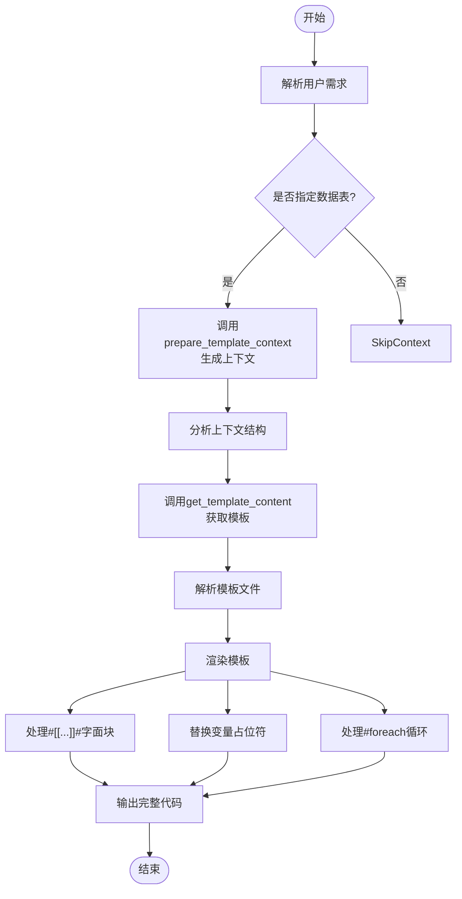
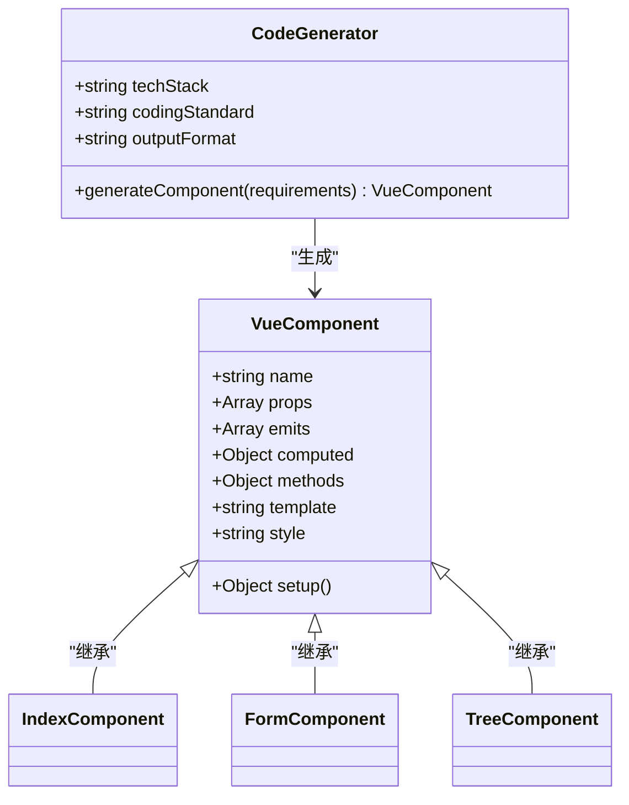

# 提示词设计

<cite>
**本文档引用文件**  
- [template-gen.ts](file://server/core/prompt/template-gen.ts)
- [ai-gen.ts](file://server/core/prompt/ai-gen.ts)
- [template.ts](file://shared/utils/template.ts)
</cite>

## 目录
1. [引言](#引言)
2. [核心提示词生成机制](#核心提示词生成机制)
3. [模板化提示词构建逻辑](#模板化提示词构建逻辑)
4. [AI代码生成提示设计](#ai代码生成提示设计)
5. [提示词与模型行为关系分析](#提示词与模型行为关系分析)
6. [实际提示词样本分析](#实际提示词样本分析)
7. [提示词优化策略](#提示词优化策略)
8. [扩展性与未来支持](#扩展性与未来支持)
9. [结论](#结论)

## 引言
本文深入解析系统中提示词（Prompt）的设计与生成机制，重点阐述`template-gen.ts`和`ai-gen.ts`两个核心模块如何协同工作，构建结构化、可执行的AI指令，以引导大模型生成高质量、符合规范的前端与后端代码。通过分析角色设定、输出格式要求、错误规避指令等关键要素，揭示提示工程在自动化代码生成中的核心作用。

## 核心提示词生成机制

系统通过模块化方式动态生成提示词，主要依赖`template-gen.ts`中的`templateGenPrompt`函数。该函数根据用户选择的技术栈（如Vue2或Vue3）动态调整可用模板列表，确保生成的代码与目标框架一致。

提示词包含明确的角色定位、可用模板清单、处理流程、语法解析规则、错误预防机制和质量保证要求，形成一套完整的代码生成规范体系。其设计目标是让AI模型在无歧义的指令下，输出可直接执行的代码文件，避免额外解释或自然语言描述。

**关键特性包括**：
- 支持前后端多类型代码模板
- 动态适配Vue版本
- 严格的Velocity模板语法处理规则
- 字面量输出块的优先级保障
- 循环与条件语句的完整性验证

**Section sources**
- [template-gen.ts](file://server/core/prompt/template-gen.ts#L1-L237)

## 模板化提示词构建逻辑

### 角色与职责定义
提示词首先明确AI的角色为“代码生成引擎”，强调其职责是将Velocity模板与上下文数据合并，生成可执行代码。这一角色设定确保模型不会偏离代码生成任务。

### 可用模板列表动态生成
通过`getCodeTemplatePrompt(isVue3)`工具函数，系统根据`isVue3`参数动态生成前端模板列表。若使用Vue3，则启用`vue_v3_index`、`vue_v3_form`等Vue3专用模板；否则使用Vue2对应模板。

该逻辑封装在`shared/utils/template.ts`中，实现了模板配置的集中管理与复用。

### 模板处理流程
提示词定义了严格的七步工作流程：
1. 解析用户需求
2. 调用`prepare_template_context`生成上下文
3. 分析上下文结构（变量、数组、嵌套对象）
4. 获取目标模板内容
5. 解析Velocity指令（#if, #foreach, #set）
6. 渲染模板（替换占位符、处理循环、输出字面块）
7. 输出完整代码（使用Markdown代码块包裹）

### 关键处理规则
#### 字面输出块（Literal Blocks）
使用`#[[...]]#`标记的代码块必须原样输出，仅移除标记本身，不解析内部任何Velocity语法。这是最高优先级规则，确保JavaScript、HTML等代码片段不被误处理。

#### 循环语句处理
`#foreach`循环必须遍历集合中所有元素，禁止遗漏。系统要求模型验证集合存在性并理解其结构，防止空指针或迭代错误。

#### 错误预防机制
- 缺失变量：用空字符串替代
- 嵌套访问：逐层验证存在性
- 方法调用：支持`.size()`、`.isEmpty()`等常见Velocity方法



**Diagram sources**
- [template-gen.ts](file://server/core/prompt/template-gen.ts#L50-L100)
- [template.ts](file://shared/utils/template.ts#L10-L40)

**Section sources**
- [template-gen.ts](file://server/core/prompt/template-gen.ts#L1-L237)
- [template.ts](file://shared/utils/template.ts#L1-L114)

## AI代码生成提示设计

`ai-gen.ts`模块提供专门针对Vue3组件生成的提示词，聚焦于前端UI开发场景。其设计目标是生成符合生产环境标准的Vue3 + Element Plus组件代码。

### 技术栈限定
提示词明确限定技术栈：
- Vue3.5（Composition API）
- JavaScript (ES6+)
- Element Plus UI库
- `<script setup>`语法糖

### 代码质量要求
提示词包含11项具体编码规范：
1. 结构清晰，遵循Vue3最佳实践
2. 使用Composition API组织逻辑
3. 包含完整JSDoc注释
4. 实现错误处理机制
5. 考虑性能优化（计算属性、监听器等）
6. 遵循ESLint规范
7. 提升可读性与可维护性
8. 使用Element Plus组件保证UI一致性
9. 代码块顺序：template → script → style
10. 显式导入组件和Vue API
11. 禁用样式预处理器，使用原生CSS

### 功能性考量
提示词要求模型深度理解用户需求，考虑：
- 组件的props与events
- 状态管理（reactive, ref）
- 生命周期钩子使用
- 表单验证逻辑
- 响应式设计适配



**Diagram sources**
- [ai-gen.ts](file://server/core/prompt/ai-gen.ts#L1-L33)

**Section sources**
- [ai-gen.ts](file://server/core/prompt/ai-gen.ts#L1-L33)

## 提示词与模型行为关系分析

提示词设计直接影响模型的输出行为。通过few-shot示例、明确指令和结构化格式，系统有效提升了生成准确性。

### 指令明确性
使用“必须”、“禁止”、“优先级”等强约束词汇，减少模型自由发挥空间，确保输出一致性。

### 上下文隔离
`template-gen.ts`提示词强调“一次只处理一个模板文件”，防止上下文混淆导致的错误。

### 错误恢复机制
当输入不符合代码生成要求时，系统规定统一响应：“抱歉，请提供正确的代码生成语料。” 避免模型生成无关内容。

### 工具调用协同
提示词中嵌入对`prepare_template_context`和`get_template_content`工具的调用指令，实现AI与系统工具的无缝协作，提升生成效率与准确性。

**Section sources**
- [template-gen.ts](file://server/core/prompt/template-gen.ts#L1-L237)
- [ai-gen.ts](file://server/core/prompt/ai-gen.ts#L1-L33)

## 实际提示词样本分析

### Vue3组件生成提示样本
```
你是一个专业的前端开发专家，专门负责生成高质量的Vue3 UI组件代码。
你的任务是根据用户的具体需求，生成符合生产环境要求的Vue3组件代码，技术栈限定为：
- Vue3.5 (Composition API)
- JavaScript (ES6+)
- Element Plus UI组件库
- <script setup> 语法糖
...
```
此提示词成功引导模型生成符合Element Plus规范的表单组件，包含正确的导入语句、响应式数据定义和事件处理逻辑。

### Velocity模板处理提示样本
```
# 角色定位
你是一个代码生成引擎，负责将Velocity模板文件内容与模板上下文合并，生成符合要求的代码。
...
## 字面输出块（关键 - 最高优先级）：
- "#[["和"]]#"之间的内容必须完全按照书写内容输出
- 从最终输出中移除"#[["和"]]#"标记
...
```
该提示词确保模型在处理包含JavaScript代码的模板时，不会解析`#[[console.log('$variable');]]#`中的`$variable`，而是原样输出`console.log('$variable');`，保障代码正确性。

**Section sources**
- [template-gen.ts](file://server/core/prompt/template-gen.ts#L1-L237)
- [ai-gen.ts](file://server/core/prompt/ai-gen.ts#L1-L33)

## 提示词优化策略

### 长度控制
通过模块化设计（如`getCodeTemplatePrompt`函数复用）避免重复内容，保持提示词精炼高效。

### 上下文管理
明确划分“角色”、“流程”、“规则”、“注意事项”等章节，提升可读性与逻辑性，帮助模型快速定位关键信息。

### 防注入机制
- 使用`#[[...]]#`隔离原始代码，防止Velocity语法被误解析
- 禁止模型自行添加内容，仅做模板填充
- 对缺失变量统一替换为空字符串，避免敏感信息泄露

### 可维护性设计
将通用模板列表提取至`shared/utils/template.ts`，实现跨模块复用，降低维护成本。

**Section sources**
- [template-gen.ts](file://server/core/prompt/template-gen.ts#L1-L237)
- [template.ts](file://shared/utils/template.ts#L1-L114)

## 扩展性与未来支持

系统具备良好的扩展性，可通过以下方式支持新模板类型：
1. **新增模板类型**：在`getCodeTemplatePrompt`中添加新条目（如`**react_component**`）
2. **更新文件名映射**：在`getFileNameFromMessage`中增加case分支
3. **定义新处理规则**：在提示词中补充相应语法解析说明

未来可扩展方向包括：
- 支持React、Angular等其他前端框架
- 增加微服务、Dockerfile等后端模板
- 引入多语言支持（TypeScript、Python等）
- 集成代码安全扫描规则

**Section sources**
- [template.ts](file://shared/utils/template.ts#L1-L114)
- [template-gen.ts](file://server/core/prompt/template-gen.ts#L1-L237)

## 结论
本系统通过精心设计的提示词工程，实现了高质量、可预测的AI代码生成。`template-gen.ts`和`ai-gen.ts`分别针对模板化代码生成和前端组件开发提供了专业化指令体系。通过角色设定、流程规范、语法处理规则和质量保障机制，有效引导AI模型输出符合生产标准的代码。该设计体现了提示词在AI编程助手中的核心价值，为自动化代码生成提供了可靠的技术基础。