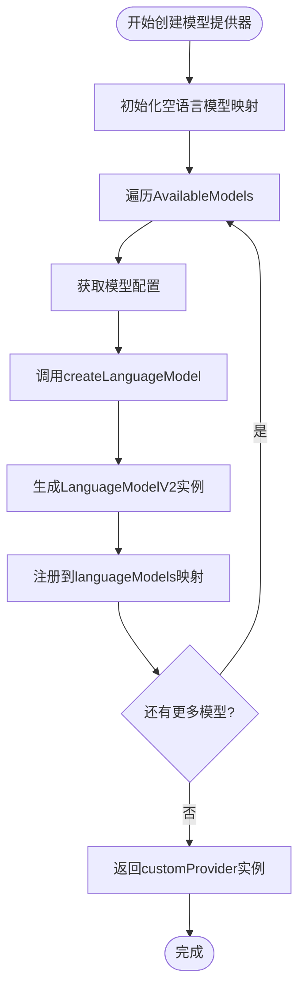
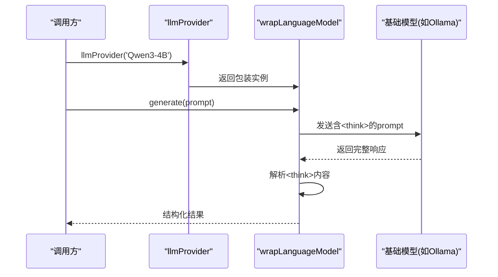
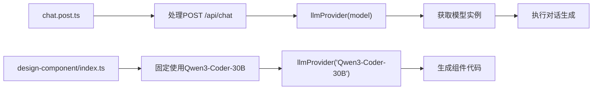

# 模型集成机制

<cite>
**本文档引用的文件**  
- [model.ts](file://server/utils/model.ts)
- [model.ts](file://shared/types/model.ts)
- [chat.post.ts](file://server/api/chat.post.ts)
- [index.ts](file://server/core/steps/design-component/index.ts)
</cite>

## 目录
1. [简介](#简介)
2. [核心架构设计](#核心架构设计)
3. [模型元数据与类型定义](#模型元数据与类型定义)
4. [模型提供器的动态创建机制](#模型提供器的动态创建机制)
5. [多提供商支持与统一接口抽象](#多提供商支持与统一接口抽象)
6. [中间件机制与推理增强](#中间件机制与推理增强)
7. [模型别名映射与API路由](#模型别名映射与api路由)
8. [认证逻辑分离设计](#认证逻辑分离设计)
9. [添加新模型支持的步骤](#添加新模型支持的步骤)
10. [模型切换的影响分析](#模型切换的影响分析)
11. [实际使用示例](#实际使用示例)
12. [总结](#总结)

## 简介
本系统通过抽象化模型集成机制，实现了对多种AI模型提供商（如OpenAI兼容接口、DeepSeek、Ollama等）的统一管理。`llmProvider`工厂函数根据配置的模型名称（如`gpt-4o`、`deepseek-chat`）动态选择对应的AI提供商并实例化客户端，屏蔽底层差异，提供一致的调用接口。该机制支持灵活扩展，便于集成新模型。

## 核心架构设计
系统采用分层抽象设计，将模型定义、提供商封装、运行时配置与客户端调用解耦。核心组件包括：
- **模型元数据定义**：在`shared/types/model.ts`中声明所有可用模型及其属性
- **提供商适配层**：为不同AI服务创建标准化客户端封装
- **动态工厂函数**：`llmProvider`根据模型名查找并返回对应实例
- **统一接口抽象**：所有模型均实现`LanguageModelV2`接口，确保行为一致性

```mermaid
graph TB
A[客户端调用] --> B[llmProvider(modelName)]
B --> C{查找模型配置}
C --> D[createLanguageModel]
D --> E[根据provider创建实例]
E --> F[应用中间件可选]
F --> G[返回标准化模型实例]
```

**Diagram sources**  
- [model.ts](file://server/utils/model.ts#L59-L93)
- [model.ts](file://shared/types/model.ts#L36-L137)

**Section sources**  
- [model.ts](file://server/utils/model.ts#L1-L121)
- [model.ts](file://shared/types/model.ts#L1-L148)

## 模型元数据与类型定义
在`shared/types/model.ts`中，通过`AvailableModels`常量数组集中管理所有支持的模型配置。每个模型包含以下元数据字段：

| 字段 | 类型 | 说明 |
|------|------|------|
| `id` | `string` | 模型在提供商系统中的唯一标识符 |
| `name` | `string` | 系统内使用的模型别名（如`DeepSeek-Chat`） |
| `description` | `string` | 模型功能描述 |
| `provider` | `string` | 提供商名称（如`siliconflow`、`deepseek`） |
| `middleware` | `string?` | 可选中间件配置（如`think`用于推理增强） |

该结构通过TypeScript的`const assertion`和类型推导，生成精确的联合类型`AvailableModelNames`，确保模型名称的类型安全。

**Section sources**  
- [model.ts](file://shared/types/model.ts#L36-L137)

## 模型提供器的动态创建机制
`createModelProvider`函数遍历`AvailableModels`列表，为每个模型配置调用`createLanguageModel`生成对应的`LanguageModelV2`实例，并注册到自定义提供器中。此过程在应用启动时完成，确保运行时调用的高效性。



**Diagram sources**  
- [model.ts](file://server/utils/model.ts#L99-L108)

**Section sources**  
- [model.ts](file://server/utils/model.ts#L99-L108)

## 多提供商支持与统一接口抽象
系统通过`createLanguageModel`函数实现多提供商支持。基于`provider`字段的值，使用`switch`语句路由到不同的客户端构造逻辑：

- `siliconflow`：使用`createOpenAICompatible`封装OpenAI兼容API
- `ollama`：直接调用`ollama`提供商
- `deepseek`：使用`createDeepSeek`专用封装
- `bailian`：使用`createOpenAICompatible`连接阿里百炼

所有实例最终都实现`LanguageModelV2`接口，提供统一的`chat`、`completion`等方法，屏蔽底层协议差异。

**Section sources**  
- [model.ts](file://server/utils/model.ts#L59-L93)

## 中间件机制与推理增强
对于需要特殊处理的模型（如支持思维链的`qwen3:4b`），系统通过`middleware`字段配置中间件。当`middleware === 'think'`时，使用`wrapLanguageModel`包装基础模型，并注入`extractReasoningMiddleware`，自动提取`<think>`标签内的推理过程，实现结构化输出解析。



**Diagram sources**  
- [model.ts](file://server/utils/model.ts#L78-L85)

**Section sources**  
- [model.ts](file://server/utils/model.ts#L78-L85)

## 模型别名映射与API路由
系统通过`name`字段实现模型别名映射，解耦用户可见名称与底层实现。例如：
- `DeepSeek-Chat` → `deepseek-chat` (provider: `deepseek`)
- `Qwen2.5-72B` → `Qwen/Qwen2.5-72B-Instruct-128K` (provider: `siliconflow`)

这种设计允许：
1. 统一用户体验：用户始终使用简洁别名
2. 灵活后端切换：可更换底层提供商而不影响前端
3. 渐进式升级：通过新别名引入改进版本

**Section sources**  
- [model.ts](file://shared/types/model.ts#L36-L137)

## 认证逻辑分离设计
认证信息通过`useRuntimeConfig()`从运行时配置注入，实现敏感信息与代码逻辑分离：
- `siliconFlowApiKey`、`bailianApiKey`等密钥存储在环境变量或配置文件中
- 各提供商客户端在初始化时自动注入对应密钥
- 代码中不出现硬编码凭证，提升安全性

此设计支持多租户场景下的动态凭证管理。

**Section sources**  
- [model.ts](file://server/utils/model.ts#L15-L55)

## 添加新模型支持的步骤
要添加新模型支持，请按以下步骤操作：

1. **环境变量配置**  
   在`.env`文件中添加必要的API密钥和端点URL

2. **扩展模型定义**  
   在`shared/types/model.ts`的`AvailableModels`数组中添加新条目：
   ```ts
   {
     id: 'new-model-id',
     name: 'NewModel-Alias',
     description: '新模型描述',
     provider: 'new-provider',
     middleware: 'think' // 可选
   }
   ```

3. **扩展提供商支持**  
   在`server/utils/model.ts`的`createLanguageModel`函数中添加新的`case`分支

4. **测试验证**  
   使用`llmProvider('NewModel-Alias')`进行功能测试，验证响应格式和流式行为

**Section sources**  
- [model.ts](file://shared/types/model.ts#L36-L137)
- [model.ts](file://server/utils/model.ts#L59-L93)

## 模型切换的影响分析
切换模型可能影响以下方面：

| 影响维度 | 说明 |
|---------|------|
| **提示词适配** | 不同模型对提示词结构敏感度不同，需调整系统提示词格式 |
| **工具兼容性** | 部分模型（如Ollama本地模型）可能不支持函数调用功能 |
| **流式响应行为** | 各提供商的流式传输延迟和分块策略存在差异 |
| **上下文长度** | 模型最大上下文从32K到1M不等，需动态调整截断策略 |
| **推理模式** | 仅部分模型支持`<think>`标签的中间件解析 |

建议在`description`字段中明确标注模型能力特征，辅助选择。

**Section sources**  
- [model.ts](file://shared/types/model.ts#L36-L137)
- [model.ts](file://server/utils/model.ts#L78-L85)

## 实际使用示例
模型提供器在多个关键路径中被调用：



**Diagram sources**  
- [chat.post.ts](file://server/api/chat.post.ts#L27)
- [index.ts](file://server/core/steps/design-component/index.ts#L29)

**Section sources**  
- [chat.post.ts](file://server/api/chat.post.ts#L27)
- [index.ts](file://server/core/steps/design-component/index.ts#L29)

## 总结
本系统通过`llmProvider`工厂模式实现了多模型的统一抽象，具备良好的扩展性和维护性。核心优势包括：
- **类型安全**：基于TypeScript的精确类型推导
- **动态路由**：根据配置自动选择提供商
- **关注点分离**：模型定义、认证、逻辑处理各司其职
- **易于扩展**：新增模型仅需修改两处配置

该设计为未来集成更多AI提供商奠定了坚实基础。