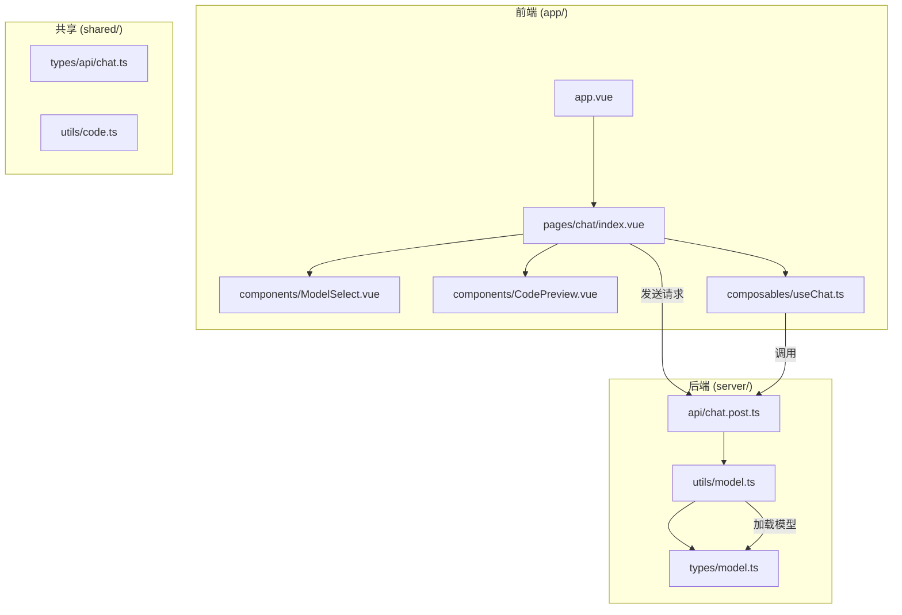

# 开发者入门指南

<cite>
**本文档中引用的文件**  
- [README.md](file://README.md)
- [.env.example](file://.env.example)
- [nuxt.config.ts](file://nuxt.config.ts)
- [package.json](file://package.json)
- [app/composables/useChat.ts](file://app/composables/useChat.ts)
- [server/api/chat.post.ts](file://server/api/chat.post.ts)
- [app/pages/chat/index.vue](file://app/pages/chat/index.vue)
- [shared/types/model.ts](file://shared/types/model.ts)
- [server/utils/model.ts](file://server/utils/model.ts)
- [app/components/ModelSelect.vue](file://app/components/ModelSelect.vue)
</cite>

## 目录

1. [简介](#简介)
2. [项目结构](#项目结构)
3. [环境搭建](#环境搭建)
4. [配置环境变量](#配置环境变量)
5. [启动开发服务器](#启动开发服务器)
6. [基本交互流程](#基本交互流程)
7. [关键配置与代码入口](#关键配置与代码入口)
8. [调试建议](#调试建议)
9. [常见问题解答](#常见问题解答)
10. [总结](#总结)

## 简介

本指南旨在帮助新手开发者快速上手 `code_gen` 项目，从零开始完成环境搭建、依赖安装、配置设置、服务启动，并成功生成第一段代码。整个过程设计为10分钟内可完成，适合初次接触该项目的开发者。

## 项目结构

`code_gen` 是一个基于 Nuxt.js 的全栈应用，前端使用 Vue 3 和 Element Plus X 组件库，后端通过 Nuxt 服务端 API 处理请求，集成多种大模型服务（如 DeepSeek、SiliconFlow、Ollama）实现 AI 代码生成功能。



**Diagram sources**  
- [app/pages/chat/index.vue](file://app/pages/chat/index.vue)
- [server/api/chat.post.ts](file://server/api/chat.post.ts)
- [shared/types/model.ts](file://shared/types/model.ts)

## 环境搭建

### 1. 克隆仓库

打开终端，执行以下命令克隆项目：

```bash
git clone https://github.com/All_in_Ai/code_gen.git
cd code_gen
```

### 2. 安装依赖

项目使用 `pnpm` 作为包管理器，请确保已安装 pnpm（可通过 `npm install -g pnpm` 安装）。

安装项目依赖：

```bash
pnpm install
```

该命令将根据 `package.json` 和 `pnpm-lock.yaml` 文件安装所有必要的依赖包。

**Section sources**  
- [package.json](file://package.json)
- [README.md](file://README.md)

## 配置环境变量

### 1. 复制示例环境文件

在项目根目录下，复制 `.env.example` 文件并重命名为 `.env`：

```bash
cp .env.example .env
```

### 2. 填写 API 密钥

使用文本编辑器打开 `.env` 文件，填写所需的 API 密钥：

```env
# 硅基流动 API 密钥（可选）
NUXT_SILICON_FLOW_API_KEY=your_siliconflow_api_key_here

# DeepSeek API 密钥（可选）
NUXT_DEEPSEEK_API_KEY=your_deepseek_api_key_here

# MCP 服务项目路径（如使用 MCP 工具）
NUXT_MCP_SERVER_DIRECTORY=E:/GitHub/All_in_Ai/test_mcp_server
```

> **提示**：  
> - 若仅使用本地 Ollama 模型，可不填写 API 密钥。  
> - `NUXT_MCP_SERVER_DIRECTORY` 需指向本地已运行的 MCP 服务项目路径。

**Section sources**  
- [.env.example](file://.env.example)
- [README.md](file://README.md)

## 启动开发服务器

在项目根目录执行以下命令启动开发服务器：

```bash
pnpm dev -o
```

- `pnpm dev`：启动 Nuxt 开发服务器。
- `-o`：自动在默认浏览器中打开应用。

启动成功后，浏览器将自动打开 `http://localhost:3000`，显示 AI 代码生成助手界面。

**Section sources**  
- [README.md](file://README.md)

## 基本交互流程

### 1. 输入需求

在聊天界面底部的输入框中输入您的代码需求，例如：

> 请生成一个 Vue 3 的按钮组件，带有 hover 动效。

### 2. 选择模型（可选）

点击输入框左侧的 **选择模型** 按钮，从弹出的模型列表中选择您希望使用的 AI 模型。支持的模型包括：
- DeepSeek 系列（通过官方或 SiliconFlow）
- 通义千问系列（Qwen）
- Kimi 开发者模型
- 本地 Ollama 模型（如 qwen2.5:7b）

选择后，后续对话将使用该模型生成响应。

### 3. 查看生成代码

AI 将流式返回生成的代码，您可以在聊天窗口中实时查看。生成的代码通常包含：
- Vue 组件代码（`<template>`、`<script>`、`<style>`）
- Markdown 格式的说明
- 工具调用过程（如使用 MCP 工具）

### 4. 操作生成结果

每条 AI 回复下方提供四个操作按钮：
- **重新生成**：重新生成该条回复。
- **提取代码**：将代码部分复制到剪贴板。
- **预览组件**：在内置 REPL 中预览 Vue 组件。
- **下载源码**：将代码保存为 `.vue` 文件。

**Section sources**  
- [app/pages/chat/index.vue](file://app/pages/chat/index.vue)
- [app/composables/useChat.ts](file://app/composables/useChat.ts)

## 关键配置与代码入口

### 1. 主要配置文件

#### `nuxt.config.ts`

项目核心配置文件，定义了：
- 运行时环境变量（如 API 地址、密钥）
- 使用的 Nuxt 模块（如 Element Plus、Pinia）
- 别名配置（如 `#server` 指向 `server/` 目录）

```ts
runtimeConfig: {
  siliconFlowApiUrl: '',
  siliconFlowApiKey: '',
  deepseekApiKey: '',
  mcpServerDirectory: '',
}
```

**Section sources**  
- [nuxt.config.ts](file://nuxt.config.ts)

### 2. 核心代码入口

#### 前端交互逻辑：`useChat.ts`

位于 `app/composables/useChat.ts`，负责：
- 管理聊天消息状态
- 调用 `/api/chat` 接口
- 处理流式响应数据
- 管理会话存储（通过 Pinia）

关键方法：
- `sendMessage()`：发送用户消息
- `generateResponse()`：调用 API 获取 AI 响应
- `addUserMessage()` / `addAssistantMessage()`：更新消息列表

#### 后端 API 接口：`chat.post.ts`

位于 `server/api/chat.post.ts`，处理 POST `/api/chat` 请求：
- 接收前端发送的模型名、消息历史
- 调用 `llmProvider` 获取对应模型实例
- 使用 `streamText` 流式返回 AI 响应
- 集成 MCP 工具和本地工具

```ts
streamText({
  model: llmProvider(model),
  system: templateGenPrompt(),
  messages,
  tools: { ...mcpTools, ...localTools }
})
```

#### 模型管理：`model.ts`

位于 `server/utils/model.ts` 和 `shared/types/model.ts`：
- `AvailableModels`：定义所有支持的模型及其提供商
- `llmProvider()`：根据模型名称动态创建模型实例
- 支持 SiliconFlow、DeepSeek、Ollama、Bailian 等多种来源

**Section sources**  
- [app/composables/useChat.ts](file://app/composables/useChat.ts)
- [server/api/chat.post.ts](file://server/api/chat.post.ts)
- [shared/types/model.ts](file://shared/types/model.ts)
- [server/utils/model.ts](file://server/utils/model.ts)

## 调试建议

### 1. 查看浏览器开发者工具

- **网络请求**：在 `Network` 标签页中查看 `/api/chat` 请求：
  - 检查请求体是否包含正确的 `model` 和 `messages`
  - 查看响应是否为 `text/event-stream` 流式数据
  - 若状态码非 200，检查错误信息
- **控制台日志**：查看是否有 JavaScript 错误或 `console.error`

### 2. 查看服务端日志

启动服务后，终端会输出 Nuxt 服务器日志：
- 监听端口（默认 3000）
- API 请求日志
- 错误堆栈（如模型初始化失败、API 密钥无效）

### 3. 验证环境变量

确保 `.env` 文件中的变量名正确，且值已填写。可通过 `console.log(useRuntimeConfig())` 在服务端验证。

### 4. 检查 MCP 服务

若使用 MCP 工具，确保：
- `NUXT_MCP_SERVER_DIRECTORY` 路径正确
- MCP 服务已在该路径下启动并监听

**Section sources**  
- [server/api/chat.post.ts](file://server/api/chat.post.ts)
- [nuxt.config.ts](file://nuxt.config.ts)

## 常见问题解答

### 1. 依赖安装失败

**问题**：`pnpm install` 报错，无法下载包。  
**解决**：
- 确保网络畅通，可尝试切换镜像源：
  ```bash
  pnpm config set registry https://registry.npmmirror.com
  ```
- 清除缓存后重试：
  ```bash
  pnpm clear cache
  pnpm install
  ```

### 2. API 连接错误

**问题**：调用 AI 模型时报 `HTTP error! status: 401` 或 `403`。  
**解决**：
- 检查 `.env` 文件中对应 API 密钥是否正确填写
- 确认 API 密钥未过期或被禁用
- 若使用 SiliconFlow，确保在官网已启用对应模型

### 3. 跨域问题

**问题**：前端请求后端 API 被浏览器阻止。  
**解决**：
- 本项目使用 Nuxt 开发服务器，自动处理同源策略，通常不会出现跨域问题。
- 若自定义部署，请确保前后端同域，或在服务端配置 CORS。

### 4. Ollama 模型无法使用

**问题**：选择 `qwen2.5:7b` 模型后无响应。  
**解决**：
- 确保已安装 Ollama 并运行服务
- 安装所需模型：
  ```bash
  ollama run qwen2.5:7b
  ```
- 检查 `server/utils/model.ts` 中是否正确配置 Ollama 提供商

### 5. 页面空白或报错

**问题**：启动后页面显示空白或控制台报错。  
**解决**：
- 检查 `nuxt.config.ts` 是否有语法错误
- 确保 `app.vue` 和 `pages/index.vue` 存在且无错误
- 删除 `.nuxt` 缓存目录后重启：
  ```bash
  rm -rf .nuxt
  pnpm dev
  ```

**Section sources**  
- [README.md](file://README.md)
- [nuxt.config.ts](file://nuxt.config.ts)
- [server/utils/model.ts](file://server/utils/model.ts)

## 总结

通过本指南，您已成功完成 `code_gen` 项目的环境搭建、配置、启动与基本使用。您现在可以：
- 输入自然语言需求，生成 Vue 组件代码
- 在多种 AI 模型间切换
- 预览、提取、下载生成的代码
- 通过调试工具排查常见问题

接下来，您可以尝试：
- 配置更多模型（如 DeepSeek 官方 API）
- 扩展 MCP 工具集
- 自定义提示词模板（`server/core/prompt/template-gen.ts`）

祝您开发顺利！