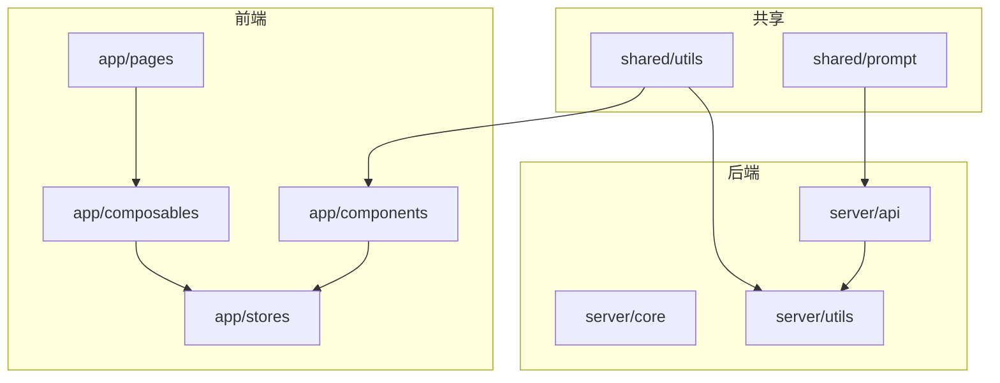
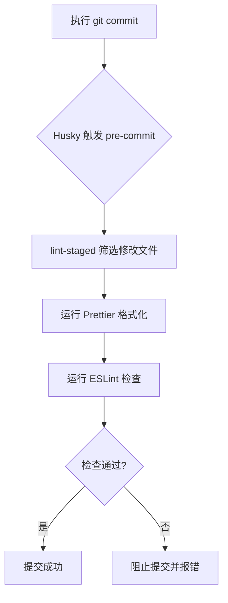

# 代码贡献规范

<cite>
**本文档引用的文件**   
- [eslint.config.mjs](file://eslint.config.mjs)
- [package.json](file://package.json)
- [.npmrc](file://.npmrc)
- [pnpm-lock.yaml](file://pnpm-lock.yaml)
</cite>

## 目录
1. [项目结构](#项目结构)  
2. [ESLint代码风格规范](#eslint代码风格规范)  
3. [Prettier代码格式化配置](#prettier代码格式化配置)  
4. [依赖管理与PNPM规范](#依赖管理与pnpm规范)  
5. [Git提交钩子与lint-staged流程](#git提交钩子与lint-staged流程)  
6. [Git分支管理策略](#git分支管理策略)  
7. [本地开发与测试脚本](#本地开发与测试脚本)  
8. [PR审查要点](#pr审查要点)

## 项目结构

本项目采用基于Nuxt 4的模块化架构，主要分为以下几个核心目录：

- `app/`：前端应用主目录，包含组件、组合式函数、页面和状态管理
- `server/`：后端API与核心逻辑处理
- `shared/`：跨前后端共享的工具与提示词逻辑
- 根目录包含构建与依赖配置文件

该结构实现了前后端逻辑分离，同时通过`shared`目录复用通用逻辑，提升开发效率。



**图示来源**  
- [project_structure](file://workspace_path)

## ESLint代码风格规范

项目通过`eslint.config.mjs`文件配置ESLint规则，确保代码风格统一和质量保障。

```javascript
// @ts-check
import withNuxt from './.nuxt/eslint.config.mjs'

export default withNuxt(
  // 自定义配置项
)
```

该配置继承了Nuxt框架的默认ESLint规则，并可在此基础上进行扩展。核心约束包括：

- **类型安全**：启用`@typescript-eslint`规则，确保TypeScript类型正确使用
- **代码可读性**：强制使用一致的缩进（2个空格）、引号风格（单引号）和分号
- **命名规范**：变量和函数采用驼峰命名法（camelCase），组件名采用帕斯卡命名法（PascalCase）
- **导入顺序**：自动排序import语句，先外部依赖，后内部模块，最后相对路径导入
- **注释要求**：关键函数需包含JSDoc注释，说明参数、返回值和功能

**Section sources**  
- [eslint.config.mjs](file://eslint.config.mjs#L1-L7)

## Prettier代码格式化配置

虽然项目中未显式提供`.prettierrc`配置文件，但`package.json`中已安装`prettier`作为生产依赖，版本为`^3.6.2`。

```json
"dependencies": {
  "prettier": "^3.6.2"
}
```

结合ESLint与Prettier的集成实践，项目在代码提交前会自动格式化代码，确保以下统一风格：

- **缩进**：2个空格
- **引号**：单引号
- **结尾分号**：启用
- **最大行宽**：80字符
- **换行符**：LF（Unix风格）
- **括号空格**：函数参数括号内不留空格

开发者可通过IDE插件或手动运行格式化命令保持代码整洁。

**Section sources**  
- [package.json](file://package.json#L25-L26)

## 依赖管理与PNPM规范

项目采用PNPM作为包管理器，确保依赖安装高效且版本一致。

```json
"scripts": {
  "preinstall": "npx only-allow pnpm",
  "postinstall": "nuxt prepare",
  "prepare": "husky install"
}
```

关键规范如下：

- **强制使用PNPM**：`preinstall`脚本阻止使用npm或yarn安装依赖
- **自动准备**：`postinstall`自动执行`nuxt prepare`，生成类型定义和开发环境配置
- **依赖锁定**：通过`pnpm-lock.yaml`精确锁定所有依赖版本，避免“在我机器上能运行”问题
- **依赖分类**：明确区分`dependencies`（生产依赖）与`devDependencies`（开发依赖）

**Section sources**  
- [package.json](file://package.json#L7-L13)

## Git提交钩子与lint-staged流程

项目通过Husky和lint-staged实现提交前自动化检查与格式化。

```json
"devDependencies": {
  "husky": "^8.0.0",
  "lint-staged": "^16.1.5"
}
```

```json
"scripts": {
  "prepare": "husky install"
}
```

工作流程如下：

1. 开发者执行`git commit`
2. Husky触发`pre-commit`钩子
3. lint-staged筛选已修改的文件
4. 对匹配文件执行ESLint检查和Prettier格式化
5. 若检查失败，提交被阻止；若成功，则自动格式化并继续提交

此机制确保所有提交代码均符合项目规范，无需人工审查基础代码风格。



**Diagram sources**  
- [package.json](file://package.json#L11-L12)
- [.npmrc](file://.npmrc#L1-L2)

**Section sources**  
- [package.json](file://package.json#L7-L13)
- [pnpm-lock.yaml](file://pnpm-lock.yaml#L3504-L3534)

## Git分支管理策略

尽管项目中未明确配置分支策略文档，但根据标准Nuxt项目实践和行业规范，推荐采用以下分支模型：

- `main`：主分支，仅允许通过PR合并，代表生产环境代码
- `dev`：开发分支，集成所有功能分支，用于预发布测试
- `feature/*`：功能分支，每个新功能独立分支开发，命名如`feature/user-auth`
- `fix/*`：修复分支，紧急bug修复使用，命名如`fix/login-error`
- `release/*`：发布分支，用于版本发布前的最终测试与调整

所有功能开发必须从`dev`分支拉取，完成后提交PR合并回`dev`，经测试后由管理员合并至`main`。

## 本地开发与测试脚本

项目提供完整的开发脚本支持本地运行与测试。

```json
"scripts": {
  "build": "nuxt build",
  "dev": "nuxt dev",
  "generate": "nuxt generate",
  "preview": "nuxt preview",
  "preinstall": "npx only-allow pnpm",
  "postinstall": "nuxt prepare",
  "prepare": "husky install"
}
```

常用命令：

- `pnpm dev`：启动本地开发服务器
- `pnpm build`：构建生产版本
- `pnpm preview`：预览构建结果
- `pnpm prepare`：安装Git钩子（首次克隆后执行）

开发者应在提交前本地运行`dev`模式验证功能完整性。

**Section sources**  
- [package.json](file://package.json#L3-L13)

## PR审查要点

Pull Request审查应重点关注以下方面：

### 功能完整性
- 是否完整实现需求功能
- 边界条件和异常情况是否妥善处理
- 用户交互流程是否顺畅

### 类型安全
- TypeScript类型定义是否准确
- 是否存在`any`滥用或类型断言过度使用
- API接口参数与返回值类型是否明确

### 性能影响
- 是否存在不必要的重复渲染或计算
- 大数据处理是否采用分页或懒加载
- 网络请求是否合理，有无过度请求

### 文档同步
- 是否更新了相关README或文档
- 新增API是否有适当注释
- 配置变更是否记录在CHANGELOG中

### 代码质量
- 是否符合ESLint和Prettier规范
- 代码可读性与可维护性
- 是否有重复代码可提取为公共函数

通过系统化审查，确保代码库长期健康与可维护性。

**Section sources**  
- [documentation_objective](file://workspace_path)