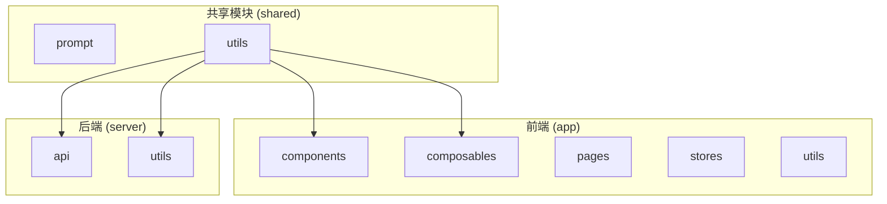
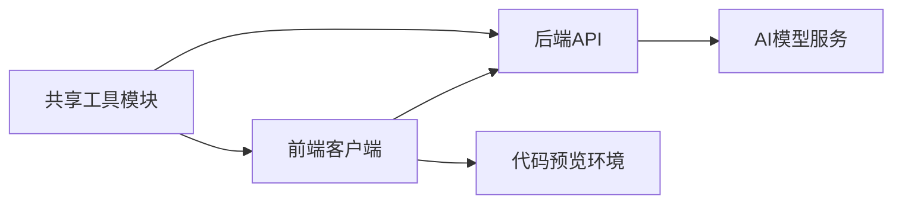
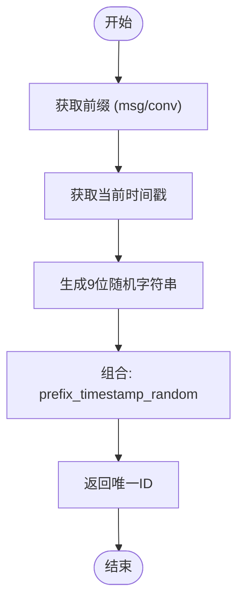
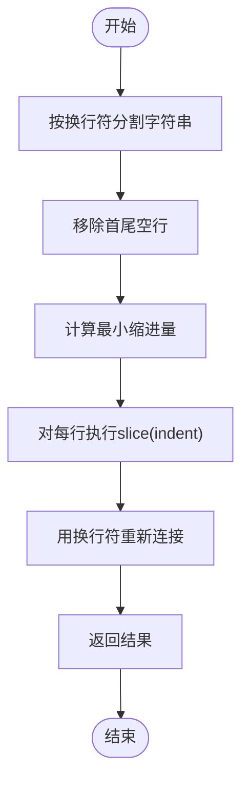
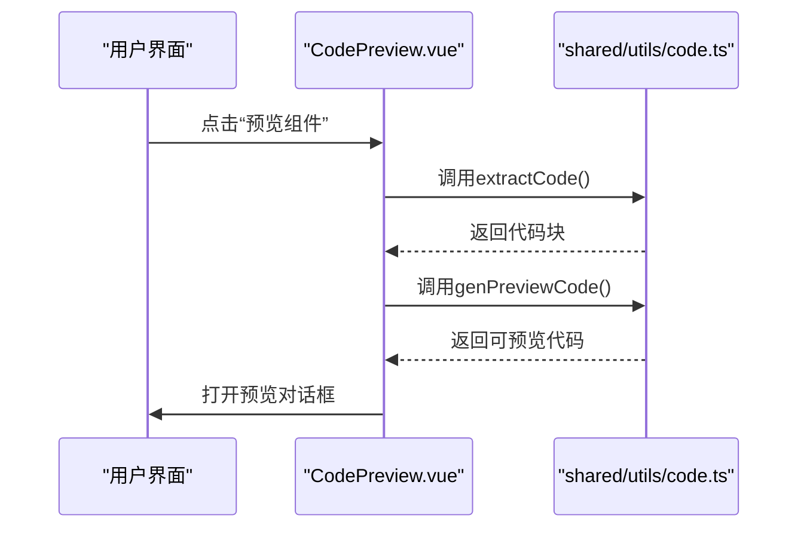
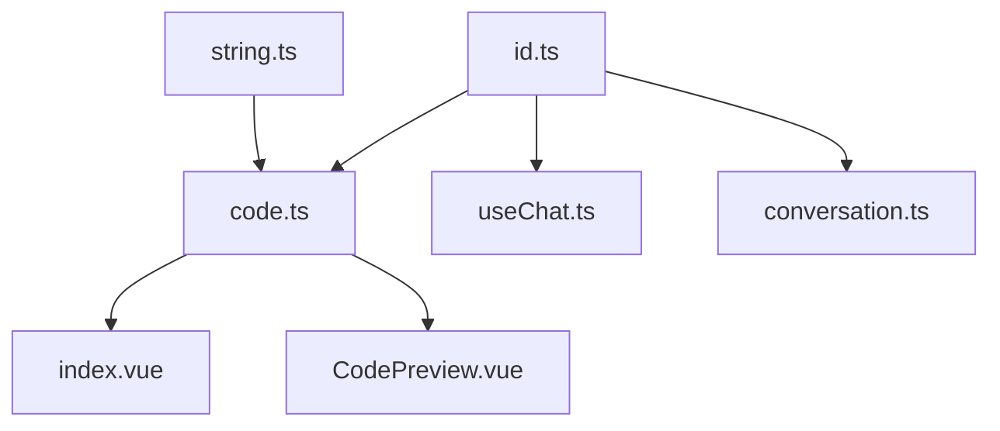

# 使用共享工具函数

<cite>
**本文档中引用的文件**   
- [id.ts](file://shared/utils/id.ts)
- [string.ts](file://shared/utils/string.ts)
- [code.ts](file://shared/utils/code.ts)
- [index.vue](file://app/pages/chat/index.vue)
- [CodePreview.vue](file://app/components/CodePreview.vue)
- [useChat.ts](file://app/composables/useChat.ts)
- [conversation.ts](file://app/stores/conversation.ts)
- [chat.post.ts](file://server/api/chat.post.ts)
</cite>

## 目录
1. [简介](#简介)
2. [项目结构](#项目结构)
3. [核心组件](#核心组件)
4. [架构概览](#架构概览)
5. [详细组件分析](#详细组件分析)
6. [依赖分析](#依赖分析)
7. [性能考量](#性能考量)
8. [故障排除指南](#故障排除指南)
9. [结论](#结论)

## 简介
本文档深入介绍了 `shared/utils` 目录下的通用工具函数及其在项目中的最佳实践。详细说明了 `id.ts` 中生成唯一标识符的方法（如 `generateId`），`string.ts` 中字符串处理工具（如模板替换、转义）的用途，以及 `code.ts` 中代码格式化与解析功能的实现逻辑。通过实际调用示例，展示了如何在前后端共用这些工具提升开发效率。同时强调了不可变性、性能优化和边界情况处理，并指导开发者如何安全扩展这些工具模块，确保类型定义同步更新。

## 项目结构
项目采用分层架构设计，主要分为 `app`（前端应用）、`server`（后端服务）和 `shared`（共享模块）三个核心部分。其中 `shared/utils` 模块作为跨平台工具库，被前后端共同引用，实现了代码复用和一致性。



**图示来源**
- [id.ts](file://shared/utils/id.ts)
- [string.ts](file://shared/utils/string.ts)
- [code.ts](file://shared/utils/code.ts)

**本节来源**
- [id.ts](file://shared/utils/id.ts)
- [string.ts](file://shared/utils/string.ts)
- [code.ts](file://shared/utils/code.ts)

## 核心组件
`shared/utils` 模块包含三个核心工具文件：`id.ts` 提供唯一ID生成，`string.ts` 提供字符串处理，`code.ts` 提供代码提取与预览功能。这些工具被广泛应用于会话管理、消息处理和代码生成等场景。

**本节来源**
- [id.ts](file://shared/utils/id.ts#L1-L27)
- [string.ts](file://shared/utils/string.ts#L1-L27)
- [code.ts](file://shared/utils/code.ts#L1-L395)

## 架构概览
系统采用前后端分离架构，前端通过 Nuxt 3 框架构建，后端使用 Nitro 服务器处理 API 请求。共享工具模块 `shared/utils` 作为桥梁，确保了前后端在ID生成、字符串处理和代码格式化方面的一致性。



**图示来源**
- [id.ts](file://shared/utils/id.ts)
- [code.ts](file://shared/utils/code.ts)
- [chat.post.ts](file://server/api/chat.post.ts)

## 详细组件分析
### ID生成工具分析
`id.ts` 文件提供了基于时间戳和随机数的唯一ID生成机制，用于会话和消息的标识。

#### ID生成逻辑


**图示来源**
- [id.ts](file://shared/utils/id.ts#L4-L27)

**本节来源**
- [id.ts](file://shared/utils/id.ts#L4-L27)
- [useChat.ts](file://app/composables/useChat.ts#L25-L35)
- [conversation.ts](file://app/stores/conversation.ts#L105-L115)

#### 实际调用场景
在 `useChat.ts` 中，`generateMessageId()` 被用于为每条用户和助手消息生成唯一ID：

```typescript
const addUserMessage = (content: string): void => {
  const message: ChatMessage = {
    id: generateMessageId(), // 生成消息ID
    content,
    role: 'user',
    timestamp: new Date(),
    typing: false,
    isMarkdown: false,
    shape: 'corner',
  };
  conversationStore.addMessage(conversationStore.activeConversationId, message);
};
```

在 `conversation.ts` 中，`generateConversationId()` 被用于创建新的会话：

```typescript
const createConversation = (
  params: CreateConversationParams = {}
): Conversation => {
  const conversation: Conversation = {
    id: generateConversationId(), // 生成会话ID
    title: params.title || `新对话 ${conversations.value.length + 1}`,
    group: params.group || 'recent',
    createdAt: now,
    updatedAt: now,
    config: params.config,
  };
  // ...
};
```

### 字符串处理工具分析
`string.ts` 文件提供了 `trimIndent` 函数，用于移除字符串的公共缩进，常用于代码格式化场景。

#### 缩进移除逻辑


**图示来源**
- [string.ts](file://shared/utils/string.ts#L13-L26)
- [code.ts](file://shared/utils/code.ts#L1-L395)

**本节来源**
- [string.ts](file://shared/utils/string.ts#L13-L26)
- [code.ts](file://shared/utils/code.ts#L1-L395)

### 代码处理工具分析
`code.ts` 文件提供了强大的代码提取和预览功能，是实现AI代码生成核心体验的关键。

#### 代码提取流程


**图示来源**
- [code.ts](file://shared/utils/code.ts#L17-L41)
- [CodePreview.vue](file://app/components/CodePreview.vue#L1-L82)

**本节来源**
- [code.ts](file://shared/utils/code.ts#L17-L208)
- [index.vue](file://app/pages/chat/index.vue#L300-L320)
- [CodePreview.vue](file://app/components/CodePreview.vue#L1-L82)

#### 核心函数实现
`extractCode` 函数使用正则表达式从Markdown内容中提取指定语言的代码块：

```typescript
export const extractCode = (
  content: string,
  language?: string,
  index: number = 0,
): string => {
  const codeRegex = language
    ? new RegExp(`\`\`\`${language}[\\s\\S]*?\`\`\``, 'g')
    : /```[\s\S]*?```/g;

  const matches = content.match(codeRegex);
  if (!matches || matches.length <= index) {
    return '';
  }

  const codeBlock = matches[index];
  const code = (codeBlock || '')
    .replace(/^```(?:\w+)?\s*/, '')
    .replace(/\s*```$/, '');

  return code.trim();
};
```

`genPreviewCode` 函数则进一步处理Vue组件代码，自动补全缺失的Vue API导入：

```typescript
export const genPreviewCode = (code: string) => {
  const { template, script, style } = extractVuePart(code);
  const usedVueApis = detectUsedVueApis(template + script);
  const existingVueImports = extractExistingVueImports(script);
  
  // 自动处理Vue API导入
  if (usedVueApis.length > 0 && !hasVueImport) {
    const vueImportStatement = generateVueImport(usedVueApis);
    enhancedScript = `${vueImportStatement}\n${enhancedScript}`;
  }

  return trimIndent(`
    <template>
    ${template}
    </template>

    <script setup>
    ${enhancedScript}
    </script>

    <style scoped>
    ${style}
    </style>
  `);
};
```

## 依赖分析
`shared/utils` 模块内部存在清晰的依赖关系，外部则被多个关键组件引用。



**图示来源**
- [id.ts](file://shared/utils/id.ts)
- [string.ts](file://shared/utils/string.ts)
- [code.ts](file://shared/utils/code.ts)
- [index.vue](file://app/pages/chat/index.vue)
- [CodePreview.vue](file://app/components/CodePreview.vue)
- [useChat.ts](file://app/composables/useChat.ts)
- [conversation.ts](file://app/stores/conversation.ts)

**本节来源**
- [id.ts](file://shared/utils/id.ts)
- [string.ts](file://shared/utils/string.ts)
- [code.ts](file://shared/utils/code.ts)

## 性能考量
- **ID生成**：`generateId` 使用 `Date.now()` 和 `Math.random()`，性能优异，无明显瓶颈。
- **字符串处理**：`trimIndent` 需要遍历所有行计算最小缩进，对于超长代码块可能存在性能问题，建议限制处理长度。
- **代码提取**：正则表达式匹配在处理复杂嵌套代码块时可能产生性能开销，建议对输入内容进行预检查。

## 故障排除指南
- **ID重复问题**：由于使用了时间戳+随机数的组合，理论上重复概率极低。若出现重复，检查系统时间是否准确。
- **代码提取失败**：确保AI返回的内容使用标准的Markdown代码块语法（```language ... ```）。
- **预览环境加载失败**：检查网络连接，确保CDN资源（如Element Plus CSS）可正常访问。
- **Vue API导入错误**：确认 `VUE_APIS` 常量列表与当前Vue版本兼容，必要时进行更新。

**本节来源**
- [id.ts](file://shared/utils/id.ts#L4-L27)
- [code.ts](file://shared/utils/code.ts#L17-L208)
- [CodePreview.vue](file://app/components/CodePreview.vue#L1-L82)

## 结论
`shared/utils` 模块通过提供 `id.ts`、`string.ts` 和 `code.ts` 三个核心工具文件，有效支撑了项目的ID生成、字符串处理和代码预览功能。这些工具在保持轻量级的同时，实现了高度的复用性和实用性，是项目架构中的关键基础设施。建议在扩展这些工具时，遵循不可变性原则，添加充分的边界情况测试，并同步更新类型定义，以确保代码质量和可维护性。