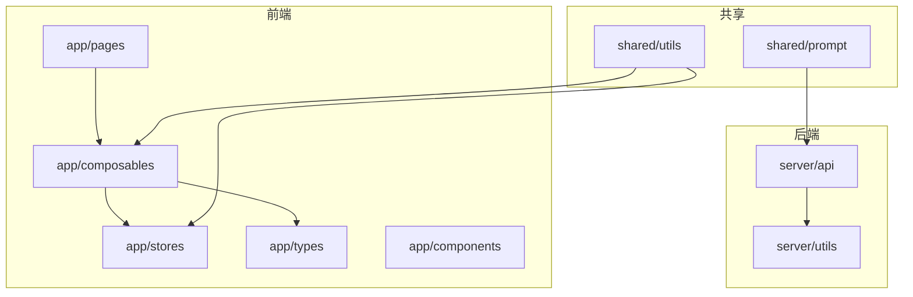
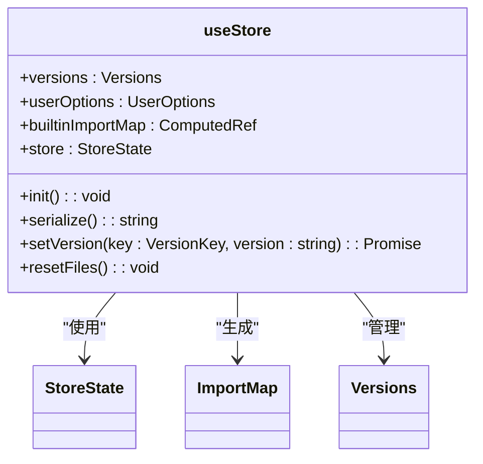
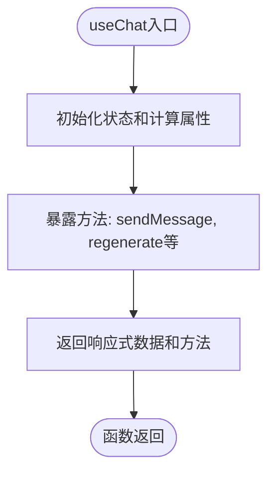
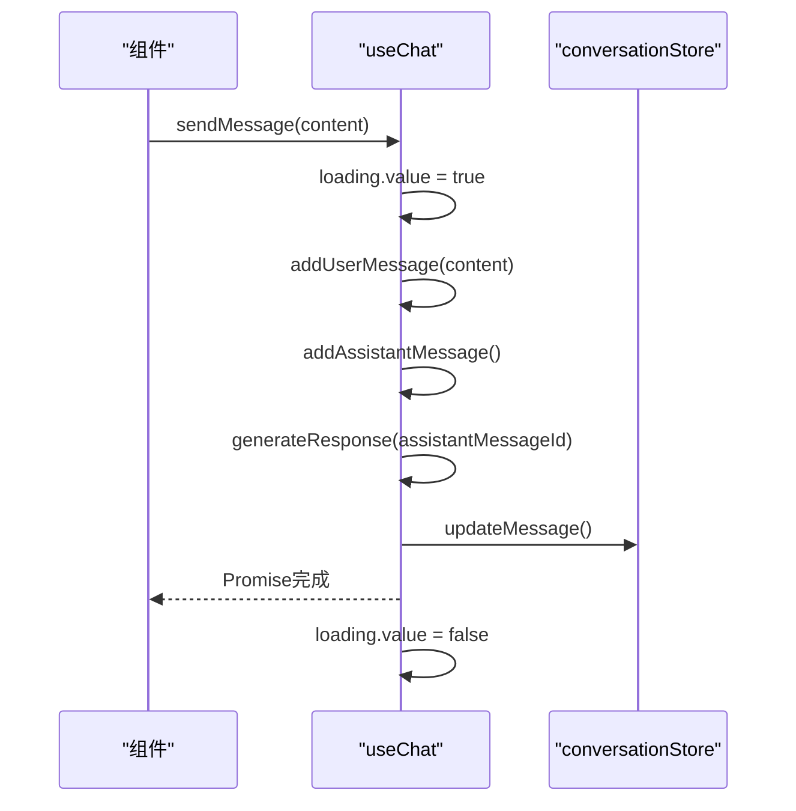
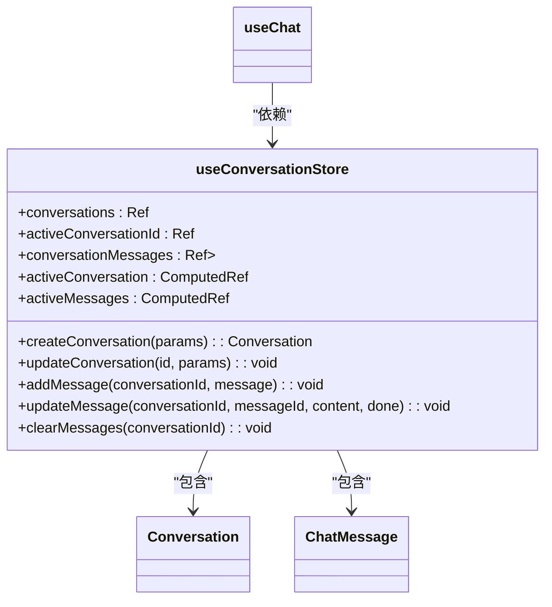
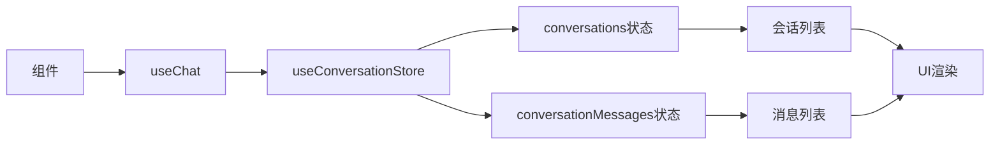
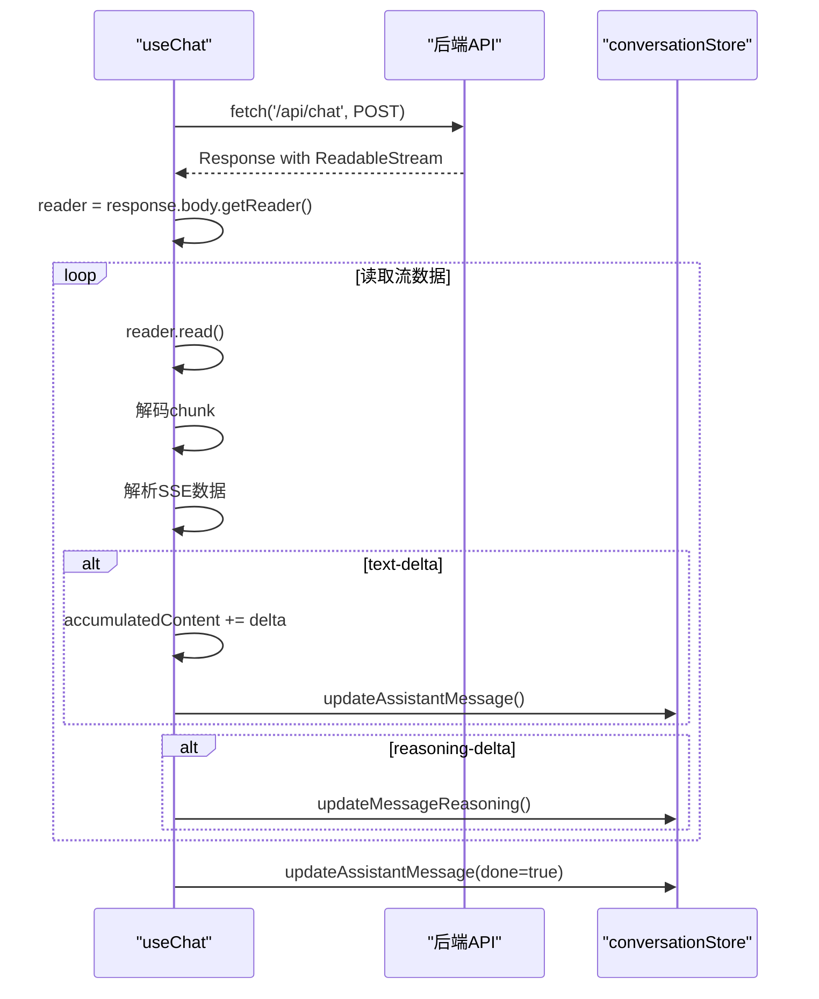
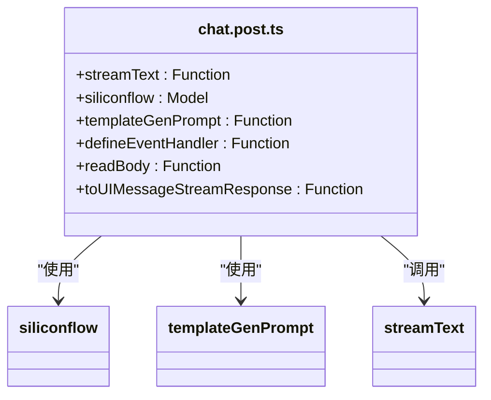
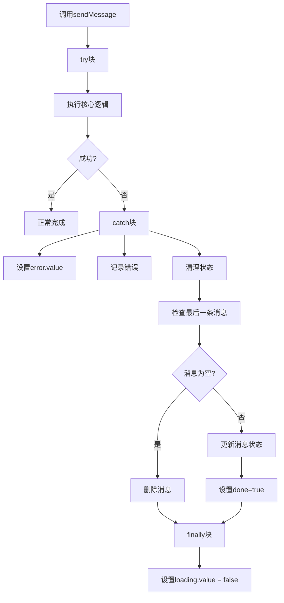
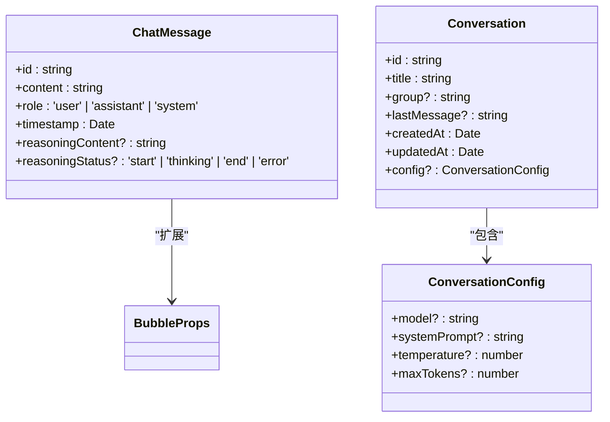

# 扩展组合式函数

<cite>
**本文档中引用的文件**   
- [store.ts](file://app/composables/store.ts)
- [useChat.ts](file://app/composables/useChat.ts)
- [conversation.ts](file://app/stores/conversation.ts)
- [chat.ts](file://app/types/chat.ts)
- [conversation.ts](file://app/types/conversation.ts)
- [chat.post.ts](file://server/api/chat.post.ts)
- [template-gen.ts](file://shared/prompt/template-gen.ts)
- [model.ts](file://server/utils/model.ts)
- [id.ts](file://shared/utils/id.ts)
</cite>

## 目录
1. [项目结构分析](#项目结构分析)
2. [核心组件分析](#核心组件分析)
3. [组合式函数模式详解](#组合式函数模式详解)
4. [useChat 组合式函数深度解析](#usechat-组合式函数深度解析)
5. [Pinia Store 交互机制](#pinia-store-交互机制)
6. [异步操作与流式响应处理](#异步操作与流式响应处理)
7. [错误处理与生命周期集成](#错误处理与生命周期集成)
8. [类型安全与 TypeScript 集成](#类型安全与-typescript-集成)
9. [测试建议](#测试建议)
10. [创建和扩展自定义组合式函数指南](#创建和扩展自定义组合式函数指南)

## 项目结构分析

项目采用基于功能的模块化结构，核心逻辑按功能划分在不同目录中。`app/composables` 目录存放组合式函数，`app/stores` 存放 Pinia 状态管理，`app/types` 定义共享类型，`server/api` 处理后端 API 请求。



**图示来源**
- [store.ts](file://app/composables/store.ts)
- [useChat.ts](file://app/composables/useChat.ts)
- [conversation.ts](file://app/stores/conversation.ts)
- [chat.post.ts](file://server/api/chat.post.ts)

**本节来源**
- [store.ts](file://app/composables/store.ts)
- [useChat.ts](file://app/composables/useChat.ts)
- [conversation.ts](file://app/stores/conversation.ts)

## 核心组件分析

项目核心由组合式函数（Composables）、Pinia Store 和类型定义构成。`useChat` 是核心业务逻辑的组合式函数，依赖 `useConversationStore` 进行状态管理，并通过类型文件确保类型安全。

**本节来源**
- [useChat.ts](file://app/composables/useChat.ts)
- [conversation.ts](file://app/stores/conversation.ts)
- [chat.ts](file://app/types/chat.ts)

## 组合式函数模式详解

### store.ts 中的组合式函数模式

`store.ts` 文件展示了如何封装复杂的状态逻辑。`useStore` 函数通过 `reactive` 和 `computed` 创建响应式状态，并暴露实用工具方法。



**图示来源**
- [store.ts](file://app/composables/store.ts#L47-L291)

**本节来源**
- [store.ts](file://app/composables/store.ts#L47-L291)

## useChat 组合式函数深度解析

`useChat` 是一个完整的组合式函数，封装了聊天功能的所有逻辑。

### 功能概览



**本节来源**
- [useChat.ts](file://app/composables/useChat.ts#L8-L363)

### 状态与计算属性

`useChat` 使用 `ref` 和 `computed` 创建响应式状态：

- **loading**: `ref<boolean>` - 表示消息发送的加载状态
- **error**: `ref<string | undefined>` - 存储错误信息
- **messages**: `computed` - 从 store 获取当前会话消息
- **activeConversation**: `computed` - 获取当前活跃会话

```typescript
const loading = ref(false);
const error = ref<string | undefined>();
const messages = computed(() => conversationStore.activeMessages);
```

### 核心方法

#### 消息发送流程



**图示来源**
- [useChat.ts](file://app/composables/useChat.ts#L200-L363)

**本节来源**
- [useChat.ts](file://app/composables/useChat.ts#L8-L363)

## Pinia Store 交互机制

`useChat` 通过 `useConversationStore` 与 Pinia store 交互，实现状态的集中管理。

### Store 结构分析



**图示来源**
- [conversation.ts](file://app/stores/conversation.ts#L11-L316)
- [conversation.ts](file://app/types/conversation.ts)
- [chat.ts](file://app/types/chat.ts)

### 数据流分析



**本节来源**
- [useChat.ts](file://app/composables/useChat.ts)
- [conversation.ts](file://app/stores/conversation.ts)

## 异步操作与流式响应处理

### 流式 API 调用实现

`generateResponse` 方法实现了完整的流式响应处理：



**图示来源**
- [useChat.ts](file://app/composables/useChat.ts#L100-L198)
- [chat.post.ts](file://server/api/chat.post.ts)

### 后端流式响应实现



**图示来源**
- [chat.post.ts](file://server/api/chat.post.ts)
- [model.ts](file://server/utils/model.ts)
- [template-gen.ts](file://shared/prompt/template-gen.ts)

**本节来源**
- [useChat.ts](file://app/composables/useChat.ts#L100-L198)
- [chat.post.ts](file://server/api/chat.post.ts)

## 错误处理与生命周期集成

### 错误处理策略

`useChat` 在 `sendMessage` 和 `regenerate` 方法中实现了全面的错误处理：



**本节来源**
- [useChat.ts](file://app/composables/useChat.ts#L200-L300)

### 生命周期集成

组合式函数利用 Vue 的响应式系统和生命周期钩子：

- **初始化**: 在函数调用时立即创建响应式状态
- **响应式更新**: 通过 `computed` 自动响应 store 变化
- **副作用管理**: 使用 `watch` 和 `watchEffect` 处理副作用

## 类型安全与 TypeScript 集成

项目通过 TypeScript 实现了完整的类型安全。

### 类型定义结构



**图示来源**
- [chat.ts](file://app/types/chat.ts)
- [conversation.ts](file://app/types/conversation.ts)

### 类型推断与自动导入

Nuxt 的自动导入机制确保类型正确推断：

- **目录约定**: 将组合式函数放在 `app/composables` 目录下
- **命名约定**: 使用 `use` 前缀的函数名
- **类型导出**: 正确导出类型定义

**本节来源**
- [chat.ts](file://app/types/chat.ts)
- [conversation.ts](file://app/types/conversation.ts)

## 测试建议

### 单元测试策略

1. **状态初始化测试**: 验证 `useChat` 初始化状态是否正确
2. **方法行为测试**: 测试 `sendMessage`、`regenerate` 等方法的行为
3. **Store 交互测试**: 验证与 `useConversationStore` 的交互是否正确
4. **错误处理测试**: 测试各种错误场景下的处理逻辑

### 测试示例

```typescript
// 示例：sendMessage 方法测试
test('sendMessage should add user and assistant messages', async () => {
  const { sendMessage, conversationStore } = useChat();
  const initialMessageCount = conversationStore.activeMessages.length;
  
  await sendMessage('Hello');
  
  expect(conversationStore.activeMessages.length).toBe(initialMessageCount + 2);
  expect(conversationStore.activeMessages[0].role).toBe('user');
  expect(conversationStore.activeMessages[1].role).toBe('assistant');
});
```

**本节来源**
- [useChat.ts](file://app/composables/useChat.ts)
- [conversation.ts](file://app/stores/conversation.ts)

## 创建和扩展自定义组合式函数指南

### 基本模式

遵循 `useChat.ts` 的模式创建新的组合式函数：

```typescript
import { ref, computed } from 'vue';
import { useSomeStore } from '~/stores/someStore';

export const useCustomComposable = () => {
  // 1. 引入依赖
  const store = useSomeStore();
  
  // 2. 定义响应式状态
  const loading = ref(false);
  const error = ref<string | undefined>();
  
  // 3. 定义计算属性
  const data = computed(() => store.someData);
  
  // 4. 定义方法
  const fetchData = async () => {
    loading.value = true;
    try {
      await store.fetchData();
    } catch (err) {
      error.value = err instanceof Error ? err.message : '获取数据失败';
    } finally {
      loading.value = false;
    }
  };
  
  // 5. 返回公共接口
  return {
    // 只读状态
    data,
    loading: readonly(loading),
    error: readonly(error),
    
    // 方法
    fetchData,
  };
};
```

### 最佳实践

1. **单一职责**: 每个组合式函数应专注于一个特定功能
2. **类型安全**: 使用 TypeScript 定义清晰的接口和类型
3. **响应式设计**: 合理使用 `ref`、`reactive`、`computed`
4. **错误处理**: 实现健壮的错误处理机制
5. **文档注释**: 添加 JSDoc 注释说明函数用途和参数

### 文件放置与自动导入

将新创建的组合式函数放置在 `app/composables` 目录下：

```
app/
└── composables/
    ├── useChat.ts
    ├── useCustom.ts
    └── useAnother.ts
```

Nuxt 会自动导入这些函数，无需手动导入即可在组件中使用。

### 类型推断确保

确保 TypeScript 类型正确推断：

1. **正确导出类型**: 如果需要暴露类型，使用 `export type`
2. **使用 ReturnType**: 在需要时使用 `ReturnType<typeof useCustomComposable>`
3. **避免 any 类型**: 尽量使用具体类型而非 `any`

**本节来源**
- [useChat.ts](file://app/composables/useChat.ts)
- [store.ts](file://app/composables/store.ts)
- [conversation.ts](file://app/stores/conversation.ts)