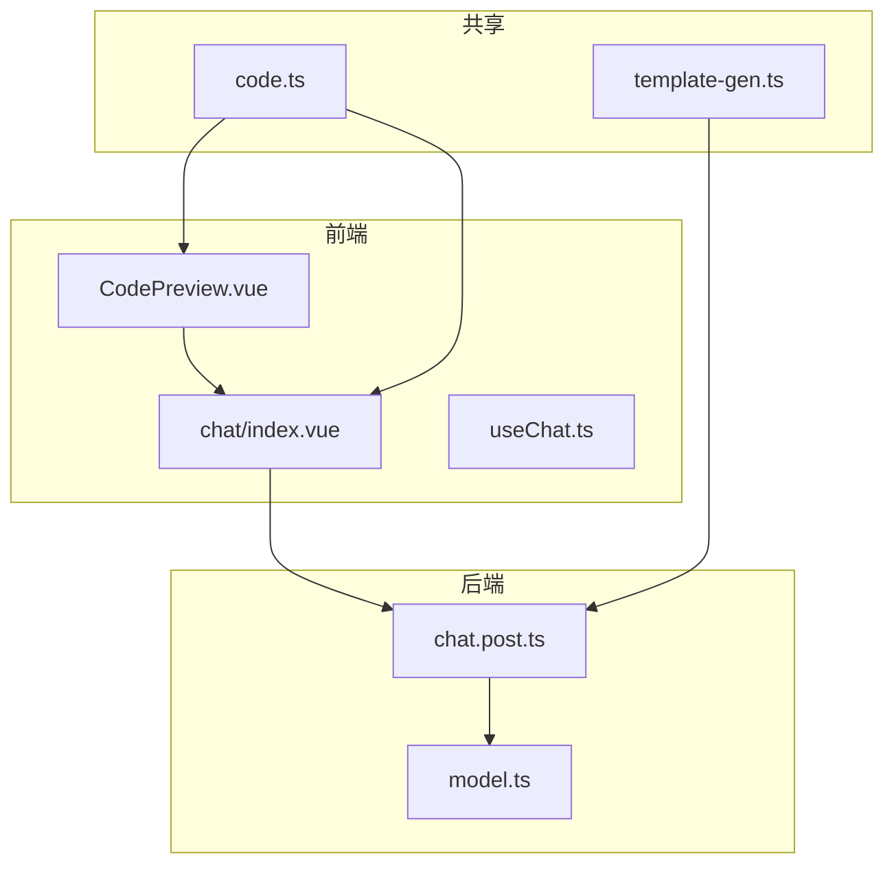
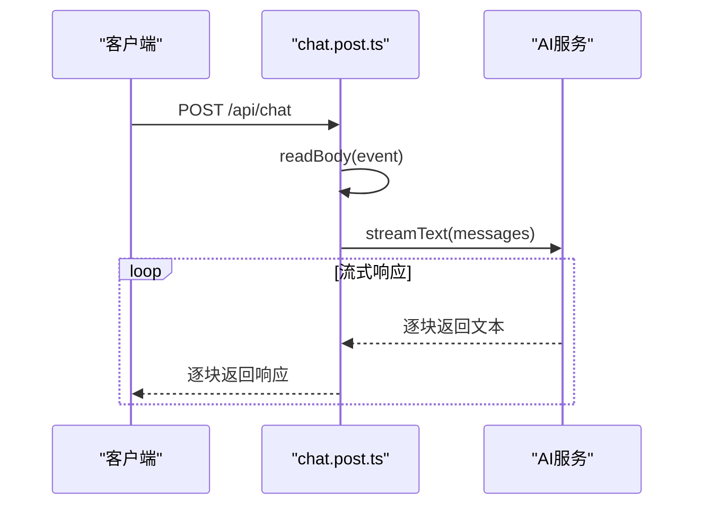

# 添加组件与API接口

<cite>
**本文档引用的文件**  
- [CodePreview.vue](file://app/components/CodePreview.vue)
- [chat.post.ts](file://server/api/chat.post.ts)
- [chat/index.vue](file://app/pages/chat/index.vue)
- [nuxt.config.ts](file://nuxt.config.ts)
- [code.ts](file://shared/utils/code.ts)
</cite>

## 目录
1. [项目结构概览](#项目结构概览)  
2. [前端组件开发规范](#前端组件开发规范)  
3. [后端API接口实现](#后端api接口实现)  
4. [组件注册与使用流程](#组件注册与使用流程)  
5. [API路由配置与安全机制](#api路由配置与安全机制)  
6. [完整开发流程示例](#完整开发流程示例)

## 项目结构概览

本项目采用Nuxt 3框架构建，遵循标准的分层架构设计，主要包含以下目录：

- `app/`：前端应用核心目录，包含组件、页面、组合式函数等
- `server/`：后端API服务目录，包含API路由和工具函数
- `shared/`：前后端共享的工具函数和提示词模板
- `public/`：静态资源文件
- 根目录：配置文件（如`nuxt.config.ts`、`package.json`）

关键文件路径：
- 前端组件：`app/components/CodePreview.vue`
- API路由：`server/api/chat.post.ts`
- 聊天页面：`app/pages/chat/index.vue`
- 共享工具：`shared/utils/code.ts`

**Diagram sources**  
- [CodePreview.vue](file://app/components/CodePreview.vue#L1-L81)
- [chat.post.ts](file://server/api/chat.post.ts#L1-L25)



## 前端组件开发规范

### Vue 3 + TypeScript组件编写规范

以`CodePreview.vue`为例，该组件遵循Vue 3的组合式API（Composition API）和TypeScript最佳实践。

```vue
<script setup lang="ts">
import { Repl } from '@vue/repl';
import Monaco from '@vue/repl/monaco-editor';

// 响应式数据定义
const componentCode = ref('');
const dialogVisible = ref(false);
const loading = ref(true);

// 组合式函数使用
const store = useStore({
  serializedState: location.hash.slice(1),
  initialized: () => {
    loading.value = false;
  },
});

// 监听器处理
watch(componentCode, () => {
  if (!componentCode.value) return;
  store.setFiles({
    'src/App.vue': componentCode.value,
    'import-map.json': JSON.stringify(generateImportMap(vueVersion, elementPlusVersion, elementIconVersion), null, 2),
  });
  store.mainFile = 'src/PlaygroundMain.vue';
}, { immediate: true });

// 暴露方法供父组件调用
defineExpose({ openDialog });
</script>
```

**关键规范要点：**
- 使用`<script setup>`语法糖简化组件定义
- 所有变量和函数使用`ref`、`reactive`等响应式API
- 类型安全：所有变量和函数参数都应有明确的类型注解
- 组合式函数（Composables）用于逻辑复用

**Section sources**  
- [CodePreview.vue](file://app/components/CodePreview.vue#L1-L81)

### 样式隔离机制

组件采用scoped CSS实现样式隔离，确保样式不会污染全局作用域。

```vue
<style scoped>
.chat-container {
  height: 100vh;
  display: flex;
  overflow: hidden;
}

:deep(.Bubble) {
  background: rgba(255, 255, 255, 0.95);
  backdrop-filter: blur(10px);
  border-radius: 12px;
}
</style>
```

**样式隔离特点：**
- `scoped`属性：编译时为元素添加唯一属性选择器，实现样式作用域隔离
- `:deep()`选择器：用于穿透scoped样式，修改子组件内部样式
- BEM命名规范：采用语义化的类名，避免命名冲突
- 响应式设计：通过媒体查询支持不同屏幕尺寸

### Props定义与事件通信机制

`CodePreview.vue`组件通过`defineExpose`暴露方法，实现父组件调用子组件方法的通信模式。

```typescript
const openDialog = (code: string) => {
  componentCode.value = genPreviewCode(code);
  dialogVisible.value = true;
};

defineExpose({ openDialog });
```

在父组件`chat/index.vue`中调用：

```typescript
const previewRef = useTemplateRef<InstanceType<typeof CodePreview>>('previewRef');

// 调用子组件方法
previewRef.value?.openDialog(sourceCode);
```

**通信机制总结：**
- **Props**：父组件向子组件传递数据（本例未使用props）
- **事件**：子组件通过`emit`触发事件通知父组件（本例未使用）
- **expose**：子组件暴露方法供父组件直接调用
- **模板引用**：父组件通过`ref`获取子组件实例

**Section sources**  
- [CodePreview.vue](file://app/components/CodePreview.vue#L58-L62)
- [chat/index.vue](file://app/pages/chat/index.vue#L13-L14)

## 后端API接口实现

### 创建新的服务器API路由

以`chat.post.ts`为例，创建新的API路由遵循Nuxt 3的约定式路由。

```typescript
export default defineLazyEventHandler(async () => {
  return defineEventHandler(async (event: any) => {
    const { messages } = await readBody(event);
    const result = streamText({
      model: siliconflow('Qwen/Qwen3-Coder-30B-A3B-Instruct'),
      system: templateGenPrompt(),
      messages,
    });
    return result.toUIMessageStreamResponse();
  });
});
```

**API创建步骤：**
1. 在`server/api/`目录下创建文件
2. 文件名格式：`{路由名}.{HTTP方法}.ts`
3. 使用`defineEventHandler`定义请求处理器
4. 通过`readBody`读取请求体
5. 返回响应数据

### 处理POST请求与输入验证

```typescript
const { messages } = await readBody(event);
```

**输入验证要点：**
- 使用`readBody`安全读取请求体
- 解构赋值提取必要字段
- 类型安全：在TypeScript中定义接口进行类型检查
- 错误处理：捕获并处理解析异常

### 调用AI服务与流式响应

```typescript
const result = streamText({
  model: siliconflow('Qwen/Qwen3-Coder-30B-A3B-Instruct'),
  system: templateGenPrompt(),
  messages,
});

return result.toUIMessageStreamResponse();
```

**流式响应机制：**
- `streamText`：AI SDK提供的流式文本生成函数
- `siliconflow`：模型提供者配置
- `templateGenPrompt`：系统提示词模板
- `toUIMessageStreamResponse`：将流式结果转换为UI友好的响应格式

**Diagram sources**  
- [chat.post.ts](file://server/api/chat.post.ts#L10-L25)



**Section sources**  
- [chat.post.ts](file://server/api/chat.post.ts#L10-L25)

## 组件注册与使用流程

### 组件注册机制

Nuxt 3采用自动导入机制，`app/components/`目录下的组件会自动注册，无需手动导入。

```typescript
// nuxt.config.ts
export default defineNuxtConfig({
  modules: ['@nuxt/eslint', '@element-plus/nuxt', '@pinia/nuxt'],
});
```

**注册特点：**
- 自动扫描`app/components/`目录
- 组件名基于文件名（如`CodePreview.vue` -> `<CodePreview/>`）
- 支持嵌套目录
- 类型安全：自动生成类型声明

### 组件使用流程

在`chat/index.vue`中使用`CodePreview`组件：

```vue
<template>
  <!-- 1. 在模板中使用组件 -->
  <CodePreview ref="previewRef" />
</template>

<script setup lang="ts">
// 2. 获取组件引用
const previewRef = useTemplateRef<InstanceType<typeof CodePreview>>('previewRef');

// 3. 调用组件方法
const handlePreview = (item: ChatMessage): void => {
  const sourceCode = extractCode(item.content);
  if (sourceCode) {
    previewRef.value?.openDialog(sourceCode);
  }
};
</script>
```

**使用流程：**
1. 在模板中声明组件并设置`ref`
2. 在`<script setup>`中使用`useTemplateRef`获取引用
3. 通过引用调用组件暴露的方法

**Section sources**  
- [chat/index.vue](file://app/pages/chat/index.vue#L72-L73)
- [chat/index.vue](file://app/pages/chat/index.vue#L13-L14)
- [chat/index.vue](file://app/pages/chat/index.vue#L388-L393)

## API路由配置与安全机制

### API路径命名规范

遵循RESTful风格和Nuxt约定：
- 路径：`/api/{资源名}`
- 方法：通过文件后缀指定（`.get.ts`、`.post.ts`等）
- 示例：`chat.post.ts` -> `POST /api/chat`

### 错误处理中间件

虽然本例未显式定义，但Nuxt提供全局错误处理机制：

```typescript
// 可在 middleware/ 目录下创建错误处理中间件
export default defineEventHandler((event) => {
  // 全局错误处理逻辑
});
```

### CORS配置

Nuxt自动处理CORS，可通过`nuxt.config.ts`配置：

```typescript
export default defineNuxtConfig({
  // CORS配置通常在服务器层处理
  runtimeConfig: {
    siliconFlowApiUrl: '',
    siliconFlowApiKey: '',
  },
});
```

### 安全性防护措施

1. **环境变量**：敏感信息通过`runtimeConfig`配置
2. **输入验证**：对`messages`进行基本验证
3. **API密钥**：通过环境变量管理AI服务密钥
4. **HTTPS**：生产环境强制使用HTTPS

```typescript
// server/api/chat.post.ts
const result = streamText({
  model: siliconflow('Qwen/Qwen3-Coder-30B-A3B-Instruct'), // 模型标识
  system: templateGenPrompt(), // 系统提示词
  messages, // 用户消息
});
```

**安全最佳实践：**
- 避免在客户端暴露API密钥
- 对用户输入进行严格验证
- 使用HTTPS加密传输
- 限制请求频率

**Section sources**  
- [nuxt.config.ts](file://nuxt.config.ts#L1-L11)
- [chat.post.ts](file://server/api/chat.post.ts#L1-L25)

## 完整开发流程示例

### 添加新前端组件

1. **创建组件文件**
   ```bash
   mkdir -p app/components/NewComponent
   touch app/components/NewComponent.vue
   ```

2. **编写组件代码**
   ```vue
   <script setup lang="ts">
   defineProps<{
     title: string
   }>()
   
   const emit = defineEmits(['click'])
   </script>
   
   <template>
     <div @click="emit('click')">{{ title }}</div>
   </template>
   
   <style scoped>
   div {
     padding: 16px;
     cursor: pointer;
   }
   </style>
   ```

3. **在页面中使用**
   ```vue
   <template>
     <NewComponent :title="componentTitle" @click="handleClick" />
   </template>
   ```

### 添加新后端API接口

1. **创建API文件**
   ```bash
   mkdir -p server/api
   touch server/api/new-feature.post.ts
   ```

2. **实现API逻辑**
   ```typescript
   export default defineLazyEventHandler(async () => {
     return defineEventHandler(async (event) => {
       const body = await readBody(event);
       // 业务逻辑处理
       return { success: true, data: body };
     });
   });
   ```

3. **前端调用API**
   ```typescript
   const { data } = await useFetch('/api/new-feature', {
     method: 'POST',
     body: { message: 'Hello' }
   });
   ```

### 测试与部署

1. **本地测试**
   ```bash
   npm run dev
   ```

2. **构建生产版本**
   ```bash
   npm run build
   ```

3. **启动生产服务器**
   ```bash
   npm run start
   ```

4. **部署到服务器**
   - 配置环境变量
   - 启动PM2进程
   - 配置Nginx反向代理

**Section sources**  
- [CodePreview.vue](file://app/components/CodePreview.vue)
- [chat.post.ts](file://server/api/chat.post.ts)
- [chat/index.vue](file://app/pages/chat/index.vue)
- [nuxt.config.ts](file://nuxt.config.ts)
- [code.ts](file://shared/utils/code.ts)