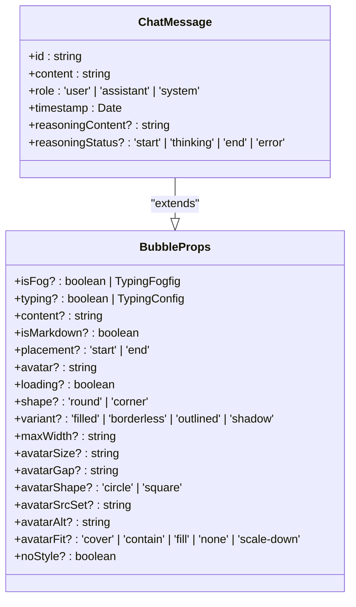
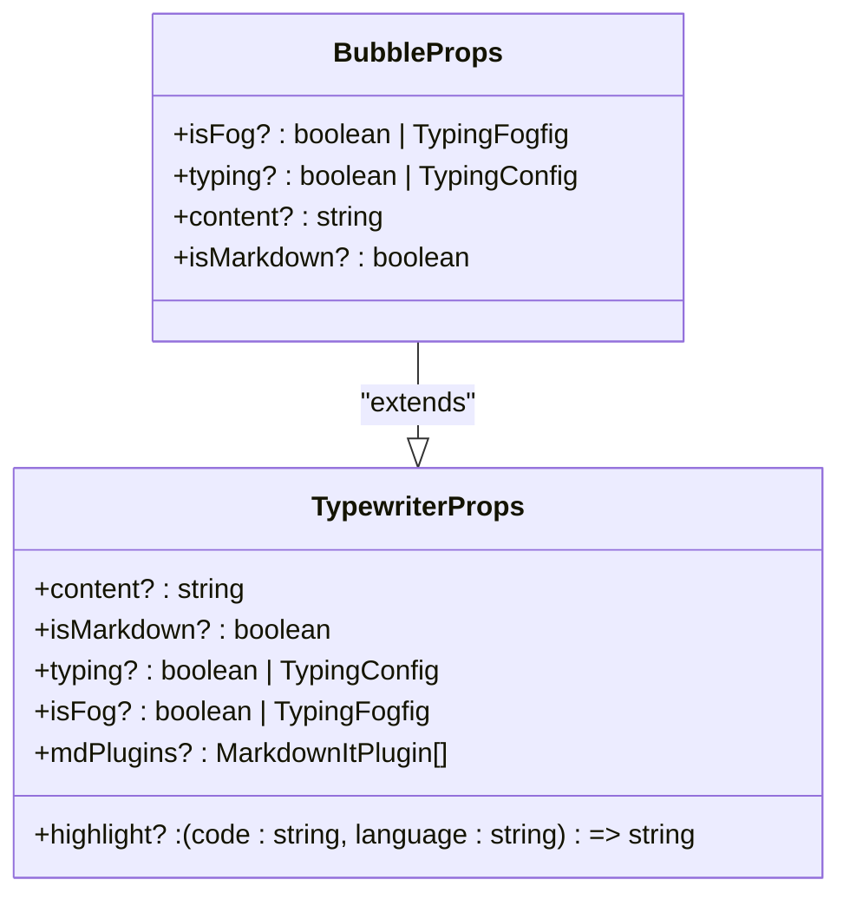
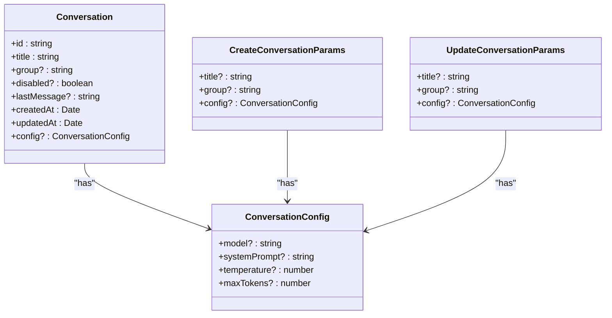
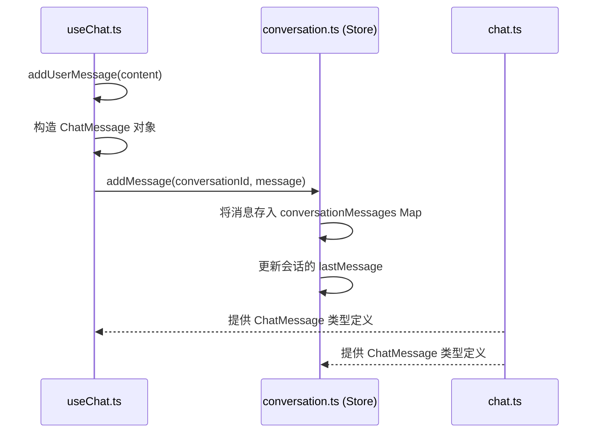
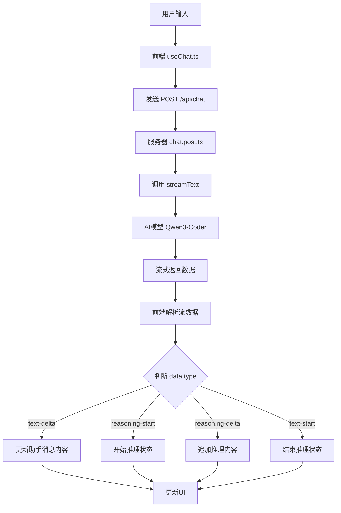

# 类型安全实践

<cite>
**本文档引用的文件**   
- [chat.ts](file://app/types/chat.ts#L1-L21)
- [conversation.ts](file://app/types/conversation.ts#L1-L79)
- [useChat.ts](file://app/composables/useChat.ts#L1-L365)
- [conversation.ts](file://app/stores/conversation.ts#L1-L318)
- [chat.post.ts](file://server/api/chat.post.ts#L1-L26)
- [id.ts](file://shared/utils/id.ts#L1-L28)
- [types.d.ts](file://node_modules/vue-element-plus-x/types/components/Bubble/types.d.ts#L1-L27)
- [types.d.ts](file://node_modules/vue-element-plus-x/types/components/Typewriter/types.d.ts#L1-L40)
- [template-gen.ts](file://shared/prompt/template-gen.ts#L1-L66)
</cite>

## 目录
1. [类型安全设计概述](#类型安全设计概述)
2. [核心数据结构类型定义](#核心数据结构类型定义)
3. [类型在模块中的引用与编译时检查](#类型在模块中的引用与编译时检查)
4. [类型扩展与泛型复用](#类型扩展与泛型复用)
5. [高级类型技巧的应用](#高级类型技巧的应用)
6. [AI响应解析与类型守卫](#ai响应解析与类型守卫)
7. [最佳实践与开发指导](#最佳实践与开发指导)

## 类型安全设计概述

本项目采用TypeScript进行类型安全设计，通过在`types/`目录下定义精确的接口和类型，确保消息、会话、用户输入等核心数据结构在编译时即可进行类型检查。这种设计减少了运行时错误，提高了代码的可维护性和可读性。

**Section sources**
- [chat.ts](file://app/types/chat.ts#L1-L21)
- [conversation.ts](file://app/types/conversation.ts#L1-L79)

## 核心数据结构类型定义

### 消息类型定义

`ChatMessage` 接口定义了聊天消息的核心结构，它继承自第三方UI库的 `BubbleProps` 类型，以复用UI组件的属性。



**Diagram sources**
- [chat.ts](file://app/types/chat.ts#L1-L21)
- [types.d.ts](file://node_modules/vue-element-plus-x/types/components/Bubble/types.d.ts#L1-L27)

`BubbleProps` 本身又依赖于 `TypewriterProps`，形成了清晰的类型继承链。



**Diagram sources**
- [types.d.ts](file://node_modules/vue-element-plus-x/types/components/Bubble/types.d.ts#L1-L27)
- [types.d.ts](file://node_modules/vue-element-plus-x/types/components/Typewriter/types.d.ts#L1-L40)

### 会话类型定义

`Conversation` 接口定义了会话的核心属性，包括唯一标识、标题、分组、创建时间等。



**Diagram sources**
- [conversation.ts](file://app/types/conversation.ts#L1-L79)

**Section sources**
- [conversation.ts](file://app/types/conversation.ts#L1-L79)

## 类型在模块中的引用与编译时检查

### 在组合式函数中使用类型

`useChat.ts` 模块通过 `import type { ChatMessage } from '~/types/chat'` 引入消息类型，并在 `addUserMessage` 和 `addAssistantMessage` 方法中创建符合 `ChatMessage` 类型的对象。

```typescript
const message: ChatMessage = {
  id: generateMessageId(),
  content,
  role: 'user',
  timestamp: new Date(),
  typing: false,
  isMarkdown: false,
  shape: 'corner',
};
```

这种显式类型注解确保了对象的结构与 `ChatMessage` 接口完全匹配，任何属性缺失或类型错误都会在编译时报错。

**Section sources**
- [useChat.ts](file://app/composables/useChat.ts#L1-L365)

### 在状态管理中使用类型

`conversation.ts` (Pinia Store) 模块引入了 `ChatMessage` 和 `Conversation` 等类型，用于定义状态的类型。

```typescript
const conversations = ref<Conversation[]>([]);
const conversationMessages = ref<Map<string, ChatMessage[]>>();
```

这确保了 `conversations` 数组中的每个元素都必须是 `Conversation` 类型，`conversationMessages` 的值必须是 `ChatMessage` 数组，从而在数据操作时提供强大的类型保障。



**Diagram sources**
- [useChat.ts](file://app/composables/useChat.ts#L1-L365)
- [conversation.ts](file://app/stores/conversation.ts#L1-L318)
- [chat.ts](file://app/types/chat.ts#L1-L21)

**Section sources**
- [useChat.ts](file://app/composables/useChat.ts#L1-L365)
- [conversation.ts](file://app/stores/conversation.ts#L1-L318)

## 类型扩展与泛型复用

### 避免 `any` 的滥用

项目中严格避免使用 `any` 类型。例如，在服务器端API中，虽然使用了 `// eslint-disable-next-line @typescript-eslint/no-explicit-any` 来绕过类型检查，但这是一种临时妥协，理想情况下应定义更精确的 `Event` 类型。

```typescript
// eslint-disable-next-line @typescript-eslint/no-explicit-any
return defineEventHandler(async (event: any) => {
  const { messages } = await readBody(event);
  // ...
});
```

### 使用泛型提高复用性

虽然当前代码中未直接展示泛型的使用，但 `ref<T>()` 和 `computed<T>()` 等Vue组合式API本身就是泛型函数的典范。开发者在新增功能时，应积极使用泛型来创建可复用的工具函数。

例如，可以创建一个泛型的 `createIdGenerator` 函数：

```typescript
const createIdGenerator = <T extends string>(prefix: T) => {
  return () => `${prefix}_${Date.now()}`;
};
const generateMessageId = createIdGenerator('msg');
```

**Section sources**
- [id.ts](file://shared/utils/id.ts#L1-L28)

## 高级类型技巧的应用

### 联合类型

`ChatMessage` 中的 `role` 属性使用了联合类型 `'user' | 'assistant' | 'system'`，这限制了角色值只能是这三个字符串之一，防止了无效值的传入。

同样，`reasoningStatus` 使用了 `'start' | 'thinking' | 'end' | 'error'` 联合类型，清晰地表达了推理过程的各个阶段。

### 类型守卫

在 `useChat.ts` 的 `generateResponse` 方法中，通过检查 `data.type` 字段的值，实现了对流式响应数据的类型守卫。

```typescript
if (data.type === 'text-delta' && data.delta) {
  // 此时可以安全地使用 data.delta
  accumulatedContent += data.delta;
}
```

虽然代码中没有使用 `is` 关键字定义显式的类型谓词函数，但这种基于 `type` 字段的条件判断，本质上就是一种运行时的类型守卫。

### Partial 与 Required

项目中虽然没有直接使用 `Partial<T>` 或 `Required<T>`，但 `UpdateConversationParams` 接口的设计思想与 `Partial<Conversation>` 非常相似。它包含了 `Conversation` 中所有可更新的字段，并且都是可选的，这允许开发者只更新需要修改的字段。

```typescript
export interface UpdateConversationParams {
  title?: string;
  group?: string;
  config?: ConversationConfig;
}
```

这与 `Partial<Conversation>` 的效果一致，是一种手动实现的“部分”类型。

**Section sources**
- [conversation.ts](file://app/types/conversation.ts#L1-L79)
- [useChat.ts](file://app/composables/useChat.ts#L1-L365)

## AI响应解析与类型守卫

### 服务器端AI响应逻辑

服务器端的 `chat.post.ts` 文件使用 `ai` 库的 `streamText` 函数来生成流式响应。

```typescript
export default defineLazyEventHandler(async () => {
  return defineEventHandler(async (event: any) => {
    const { messages } = await readBody(event);
    const result = streamText({
      model: siliconflow('Qwen/Qwen3-Coder-30B-A3B-Instruct'),
      system: templateGenPrompt(), // 使用 template-gen.ts 中定义的系统提示词
      messages,
    });
    return result.toUIMessageStreamResponse();
  });
});
```

`templateGenPrompt()` 函数返回一个详细的系统提示词，指导AI如何根据用户需求生成代码。



**Diagram sources**
- [chat.post.ts](file://server/api/chat.post.ts#L1-L26)
- [template-gen.ts](file://shared/prompt/template-gen.ts#L1-L66)
- [useChat.ts](file://app/composables/useChat.ts#L1-L365)

**Section sources**
- [chat.post.ts](file://server/api/chat.post.ts#L1-L26)
- [template-gen.ts](file://shared/prompt/template-gen.ts#L1-L66)

## 最佳实践与开发指导

### 新增功能时的类型扩展

当需要为 `ChatMessage` 添加新功能时（例如，支持消息引用），应直接在 `types/chat.ts` 中扩展接口：

```typescript
export type ChatMessage = BubbleProps & {
  // ... existing fields
  reference?: {
    messageId: string;
    content: string;
  };
};
```

然后在 `useChat.ts` 和 `conversation.ts` 中相应地更新消息创建和处理逻辑。

### 推荐的开发流程

1.  **定义类型**：首先在 `types/` 目录下定义新的接口或类型。
2.  **实现逻辑**：在 `composables/` 或 `stores/` 中实现业务逻辑，导入并使用新定义的类型。
3.  **编译检查**：利用TypeScript的编译器检查所有类型错误。
4.  **单元测试**：为新功能编写单元测试，验证类型和逻辑的正确性。

通过遵循这一流程，可以确保代码库的类型安全性和长期可维护性。

**Section sources**
- [chat.ts](file://app/types/chat.ts#L1-L21)
- [useChat.ts](file://app/composables/useChat.ts#L1-L365)