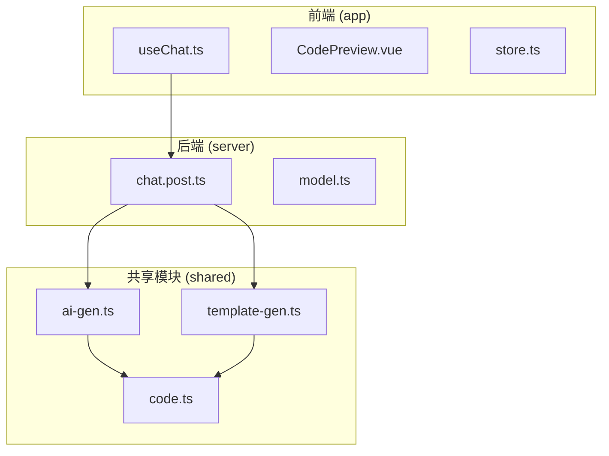
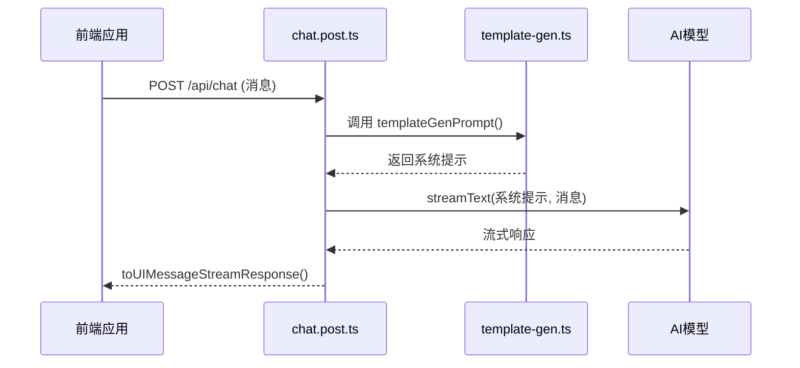

# 自定义提示词模板

<cite>
**本文档中引用的文件**  
- [ai-gen.ts](file://shared/prompt/ai-gen.ts)
- [template-gen.ts](file://shared/prompt/template-gen.ts)
- [chat.post.ts](file://server/api/chat.post.ts)
- [useChat.ts](file://app/composables/useChat.ts)
- [code.ts](file://shared/utils/code.ts)
</cite>

## 目录
1. [项目结构分析](#项目结构分析)
2. [核心组件分析](#核心组件分析)
3. [提示词系统架构](#提示词系统架构)
4. [提示词模板设计与扩展](#提示词模板设计与扩展)
5. [变量插值与上下文注入](#变量插值与上下文注入)
6. [安全性与可维护性建议](#安全性与可维护性建议)
7. [国际化支持](#国际化支持)
8. [类型系统与结构一致性](#类型系统与结构一致性)
9. [完整扩展示例](#完整扩展示例)

## 项目结构分析

本项目采用分层架构，主要分为前端（app）、后端（server）和共享模块（shared）。核心提示词系统位于 `shared/prompt` 目录下，由 `ai-gen.ts` 和 `template-gen.ts` 两个文件构成。前端通过 `useChat.ts` 组合式函数与后端 `/api/chat` 接口通信，实现AI代码生成功能。



**图示来源**  
- [ai-gen.ts](file://shared/prompt/ai-gen.ts)
- [template-gen.ts](file://shared/prompt/template-gen.ts)
- [chat.post.ts](file://server/api/chat.post.ts)

**本节来源**  
- [ai-gen.ts](file://shared/prompt/ai-gen.ts)
- [template-gen.ts](file://shared/prompt/template-gen.ts)
- [chat.post.ts](file://server/api/chat.post.ts)

## 核心组件分析

### AI生成提示构造逻辑

`ai-gen.ts` 文件定义了 `aiGenPrompt()` 函数，该函数返回一个针对Vue3组件生成的专用提示词。该提示词明确限定了技术栈（Vue3.5、JavaScript、Element Plus），并提出了11条具体的代码生成要求，包括使用Composition API、包含JSDoc注释、实现错误处理、性能优化等。

```typescript
export const aiGenPrompt = () => {
  return `
你是一个专业的前端开发专家，专门负责生成高质量的Vue3 UI组件代码。

你的任务是根据用户的具体需求，生成符合生产环境要求的Vue3组件代码，技术栈限定为：
- Vue3.5 (Composition API)
- JavaScript (ES6+)
- Element Plus UI组件库
- <script setup> 语法糖

请严格按照以下要求生成代码:
1. 代码结构清晰，遵循Vue3最佳实践...
...
`;
};
```

该提示词通过Markdown代码块（\`\`\`vue）包裹生成的代码，确保格式正确。

**本节来源**  
- [ai-gen.ts](file://shared/prompt/ai-gen.ts)

### 预设模板组织方式

`template-gen.ts` 文件定义了 `templateGenPrompt()` 函数，该函数返回一个通用代码生成器的角色提示。它采用模板驱动的方式，支持多种代码类型，包括后端（domain、service、controller等）、前端（vue_index、vue_form等）和数据库脚本（sql）。

```typescript
export const templateGenPrompt = () => {
  return `
# 角色
你是一个代码生成器...

# 可用模板列表
## 后端代码
- **domain**: Domain 实体类模板
- **mapper**: Mapper 接口模板
...

## 使用说明
使用 \`get_template_content\` 工具，传入模板名称即可获取对应的模板文件内容。
`;
};
```

该系统通过 `get_template_content` 工具动态获取模板内容，并替换占位符生成最终代码。

**本节来源**  
- [template-gen.ts](file://shared/prompt/template-gen.ts)

## 提示词系统架构

### API端点集成

`server/api/chat.post.ts` 是AI请求的入口点。它使用 `streamText` 函数处理流式响应，并将 `templateGenPrompt()` 作为系统提示（system prompt）注入到AI模型中。

```typescript
import { streamText } from 'ai';
import { siliconflow } from '../utils/model';
import { templateGenPrompt } from '#shared/prompt/template-gen';

export default defineLazyEventHandler(async () => {
  return defineEventHandler(async (event: any) => {
    const { messages } = await readBody(event);
    const result = streamText({
      model: siliconflow('Qwen/Qwen3-Coder-30B-A3B-Instruct'),
      system: templateGenPrompt(), // 注入系统提示
      messages,
    });

    return result.toUIMessageStreamResponse();
  });
});
```

该设计将提示词逻辑与API处理分离，提高了可维护性。



**图示来源**  
- [chat.post.ts](file://server/api/chat.post.ts)
- [template-gen.ts](file://shared/prompt/template-gen.ts)

**本节来源**  
- [chat.post.ts](file://server/api/chat.post.ts)
- [template-gen.ts](file://shared/prompt/template-gen.ts)

### 前端聊天功能实现

`app/composables/useChat.ts` 实现了前端的聊天逻辑，包括发送消息、接收流式响应、更新消息状态等。`generateResponse` 函数通过 `fetch` 调用 `/api/chat` 接口，并逐块处理流式响应。

```typescript
const generateResponse = async (assistantMessageId: string): Promise<string> => {
  const response = await fetch('/api/chat', {
    method: 'POST',
    headers: { 'Content-Type': 'application/json' },
    body: JSON.stringify({ messages: messages.value.map(...) }),
  });

  const reader = response.body?.getReader();
  const decoder = new TextDecoder();
  let accumulatedContent = '';

  while (true) {
    const { done, value } = await reader.read();
    if (done) break;

    const chunk = decoder.decode(value, { stream: true });
    const lines = chunk.split('\n');

    for (const line of lines) {
      if (line.startsWith('data: ') && !line.includes('[DONE]')) {
        const jsonStr = line.slice(6);
        const data = JSON.parse(jsonStr);

        if (data.type === 'text-delta' && data.delta) {
          accumulatedContent += data.delta;
          updateAssistantMessage(assistantMessageId, accumulatedContent);
        }
      }
    }
  }

  return accumulatedContent;
};
```

该实现支持实时显示AI生成内容，提升用户体验。

**本节来源**  
- [useChat.ts](file://app/composables/useChat.ts)

## 提示词模板设计与扩展

### 添加新模板的步骤

1. **在 `template-gen.ts` 中注册新模板**：在“可用模板列表”中添加新条目。
2. **实现 `get_template_content` 工具**：该工具应能根据模板名称返回对应的模板内容。
3. **创建模板文件**：在项目中创建实际的模板文件（如 `react-component.template`）。

### 模板组织原则

- **分类清晰**：按后端、前端、数据库等分类组织模板。
- **命名规范**：使用小写字母和下划线命名模板（如 `vue_v3_index`）。
- **文档化**：在 `template-gen.ts` 中为每个模板提供简要说明。

## 变量插值与上下文注入

### 变量插值机制

虽然当前代码未直接展示变量插值，但 `template-gen.ts` 的工作流程第5步“解析模板文件内容，替换其中的占位符”表明系统支持变量插值。典型的占位符可能如下：

```vue
<template>
  <div class="component-{{name}}">
    <h1>{{title}}</h1>
  </div>
</template>
```

### 上下文注入机制

系统通过 `system` 字段将提示词注入到AI请求中。`chat.post.ts` 中的 `templateGenPrompt()` 调用即为上下文注入的实例。这种设计允许动态构建复杂的系统提示。

## 安全性与可维护性建议

### 安全性

- **输入验证**：在调用AI前验证用户输入，防止提示词注入攻击。
- **沙箱执行**：对生成的代码在沙箱环境中执行，避免恶意代码。
- **内容过滤**：对AI响应进行内容安全检查。

### 可维护性

- **模块化设计**：将提示词逻辑独立到 `shared/prompt` 目录，便于维护。
- **版本控制**：对提示词进行版本管理，便于回滚和测试。
- **文档化**：为每个模板和提示词提供详细文档。

## 国际化支持

### 实现方案

1. **多语言提示词文件**：为不同语言创建独立的提示词文件（如 `ai-gen.zh.ts`、`ai-gen.en.ts`）。
2. **运行时语言选择**：根据用户设置动态导入对应语言的提示词。
3. **翻译服务集成**：集成翻译API，自动翻译提示词和响应。

### 示例结构

```
shared/
└── prompt/
    ├── ai-gen.ts
    ├── ai-gen.zh.ts
    ├── ai-gen.en.ts
    └── template-gen.ts
```

## 类型系统与结构一致性

### 类型定义

`shared/types/chat.ts` 和 `conversation.ts` 定义了聊天消息和会话的状态结构。使用TypeScript确保了数据结构的一致性。

```typescript
// 示例：ChatMessage 类型
interface ChatMessage {
  id: string;
  content: string;
  role: 'user' | 'assistant';
  timestamp: Date;
  isMarkdown: boolean;
}
```

### 结构一致性保障

- **编译时检查**：TypeScript在编译时验证类型安全。
- **运行时验证**：在关键接口处添加运行时类型检查。
- **Schema验证**：对于复杂对象，使用Zod等库进行Schema验证（如 `design-component` 中的 `z.object`）。

## 完整扩展示例

### 为React组件添加专用模板

1. **修改 `template-gen.ts`**：

```typescript
// 在“前端代码”部分添加
## 前端代码
...
- **react_component**: React 函数组件模板
```

2. **更新支持的模板名称列表**：

```typescript
支持的模板名称:
...
- \`react_component\`
```

3. **实现模板内容获取**（假设在 `get_template_content` 工具中）：

```typescript
// 伪代码
function get_template_content(templateName: string): string {
  switch(templateName) {
    case 'react_component':
      return `
import React from 'react';

interface {{ComponentName}}Props {
  // props 定义
}

const {{ComponentName}}: React.FC<{{ComponentName}}Props> = (props) => {
  return (
    <div className="{{componentName}}">
      {/* 组件内容 */}
    </div>
  );
};

export default {{ComponentName}};
      `;
    // 其他模板...
  }
}
```

### 为SQL脚本生成添加专用模板

1. **增强 `sql` 模板描述**：

```markdown
## 数据库脚本

- **sql**: 菜单 SQL 脚本模板，用于生成创建表、插入数据等SQL语句。支持占位符：{{table_name}}, {{columns}}, {{data}}。
```

2. **提供具体示例**：

```sql
-- 模板示例
CREATE TABLE IF NOT EXISTS {{table_name}} (
  {{columns}}
);

INSERT INTO {{table_name}} VALUES
{{data}};
```

3. **在工作流程中明确SQL生成步骤**：

```markdown
# 工作流程
...
2. 使用数据库相关工具解析用户需求，确定数据库结构。
3. 根据数据库结构，生成对应的SQL脚本。
...
```