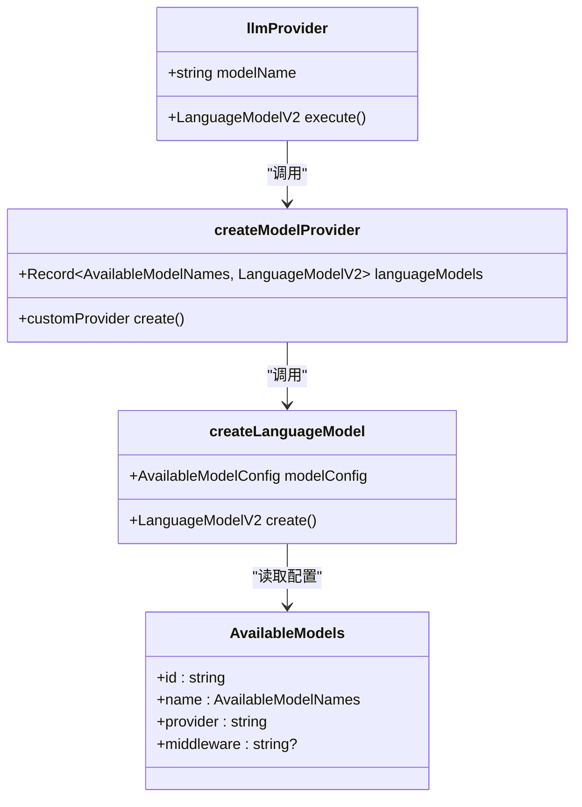
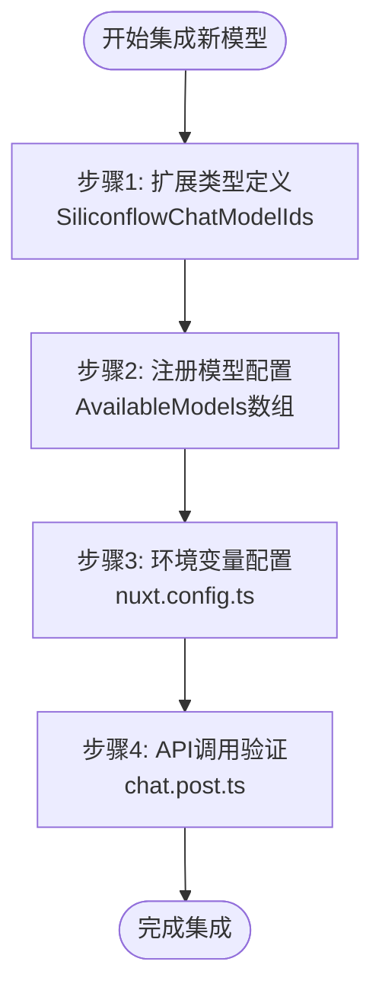
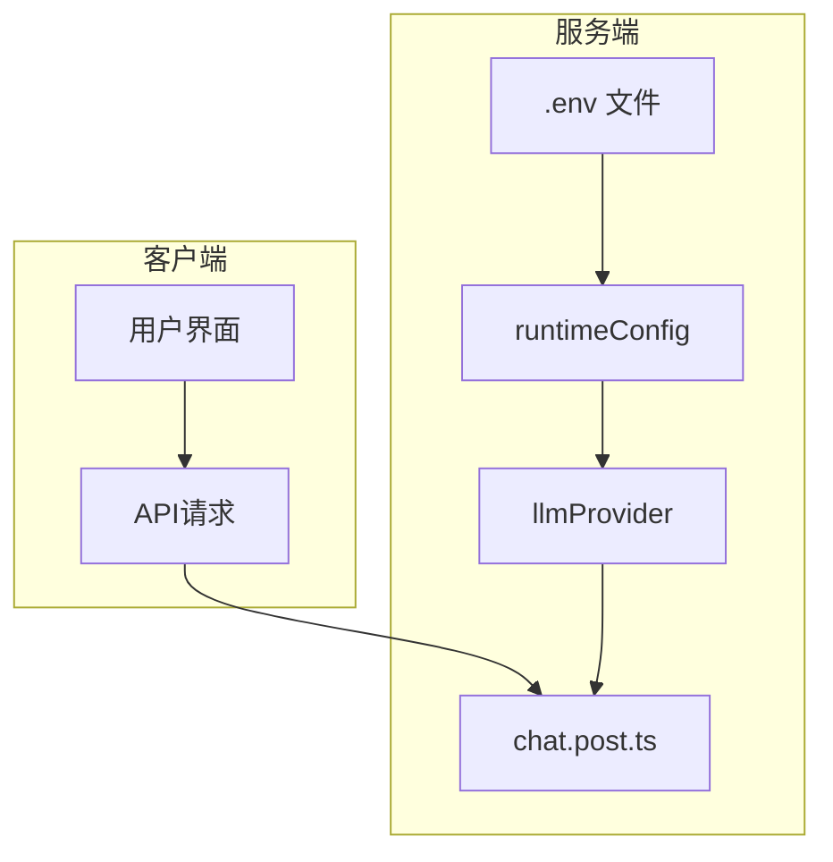
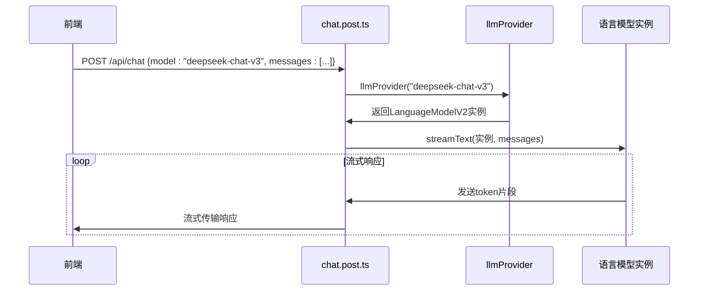

# AI 模型提供商扩展指南

<cite>
**本文档引用文件**  
- [model.ts](file://server/utils/model.ts)
- [model.ts](file://shared/types/model.ts)
- [nuxt.config.ts](file://nuxt.config.ts)
- [chat.post.ts](file://server/api/chat.post.ts)
</cite>

## 目录
1. [引言](#引言)
2. [核心架构与设计原理](#核心架构与设计原理)
3. [集成新LLM服务的分步指南](#集成新llm服务的分步指南)
4. [环境变量与安全配置](#环境变量与安全配置)
5. [流式响应与API集成验证](#流式响应与api集成验证)
6. [常见问题诊断与修复](#常见问题诊断与修复)
7. [性能优化建议](#性能优化建议)
8. [结论](#结论)

## 引言

本指南旨在为开发者提供一份权威、详尽的操作手册，指导如何在现有系统中扩展对新的大型语言模型（LLM）服务的支持，特别是针对阿里云百炼、硅基流动等平台。通过深入分析 `model.ts` 中的 `llmProvider` 工厂函数设计，本文将阐述模型别名映射、API路由、认证机制及客户端实例化的完整逻辑，并提供从零开始集成新模型（如 `deepseek-chat-v3`）的完整流程。

## 核心架构与设计原理

系统采用基于工厂模式和依赖注入的灵活架构来管理多LLM提供商。核心组件 `llmProvider` 是一个自定义模型提供器，它通过读取类型安全的配置列表 `AvailableModels` 来动态创建和管理所有可用的语言模型实例。

### 设计模式解析

该架构的核心是 `createModelProvider` 工厂函数，它遍历 `AvailableModels` 配置数组，根据每个模型的 `provider` 字段调用相应的创建逻辑。这种设计实现了：

- **解耦性**：模型配置与实例化逻辑分离
- **可扩展性**：新增提供商只需扩展配置和添加创建逻辑
- **类型安全性**：利用 TypeScript 的 `const` 断言和类型推导确保配置正确性

**Diagram sources**  
- [model.ts](file://server/utils/model.ts#L1-L121)
- [model.ts](file://shared/types/model.ts#L1-L148)

**Section sources**  
- [model.ts](file://server/utils/model.ts#L1-L121)
- [model.ts](file://shared/types/model.ts#L1-L148)

## 集成新LLM服务的分步指南

本节以集成一个假设的新模型 `deepseek-chat-v3` 为例，详细说明扩展流程。

### 步骤 1：扩展模型类型定义

首先，在 `shared/types/model.ts` 中扩展硅基流动的模型ID联合类型，以支持新模型。

**Section sources**  
- [model.ts](file://shared/types/model.ts#L5-L10)

### 步骤 2：注册新模型配置

在 `AvailableModels` 数组中添加新模型的配置对象，定义其ID、别名、描述、提供商和中间件。

**Diagram sources**  
- [model.ts](file://shared/types/model.ts#L100-L148)

**Section sources**  
- [model.ts](file://shared/types/model.ts#L100-L148)

### 步骤 3：实现模型创建逻辑

在 `server/utils/model.ts` 中，`createLanguageModel` 函数的 `switch` 语句会根据 `provider` 字段自动路由到正确的创建函数。对于 `siliconflow` 提供商，系统已通过 `createOpenAICompatible` 工厂函数统一处理。

### 步骤 4：验证类型安全

利用 TypeScript 的 `const` 断言和 `AvailableModelNames` 类型，确保新添加的模型名称在编译时即被验证，防止运行时错误。

## 环境变量与安全配置

系统的敏感信息（如API密钥、端点URL）通过 Nuxt 的 `runtimeConfig` 机制进行安全管理，确保这些信息不会暴露在客户端代码中。

### 配置机制

`nuxt.config.ts` 中定义的 `runtimeConfig` 对象声明了所有需要在服务端运行时注入的环境变量。这些变量通过 `.env` 文件或部署环境注入，并在构建时被剥离出客户端包。

**Diagram sources**  
- [nuxt.config.ts](file://nuxt.config.ts#L1-L27)
- [model.ts](file://server/utils/model.ts#L1-L121)

**Section sources**  
- [nuxt.config.ts](file://nuxt.config.ts#L1-L27)

## 流式响应与API集成验证

系统通过 `ai` 库的 `streamText` 函数实现流式响应，确保用户能够实时接收模型输出。

### 集成验证流程

1. 在 `chat.post.ts` 中，`llmProvider(model)` 根据请求的模型名称返回对应的 `LanguageModelV2` 实例。
2. `streamText` 函数接收该实例并建立流式连接。
3. 响应通过 `toUIMessageStreamResponse()` 转换为兼容前端的流格式。

**Diagram sources**  
- [chat.post.ts](file://server/api/chat.post.ts#L1-L43)
- [model.ts](file://server/utils/model.ts#L1-L121)

**Section sources**  
- [chat.post.ts](file://server/api/chat.post.ts#L1-L43)

## 常见问题诊断与修复

### 认证失败 (401 Unauthorized)

**可能原因**：
- `bailianApiKey` 或 `siliconFlowApiKey` 环境变量未正确设置
- API密钥已过期或被撤销

**解决方案**：
1. 检查 `.env` 文件或部署环境变量
2. 验证密钥格式和权限范围
3. 重启应用以重新加载配置

### 响应格式不匹配

**可能原因**：
- 新模型的响应结构与 `LanguageModelV2` 接口不兼容
- `createOpenAICompatible` 的配置未正确映射

**解决方案**：
1. 使用 `curl` 或 Postman 直接测试API端点
2. 检查 `baseURL` 和认证头是否正确传递
3. 在 `model.ts` 中添加中间件进行响应转换

### 流中断或延迟

**可能原因**：
- 网络连接不稳定
- 模型提供商的流式API存在性能瓶颈

**解决方案**：
1. 增加超时时间配置
2. 实现客户端重连机制
3. 监控服务端日志，定位瓶颈

## 性能优化建议

- **连接复用**：确保 `createOpenAICompatible` 创建的客户端实例是单例的，避免重复建立HTTP连接。
- **缓存策略**：对于频繁调用的模型，考虑在服务端实现响应缓存。
- **并发控制**：在 `streamText` 调用中合理设置 `maxSteps` 和 `stopWhen` 条件，防止无限生成。
- **错误重试**：为网络请求添加指数退避重试机制，提高系统鲁棒性。

## 结论

通过遵循本指南，开发者可以高效、安全地将新的LLM服务集成到现有系统中。`llmProvider` 工厂函数的设计体现了高内聚、低耦合的软件工程原则，使得系统具备极强的可扩展性和维护性。未来扩展只需遵循“定义类型 -> 配置注册 -> 环境配置 -> 验证测试”的四步流程，即可快速接入任何兼容OpenAI API规范的模型服务。