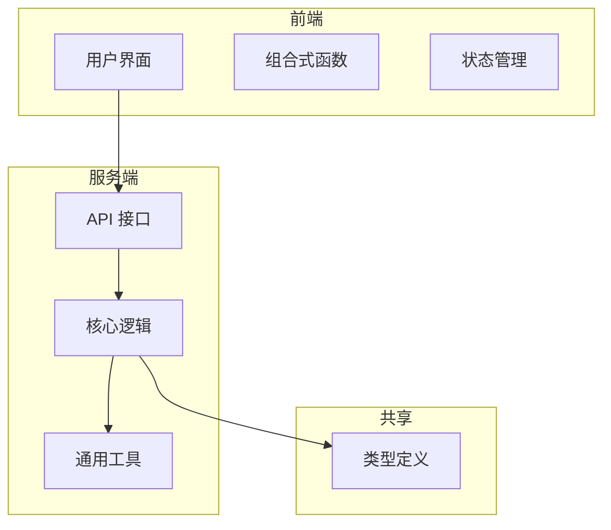
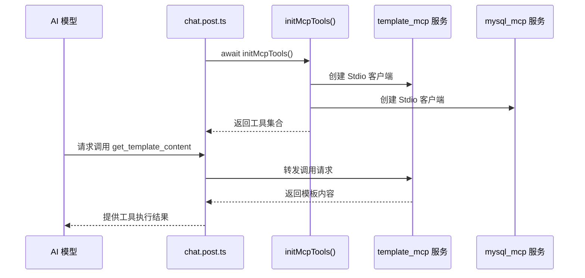
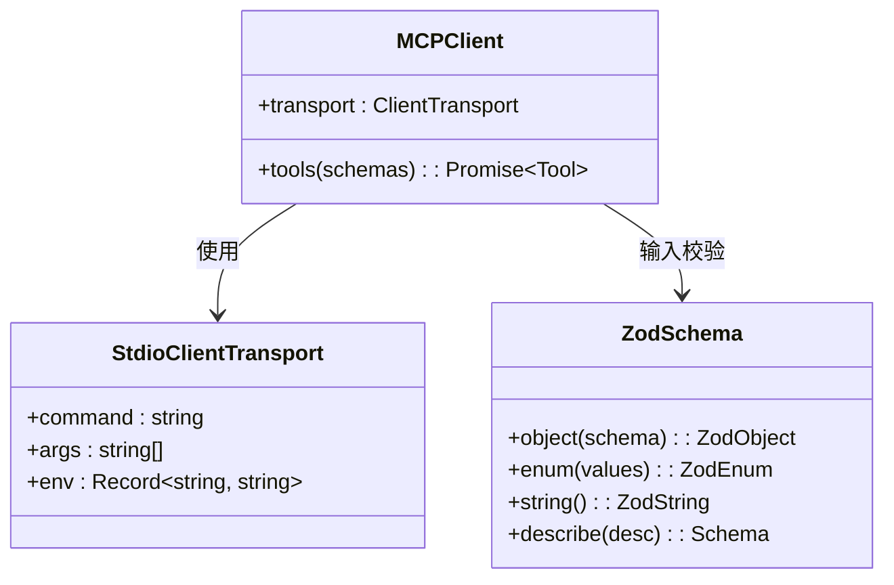
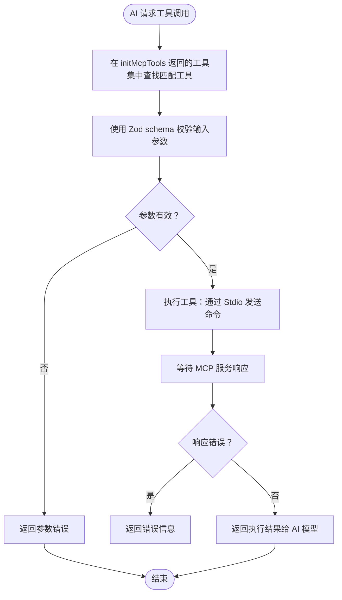

# MCP 工具集成指南

<cite>
**本文档引用文件**  
- [mcp-tools.ts](file://server/core/tools/mcp-tools.ts)
- [model.ts](file://shared/types/model.ts)
- [chat.post.ts](file://server/api/chat.post.ts)
- [local-tools.ts](file://server/core/tools/local-tools.ts)
</cite>

## 目录
1. [简介](#简介)
2. [项目结构](#项目结构)
3. [核心组件](#核心组件)
4. [架构概述](#架构概述)
5. [详细组件分析](#详细组件分析)
6. [依赖分析](#依赖分析)
7. [性能考虑](#性能考虑)
8. [故障排除指南](#故障排除指南)
9. [结论](#结论)

## 简介
本文档详细说明如何在 `mcp-tools.ts` 中注册外部工具服务器，使 AI 模型能够安全调用数据库、文件系统等后端服务。重点解析 `initMcpTools` 函数的实现机制，涵盖工具发现、能力声明与运行时调用流程。提供完整示例：添加支持读取用户配置文件的 MCP 服务，包含服务端点配置、能力描述 schema 定义及错误处理策略。强调类型安全，结合 `shared/types/model.ts` 接口规范进行参数校验，并提供调试技巧与常见问题解决方案。

## 项目结构
本项目采用分层架构设计，主要分为前端（app）、服务端（server）和共享类型定义（shared）三大模块。MCP 工具相关逻辑集中于 `server/core/tools` 目录下，通过 `mcp-tools.ts` 实现外部工具集成，`chat.post.ts` 调用并注入工具至 AI 模型上下文中。



**Diagram sources**
- [mcp-tools.ts](file://server/core/tools/mcp-tools.ts#L1-L93)
- [chat.post.ts](file://server/api/chat.post.ts#L1-L43)

**Section sources**
- [mcp-tools.ts](file://server/core/tools/mcp-tools.ts#L1-L93)
- [chat.post.ts](file://server/api/chat.post.ts#L1-L43)

## 核心组件
`initMcpTools` 是 MCP 工具初始化的核心函数，负责创建并配置多个外部工具客户端（如模板服务、MySQL 服务），并通过 schema 约束暴露特定工具能力。该函数返回一个工具集合，供 AI 模型在运行时调用。

**Section sources**
- [mcp-tools.ts](file://server/core/tools/mcp-tools.ts#L44-L92)

## 架构概述
系统通过 MCP 协议实现 AI 模型与外部服务的安全交互。AI 模型在生成响应时可请求调用已注册的工具，工具调用请求经由 `StdioClientTransport` 发送到独立运行的 MCP 服务进程，执行完成后将结果返回给模型。



**Diagram sources**
- [mcp-tools.ts](file://server/core/tools/mcp-tools.ts#L20-L30)
- [chat.post.ts](file://server/api/chat.post.ts#L10-L15)

## 详细组件分析

### MCP 工具初始化分析
`initMcpTools` 函数通过 `experimental_createMCPClient` 创建两个 MCP 客户端：`templateClientPromise` 和 `mysqlClientPromise`，分别连接模板生成服务和 MySQL 数据准备服务。每个客户端通过 `tools()` 方法按需暴露具体工具，并使用 Zod 定义输入参数 schema，确保类型安全。

#### 工具暴露与类型校验


**Diagram sources**
- [mcp-tools.ts](file://server/core/tools/mcp-tools.ts#L10-L43)
- [shared/types/model.ts](file://shared/types/model.ts#L1-L148)

#### 工具调用流程


**Diagram sources**
- [mcp-tools.ts](file://server/core/tools/mcp-tools.ts#L44-L92)
- [chat.post.ts](file://server/api/chat.post.ts#L10-L15)

**Section sources**
- [mcp-tools.ts](file://server/core/tools/mcp-tools.ts#L44-L92)
- [chat.post.ts](file://server/api/chat.post.ts#L10-L15)

### 添加新的 MCP 服务示例
假设需添加一个读取用户配置文件的 MCP 服务：

1. **服务端点配置**：在 `mcp-tools.ts` 中新增客户端：
```ts
const userConfigClientPromise = experimental_createMCPClient({
  transport: new StdioClientTransport({
    command: 'uv',
    args: ['--directory', MCP_SERVER_DIRECTORY, 'run', 'userconfig_mcp'],
  }),
});
```

2. **能力描述 schema 定义**：
```ts
const userConfigTools = await (await userConfigClientPromise).tools({
  schemas: {
    read_user_config: {
      inputSchema: z.object({
        user_id: z.string().describe('用户 ID'),
        config_type: z.enum(['profile', 'preferences']).describe('配置类型'),
      }),
    },
  },
});
```

3. **错误处理策略**：在服务端实现中捕获异常并返回结构化错误：
```ts
// 在 userconfig_mcp 服务中
try {
  const config = await loadConfig(userId, type);
  return { success: true, data: config };
} catch (error) {
  return { 
    success: false, 
    error: { 
      code: 'CONFIG_NOT_FOUND', 
      message: '用户配置未找到' 
    } 
  };
}
```

**Section sources**
- [mcp-tools.ts](file://server/core/tools/mcp-tools.ts#L10-L43)

## 依赖分析
MCP 工具依赖外部服务进程独立运行，通过标准输入输出通信。`ai` 库提供 `experimental_createMCPClient` 和 `StdioClientTransport` 支持协议交互，Zod 用于运行时类型校验，确保工具调用安全。

```mermaid
dependencyDiagram
mcp-tools.ts --> ai : experimental_createMCPClient
mcp-tools.ts --> @modelcontextprotocol/sdk/client/stdio : StdioClientTransport
mcp-tools.ts --> zod : schema validation
chat.post.ts --> mcp-tools.ts : initMcpTools
chat.post.ts --> local-tools.ts : initLocalTools
```

**Diagram sources**
- [mcp-tools.ts](file://server/core/tools/mcp-tools.ts#L1-L10)
- [chat.post.ts](file://server/api/chat.post.ts#L5-L6)

**Section sources**
- [mcp-tools.ts](file://server/core/tools/mcp-tools.ts#L1-L93)
- [chat.post.ts](file://server/api/chat.post.ts#L1-L43)

## 性能考虑
- **启动延迟**：`initMcpTools` 在首次调用时建立与 MCP 服务的连接，建议在应用启动时预热。
- **调用开销**：每次工具调用涉及进程间通信（IPC），应避免高频小请求。
- **并发控制**：AI 模型可能并行请求多个工具，需确保 MCP 服务具备足够并发处理能力。

## 故障排除指南
### 常见问题及解决方案
| 问题 | 可能原因 | 解决方案 |
|------|--------|---------|
| 工具调用超时 | 服务未启动或响应慢 | 检查 MCP 服务日志，优化查询性能 |
| 权限不足 | 环境变量缺失或配置错误 | 确保 `MYSQL_HOST` 等环境变量正确设置 |
| 协议不兼容 | 客户端与服务端版本不匹配 | 统一使用 `@modelcontextprotocol/sdk` 相同版本 |
| 参数校验失败 | 输入不符合 schema 定义 | 检查 Zod schema 与实际输入字段一致性 |

### 调试技巧
- **日志追踪**：在 `mcp-tools.ts` 中添加日志输出，记录工具调用前后状态。
- **模拟响应**：测试阶段可用 `local-tools.ts` 模拟 MCP 服务行为：
```ts
// 在 local-tools.ts 中添加模拟工具
mock_read_user_config: tool({
  description: '模拟读取用户配置',
  inputSchema: z.object({ user_id: z.string() }),
  execute: (input) => ({ profile: { name: 'Test User' } }),
})
```

**Section sources**
- [mcp-tools.ts](file://server/core/tools/mcp-tools.ts#L44-L92)
- [local-tools.ts](file://server/core/tools/local-tools.ts#L1-L20)

## 结论
MCP 工具集成机制为 AI 模型提供了安全、类型安全的外部服务调用能力。通过 `initMcpTools` 函数可灵活注册多个外部服务，并利用 Zod schema 实现严格的输入校验。合理配置服务端点、定义能力 schema 并实施有效的错误处理策略，是保障系统稳定性的关键。建议结合日志监控与模拟测试提升开发效率。