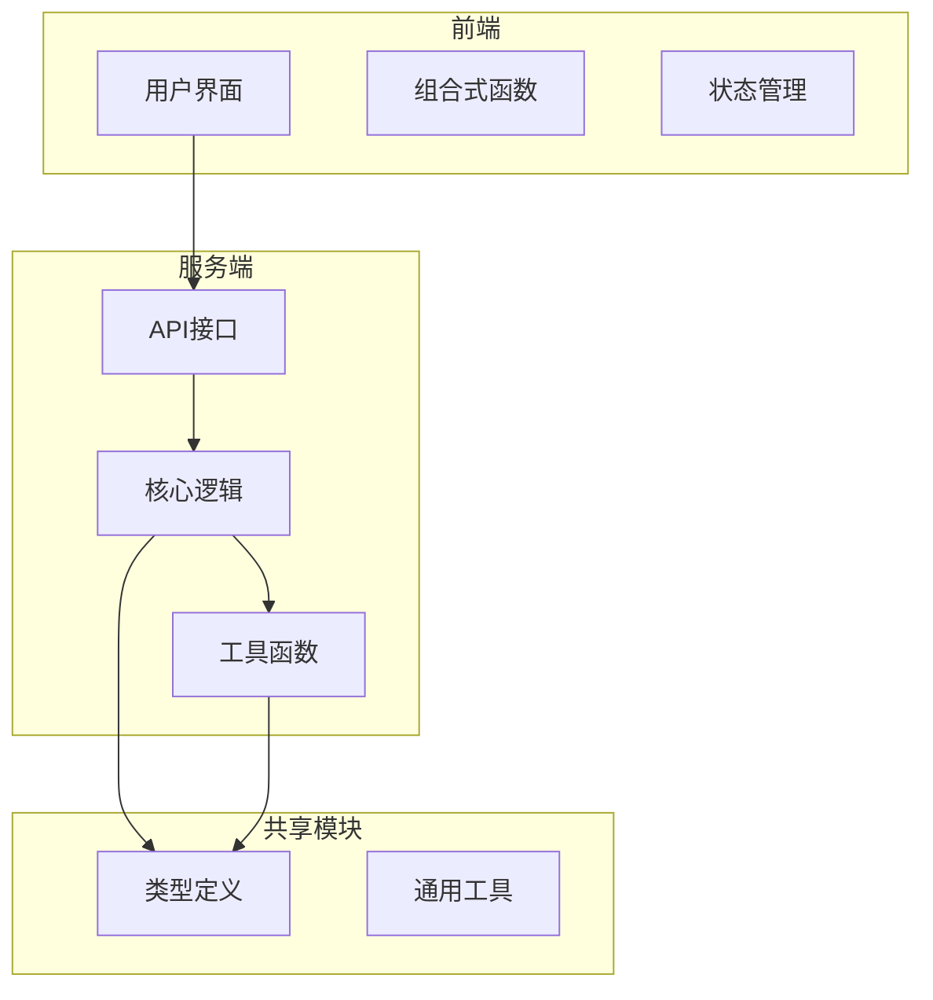
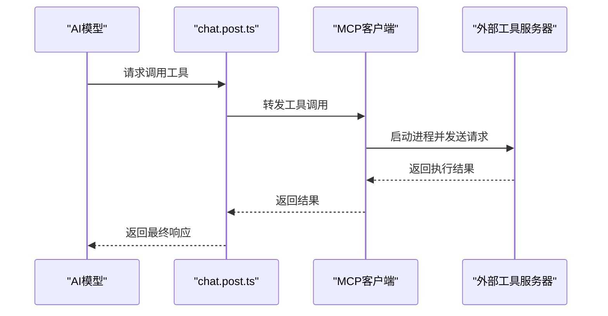
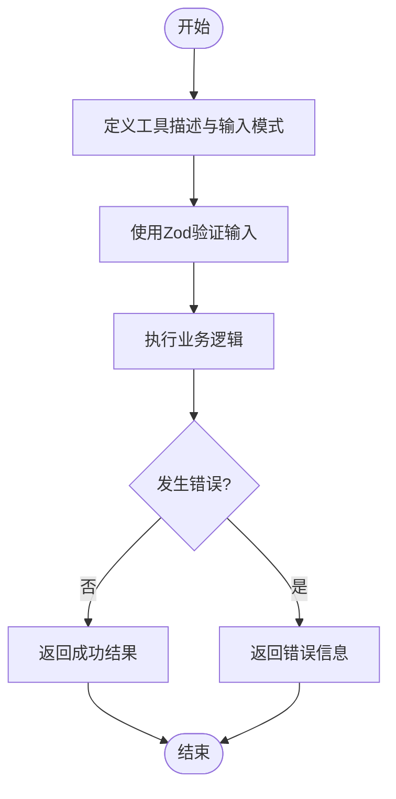
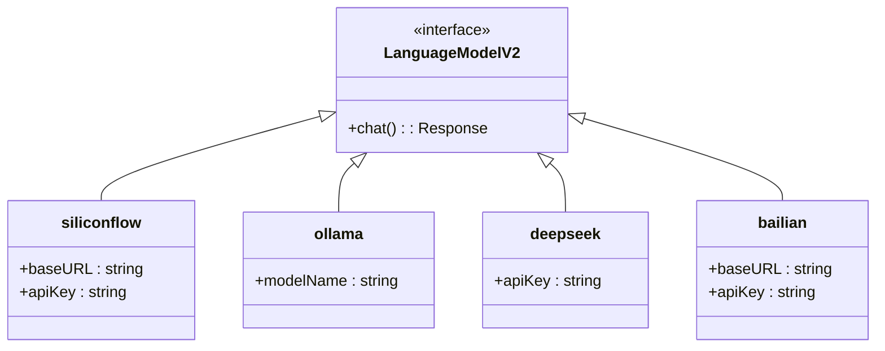
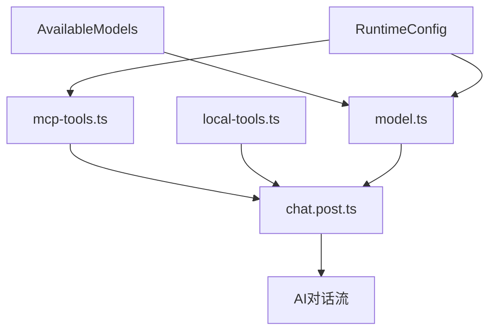

# 扩展与集成指南

<cite>
**本文档中引用的文件**  
- [mcp-tools.ts](file://server/core/tools/mcp-tools.ts)
- [local-tools.ts](file://server/core/tools/local-tools.ts)
- [model.ts](file://server/utils/model.ts)
- [chat.post.ts](file://server/api/chat.post.ts)
</cite>

## 目录
1. [简介](#简介)
2. [项目结构](#项目结构)
3. [核心组件](#核心组件)
4. [MCP工具扩展](#mcp工具扩展)
5. [本地工具注册](#本地工具注册)
6. [模型提供商扩展](#模型提供商扩展)
7. [依赖关系分析](#依赖关系分析)
8. [性能考虑](#性能考虑)
9. [故障排除指南](#故障排除指南)
10. [结论](#结论)

## 简介
本文档旨在为开发者提供一份详尽的系统扩展指南，重点介绍如何通过MCP（Model Context Protocol）机制增强AI对数据库、文件系统等外部资源的访问能力。同时涵盖本地自定义工具的注册方法、新AI模型提供商的接入方式，并提供类型安全、错误处理及常见问题排查建议，帮助开发者安全高效地扩展code_gen系统的功能边界。

## 项目结构
本项目采用分层架构设计，主要分为前端（app）、服务端（server）和共享模块（shared）。服务端核心逻辑集中在`server/core`目录下，其中`tools`子目录包含MCP与本地工具的实现，`utils/model.ts`负责模型实例化管理。API入口位于`server/api/chat.post.ts`，是AI对话流的处理中枢。

**Diagram sources**
- [chat.post.ts](file://server/api/chat.post.ts#L1-L44)
- [model.ts](file://server/utils/model.ts#L1-L122)

**Section sources**
- [chat.post.ts](file://server/api/chat.post.ts#L1-L44)
- [model.ts](file://server/utils/model.ts#L1-L122)

## 核心组件
系统的核心组件包括MCP工具客户端、本地工具注册器、模型提供器以及聊天API处理器。这些组件协同工作，使AI能够调用外部服务、执行本地逻辑并灵活切换不同AI模型。

**Section sources**
- [mcp-tools.ts](file://server/core/tools/mcp-tools.ts#L1-L93)
- [local-tools.ts](file://server/core/tools/local-tools.ts#L1-L19)
- [model.ts](file://server/utils/model.ts#L1-L122)
- [chat.post.ts](file://server/api/chat.post.ts#L1-L44)

## MCP工具扩展
MCP（Model Context Protocol）机制允许AI模型安全地与外部工具服务器通信。通过`mcp-tools.ts`文件中的`initMcpTools`函数，可以注册并初始化外部工具服务。

### 注册外部工具服务器
在`mcp-tools.ts`中，使用`experimental_createMCPClient`创建MCP客户端，通过`StdioClientTransport`启动外部工具进程。例如，模板工具和MySQL工具分别通过`uv run template_mcp`和`uv run mysql_mcp`命令启动。

### 类型安全输入约束
通过Zod库定义输入参数的类型协议，确保AI调用时传入合法参数。例如，`get_template_content`工具仅接受预定义的模板名称枚举值。

### 添加新MCP工具示例
要添加新的MCP工具（如“生成测试用例”），需：
1. 创建新的MCP服务脚本（如`testcase_mcp.py`）
2. 在`mcp-tools.ts`中添加新的客户端配置
3. 使用`schemas`字段定义输入校验规则
4. 将新工具合并到返回的工具集合中

**Diagram sources**
- [mcp-tools.ts](file://server/core/tools/mcp-tools.ts#L1-L93)
- [chat.post.ts](file://server/api/chat.post.ts#L1-L44)

**Section sources**
- [mcp-tools.ts](file://server/core/tools/mcp-tools.ts#L1-L93)

## 本地工具注册
本地工具允许在项目内部定义可被AI调用的函数，无需启动外部进程，适合轻量级或敏感操作。

### 定义本地工具
在`local-tools.ts`中，使用`tool`函数创建工具对象，指定描述、输入模式和执行逻辑。当前示例提供了获取当前日期的功能。

### 扩展本地工具
要添加新工具（如“生成测试用例”）：
1. 在`initLocalTools`函数中添加新工具定义
2. 使用Zod定义输入参数结构
3. 实现`execute`函数处理业务逻辑
4. 返回工具对象供AI调用

### 类型安全与错误处理
所有本地工具应进行输入验证，并在`execute`中捕获异常，返回有意义的错误信息，避免中断AI对话流。

**Diagram sources**
- [local-tools.ts](file://server/core/tools/local-tools.ts#L1-L19)
- [chat.post.ts](file://server/api/chat.post.ts#L1-L44)

**Section sources**
- [local-tools.ts](file://server/core/tools/local-tools.ts#L1-L19)

## 模型提供商扩展
`model.ts`文件实现了动态模型提供器，支持多种AI模型服务商。

### 支持的模型提供商
当前系统支持以下提供商：
- **siliconflow**：基于OpenAI兼容接口的硅基流动模型
- **ollama**：本地Ollama模型服务
- **deepseek**：深度求索模型API
- **bailian**：阿里百炼模型服务

### 添加新模型提供商
要接入新的模型API（如Anthropic、Google Gemini等）：
1. 安装对应的AI SDK（如`@ai-sdk/anthropic`）
2. 在`model.ts`中导入创建函数（如`createAnthropic`）
3. 在`createLanguageModel`的`switch`语句中添加新`case`分支
4. 配置运行时环境变量（API密钥、端点URL）
5. 在`AvailableModels`类型中添加新模型ID

### 中间件支持
系统支持中间件机制，如`think`中间件可用于提取AI的推理过程。可通过`wrapLanguageModel`包装模型实例以启用特定行为。

**Diagram sources**
- [model.ts](file://server/utils/model.ts#L1-L122)

**Section sources**
- [model.ts](file://server/utils/model.ts#L1-L122)

## 依赖关系分析
系统各组件之间存在明确的依赖关系，确保功能模块化与可维护性。

**Diagram sources**
- [mcp-tools.ts](file://server/core/tools/mcp-tools.ts#L1-L93)
- [local-tools.ts](file://server/core/tools/local-tools.ts#L1-L19)
- [model.ts](file://server/utils/model.ts#L1-L122)
- [chat.post.ts](file://server/api/chat.post.ts#L1-L44)

**Section sources**
- [mcp-tools.ts](file://server/core/tools/mcp-tools.ts#L1-L93)
- [local-tools.ts](file://server/core/tools/local-tools.ts#L1-L19)
- [model.ts](file://server/utils/model.ts#L1-L122)
- [chat.post.ts](file://server/api/chat.post.ts#L1-L44)

## 性能考虑
- **MCP工具延迟**：外部工具通过进程通信，可能存在启动延迟，建议对高频工具做连接池优化
- **模型切换开销**：不同模型提供商的响应速度差异较大，应根据场景选择合适模型
- **输入验证成本**：Zod校验虽保障类型安全，但复杂模式可能影响性能，建议缓存解析结果
- **流式响应**：使用`streamText`实现流式输出，提升用户体验，避免长时间等待

## 故障排除指南
### 工具调用失败
- **检查MCP服务是否运行**：确认`uv run xxx_mcp`命令能正常启动
- **验证环境变量**：数据库连接等敏感信息需通过`env`正确传递
- **查看输入参数**：确保AI传入参数符合Zod定义的模式

### 模型连接超时
- **检查API密钥有效性**
- **确认网络可达性**：特别是对外部API（如siliconflow、bailian）
- **调整超时设置**：在SDK配置中增加超时时间

### 类型错误
- **确保`AvailableModelNames`同步更新**
- **检查运行时配置**：`useRuntimeConfig()`返回值是否包含所需字段
- **验证工具返回格式**：必须符合AI SDK期望的响应结构

**Section sources**
- [mcp-tools.ts](file://server/core/tools/mcp-tools.ts#L1-L93)
- [local-tools.ts](file://server/core/tools/local-tools.ts#L1-L19)
- [model.ts](file://server/utils/model.ts#L1-L122)

## 结论
通过本指南，开发者可全面掌握code_gen系统的扩展机制。利用MCP协议接入外部资源，通过本地工具实现定制逻辑，灵活扩展模型提供商，构建更强大的AI应用。务必遵循类型安全原则，妥善处理错误，确保系统稳定可靠。