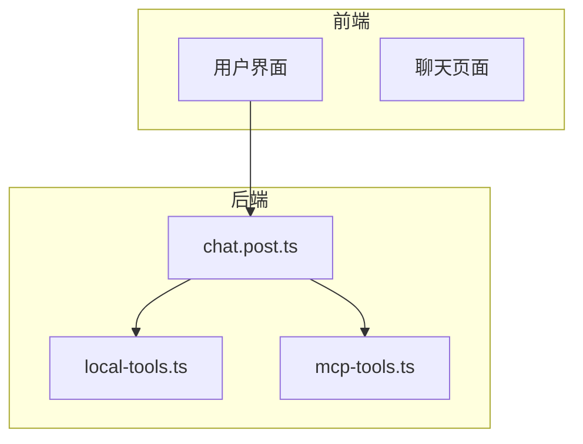
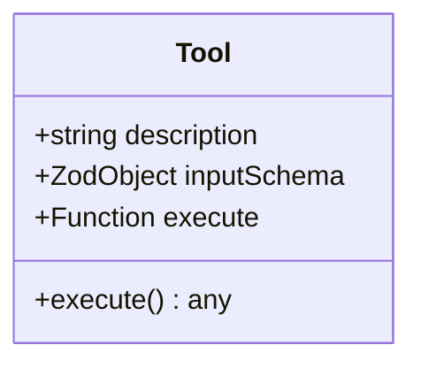
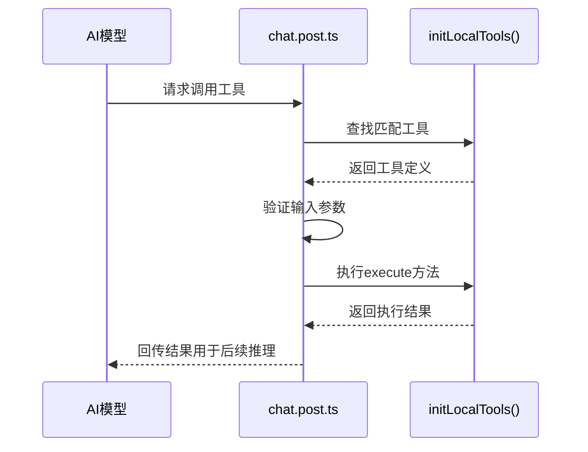

# 本地工具扩展指南

<cite>
**本文档引用文件**  
- [local-tools.ts](file://server/core/tools/local-tools.ts)
- [chat.post.ts](file://server/api/chat.post.ts)
- [mcp-tools.ts](file://server/core/tools/mcp-tools.ts)
</cite>

## 目录
1. [简介](#简介)
2. [项目结构概览](#项目结构概览)
3. [核心组件分析](#核心组件分析)
4. [本地工具注册机制](#本地工具注册机制)
5. [工具调用流程解析](#工具调用流程解析)
6. [安全性控制策略](#安全性控制策略)
7. [调试与日志配置](#调试与日志配置)
8. [常见问题排查](#常见问题排查)
9. [结论与最佳实践](#结论与最佳实践)

## 简介
本文档旨在为开发者提供详尽的指导，说明如何在 `local-tools.ts` 中注册项目内部可调用的自定义函数，以支持AI驱动的业务逻辑执行。文档涵盖工具注册格式、参数约束、异步处理机制、调用链路分析、安全防护措施及调试方法，帮助开发者高效扩展本地工具能力。

## 项目结构概览
项目采用分层架构设计，主要模块包括前端界面（`app/`）、服务端逻辑（`server/`）和共享类型定义（`shared/`）。核心工具逻辑位于 `server/core/tools/` 目录下，其中 `local-tools.ts` 负责注册本地可执行函数，`mcp-tools.ts` 管理外部MCP服务工具，而 `chat.post.ts` 作为API入口整合所有工具并暴露给AI模型使用。



**图示来源**  
- [chat.post.ts](file://server/api/chat.post.ts#L1-L44)
- [local-tools.ts](file://server/core/tools/local-tools.ts#L1-L20)
- [mcp-tools.ts](file://server/core/tools/mcp-tools.ts#L1-L94)

## 核心组件分析

### 本地工具初始化函数
`initLocalTools` 函数用于创建并返回一组可在AI对话中调用的本地工具。每个工具需定义描述、输入模式和执行逻辑。

**组件来源**  
- [local-tools.ts](file://server/core/tools/local-tools.ts#L6-L19)

### MCP工具管理器
`initMcpTools` 异步初始化外部MCP客户端，并通过Zod模式限制暴露的工具接口，确保输入合法性。

**组件来源**  
- [mcp-tools.ts](file://server/core/tools/mcp-tools.ts#L25-L93)

### 聊天API入口
`chat.post.ts` 是核心API处理文件，负责读取请求、初始化工具集、调用LLM模型并流式返回结果。

**组件来源**  
- [chat.post.ts](file://server/api/chat.post.ts#L1-L44)

## 本地工具注册机制

### 工具注册格式
所有本地工具通过 `tool()` 函数包装，需包含以下字段：

- `description`: 工具功能描述，供AI理解用途
- `inputSchema`: 使用Zod定义的输入参数校验规则
- `execute`: 实际执行函数，支持同步或异步操作



**图示来源**  
- [local-tools.ts](file://server/core/tools/local-tools.ts#L9-L18)

### 示例：添加“生成单元测试”工具
```ts
generateUnitTest: tool({
  description: '为指定函数生成单元测试代码',
  inputSchema: z.object({
    functionName: z.string().describe('目标函数名'),
    sourceCode: z.string().describe('源码内容')
  }),
  execute: async ({ functionName, sourceCode }) => {
    // 调用代码生成逻辑
    return await generateTestCode(functionName, sourceCode);
  }
})
```

### 示例：添加“检查代码风格”工具
```ts
checkCodeStyle: tool({
  description: '检查提供的代码是否符合编码规范',
  inputSchema: z.object({
    code: z.string().describe('待检测代码'),
    language: z.enum(['ts', 'js', 'vue']).optional().default('ts')
  }),
  execute: ({ code, language }) => {
    return lintCode(code, { language });
  }
})
```

**组件来源**  
- [local-tools.ts](file://server/core/tools/local-tools.ts#L6-L19)

## 工具调用流程解析

### 工具选择与参数解析
当AI模型决定调用工具时，会根据工具描述匹配最合适的函数，并依据 `inputSchema` 自动解析参数。



**图示来源**  
- [chat.post.ts](file://server/api/chat.post.ts#L20-L35)
- [local-tools.ts](file://server/core/tools/local-tools.ts#L6-L19)

### 结果回传机制
工具执行结果以结构化数据形式返回，由 `streamText` 接口封装为UI消息流，最终推送至前端展示。

**组件来源**  
- [chat.post.ts](file://server/api/chat.post.ts#L37-L43)

## 安全性控制策略
为防止任意代码执行风险，系统实施以下安全措施：

1. **输入验证**：所有工具参数必须通过Zod模式校验
2. **最小权限暴露**：仅暴露必要工具，如 `mcp-tools.ts` 中仅启用 `get_template_content` 和 `prepare_template_context`
3. **环境隔离**：MCP工具运行于独立进程，避免直接访问主应用内存
4. **敏感信息屏蔽**：数据库连接信息通过环境变量注入，不硬编码在源码中

**组件来源**  
- [mcp-tools.ts](file://server/core/tools/mcp-tools.ts#L45-L93)
- [local-tools.ts](file://server/core/tools/local-tools.ts#L9-L18)

## 调试与日志配置
在开发环境中可通过以下方式启用工具调用日志：

1. 在 `chat.post.ts` 中添加日志输出：
```ts
execute: async (input) => {
  console.log('[Tool Called] dateTime with input:', input);
  return new Date().toISOString();
}
```

2. 启用AI SDK的调试模式（需配置环境变量）：
```bash
DEBUG=ai*
```

3. 使用Nuxt DevTools监控API请求与响应

**组件来源**  
- [chat.post.ts](file://server/api/chat.post.ts#L20-L35)

## 常见问题排查

### 问题1：工具未被识别
**现象**：AI未触发工具调用  
**排查步骤**：
- 检查工具是否已正确合并到 `tools` 对象中
- 确认 `description` 描述清晰且与使用场景匹配
- 验证 `chat.post.ts` 是否正确导入并初始化 `initLocalTools`

### 问题2：参数解析失败
**现象**：调用时报错“Invalid input”  
**排查步骤**：
- 检查 `inputSchema` 是否正确定义字段类型
- 确保AI提供的参数名称与schema一致
- 使用Zod `.optional()` 标记可选参数

### 问题3：返回格式错误
**现象**：工具执行成功但AI无法理解结果  
**排查步骤**：
- 确保 `execute` 返回值为JSON可序列化对象
- 避免返回函数、Promise或循环引用对象
- 如需异步操作，请使用 `async/await` 并返回最终值

**组件来源**  
- [local-tools.ts](file://server/core/tools/local-tools.ts#L9-L18)
- [chat.post.ts](file://server/api/chat.post.ts#L37-L43)

## 结论与最佳实践
通过 `local-tools.ts` 注册本地工具是实现AI自动化业务逻辑的关键路径。建议遵循以下最佳实践：

- 工具职责单一，命名清晰
- 输入参数严格校验，避免运行时错误
- 异步操作应返回Promise而非回调
- 敏感操作应增加权限校验中间件
- 开发阶段启用详细日志便于调试

合理扩展本地工具集，可显著提升AI助手的实用性与自动化水平。