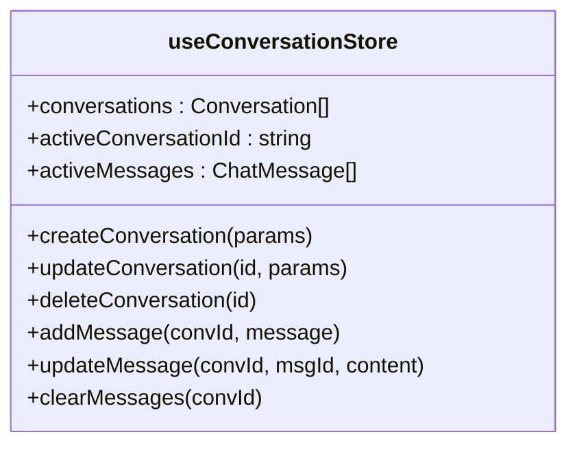
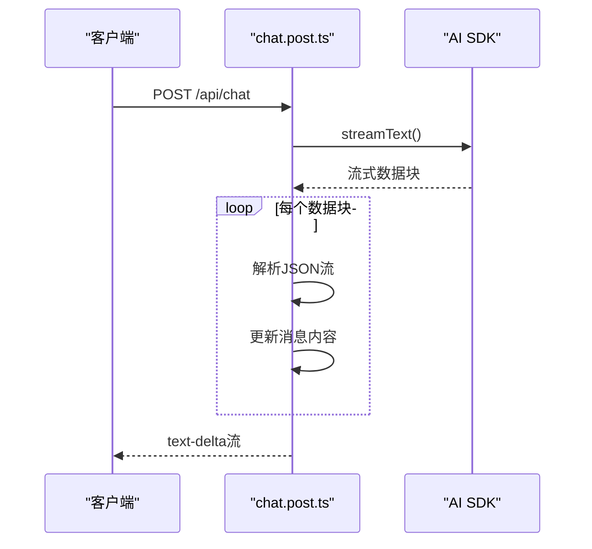
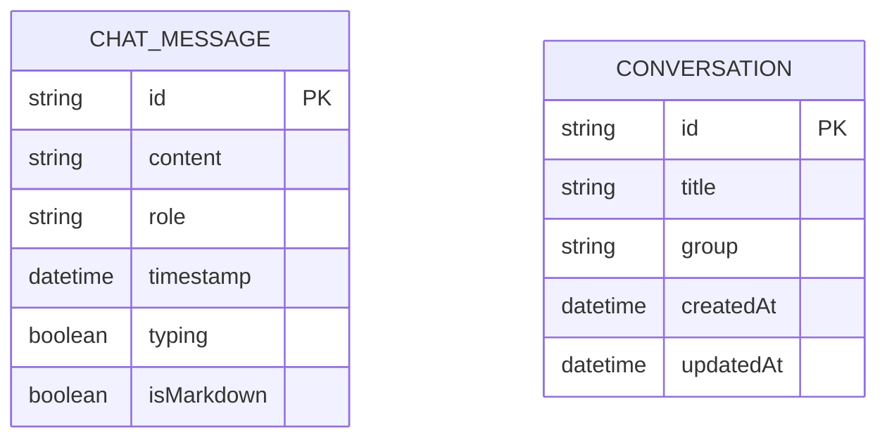
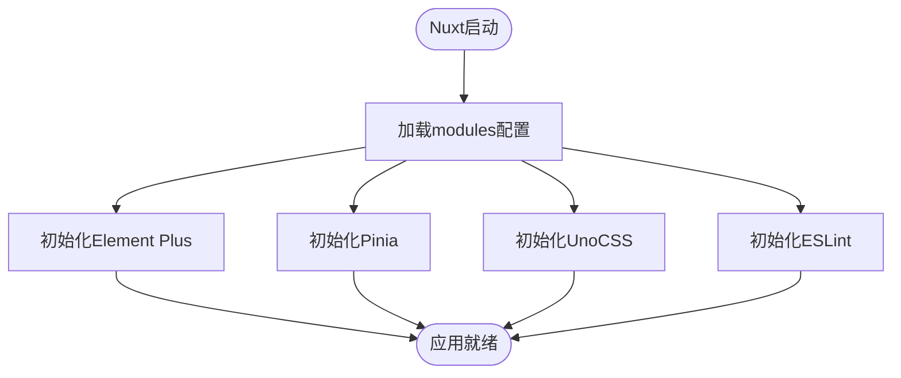

# 技术栈与依赖说明

<cite>
**本文档中引用的文件**  
- [package.json](file://package.json)
- [nuxt.config.ts](file://nuxt.config.ts)
- [tsconfig.json](file://tsconfig.json)
- [uno.config.ts](file://uno.config.ts)
- [app/composables/useChat.ts](file://app/composables/useChat.ts)
- [app/composables/store.ts](file://app/composables/store.ts)
- [app/stores/conversation.ts](file://app/stores/conversation.ts)
- [server/api/chat.post.ts](file://server/api/chat.post.ts)
- [server/utils/model.ts](file://server/utils/model.ts)
- [shared/types/model.ts](file://shared/types/model.ts)
</cite>

## 目录
1. [项目概述](#项目概述)
2. [核心框架与架构](#核心框架与架构)
3. [前端技术栈详解](#前端技术栈详解)
4. [后端技术栈详解](#后端技术栈详解)
5. [主要依赖项功能说明](#主要依赖项功能说明)
6. [TypeScript与类型安全](#typescript与类型安全)
7. [包管理工具：pnpm](#包管理工具pnpm)
8. [模块加载与配置机制](#模块加载与配置机制)
9. [新开发者入门建议](#新开发者入门建议)

## 项目概述

本项目是一个基于Nuxt 3构建的全栈AI代码生成应用，集成了多种AI模型提供商和前端UI组件库，支持流式AI响应处理、会话管理、代码预览等功能。项目采用模块化设计，前后端统一使用TypeScript，确保类型安全，并通过UnoCSS实现高效的原子化样式管理。

**Section sources**  
- [package.json](file://package.json#L1-L51)

## 核心框架与架构

项目采用Nuxt 3作为全栈框架，实现了服务端渲染（SSR）关闭的单页应用（SPA）架构。Nuxt 3提供了模块化扩展机制，允许无缝集成Pinia、UnoCSS、Element Plus等第三方库，同时支持API路由定义，使得前后端逻辑可以在同一项目中协同工作。

```mermaid
graph TB
subgraph "前端"
A[Vue 3] --> B[Nuxt 3]
B --> C[Pinia]
B --> D[Element Plus]
B --> E[UnoCSS]
end
subgraph "后端"
F[H3 Server] --> G[AI SDK]
G --> H[OpenAI Compatible]
G --> I[DeepSeek]
G --> J[Ollama]
end
B < --> F
K[TypeScript] --> A
K --> F
```

**Diagram sources**  
- [nuxt.config.ts](file://nuxt.config.ts#L1-L27)
- [package.json](file://package.json#L1-L51)

## 前端技术栈详解

### Vue 3 与 Composition API

项目使用Vue 3作为核心前端框架，采用Composition API组织逻辑。通过`<script setup>`语法和组合式函数（composables），实现了逻辑复用和代码组织的高内聚性。例如，在`useChat.ts`中封装了完整的聊天逻辑，包括消息发送、流式响应处理、错误恢复等。

**Section sources**  
- [app/composables/useChat.ts](file://app/composables/useChat.ts#L1-L391)

### Pinia 状态管理

Pinia作为官方推荐的状态管理库，用于管理全局应用状态。项目中定义了`useConversationStore`来管理会话列表、活跃会话、消息记录等状态，实现了会话的增删改查、消息更新、推理内容展示等复杂状态逻辑。



**Diagram sources**  
- [app/stores/conversation.ts](file://app/stores/conversation.ts#L1-L314)

### Element Plus UI 组件库

Element Plus提供了一套完整的UI组件，包括按钮、输入框、对话框、标签页等，用于构建现代化的Web界面。项目通过`@element-plus/nuxt`模块集成，确保组件按需加载，优化性能。

**Section sources**  
- [package.json](file://package.json#L1-L51)

### UnoCSS 原子化样式

UnoCSS作为原子化CSS引擎，通过`@unocss/nuxt`模块集成，实现了极致的样式性能优化。它在构建时生成所需的CSS类，避免了传统CSS框架的冗余样式，同时支持自定义规则和主题配置。

**Section sources**  
- [uno.config.ts](file://uno.config.ts#L1-L5)
- [package.json](file://package.json#L1-L51)

## 后端技术栈详解

### H3 服务器引擎

Nuxt 4内置的H3服务器引擎提供了轻量级、高性能的后端服务支持。项目在`server/api/chat.post.ts`中定义了POST接口，处理客户端的聊天请求，并通过流式响应返回AI生成内容。



**Diagram sources**  
- [server/api/chat.post.ts](file://server/api/chat.post.ts#L1-L43)

### AI SDK 流式响应处理

项目使用`ai` SDK（`@ai-sdk/vue`）实现流式AI响应处理。通过`streamText`方法，后端可以逐步返回AI生成的文本片段，前端通过SSE（Server-Sent Events）接收并实时渲染，实现“打字机”效果，提升用户体验。

**Section sources**  
- [server/api/chat.post.ts](file://server/api/chat.post.ts#L1-L43)
- [app/composables/useChat.ts](file://app/composables/useChat.ts#L1-L391)

## 主要依赖项功能说明

| 依赖包 | 用途 |
|-------|------|
| `@ai-sdk/openai` | OpenAI兼容模型的SDK支持 |
| `@ai-sdk/deepseek` | DeepSeek模型专用SDK |
| `@ai-sdk/openai-compatible` | 通用OpenAI兼容接口封装 |
| `@ai-sdk/vue` | Vue集成的AI流式响应支持 |
| `zod` | 运行时类型校验与数据验证 |
| `semver` | 语义化版本号解析与比较 |
| `dayjs` | 轻量级日期处理库 |
| `prettier` | 代码格式化工具 |
| `typescript` | 类型系统与编译支持 |
| `unocss` | 原子化CSS引擎 |
| `vue` | 前端核心框架 |
| `pinia` | 状态管理库 |
| `nuxt` | 全栈应用框架 |

**Section sources**  
- [package.json](file://package.json#L1-L51)

## TypeScript与类型安全

项目全面采用TypeScript，通过定义精确的类型接口保障类型安全。例如：
- `shared/types/chat.ts` 定义聊天消息结构
- `shared/types/model.ts` 定义模型配置类型
- `types/conversation.ts` 定义会话数据结构

类型系统贯穿前后端，通过`#shared/types`共享类型定义，避免重复声明，确保数据一致性。



**Diagram sources**  
- [shared/types/model.ts](file://shared/types/model.ts#L1-L148)
- [app/types/chat.ts](file://app/types/chat.ts)
- [app/types/conversation.ts](file://app/types/conversation.ts)

## 包管理工具：pnpm

项目使用pnpm作为包管理工具，通过`.npmrc`中的`preinstall`脚本强制使用pnpm，确保团队一致性。pnpm的硬链接机制节省磁盘空间，快速安装，并通过`packageManager`字段锁定版本，提高可重现性。

**Section sources**  
- [package.json](file://package.json#L1-L51)
- [.npmrc](file://.npmrc)

## 模块加载与配置机制

`nuxt.config.ts`中通过`modules`数组加载核心模块：
- `@nuxt/eslint`：集成ESLint代码检查
- `@element-plus/nuxt`：自动注册Element Plus组件
- `@pinia/nuxt`：启用Pinia状态管理
- `@unocss/nuxt`：启动UnoCSS样式引擎

这些模块在构建时自动配置，减少手动设置，提升开发效率。



**Diagram sources**  
- [nuxt.config.ts](file://nuxt.config.ts#L1-L27)

## 新开发者入门建议

1. **理解Nuxt模块机制**：熟悉`nuxt.config.ts`中的`modules`配置，了解各插件如何影响构建流程。
2. **掌握组合式函数**：重点阅读`useChat.ts`和`store.ts`，学习如何组织可复用的业务逻辑。
3. **调试AI流式响应**：通过浏览器Network面板观察`/api/chat`的SSE流，理解数据分块传输机制。
4. **类型驱动开发**：利用TypeScript接口定义，确保前后端数据结构一致。
5. **UnoCSS使用规范**：遵循原子化类名命名规则，避免自定义CSS污染。

**Section sources**  
- [nuxt.config.ts](file://nuxt.config.ts#L1-L27)
- [app/composables/useChat.ts](file://app/composables/useChat.ts#L1-L391)
- [server/api/chat.post.ts](file://server/api/chat.post.ts#L1-L43)