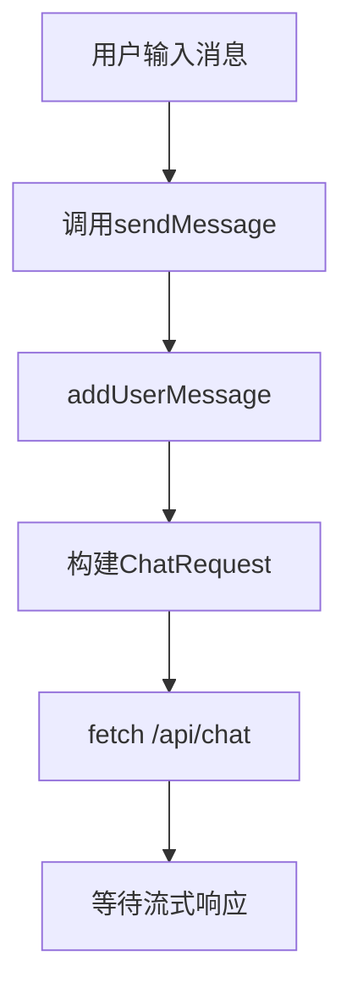
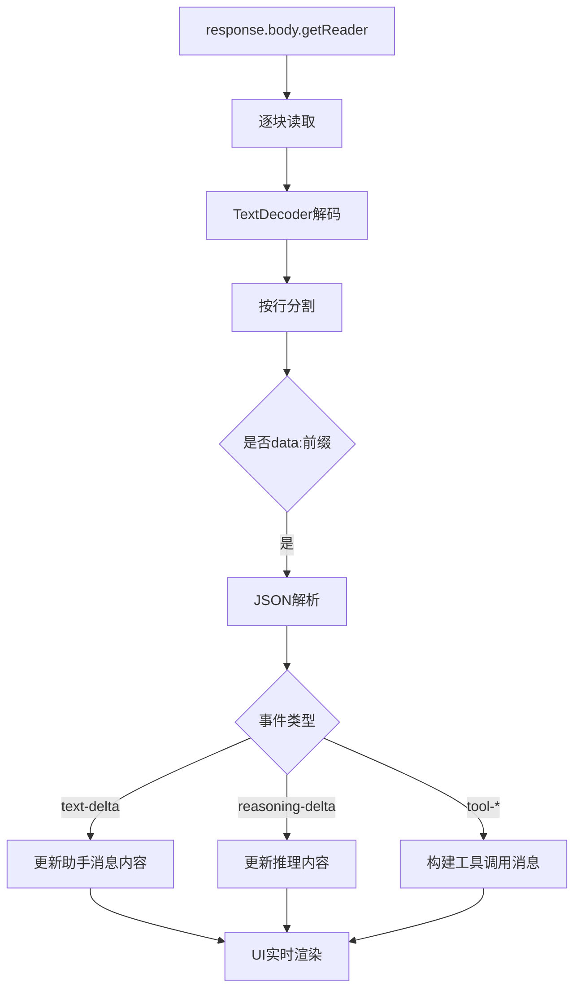
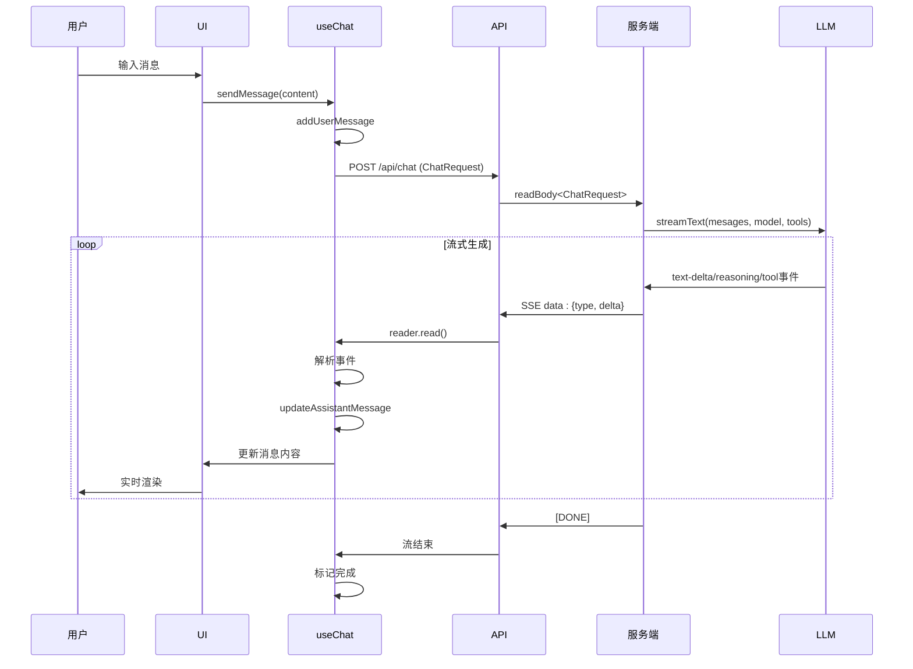

# 数据流与通信机制

<cite>
**本文档引用文件**  
- [useChat.ts](file://app/composables/useChat.ts)
- [chat.ts](file://shared/types/api/chat.ts)
- [chat.post.ts](file://server/api/chat.post.ts)
- [chat.ts](file://app/types/chat.ts)
- [conversation.ts](file://app/stores/conversation.ts)
- [model.ts](file://shared/types/model.ts)
- [model.ts](file://server/utils/model.ts)
- [template-gen.ts](file://server/core/prompt/template-gen.ts)
- [mcp-tools.ts](file://server/core/tools/mcp-tools.ts)
- [local-tools.ts](file://server/core/tools/local-tools.ts)
</cite>

## 目录
1. [数据流概述](#数据流概述)
2. [客户端消息组装与发送](#客户端消息组装与发送)
3. [服务端请求解析与上下文构建](#服务端请求解析与上下文构建)
4. [LLM流式响应生成](#llm流式响应生成)
5. [服务端流式返回机制](#服务端流式返回机制)
6. [客户端流式接收与实时渲染](#客户端流式接收与实时渲染)
7. [shared类型文件的作用](#shared类型文件的作用)
8. [消息字段传递路径分析](#消息字段传递路径分析)
9. [通信模式与状态同步](#通信模式与状态同步)
10. [序列图建议](#序列图建议)

## 数据流概述

本系统实现了从用户输入到AI响应的完整流式通信机制。数据流始于用户在聊天界面输入需求，经由客户端`useChat.ts`组合式函数处理，通过`/api/chat`接口与服务端交互，最终实现LLM响应的逐帧返回与实时渲染。整个过程采用流式传输，确保低延迟体验。

**Section sources**
- [useChat.ts](file://app/composables/useChat.ts#L1-L391)
- [chat.post.ts](file://server/api/chat.post.ts#L1-L43)

## 客户端消息组装与发送

当用户在聊天界面输入内容并发送时，`useChat.ts`中的`sendMessage`方法被触发。该方法首先调用`addUserMessage`将用户输入添加至当前会话，随后准备请求载荷并发起API调用。

请求载荷遵循`ChatRequest`接口定义，包含`model`和`messages`两个核心字段。`messages`数组由`activeMessages`计算属性获取，并通过映射转换为标准`ModelMessage`格式，仅保留`role`和`content`字段。



**Diagram sources**
- [useChat.ts](file://app/composables/useChat.ts#L300-L330)

**Section sources**
- [useChat.ts](file://app/composables/useChat.ts#L300-L330)
- [chat.ts](file://shared/types/api/chat.ts#L7-L16)

## 服务端请求解析与上下文构建

服务端通过`chat.post.ts`处理`/api/chat`的POST请求。使用`readBody<ChatRequest>`解析请求体，确保类型安全。解析出的`messages`、`model`、`temperature`等参数用于初始化流式响应。

系统通过`llmProvider(model)`动态获取对应模型实例，该函数基于`AvailableModels`配置映射模型名称到实际提供者。同时，初始化MCP工具集（模板与数据库上下文工具）和本地工具（如时间获取），为可能的工具调用做准备。

```mermaid
flowchart TD
A[/api/chat POST] --> B[readBody<ChatRequest>]
B --> C[提取model, messages, temperature]
C --> D[llmProvider(model)]
D --> E[initMcpTools + initLocalTools]
E --> F[streamText配置]
```

**Diagram sources**
- [chat.post.ts](file://server/api/chat.post.ts#L20-L43)
- [model.ts](file://server/utils/model.ts#L100-L121)

**Section sources**
- [chat.post.ts](file://server/api/chat.post.ts#L20-L43)
- [model.ts](file://server/utils/model.ts#L100-L121)

## LLM流式响应生成

核心生成逻辑由`streamText`函数驱动，配置包括：
- 模型实例：通过`llmProvider`获取
- 温度参数：控制生成随机性
- 工具集合：合并MCP与本地工具
- 系统提示：采用`templateGenPrompt()`生成的中文模板提示词
- 停止条件：最多5个推理步骤
- 特定选项：百炼模型禁用思考模式

系统提示词`templateGenPrompt`定义了严格的代码生成规则，强调Velocity模板语法处理、字面块输出优先级和循环完整性，确保生成代码的正确性。

**Section sources**
- [chat.post.ts](file://server/api/chat.post.ts#L30-L40)
- [template-gen.ts](file://server/core/prompt/template-gen.ts#L1-L237)

## 服务端流式返回机制

`streamText`返回一个可流式响应对象，通过调用`toUIMessageStreamResponse()`转换为适合前端消费的格式。该过程将LLM生成的token流、工具调用事件、推理过程等不同类型的数据，封装为SSE（Server-Sent Events）格式逐帧发送。

关键事件类型包括：
- `text-delta`：正文增量
- `reasoning-start/delta`：推理过程
- `tool-input-start/delta/available`：工具调用输入
- `tool-output-available`：工具调用结果

```mermaid
flowchart TD
A[streamText] --> B[生成事件流]
B --> C{事件类型判断}
C --> |text-delta| D[发送正文增量]
C --> |reasoning-delta| E[发送推理增量]
C --> |tool-input-delta| F[发送工具输入]
C --> |tool-output-available| G[发送工具结果]
D --> H[SSE data: {...}]
E --> H
F --> H
G --> H
```

**Diagram sources**
- [chat.post.ts](file://server/api/chat.post.ts#L30-L43)

**Section sources**
- [chat.post.ts](file://server/api/chat.post.ts#L30-L43)

## 客户端流式接收与实时渲染

客户端通过`fetch`的`response.body.getReader()`获取流式读取器，配合`TextDecoder`逐块处理响应。对每个`data:`事件进行解析，根据`type`字段分发处理：

- `text-delta`：拼接至`accumulatedContent`并调用`updateAssistantMessage`更新UI
- `reasoning-delta`：更新消息的`reasoningContent`字段，用于显示思考过程
- 工具相关事件：构建工具调用状态消息并实时更新

通过`updateAssistantMessage`操作Pinia状态，触发Vue响应式更新，实现内容的实时渲染。错误处理机制确保在流中断时正确清理状态。



**Diagram sources**
- [useChat.ts](file://app/composables/useChat.ts#L200-L290)

**Section sources**
- [useChat.ts](file://app/composables/useChat.ts#L200-L290)
- [conversation.ts](file://app/stores/conversation.ts#L200-L250)

## shared类型文件的作用

`shared/types/api/chat.ts`中定义的`ChatRequest`接口是前后端通信的契约核心。通过在客户端和服务端同时引用同一类型定义，确保了：
- 请求结构的一致性
- 字段类型的精确匹配
- 模型名称的枚举安全（通过`AvailableModelNames`）
- 减少因接口变更导致的集成错误

这种共享类型模式实现了类型级别的API文档，提升了开发效率与系统可靠性。

**Section sources**
- [chat.ts](file://shared/types/api/chat.ts#L7-L16)
- [model.ts](file://shared/types/model.ts#L145-L148)

## 消息字段传递路径分析

### role与content字段
- **客户端**：`useChat.ts`中`messages.value`映射为`{role, content}`
- **传输**：作为`ChatRequest.messages`数组元素发送
- **服务端**：直接传入`streamText`的`messages`参数
- **返回**：通过`text-delta`事件携带`delta`字段返回增量内容

### toolCalls字段（隐式）
虽然未显式定义`toolCalls`字段，但通过工具事件实现类似功能：
- `tool-input-start`：标记工具调用开始
- `tool-input-delta`：传递工具参数增量
- `tool-output-available`：返回执行结果

这些事件由MCP工具执行时触发，经由流式响应传递至客户端。

**Section sources**
- [useChat.ts](file://app/composables/useChat.ts#L250-L290)
- [chat.post.ts](file://server/api/chat.post.ts#L30-L40)
- [mcp-tools.ts](file://server/core/tools/mcp-tools.ts#L50-L93)

## 通信模式与状态同步

系统采用异步流式通信模式，具有以下特点：
- **单向流**：客户端发起请求，服务端持续推送直至完成
- **状态同步**：客户端通过`updateAssistantMessage`等方法保持与服务端生成状态同步
- **错误恢复**：捕获异常后清理不完整消息，保持会话一致性
- **幂等操作**：消息ID由客户端生成，避免重复提交问题

状态管理通过Pinia实现集中式存储，确保UI组件与业务逻辑解耦。

**Section sources**
- [useChat.ts](file://app/composables/useChat.ts#L300-L391)
- [conversation.ts](file://app/stores/conversation.ts#L100-L300)

## 序列图建议



**Diagram sources**
- [useChat.ts](file://app/composables/useChat.ts#L200-L330)
- [chat.post.ts](file://server/api/chat.post.ts#L20-L43)