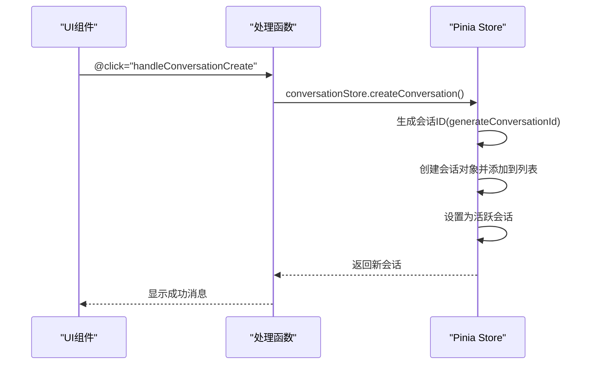
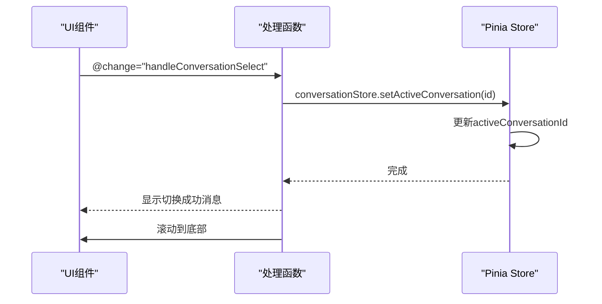
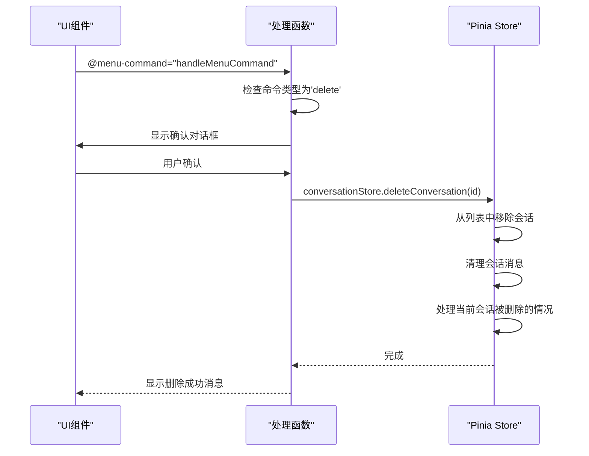
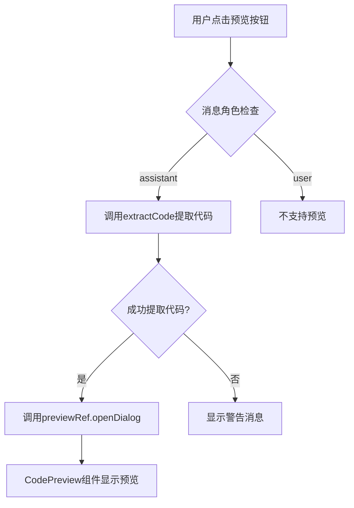
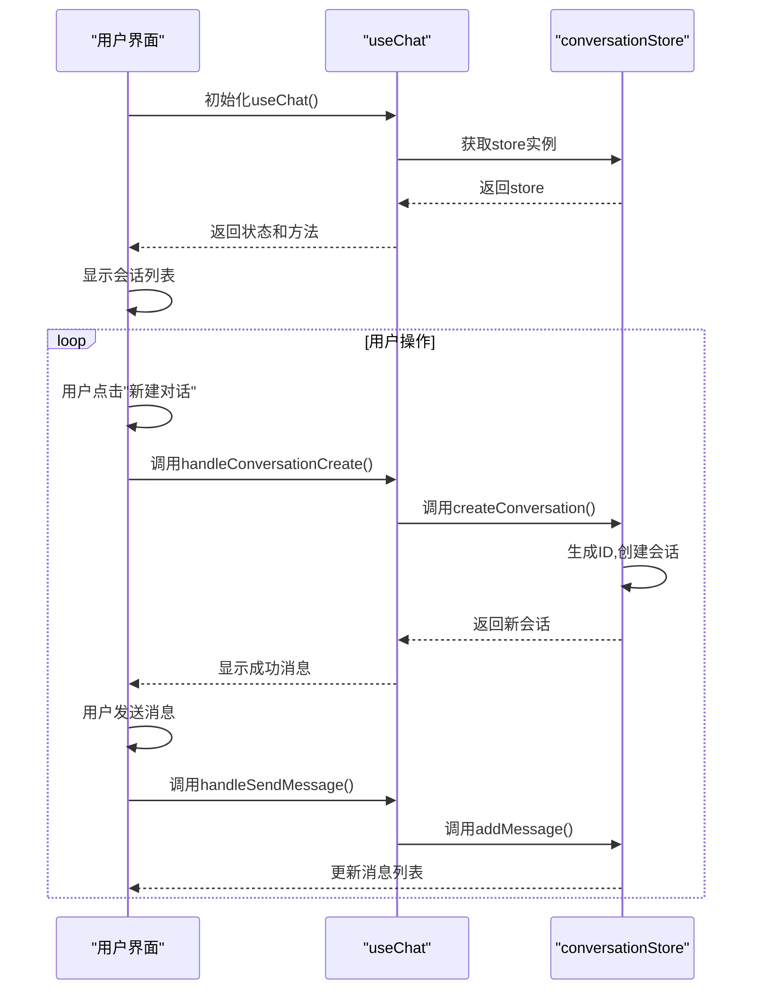

# UI集成与交互

<cite>
**本文档引用的文件**
- [index.vue](file://app/pages/chat/index.vue)
- [conversation.ts](file://app/stores/conversation.ts)
- [useChat.ts](file://app/composables/useChat.ts)
- [id.ts](file://shared/utils/id.ts)
- [CodePreview.vue](file://app/components/CodePreview.vue)
</cite>

## 目录
1. [会话管理功能集成](#会话管理功能集成)
2. [事件绑定与处理函数调用链](#事件绑定与处理函数调用链)
3. [侧边栏会话列表渲染机制](#侧边栏会话列表渲染机制)
4. [当前会话高亮显示实现](#当前会话高亮显示实现)
5. [会话删除二次确认机制](#会话删除二次确认机制)
6. [代码预览区域更新机制](#代码预览区域更新机制)
7. [UI-Store交互序列图](#ui-store交互序列图)
8. [常见UI同步问题调试方法](#常见ui同步问题调试方法)

## 会话管理功能集成

本系统通过`index.vue`页面组件实现了完整的会话管理功能，包括新建、切换和删除会话操作。这些功能通过左侧的`Conversations`组件实现，该组件提供了直观的用户界面来管理用户的对话历史。

会话管理功能的核心是Pinia状态管理库，通过`conversation.ts`中的`useConversationStore`存储来集中管理所有会话相关的状态和逻辑。这种架构设计实现了UI组件与业务逻辑的分离，提高了代码的可维护性和可测试性。

**Section sources**
- [index.vue](file://app/pages/chat/index.vue#L0-L29)
- [conversation.ts](file://app/stores/conversation.ts#L0-L43)

## 事件绑定与处理函数调用链

### 新建会话事件流


**Diagram sources**
- [index.vue](file://app/pages/chat/index.vue#L312-L361)
- [conversation.ts](file://app/stores/conversation.ts#L0-L43)

### 切换会话事件流


**Diagram sources**
- [index.vue](file://app/pages/chat/index.vue#L312-L361)
- [conversation.ts](file://app/stores/conversation.ts#L87-L133)

### 删除会话事件流


**Diagram sources**
- [index.vue](file://app/pages/chat/index.vue#L312-L361)
- [conversation.ts](file://app/stores/conversation.ts#L42-L89)

## 侧边栏会话列表渲染机制

侧边栏会话列表通过`Conversations`组件实现渲染，其核心机制如下：

### 数据绑定与遍历
```typescript
// 会话数据映射
const conversations = computed<ConversationItem<Conversation>[]>(() => {
  return conversationStore.conversations.map(conv => ({
    ...conv,
    label: conv.title,
    group: conv.group,
    disabled: conv.disabled,
    lastMessage: conv.lastMessage,
    timestamp: conv.updatedAt,
    ...conv,
  }));
});
```

**Section sources**
- [index.vue](file://app/pages/chat/index.vue#L181-L231)

### 动态属性绑定
- **v-for遍历**: 使用`v-model:active`和`:items`绑定会话数据
- **动态class**: 通过`class="conversations-panel"`实现样式控制
- **Tooltip集成**: 使用`tooltip-placement="right"`和`:tooltip-offset="35"`配置提示框

### 模板结构
```vue
<Conversations
  v-model:active="activeConversation"
  :items="conversations"
  class="conversations-panel"
  row-key="id"
  groupable
  tooltip-placement="right"
  :tooltip-offset="35"
  @change="handleConversationSelect"
  @menu-command="handleMenuCommand"
>
  <template #header>
    <div class="conversations-header">
      <h3>对话历史</h3>
      <el-button
        type="primary"
        size="small"
        :icon="Plus"
        @click="handleConversationCreate"
      >
        新建对话
      </el-button>
    </div>
  </template>
</Conversations>
```

## 当前会话高亮显示实现

当前会话的高亮显示通过以下机制实现：

### 活跃状态绑定
```typescript
// 计算属性双向绑定
const activeConversation = computed({
  get: () => conversationStore.activeConversationId,
  set: (value: string) => {
    if (value) {
      conversationStore.setActiveConversation(value);
    }
  },
});
```

### UI组件联动
`Conversations`组件通过`v-model:active`与`activeConversation`计算属性双向绑定，当用户选择或创建新会话时，store中的`activeConversationId`更新，触发UI重新渲染，自动高亮显示当前活跃会话。

**Section sources**
- [index.vue](file://app/pages/chat/index.vue#L181-L231)
- [conversation.ts](file://app/stores/conversation.ts#L87-L133)

## 会话删除二次确认机制

会话删除操作集成了Element Plus的`ElMessageBox`组件实现二次确认：

```typescript
function handleMenuCommand(
  command: ConversationMenuCommand,
  item: ConversationItem<Conversation>
) {
  if (command === 'delete') {
    ElMessageBox.confirm(
      `确定要删除会话 "${item.label}" 吗？此操作不可恢复。`,
      '确认删除',
      {
        confirmButtonText: '确定',
        cancelButtonText: '取消',
        type: 'warning',
      }
    )
      .then(() => {
        conversationStore.deleteConversation(item.id);
        ElMessage.success('会话已删除');
      })
      .catch(() => {
        // 用户取消
      });
  }
}
```

该机制确保用户不会意外删除重要会话，提供清晰的操作反馈和撤销机会。

**Section sources**
- [index.vue](file://app/pages/chat/index.vue#L312-L361)

## 代码预览区域更新机制

### 代码提取与预览流程


**Diagram sources**
- [index.vue](file://app/pages/chat/index.vue#L312-L361)
- [CodePreview.vue](file://app/components/CodePreview.vue#L0-L53)

### 核心实现代码
```typescript
/**
 * 处理代码预览
 */
const handlePreview = (item: ChatMessage): void => {
  if (item.role !== 'assistant') return;
  const sourceCode = extractCode(item.content);
  if (sourceCode) {
    previewRef.value?.openDialog(sourceCode);
  } else {
    ElMessage.warning('未提取到组件源码');
  }
};
```

`extractCode`函数从消息内容中提取Markdown代码块，`CodePreview`组件使用Vue REPL技术实现实时预览。

**Section sources**
- [index.vue](file://app/pages/chat/index.vue#L312-L361)
- [CodePreview.vue](file://app/components/CodePreview.vue#L0-L53)

## UI-Store交互序列图



**Diagram sources**
- [index.vue](file://app/pages/chat/index.vue#L181-L231)
- [useChat.ts](file://app/composables/useChat.ts#L0-L44)
- [conversation.ts](file://app/stores/conversation.ts#L0-L43)

## 常见UI同步问题调试方法

### 视图未刷新问题排查
1. **检查响应式绑定**: 确认store中的状态是否使用`ref`或`reactive`包装
2. **验证计算属性**: 检查计算属性是否正确依赖store状态
3. **调试更新时机**: 使用`nextTick`确保DOM更新完成

### 数据不一致问题
```typescript
// 调试方法示例
console.log('Store conversations:', conversationStore.conversations);
console.log('Computed conversations:', conversations.value);
```

### 常见解决方案
- **强制刷新**: 使用`forceUpdate`或重新绑定key
- **深度监听**: 使用`watch`深度监听复杂对象变化
- **错误边界**: 添加try-catch处理异常情况

**Section sources**
- [index.vue](file://app/pages/chat/index.vue#L422-L497)
- [conversation.ts](file://app/stores/conversation.ts#L256-L316)