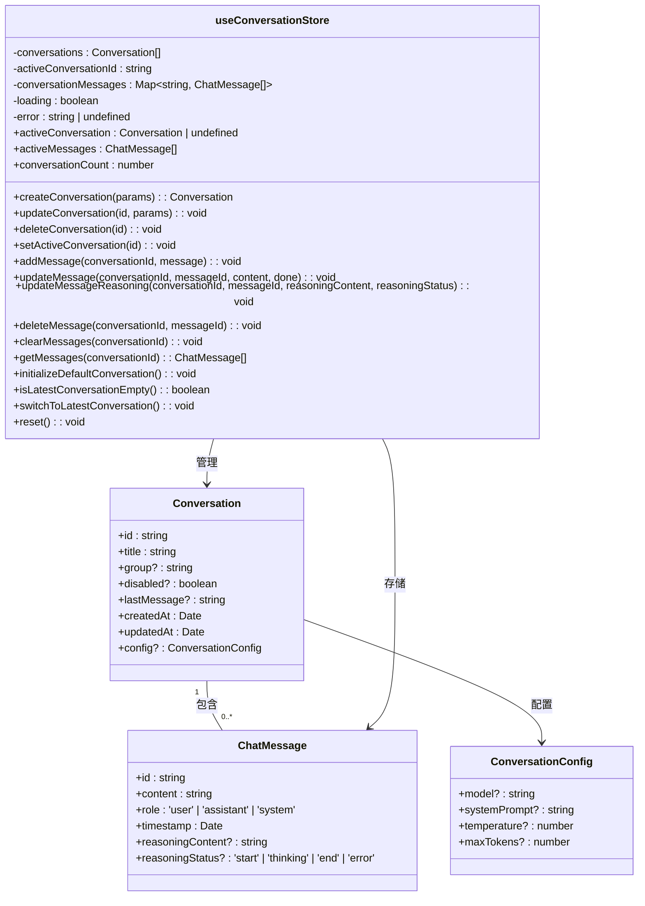
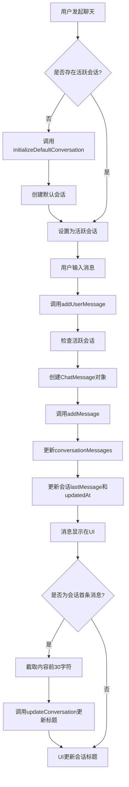

# 会话状态模型

<cite>
**本文档中引用的文件**  
- [conversation.ts](file://app/stores/conversation.ts)
- [conversation.ts](file://app/types/conversation.ts)
- [chat.ts](file://app/types/chat.ts)
- [id.ts](file://shared/utils/id.ts)
- [useChat.ts](file://app/composables/useChat.ts)
- [nuxt.config.ts](file://nuxt.config.ts)
</cite>

## 目录
1. [项目结构分析](#项目结构分析)
2. [核心数据结构与类型定义](#核心数据结构与类型定义)
3. [会话状态管理实现](#会话状态管理实现)
4. [状态持久化与初始化](#状态持久化与初始化)
5. [会话ID与消息ID生成机制](#会话id与消息id生成机制)
6. [会话状态生命周期](#会话状态生命周期)
7. [状态模型类图](#状态模型类图)
8. [数据流与操作流程图](#数据流与操作流程图)
9. [常见问题与初始化处理](#常见问题与初始化处理)

## 项目结构分析

项目采用基于Nuxt 3的模块化架构，会话状态管理功能集中于`app/stores`和`app/types`目录。核心文件包括：

- `app/stores/conversation.ts`：使用Pinia定义的会话状态管理Store
- `app/types/conversation.ts`：会话相关数据结构的TypeScript接口定义
- `app/types/chat.ts`：聊天消息的数据结构定义
- `shared/utils/id.ts`：唯一ID生成工具函数
- `app/composables/useChat.ts`：组合式函数，封装聊天业务逻辑并调用会话Store

该结构遵循关注点分离原则，将状态定义、类型约束、业务逻辑和UI组件解耦。

**Section sources**
- [conversation.ts](file://app/stores/conversation.ts)
- [nuxt.config.ts](file://nuxt.config.ts)

## 核心数据结构与类型定义

### 会话数据结构 (Conversation)

定义在`app/types/conversation.ts`中的`Conversation`接口，描述了单个会话的元数据：

```typescript
interface Conversation {
  id: string;                    // 会话唯一标识
  title: string;                 // 会话标题
  group?: string;                // 会话分组（如'recent'）
  disabled?: boolean;            // 是否禁用
  lastMessage?: string;          // 最后一条消息的摘要
  createdAt: Date;               // 创建时间
  updatedAt: Date;               // 最后更新时间
  config?: ConversationConfig;   // 会话配置
}
```

#### 会话配置 (ConversationConfig)

```typescript
interface ConversationConfig {
  model?: string;                // 使用的AI模型
  systemPrompt?: string;         // 系统提示词
  temperature?: number;          // 生成温度参数
  maxTokens?: number;            // 最大token数
}
```

### 聊天消息数据结构 (ChatMessage)

定义在`app/types/chat.ts`中的`ChatMessage`类型，扩展自UI库的`BubbleProps`，包含消息内容与元信息：

```typescript
type ChatMessage = BubbleProps & {
  id: string;                    // 消息唯一标识
  content: string;               // 消息内容
  role: 'user' | 'assistant' | 'system'; // 消息角色
  timestamp: Date;               // 时间戳
  reasoningContent?: string;     // 推理过程内容
  reasoningStatus?: 'start' | 'thinking' | 'end' | 'error'; // 推理状态
};
```

**Section sources**
- [conversation.ts](file://app/types/conversation.ts#L4-L79)
- [chat.ts](file://app/types/chat.ts#L6-L21)

## 会话状态管理实现

`useConversationStore`是基于Pinia的状态管理核心，位于`app/stores/conversation.ts`。

### 状态 (State)

- `conversations`: `Conversation[]` - 所有会话的数组
- `activeConversationId`: `string` - 当前活跃会话的ID
- `conversationMessages`: `Map<string, ChatMessage[]>` - 以会话ID为键，存储各会话消息列表
- `loading`: `boolean` - 全局加载状态
- `error`: `string | undefined` - 错误信息

### 计算属性 (Computed Properties)

- `activeConversation`: 基于`activeConversationId`从`conversations`中查找当前会话
- `activeMessages`: 获取当前活跃会话的消息列表
- `conversationCount`: 返回会话总数

### 核心方法 (Core Methods)

#### 会话管理
- `createConversation(params)`: 创建新会话，插入到数组开头，并初始化其消息列表
- `updateConversation(id, params)`: 更新指定会话的属性，并自动更新`updatedAt`
- `deleteConversation(id)`: 删除会话及其消息，若删除的是当前会话则自动切换
- `setActiveConversation(id)`: 切换当前活跃会话

#### 消息管理
- `addMessage(conversationId, message)`: 向指定会话添加消息，并更新会话的`lastMessage`和`updatedAt`
- `updateMessage(conversationId, messageId, content, done)`: 更新消息内容，可标记为完成
- `updateMessageReasoning(...)`: 更新消息的推理内容和状态
- `deleteMessage(conversationId, messageId)`: 删除指定消息
- `clearMessages(conversationId)`: 清空指定会话的所有消息

#### 辅助方法
- `initializeDefaultConversation()`: 若无会话则创建默认会话
- `isLatestConversationEmpty()`: 检查最新创建的会话是否为空
- `switchToLatestConversation()`: 切换到最新创建的会话
- `reset()`: 重置所有状态，清空会话和消息

**Section sources**
- [conversation.ts](file://app/stores/conversation.ts#L11-L316)

## 状态持久化与初始化

### 持久化策略

尽管在`conversation.ts`中未直接配置`persist`选项，但通过分析`nuxt.config.ts`，发现项目已集成`@pinia/nuxt`模块：

```typescript
export default defineNuxtConfig({
  modules: ['@nuxt/eslint', '@element-plus/nuxt', '@pinia/nuxt'],
  // ...
});
```

这表明项目使用了Pinia的Nuxt插件，通常该插件会自动配置localStorage持久化。然而，当前代码中未显式配置`persist`，意味着状态持久化可能依赖于Nuxt Pinia插件的默认行为或在更高层级配置。

### 状态重置 ($reset)

Store中定义了`reset`方法，用于将状态恢复到初始值：

```typescript
const reset = (): void => {
  conversations.value = [];
  activeConversationId.value = '';
  conversationMessages.value.clear();
  error.value = undefined;
};
```

此方法通过`return`语句暴露给外部调用者，可直接通过store实例调用`store.reset()`来重置状态。

### 初始化机制

`initializeDefaultConversation`方法确保应用至少有一个会话：

```typescript
const initializeDefaultConversation = (): void => {
  if (conversations.value.length === 0) {
    createConversation({
      title: '新对话',
      group: 'recent',
    });
  }
};
```

该方法在`useChat.ts`中被调用，确保在添加消息前存在活跃会话。

**Section sources**
- [conversation.ts](file://app/stores/conversation.ts#L230-L245)
- [nuxt.config.ts](file://nuxt.config.ts#L6)
- [useChat.ts](file://app/composables/useChat.ts#L25)

## 会话ID与消息ID生成机制

ID生成逻辑位于`shared/utils/id.ts`，采用统一的`generateId`工厂函数：

```typescript
const generateId = (prefix: string): string => {
  return `${prefix}_${Date.now()}_${Math.random().toString(36).substr(2, 9)}`;
};

export const generateMessageId = (): string => {
  return generateId('msg');
};

export const generateConversationId = (): string => {
  return generateId('conv');
};
```

- **前缀**: `msg_`用于消息，`conv_`用于会话
- **时间戳**: `Date.now()`确保时间上的唯一性
- **随机字符串**: `Math.random().toString(36).substr(2, 9)`生成9位随机字符

此机制在分布式环境下能有效避免ID冲突。

**Section sources**
- [id.ts](file://shared/utils/id.ts#L4-L27)

## 会话状态生命周期

会话状态的生命周期始于Store初始化，终于页面关闭或手动重置。

### 初始化流程
1. 应用启动，Pinia Store初始化
2. 检查localStorage中是否有持久化的会话数据（由Pinia插件自动处理）
3. 若无会话，调用`initializeDefaultConversation`创建默认会话

### 会话创建流程
1. 调用`createConversation`
2. 生成唯一ID (`generateConversationId`)
3. 设置默认标题、分组、时间戳
4. 将新会话插入`conversations`数组开头
5. 在`conversationMessages`中为该会话初始化空消息列表
6. 设置新会话为`activeConversation`

### 消息添加流程
1. 调用`addMessage`传入会话ID和消息对象
2. 在`conversationMessages`中找到对应会话的消息列表并添加消息
3. 更新该会话的`lastMessage`（截取前50字符）
4. 更新该会话的`updatedAt`时间戳

### 状态重置流程
1. 调用`reset`方法
2. 清空`conversations`数组
3. 重置`activeConversationId`为空字符串
4. 清空`conversationMessages`映射
5. 清除`error`状态

**Section sources**
- [conversation.ts](file://app/stores/conversation.ts)
- [useChat.ts](file://app/composables/useChat.ts)

## 状态模型类图



**Diagram sources**
- [conversation.ts](file://app/types/conversation.ts#L4-L79)
- [chat.ts](file://app/types/chat.ts#L6-L21)
- [conversation.ts](file://app/stores/conversation.ts#L11-L316)

## 数据流与操作流程图

### 会话创建与消息添加流程



**Diagram sources**
- [useChat.ts](file://app/composables/useChat.ts#L15-L75)
- [conversation.ts](file://app/stores/conversation.ts#L100-L133)

## 常见问题与初始化处理

### 类型不匹配处理

由于状态完全由TypeScript定义，编译时即可捕获类型错误。运行时通过Pinia的响应式系统和Vue的类型检查确保数据一致性。例如，`ChatMessage`的`role`字段被严格限定为`'user' | 'assistant' | 'system'`，任何非法值都会在编译时报错。

### 字段缺失处理

- **必填字段**: `Conversation`的`id`, `title`, `createdAt`, `updatedAt`为必填，由`createConversation`方法保证初始化时赋值。
- **可选字段**: 使用`?`标记的字段（如`group`, `config`）允许缺失，代码中通过可选链（`?.`）和条件检查安全访问。
- **默认值**: `createConversation`为`title`和`group`提供默认值，防止字段缺失。

### 初始化问题处理

- **无会话状态**: 通过`initializeDefaultConversation`确保至少有一个会话。
- **活跃会话丢失**: 在`setActiveConversation`中检查会话是否存在，避免设置无效ID。
- **消息存储不一致**: `addMessage`和`deleteConversation`等方法同步更新`conversations`和`conversationMessages`，保持数据一致性。

**Section sources**
- [conversation.ts](file://app/stores/conversation.ts)
- [useChat.ts](file://app/composables/useChat.ts)