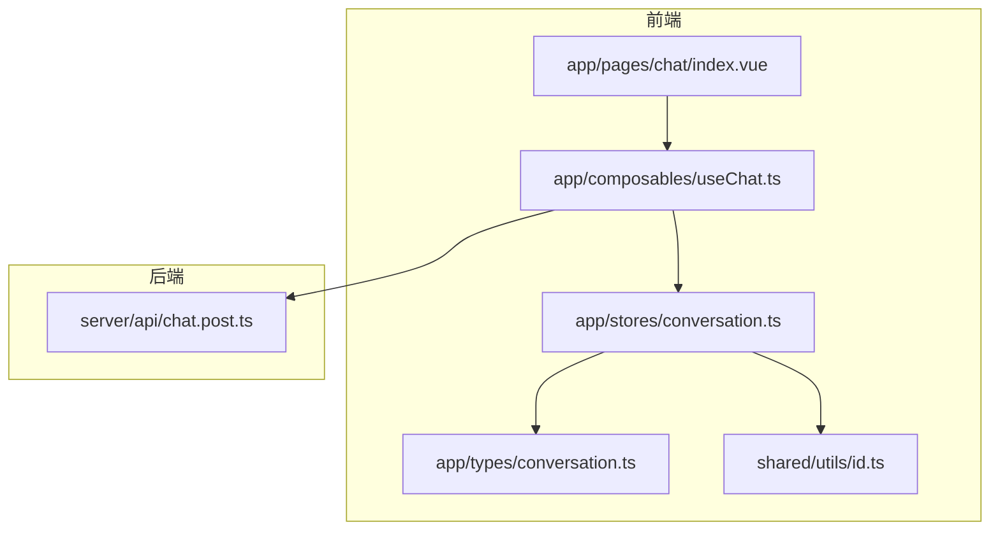
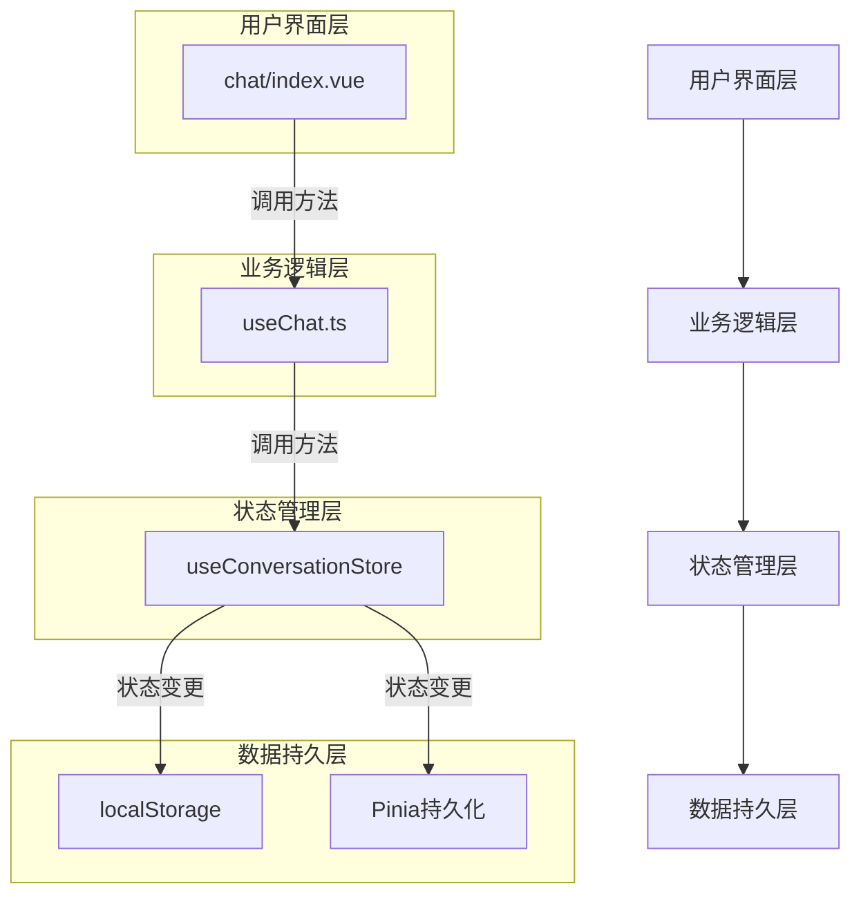
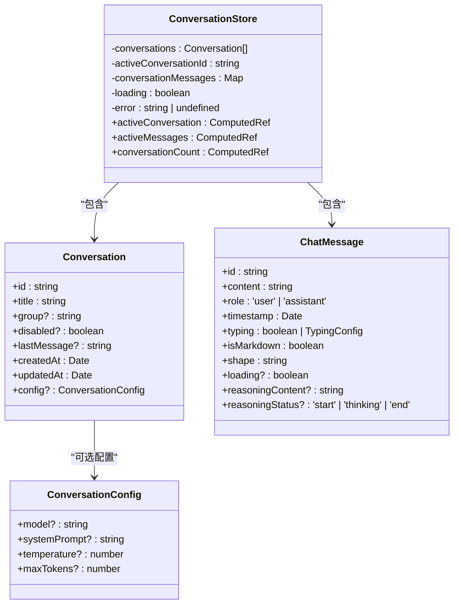
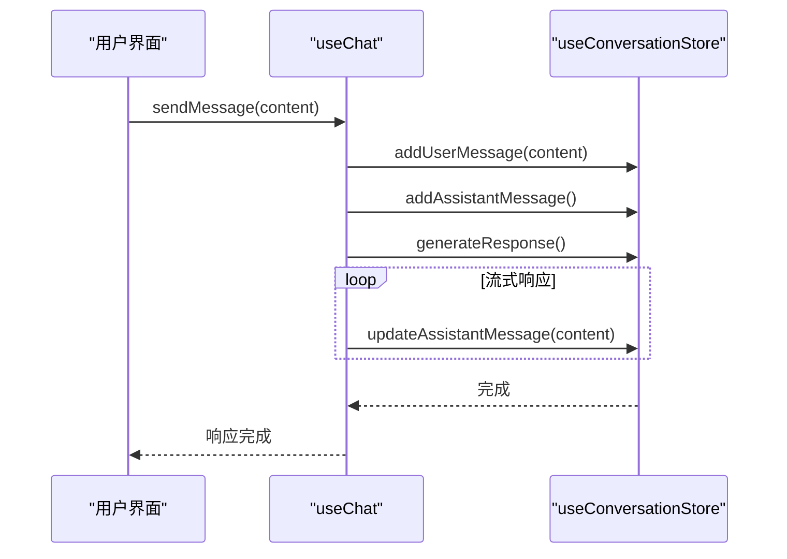
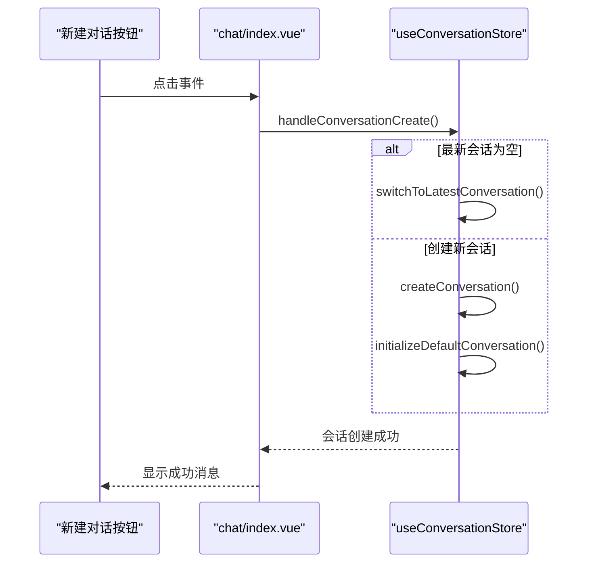
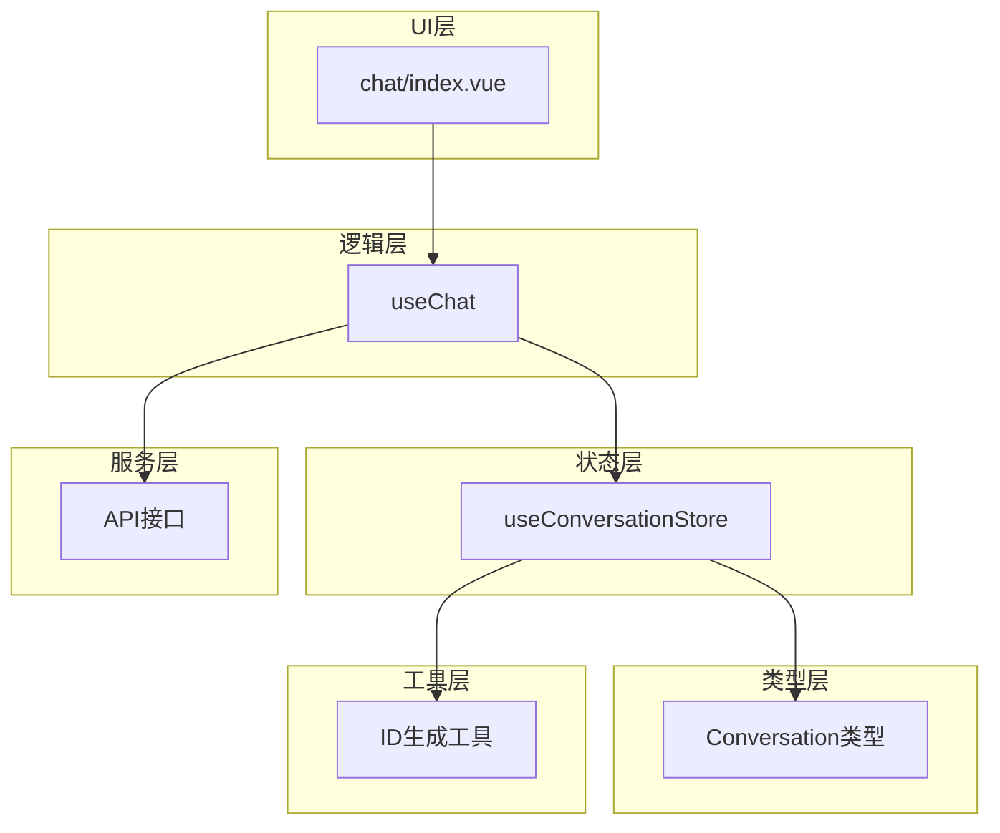

# 会话管理

<cite>
**本文档引用的文件**  
- [conversation.ts](file://app/stores/conversation.ts)
- [conversation.ts](file://app/types/conversation.ts)
- [useChat.ts](file://app/composables/useChat.ts)
- [index.vue](file://app/pages/chat/index.vue)
- [id.ts](file://shared/utils/id.ts)
- [nuxt.config.ts](file://nuxt.config.ts)
- [store.ts](file://app/composables/store.ts)
</cite>

## 目录
1. [项目结构](#项目结构)
2. [核心组件](#核心组件)
3. [架构概览](#架构概览)
4. [详细组件分析](#详细组件分析)
5. [依赖分析](#依赖分析)
6. [性能考量](#性能考量)
7. [故障排除指南](#故障排除指南)
8. [结论](#结论)

## 项目结构

项目采用基于功能的模块化组织方式，主要分为以下几个核心目录：

- `app/`：应用主目录，包含组件、组合式函数、页面和状态管理
- `app/components/`：可复用的UI组件（如CodePreview.vue）
- `app/composables/`：组合式函数逻辑（如useChat.ts和store.ts）
- `app/pages/`：页面路由组件（如chat/index.vue）
- `app/stores/`：Pinia状态管理（如conversation.ts）
- `app/types/`：类型定义（如chat.ts和conversation.ts）
- `shared/utils/`：跨项目共享的工具函数（如id.ts）
- `server/api/`：后端API接口（如chat.post.ts）

这种结构清晰地分离了UI、状态、业务逻辑和类型定义，符合现代Vue/Nuxt应用的最佳实践。

**图示来源**
- [index.vue](file://app/pages/chat/index.vue)
- [useChat.ts](file://app/composables/useChat.ts)
- [conversation.ts](file://app/stores/conversation.ts)
- [conversation.ts](file://app/types/conversation.ts)
- [id.ts](file://shared/utils/id.ts)

## 核心组件

会话管理系统的核心由以下几个组件构成：

- **useConversationStore**：基于Pinia的状态管理store，负责会话数据的存储与操作
- **useChat**：组合式函数，封装了聊天相关的业务逻辑，作为UI与状态管理的桥梁
- **chat/index.vue**：用户界面组件，提供会话创建、切换、消息发送等交互功能
- **Conversation类型**：定义了会话的数据结构和属性
- **ID生成工具**：提供唯一标识符的生成机制

这些组件共同实现了完整的会话管理功能，从数据存储到用户交互形成了一个闭环。

**组件来源**
- [conversation.ts](file://app/stores/conversation.ts)
- [useChat.ts](file://app/composables/useChat.ts)
- [index.vue](file://app/pages/chat/index.vue)
- [conversation.ts](file://app/types/conversation.ts)
- [id.ts](file://shared/utils/id.ts)

## 架构概览

系统采用分层架构设计，各层职责分明：

**图示来源**
- [index.vue](file://app/pages/chat/index.vue)
- [useChat.ts](file://app/composables/useChat.ts)
- [conversation.ts](file://app/stores/conversation.ts)

## 详细组件分析

### 会话状态管理分析

`useConversationStore`是会话管理的核心，采用Pinia作为状态管理解决方案。它定义了会话相关的所有状态和操作方法。

#### 状态定义

**图示来源**
- [conversation.ts](file://app/stores/conversation.ts)
- [conversation.ts](file://app/types/conversation.ts)

**状态来源**
- [conversation.ts](file://app/stores/conversation.ts)

#### 会话操作方法

`useConversationStore`提供了完整的CRUD操作接口：

- `createConversation`：创建新会话
- `updateConversation`：更新会话信息
- `deleteConversation`：删除会话
- `setActiveConversation`：切换活跃会话
- `addMessage`：添加消息
- `updateMessage`：更新消息
- `deleteMessage`：删除消息
- `clearMessages`：清空消息

这些方法确保了会话数据的一致性和完整性。

**方法来源**
- [conversation.ts](file://app/stores/conversation.ts)

### 聊天功能组合式函数分析

`useChat`是一个组合式函数，封装了与聊天相关的业务逻辑，作为UI组件与状态管理之间的适配层。

#### 功能调用流程

**图示来源**
- [useChat.ts](file://app/composables/useChat.ts)
- [conversation.ts](file://app/stores/conversation.ts)

**功能来源**
- [useChat.ts](file://app/composables/useChat.ts)

### 用户界面交互分析

`chat/index.vue`是会话管理的用户界面入口，通过事件驱动的方式与业务逻辑层交互。

#### 新建会话调用链

**图示来源**
- [index.vue](file://app/pages/chat/index.vue)
- [conversation.ts](file://app/stores/conversation.ts)

**交互来源**
- [index.vue](file://app/pages/chat/index.vue)

## 依赖分析

系统内部组件之间的依赖关系清晰，形成了良好的分层结构。

**图示来源**
- [index.vue](file://app/pages/chat/index.vue)
- [useChat.ts](file://app/composables/useChat.ts)
- [conversation.ts](file://app/stores/conversation.ts)
- [conversation.ts](file://app/types/conversation.ts)
- [id.ts](file://shared/utils/id.ts)

**依赖来源**
- [index.vue](file://app/pages/chat/index.vue)
- [useChat.ts](file://app/composables/useChat.ts)
- [conversation.ts](file://app/stores/conversation.ts)

## 性能考量

### 状态管理优化

- **只读状态暴露**：通过`readonly()`包装状态，防止外部直接修改，提高数据安全性
- **计算属性使用**：`activeConversation`、`activeMessages`等使用计算属性，确保响应式更新
- **Map数据结构**：`conversationMessages`使用Map而非Object，提供更好的性能和API
- **批量操作**：会话操作尽量减少状态变更次数，避免不必要的重新渲染

### 内存管理

- **消息清理机制**：提供`clearMessages`和`deleteMessage`方法，允许用户清理不需要的消息
- **会话删除**：`deleteConversation`方法会同时清理会话和对应的消息数据，防止内存泄漏
- **状态重置**：`reset`方法提供完整的状态清理功能

## 故障排除指南

### 会话丢失问题排查

当用户遇到会话丢失问题时，可以按照以下步骤进行排查：

1. **检查浏览器存储**：
   - 打开开发者工具
   - 查看Application/Storage中的localStorage
   - 确认是否有会话相关的存储数据

2. **检查Pinia状态**：
   - 使用Vue DevTools检查Pinia store状态
   - 确认`conversations`数组是否为空

3. **检查初始化逻辑**：
   - 确认`onMounted`钩子中的初始化逻辑是否执行
   - 检查`initializeDefaultConversation`方法是否被调用

4. **检查持久化配置**：
   - 查看`nuxt.config.ts`中的Pinia模块配置
   - 确认是否启用了持久化插件

### 数据恢复方案

如果会话数据意外丢失，可以尝试以下恢复方案：

1. **浏览器历史恢复**：
   - 检查浏览器的历史记录，看是否能找回之前的会话

2. **本地备份检查**：
   - 检查是否有定期导出的会话备份
   - 查看系统是否提供了数据导出功能

3. **代码层面恢复**：
   - 如果有版本控制系统，可以回退到之前的代码版本
   - 检查是否有自动保存的机制

4. **预防措施**：
   - 实现定期自动备份功能
   - 提供手动导出/导入会话功能
   - 增加数据持久化确认机制

**故障排除来源**
- [conversation.ts](file://app/stores/conversation.ts)
- [index.vue](file://app/pages/chat/index.vue)
- [nuxt.config.ts](file://nuxt.config.ts)

## 结论

会话管理系统通过Pinia状态管理、组合式函数和组件化UI的分层架构，实现了高效、可维护的会话管理功能。系统设计考虑了用户体验、性能优化和数据安全等多个方面，为用户提供了一个稳定可靠的聊天环境。

主要特点包括：
- 清晰的分层架构，职责分离明确
- 完整的CRUD操作支持，满足会话管理需求
- 响应式设计，提供流畅的用户体验
- 良好的错误处理机制，提高系统稳定性
- 可扩展的架构设计，便于未来功能扩展

建议未来可以增加以下功能：
- 会话数据的云同步功能
- 更强大的搜索和过滤功能
- 会话标签和分类管理
- 数据导出和备份功能
- 多设备同步支持