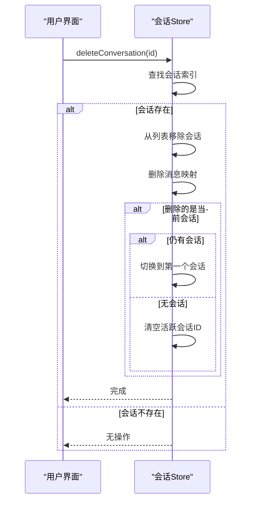
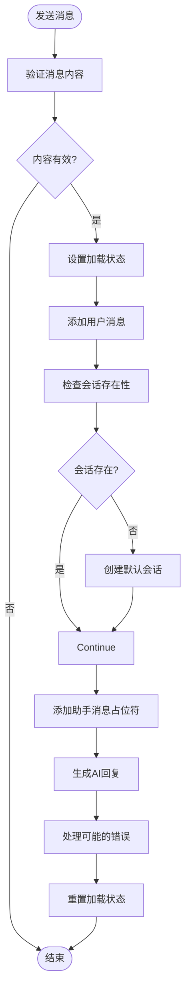
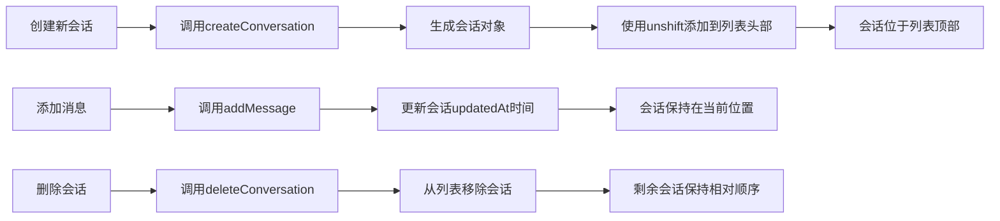

# 核心操作逻辑

<cite>
**本文档中引用的文件**   
- [conversation.ts](file://app/stores/conversation.ts#L1-L318)
- [conversation.ts](file://app/types/conversation.ts#L1-L79)
- [useChat.ts](file://app/composables/useChat.ts#L1-L365)
- [id.ts](file://shared/utils/id.ts#L1-L28)
- [index.vue](file://app/pages/chat/index.vue#L1-L726)
</cite>

## 目录
1. [核心操作逻辑](#核心操作逻辑)
2. [会话状态管理](#会话状态管理)
3. [核心操作方法分析](#核心操作方法分析)
    - [创建会话](#创建会话)
    - [切换会话](#切换会话)
    - [删除会话](#删除会话)
    - [清空消息](#清空消息)
4. [业务逻辑封装](#业务逻辑封装)
5. [会话自动命名策略](#会话自动命名策略)
6. [会话排序逻辑](#会话排序逻辑)
7. [异常场景处理](#异常场景处理)

## 核心操作逻辑

本文档全面文档化会话管理的核心操作实现，详细描述 `conversation.ts` 中 `createSession`、`switchSession`、`deleteSession`、`clearMessages` 等方法的内部逻辑，包括状态变更、边界条件处理与错误防御机制。同时，解释 `useChat.ts` 如何调用这些 store 方法实现业务逻辑封装，例如在发送消息前确保会话存在。文档化会话自动命名策略（如基于首条消息生成标题）的实现细节，以及会话排序逻辑（按最后更新时间倒序）。提供各操作的调用时序图与代码片段示例，展示参数传递与响应处理，并包含异常场景处理指南。

**Section sources**
- [conversation.ts](file://app/stores/conversation.ts#L1-L318)
- [useChat.ts](file://app/composables/useChat.ts#L1-L365)

## 会话状态管理

会话状态管理通过 Pinia store 实现，集中管理所有会话相关的状态和操作。核心状态包括会话列表、活跃会话 ID、会话消息映射等。

```mermaid
classDiagram
class useConversationStore {
+conversations : Conversation[]
+activeConversationId : string
+conversationMessages : Map<string, ChatMessage[]>
+loading : boolean
+error : string | undefined
+activeConversation : ComputedRef<Conversation | undefined>
+activeMessages : ComputedRef<ChatMessage[]>
+conversationCount : ComputedRef<number>
+createConversation(params : CreateConversationParams) : Conversation
+updateConversation(id : string, params : UpdateConversationParams) : void
+deleteConversation(id : string) : void
+setActiveConversation(id : string) : void
+addMessage(conversationId : string, message : ChatMessage) : void
+updateMessage(conversationId : string, messageId : string, content : string, done : boolean) : void
+updateMessageReasoning(conversationId : string, messageId : string, reasoningContent : string, reasoningStatus : string) : void
+deleteMessage(conversationId : string, messageId : string) : void
+clearMessages(conversationId : string) : void
+getMessages(conversationId : string) : ChatMessage[]
+initializeDefaultConversation() : void
+isLatestConversationEmpty() : boolean
+switchToLatestConversation() : void
+reset() : void
}
class Conversation {
+id : string
+title : string
+group? : string
+disabled? : boolean
+lastMessage? : string
+createdAt : Date
+updatedAt : Date
+config? : ConversationConfig
}
class ConversationConfig {
+model? : string
+systemPrompt? : string
+temperature? : number
+maxTokens? : number
}
class ChatMessage {
+id : string
+content : string
+role : 'user' | 'assistant'
+timestamp : Date
+typing : boolean | { step : number, interval : number, suffix : string }
+isMarkdown : boolean
+shape : string
+loading? : boolean
+reasoningContent? : string
+reasoningStatus? : 'start' | 'thinking' | 'end'
}
useConversationStore --> Conversation : "包含"
useConversationStore --> ChatMessage : "管理"
useConversationStore --> ConversationConfig : "配置"
```

**Diagram sources**
- [conversation.ts](file://app/stores/conversation.ts#L1-L318)
- [conversation.ts](file://app/types/conversation.ts#L1-L79)

**Section sources**
- [conversation.ts](file://app/stores/conversation.ts#L1-L318)
- [conversation.ts](file://app/types/conversation.ts#L1-L79)

## 核心操作方法分析

### 创建会话

`createConversation` 方法负责创建新的会话实例。该方法接收可选的创建参数，并返回新创建的会话对象。

**内部逻辑：**
1. 生成唯一会话 ID
2. 设置会话标题（使用参数或默认命名）
3. 初始化创建和更新时间
4. 将新会话插入会话列表头部
5. 初始化该会话的消息列表
6. 设置新会话为当前活跃会话

```typescript
const createConversation = (
  params: CreateConversationParams = {},
): Conversation => {
  const now = new Date();
  const conversation: Conversation = {
    id: generateConversationId(),
    title: params.title || `新对话 ${conversations.value.length + 1}`,
    group: params.group || 'recent',
    createdAt: now,
    updatedAt: now,
    config: params.config,
  };

  conversations.value.unshift(conversation);
  conversationMessages.value.set(conversation.id, []);
  activeConversationId.value = conversation.id;

  return conversation;
};
```

**边界条件处理：**
- 参数为可选，提供默认值
- 使用 `unshift` 确保新会话位于列表顶部
- 确保消息映射中为新会话创建空消息数组

**Section sources**
- [conversation.ts](file://app/stores/conversation.ts#L42-L89)

### 切换会话

`setActiveConversation` 方法用于切换当前活跃的会话。该方法接收会话 ID 作为参数，并验证其有效性。

```typescript
const setActiveConversation = (id: string): void => {
  const conversation = conversations.value.find(conv => conv.id === id);
  if (conversation) {
    activeConversationId.value = id;
  }
};
```

**错误防御机制：**
- 查找会话是否存在
- 仅在会话存在时才更新活跃会话 ID
- 避免设置无效的会话 ID

**Section sources**
- [conversation.ts](file://app/stores/conversation.ts#L135-L142)

### 删除会话

`deleteConversation` 方法处理会话的删除操作，包含完整的状态清理和边界条件处理。

**内部逻辑：**
1. 查找会话在列表中的索引
2. 从会话列表中移除会话
3. 从消息映射中删除该会话的所有消息
4. 处理当前活跃会话被删除的特殊情况

```typescript
const deleteConversation = (id: string): void => {
  const index = conversations.value.findIndex(conv => conv.id === id);
  if (index > -1) {
    conversations.value.splice(index, 1);
    conversationMessages.value.delete(id);

    // 如果删除的是当前活跃会话，切换到第一个会话
    if (activeConversationId.value === id) {
      if (conversations.value.length > 0) {
        activeConversationId.value = conversations.value[0]?.id || '';
      } else {
        activeConversationId.value = '';
      }
    }
  }
};
```

**异常场景处理：**
- 检查会话是否存在（索引 > -1）
- 处理删除当前活跃会话的情况
- 当有剩余会话时，自动切换到第一个会话
- 当无剩余会话时，清空活跃会话 ID



**Diagram sources**
- [conversation.ts](file://app/stores/conversation.ts#L89-L108)

**Section sources**
- [conversation.ts](file://app/stores/conversation.ts#L89-L108)

### 清空消息

`clearMessages` 方法用于清空指定会话中的所有消息记录。

```typescript
const clearMessages = (conversationId: string): void => {
  conversationMessages.value.set(conversationId, []);

  // 更新会话信息
  const conversation = conversations.value.find(
    conv => conv.id === conversationId,
  );
  if (conversation) {
    conversation.lastMessage = undefined;
    conversation.updatedAt = new Date();
  }
};
```

**状态变更：**
- 将指定会话的消息数组重置为空
- 清除会话的最后消息摘要
- 更新会话的最后更新时间

**Section sources**
- [conversation.ts](file://app/stores/conversation.ts#L211-L225)

## 业务逻辑封装

`useChat.ts` 文件封装了与聊天相关的业务逻辑，通过调用会话 store 的方法实现高级功能。

### 发送消息前的会话存在性检查

在发送消息前，`useChat` 组合式函数确保会话存在，这是关键的防御性编程实践。

```typescript
const sendMessage = async (content: string): Promise<void> => {
  if (!content.trim()) return;

  loading.value = true;
  error.value = undefined;

  try {
    // 添加用户消息
    addUserMessage(content);

    // 创建助手消息占位符
    const assistantMessageId = addAssistantMessage();

    // 生成回复
    await generateResponse(assistantMessageId);
  } catch (err) {
    // 错误处理
  } finally {
    loading.value = false;
  }
};
```

其中 `addUserMessage` 方法确保会话存在：

```typescript
const addUserMessage = (content: string): void => {
  if (!conversationStore.activeConversationId) {
    conversationStore.initializeDefaultConversation();
  }
  // ... 其他逻辑
};
```

**关键检查点：**
- `addUserMessage` 和 `addAssistantMessage` 都检查 `activeConversationId`
- 如果不存在活跃会话，则调用 `initializeDefaultConversation`
- `initializeDefaultConversation` 仅在会话列表为空时创建默认会话



**Diagram sources**
- [useChat.ts](file://app/composables/useChat.ts#L1-L365)

**Section sources**
- [useChat.ts](file://app/composables/useChat.ts#L1-L365)

## 会话自动命名策略

系统实现了智能的会话自动命名策略，结合默认命名和基于首条消息的动态命名。

### 实现细节

**1. 默认命名策略**
当创建新会话且未提供标题时，使用序号命名：

```typescript
title: params.title || `新对话 ${conversations.value.length + 1}`
```

**2. 基于首条消息的命名**
当用户发送第一条消息时，自动更新会话标题：

```typescript
const addUserMessage = (content: string): void => {
  // ... 会话存在性检查
  
  // 检查是否为该会话的第一条消息
  const currentMessages = conversationStore.getMessages(
    conversationStore.activeConversationId,
  );
  const isFirstMessage = currentMessages.length === 0;

  // ... 添加消息

  // 如果是第一条消息，更新会话标题
  if (isFirstMessage) {
    // 截取前30个字符作为标题，避免标题过长
    const title =
      content.length > 30 ? content.slice(0, 30) + '...' : content;
    conversationStore.updateConversation(
      conversationStore.activeConversationId,
      { title },
    );
  }
};
```

**命名规则：**
- 仅对会话的第一条消息应用自动命名
- 截取消息前30个字符作为标题
- 超过30个字符时添加省略号
- 保留原始消息内容的语义

**Section sources**
- [useChat.ts](file://app/composables/useChat.ts#L40-L89)
- [conversation.ts](file://app/stores/conversation.ts#L42-L43)

## 会话排序逻辑

会话排序逻辑通过多种机制实现，确保用户界面中会话的正确排序。

### 实现方式

**1. 创建时排序**
新创建的会话通过 `unshift` 方法添加到数组头部：

```typescript
conversations.value.unshift(conversation);
```

这确保新会话始终位于列表顶部。

**2. 更新时间排序**
当添加或更新消息时，会话的 `updatedAt` 时间戳会被更新：

```typescript
conversation.updatedAt = new Date();
```

**3. 最新会话查找**
`switchToLatestConversation` 方法通过 `createdAt` 时间查找最新会话：

```typescript
const latestConversation = conversations.value.reduce((latest, current) => {
  return new Date(current.createdAt) > new Date(latest.createdAt)
    ? current
    : latest;
});
```

**4. UI 展示排序**
在页面组件中，会话列表直接绑定到 store 的 `conversations` 数组：

```vue
<Conversations
  v-model:active="activeConversation"
  :items="conversations"
/>
```

由于新会话使用 `unshift` 添加，且删除操作保持相对顺序，列表自然按创建时间倒序排列。



**Section sources**
- [conversation.ts](file://app/stores/conversation.ts#L50)
- [conversation.ts](file://app/stores/conversation.ts#L125-L133)
- [conversation.ts](file://app/stores/conversation.ts#L256-L260)
- [index.vue](file://app/pages/chat/index.vue#L1-L726)

## 异常场景处理

系统实现了完善的异常场景处理机制，确保用户体验的流畅性。

### 删除当前会话的默认切换逻辑

当删除当前活跃会话时，系统自动处理会话切换：

```typescript
if (activeConversationId.value === id) {
  if (conversations.value.length > 0) {
    activeConversationId.value = conversations.value[0]?.id || '';
  } else {
    activeConversationId.value = '';
  }
}
```

**处理流程：**
1. 检测被删除的会话是否为当前活跃会话
2. 如果仍有其他会话，切换到列表中的第一个会话
3. 如果无其他会话，清空活跃会话 ID
4. 触发 UI 更新，显示空状态或创建新会话的提示

### 消息发送错误处理

在 `sendMessage` 方法中，实现了全面的错误处理：

```typescript
catch (err) {
  error.value = err instanceof Error ? err.message : '发送消息失败';
  console.error('发送消息失败:', err);

  // 如果出错，处理助手消息状态
  if (conversationStore.activeConversationId) {
    const currentMessages = conversationStore.getMessages(
      conversationStore.activeConversationId,
    );
    const lastMessage = currentMessages[currentMessages.length - 1];
    if (currentMessages.length > 0 && lastMessage?.role === 'assistant') {
      if (lastMessage.content === '') {
        // 如果消息为空，删除消息
        conversationStore.deleteMessage(
          conversationStore.activeConversationId,
          lastMessage.id,
        );
      } else {
        // 如果消息有内容，确保typing和loading状态为false
        conversationStore.updateMessage(
          conversationStore.activeConversationId,
          lastMessage.id,
          lastMessage.content,
          true,
        );
      }
    }
  }
} finally {
  loading.value = false;
}
```

**错误处理策略：**
- 捕获并显示错误信息
- 清理可能处于错误状态的助手消息
- 根据消息内容决定是删除还是完成消息
- 确保加载状态被正确重置

**Section sources**
- [conversation.ts](file://app/stores/conversation.ts#L87-L108)
- [useChat.ts](file://app/composables/useChat.ts#L200-L250)