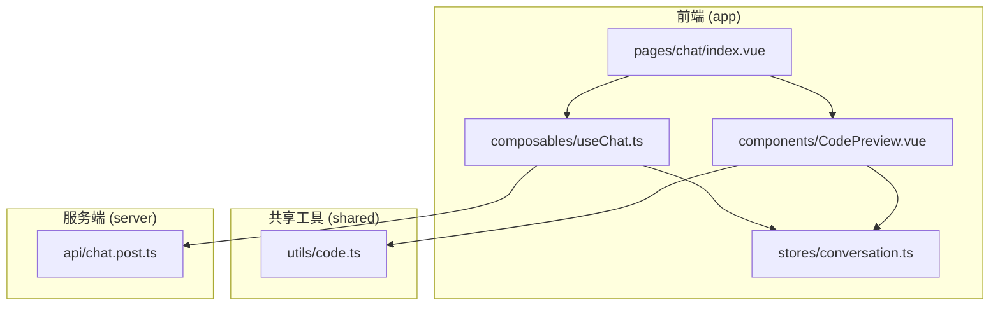
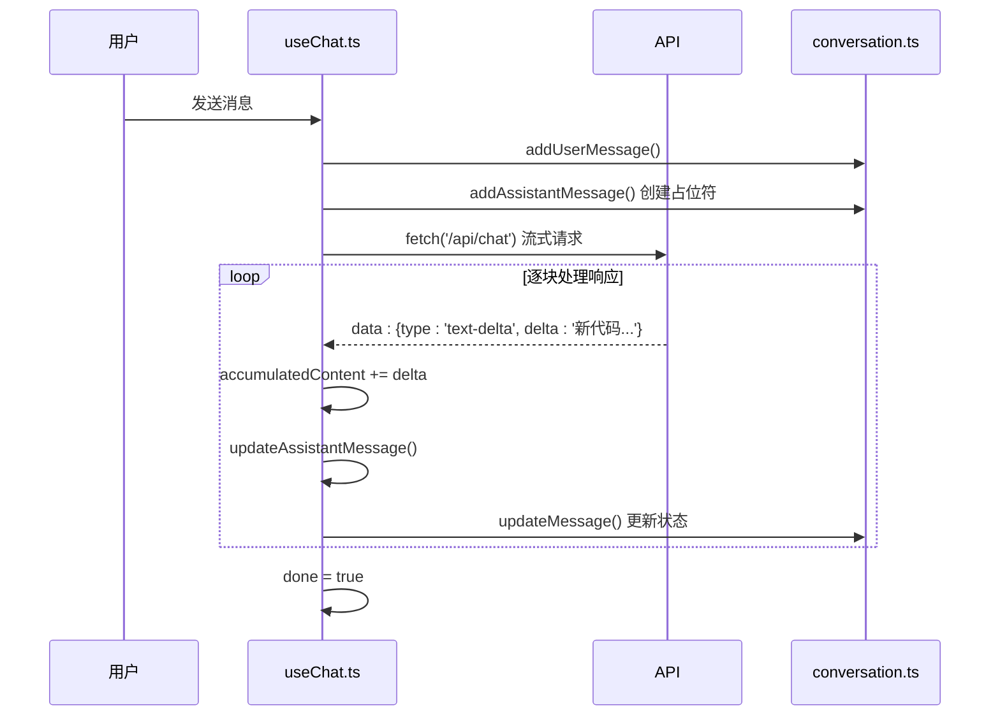
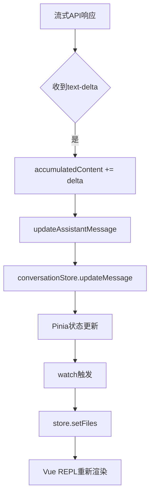
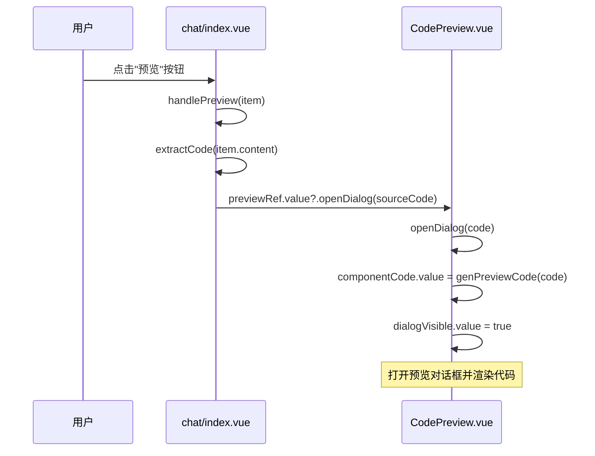

# 交互式预览控制

<cite>
**本文档引用的文件**   
- [useChat.ts](file://app/composables/useChat.ts)
- [CodePreview.vue](file://app/components/CodePreview.vue)
- [code.ts](file://shared/utils/code.ts)
- [chat/index.vue](file://app/pages/chat/index.vue)
</cite>

## 目录
1. [项目结构](#项目结构)
2. [核心组件](#核心组件)
3. [交互控制逻辑](#交互控制逻辑)
4. [Vue REPL集成](#vue-repl集成)
5. [功能实现路径](#功能实现路径)
6. [错误边界处理](#错误边界处理)
7. [UI交互功能](#ui交互功能)

## 项目结构

项目采用Nuxt 3框架，遵循模块化设计原则，主要分为前端组件、组合式函数、状态管理、服务端API和共享工具库。核心交互逻辑集中在`app`目录下，而通用工具函数则位于`shared`目录。



**图示来源**
- [CodePreview.vue](file://app/components/CodePreview.vue)
- [useChat.ts](file://app/composables/useChat.ts)
- [conversation.ts](file://app/stores/conversation.ts)
- [code.ts](file://shared/utils/code.ts)
- [chat.post.ts](file://server/api/chat.post.ts)

**本节来源**
- [CodePreview.vue](file://app/components/CodePreview.vue)
- [useChat.ts](file://app/composables/useChat.ts)

## 核心组件

系统的核心交互由两个关键组件驱动：`useChat.ts`负责处理AI流式响应和状态管理，`CodePreview.vue`负责渲染和预览生成的代码。

**本节来源**
- [useChat.ts](file://app/composables/useChat.ts#L1-L364)
- [CodePreview.vue](file://app/components/CodePreview.vue#L1-L82)

## 交互控制逻辑

`useChat.ts`组合式函数是实时预览交互控制的核心。当用户发送消息后，`sendMessage`函数被调用，它首先通过`addUserMessage`将用户消息添加到会话中，然后创建一个助手消息占位符，并调用`generateResponse`函数发起流式请求。



**图示来源**
- [useChat.ts](file://app/composables/useChat.ts#L107-L200)
- [conversation.ts](file://app/stores/conversation.ts)

**本节来源**
- [useChat.ts](file://app/composables/useChat.ts#L107-L200)

### 响应式状态更新与重新渲染

`updateAssistantMessage`函数是触发`CodePreview.vue`重新渲染的关键。当从流式API接收到新的代码片段时，`generateResponse`函数会调用`updateAssistantMessage`，该函数通过`conversationStore.updateMessage`更新Pinia状态。由于`CodePreview.vue`中的`componentCode`是通过`watch`监听`messages`计算属性的，状态的更新会自动触发`watch`回调，从而使用最新的代码内容调用`store.setFiles`，最终导致Vue REPL重新渲染。



**图示来源**
- [useChat.ts](file://app/composables/useChat.ts#L92-L105)
- [CodePreview.vue](file://app/components/CodePreview.vue#L25-L48)

**本节来源**
- [useChat.ts](file://app/composables/useChat.ts#L92-L105)
- [CodePreview.vue](file://app/components/CodePreview.vue#L25-L48)

## Vue REPL集成

`CodePreview.vue`组件通过集成`@vue/repl`库，实现了在浏览器中直接运行Vue组件代码的可运行预览功能。

### 预览环境构建

`CodePreview.vue`利用`shared/utils/code.ts`中的工具函数构建一个完整的Vue运行环境。`genPreviewCode`函数负责将AI生成的代码片段转换为一个标准的Vue SFC（单文件组件），并自动处理Vue API的导入。`buildElementPlusSetup`、`buildPlaygroundMain`和`generateImportMap`等函数共同构建了包含Element Plus UI库的预览环境。

```mermaid
classDiagram
class CodePreview {
+componentCode : Ref<string>
+dialogVisible : Ref<boolean>
+store : ReplStore
+openDialog(code : string)
}
class codeUtils {
+genPreviewCode(code : string) : string
+extractVuePart(code : string) : {template, script, style}
+buildElementPlusSetup(version : string) : string
+buildPlaygroundMain() : string
+generateImportMap(vueVer, epVer, iconVer) : object
+buildTsconfig() : string
}
class VueREPL {
+Repl
+Monaco
}
CodePreview --> codeUtils : "使用"
CodePreview --> VueREPL : "集成"
codeUtils ..> CodePreview : "提供工具"
```

**图示来源**
- [CodePreview.vue](file://app/components/CodePreview.vue)
- [code.ts](file://shared/utils/code.ts)

**本节来源**
- [CodePreview.vue](file://app/components/CodePreview.vue)
- [code.ts](file://shared/utils/code.ts)

### 集成实现

`CodePreview.vue`通过`<Repl>`组件和`store`对象与Vue REPL进行集成。`store`对象由`useStore`创建，其`setFiles`方法用于动态设置预览环境中的文件。当`watch`监听到`componentCode`变化时，会调用`setFiles`来更新`src/App.vue`等文件的内容，从而实现代码的实时预览。

```typescript
// CodePreview.vue 中的关键集成代码
const store = useStore({ /* ... */ });

watch(
  componentCode,
  () => {
    if (!componentCode.value) return;
    store.setFiles({
      'src/App.vue': componentCode.value,
      'src/element-plus.js': buildElementPlusSetup(elementPlusVersion),
      // ... 其他文件
    });
    store.mainFile = 'src/PlaygroundMain.vue';
  },
  { immediate: true }
);
```

**本节来源**
- [CodePreview.vue](file://app/components/CodePreview.vue#L15-L48)

## 功能实现路径

### “重新生成”功能

“重新生成”功能由`useChat.ts`中的`regenerate`函数实现。当用户点击“重新生成”按钮时，该函数被调用，其核心逻辑是：
1.  **定位消息**：在当前会话的消息列表中，通过`findIndex`找到指定`messageId`的消息。
2.  **删除后续消息**：使用`slice`方法获取从该消息开始的所有后续消息，并通过`deleteMessage`逐一删除，实现会话的“回滚”。
3.  **发起新请求**：创建一个新的助手消息占位符，并调用`generateResponse`重新生成回复。

```mermaid
flowchart TD
A[用户点击"重新生成"] --> B[调用regenerate(messageId)]
B --> C[findIndex找到消息索引]
C --> D{索引存在?}
D --> |否| E[抛出错误]
D --> |是| F[获取从索引开始的所有消息]
F --> G[循环删除每条消息]
G --> H[addAssistantMessage创建新占位符]
H --> I[generateResponse生成新回复]
I --> J[流式更新UI]
```

**图示来源**
- [useChat.ts](file://app/composables/useChat.ts#L255-L319)

**本节来源**
- [useChat.ts](file://app/composables/useChat.ts#L255-L319)

### “编辑预览”功能

“编辑预览”功能的实现路径是事件驱动的。在`chat/index.vue`中，当用户点击消息旁的“预览”按钮时，会触发`handlePreview`函数。该函数提取AI回复中的代码块，并通过`defineExpose`暴露的`openDialog`方法，将代码传递给`CodePreview.vue`组件，从而打开预览对话框。



**图示来源**
- [chat/index.vue](file://app/pages/chat/index.vue#L298-L301)
- [CodePreview.vue](file://app/components/CodePreview.vue#L53-L56)

**本节来源**
- [chat/index.vue](file://app/pages/chat/index.vue#L298-L301)
- [CodePreview.vue](file://app/components/CodePreview.vue#L53-L56)

## 错误边界处理

系统在多个层面实现了错误处理，确保在代码存在语法错误或运行时异常时，能提供友好的反馈。

### 客户端错误处理

`useChat.ts`中的`sendMessage`和`regenerate`函数都使用了`try...catch`块来捕获网络请求或API调用失败的错误。捕获到错误后，会将错误信息存储在`error` ref中，并在UI上显示。同时，`finally`块确保`loading`状态被正确重置。

```typescript
// useChat.ts 中的错误处理
const sendMessage = async (content: string): Promise<void> => {
  loading.value = true;
  error.value = undefined;
  try {
    // ... 核心逻辑
  } catch (err) {
    error.value = err instanceof Error ? err.message : '发送消息失败';
    // ... 清理逻辑
  } finally {
    loading.value = false; // 确保loading状态重置
  }
};
```

### 代码解析与预览错误

在预览层面，`genPreviewCode`和`extractVuePart`函数在处理代码时，会进行健壮的字符串操作和正则匹配，即使输入的代码格式不完全正确，也能尽可能地提取出`template`、`script`和`style`部分。如果无法提取到有效代码，`handlePreview`函数会通过`ElMessage.warning`向用户提示“未提取到组件源码”。

**本节来源**
- [useChat.ts](file://app/composables/useChat.ts#L150-L199)
- [code.ts](file://shared/utils/code.ts#L200-L250)
- [chat/index.vue](file://app/pages/chat/index.vue#L300-L301)

## UI交互功能

### 复制代码按钮

“复制代码”功能在`chat/index.vue`中实现。`handleExtractCode`函数负责提取AI回复中的代码块，并使用`navigator.clipboard.writeText` API将其复制到系统剪贴板。操作结果通过Element Plus的`ElMessage`组件以成功或失败的提示信息反馈给用户。

```typescript
// chat/index.vue 中的复制功能
const handleExtractCode = (item: ChatMessage): void => {
  const sourceCode = genPreviewCode(extractCode(item.content));
  if (sourceCode) {
    navigator.clipboard
      .writeText(sourceCode)
      .then(() => {
        ElMessage.success('源码已复制到剪贴板');
      })
      .catch(() => {
        ElMessage.error('复制失败,请手动复制');
      });
  } else {
    ElMessage.warning('未提取到组件源码');
  }
};
```

**本节来源**
- [chat/index.vue](file://app/pages/chat/index.vue#L290-L297)

### 缩放控制与全屏预览

根据现有代码分析，当前实现中**未包含**明确的缩放控制或全屏预览功能。`CodePreview.vue`使用`el-dialog`组件，其宽度固定为`90%`，高度为`80vh`，且未提供调整大小或进入全屏模式的交互控件。因此，这些功能在当前版本中可能尚未实现或通过其他未分析的组件实现。