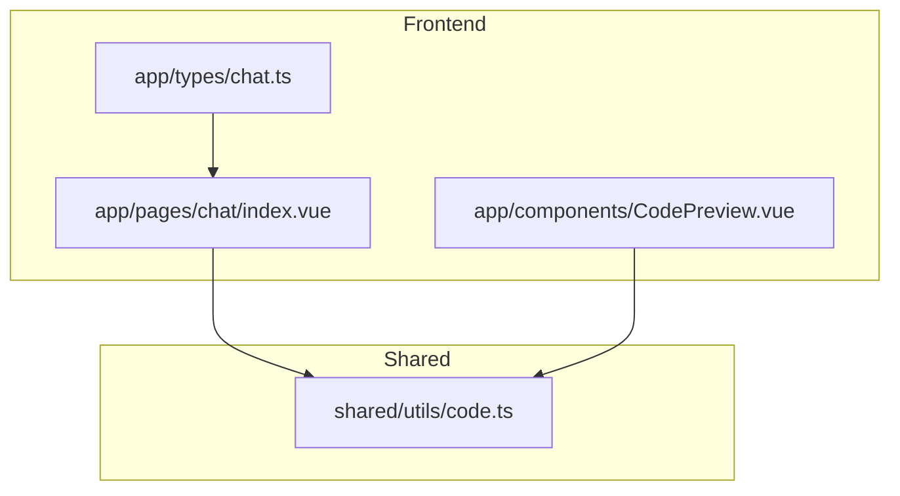
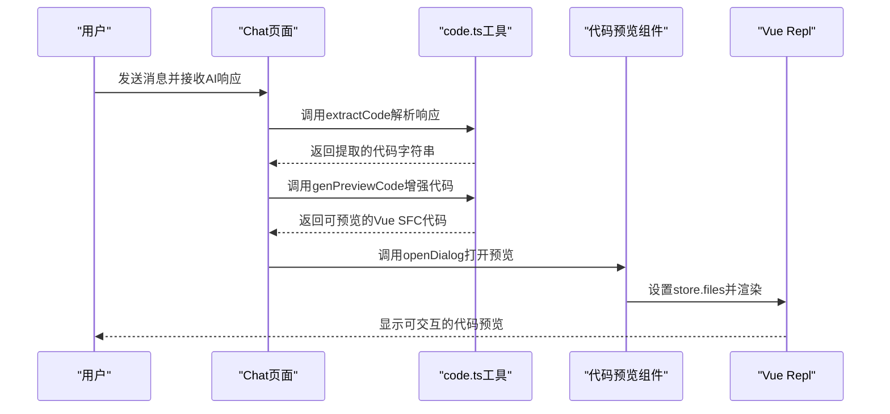
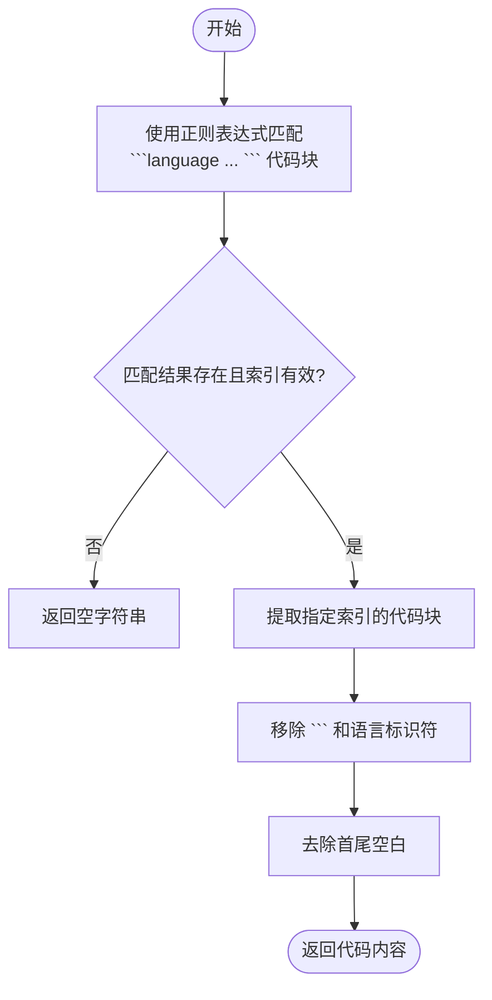
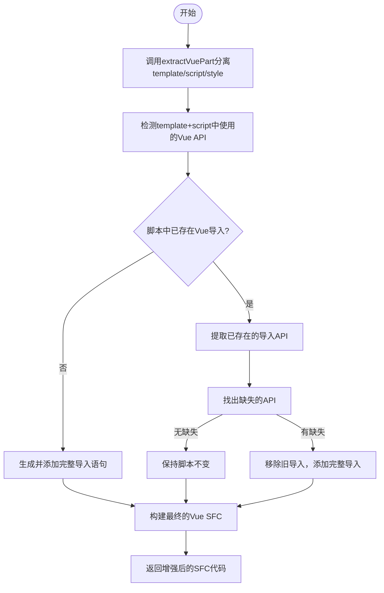
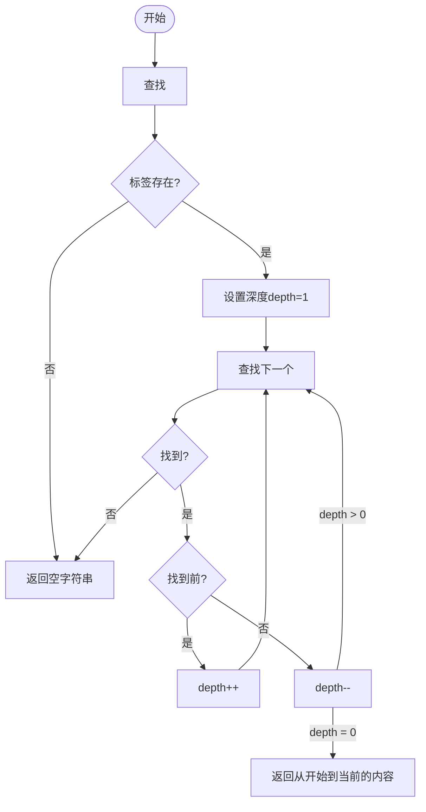
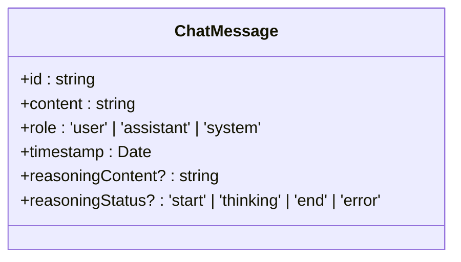
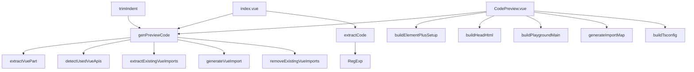

# 代码解析与安全校验

<cite>
**本文档引用的文件**  
- [code.ts](file://shared/utils/code.ts#L1-L395)
- [chat.ts](file://app/types/chat.ts#L8-L19)
- [CodePreview.vue](file://app/components/CodePreview.vue#L54)
- [index.vue](file://app/pages/chat/index.vue#L296)
</cite>

## 目录
1. [简介](#简介)
2. [项目结构](#项目结构)
3. [核心组件](#核心组件)
4. [架构概览](#架构概览)
5. [详细组件分析](#详细组件分析)
6. [依赖分析](#依赖分析)
7. [性能考量](#性能考量)
8. [故障排除指南](#故障排除指南)
9. [结论](#结论)

## 简介
本文档系统性地文档化 `shared/utils/code.ts` 中提供的代码解析与安全处理工具函数。重点说明 `parseCodeBlocks`（在代码中体现为 `extractCode`）如何从AI返回的Markdown格式响应中提取 ```language ... ``` 代码块，并识别多语言片段。解释 `sanitizeCode`（在代码中体现为 `genPreviewCode` 的安全增强逻辑）如何执行安全过滤，防止恶意脚本注入，确保在前端执行或显示代码前满足安全标准。描述 `extractVueSFC`（在代码中体现为 `extractVuePart`）对Vue单文件组件的结构化解析能力，支持 `template`/`script`/`style` 分离预览。结合 `app/types/chat.ts` 中的类型定义，说明代码块元数据（如语言类型、文件名建议）的传递与校验机制，确保前后端类型安全。

## 项目结构
项目采用典型的Nuxt 3分层架构，主要分为 `app`（前端应用）、`server`（后端API）、`shared`（共享工具）三大模块。`shared/utils/code.ts` 位于共享层，提供跨前后端的代码处理工具。`app/types/chat.ts` 定义了聊天消息的数据结构，`app/components/CodePreview.vue` 和 `app/pages/chat/index.vue` 是前端主要的UI组件，负责调用这些工具函数。



**图示来源**
- [index.vue](file://app/pages/chat/index.vue)
- [CodePreview.vue](file://app/components/CodePreview.vue)
- [chat.ts](file://app/types/chat.ts)
- [code.ts](file://shared/utils/code.ts)

**本节来源**
- [project_structure](file://#L1-L30)

## 核心组件
核心组件包括 `extractCode`、`genPreviewCode`、`extractVuePart` 等函数，它们共同构成了代码解析与安全处理的核心逻辑。`extractCode` 负责从Markdown文本中提取代码块，`extractVuePart` 负责解析Vue SFC结构，`genPreviewCode` 则负责生成可安全预览的代码。

**本节来源**
- [code.ts](file://shared/utils/code.ts#L17-L271)

## 架构概览
系统架构围绕聊天界面展开。用户与AI交互，AI返回包含代码的Markdown消息。前端通过 `ChatMessage` 类型接收消息，利用 `extractCode` 提取代码块，再通过 `genPreviewCode` 生成可预览的安全代码，最终在 `CodePreview.vue` 组件中使用Vue Repl进行实时预览。



**图示来源**
- [index.vue](file://app/pages/chat/index.vue#L296)
- [code.ts](file://shared/utils/code.ts#L158)
- [CodePreview.vue](file://app/components/CodePreview.vue#L54)

## 详细组件分析
### extractCode 函数分析
`extractCode` 函数是代码解析的入口，负责从AI返回的Markdown文本中精确提取指定语言的代码块。

#### 功能逻辑流程图


**图示来源**
- [code.ts](file://shared/utils/code.ts#L17-L41)

**本节来源**
- [code.ts](file://shared/utils/code.ts#L17-L41)

### genPreviewCode 函数分析
`genPreviewCode` 函数是安全校验与代码增强的核心，它不仅解析Vue SFC，还智能地管理Vue API的导入，确保代码可直接运行。

#### Vue API 智能导入逻辑


**图示来源**
- [code.ts](file://shared/utils/code.ts#L158-L208)

**本节来源**
- [code.ts](file://shared/utils/code.ts#L158-L208)

### extractVuePart 函数分析
`extractVuePart` 函数负责结构化解析Vue单文件组件，其核心是通过精确的标签匹配算法处理嵌套标签。

#### 标签提取算法流程


**图示来源**
- [code.ts](file://shared/utils/code.ts#L215-L271)

**本节来源**
- [code.ts](file://shared/utils/code.ts#L215-L271)

### ChatMessage 类型分析
`ChatMessage` 类型定义了聊天消息的数据结构，是代码块元数据传递的基础。

#### 类型结构图


**图示来源**
- [chat.ts](file://app/types/chat.ts#L8-L19)

**本节来源**
- [chat.ts](file://app/types/chat.ts#L8-L19)

## 依赖分析
`shared/utils/code.ts` 是一个高内聚的工具模块，其内部函数相互依赖，共同完成代码处理任务。外部依赖主要来自 `#shared/utils/string` 的 `trimIndent` 函数。前端组件 `CodePreview.vue` 和 `index.vue` 依赖此模块的多个导出函数，形成清晰的调用链。



**图示来源**
- [code.ts](file://shared/utils/code.ts)
- [CodePreview.vue](file://app/components/CodePreview.vue)
- [index.vue](file://app/pages/chat/index.vue)

**本节来源**
- [code.ts](file://shared/utils/code.ts)
- [CodePreview.vue](file://app/components/CodePreview.vue)
- [index.vue](file://app/pages/chat/index.vue)

## 性能考量
`extractCode` 和 `extractVuePart` 使用正则表达式和字符串索引查找，时间复杂度为O(n)，在处理大型代码块时表现良好。`detectUsedVueApis` 对预定义的API列表进行遍历和正则匹配，由于API列表固定且较小，其开销可忽略。`genPreviewCode` 的主要开销在于字符串拼接，但因其处理的是单个组件代码，性能影响有限。整体而言，这些工具函数设计简洁，性能高效，适合在前端实时调用。

## 故障排除指南
- **问题：无法提取代码块**  
  **原因**：AI返回的响应可能未使用标准的 ``` 包裹代码，或语言标识符不匹配。  
  **解决方案**：检查 `content` 字段是否包含正确的Markdown代码块语法。

- **问题：预览代码缺少Vue API导入**  
  **原因**：`detectUsedVueApis` 的正则匹配可能因代码格式问题而失败。  
  **解决方案**：确保代码中API调用使用标准的 `ref()`、`reactive()` 等语法，避免在字符串中误匹配。

- **问题：预览组件无法加载**  
  **原因**：`generateImportMap` 中的CDN链接版本号可能过期或网络不可达。  
  **解决方案**：检查 `elementPlusVersion`、`vueVersion` 等常量是否为有效版本号，并确保网络连接正常。

**本节来源**
- [code.ts](file://shared/utils/code.ts)
- [CodePreview.vue](file://app/components/CodePreview.vue)

## 结论
`shared/utils/code.ts` 模块提供了一套完整、安全且智能的代码解析与处理方案。通过 `extractCode` 实现了从Markdown中精准提取代码的能力，通过 `extractVuePart` 和 `genPreviewCode` 实现了对Vue SFC的深度解析与安全增强，特别是其自动管理Vue API导入的特性，极大地提升了开发者体验。结合 `ChatMessage` 类型，整个系统实现了从前端消息展示到代码提取、再到安全预览的无缝闭环，为AI生成代码的应用场景提供了坚实的技术基础。