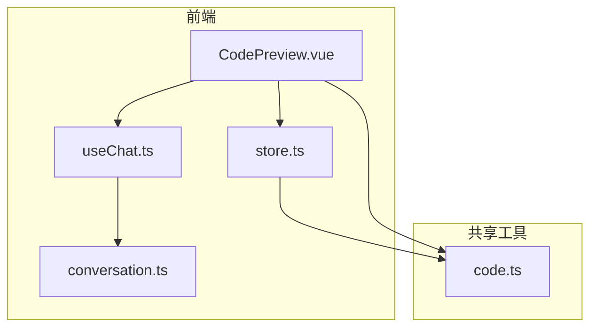
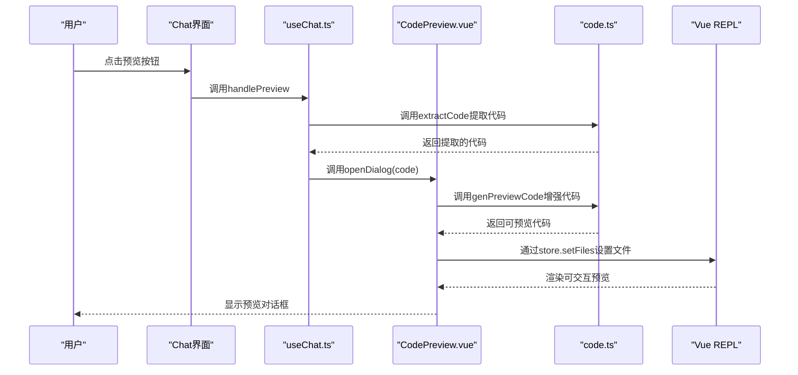
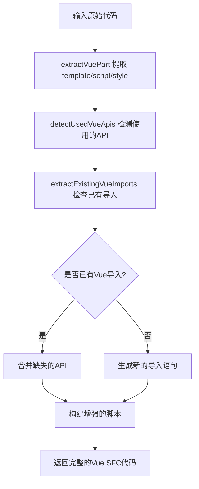
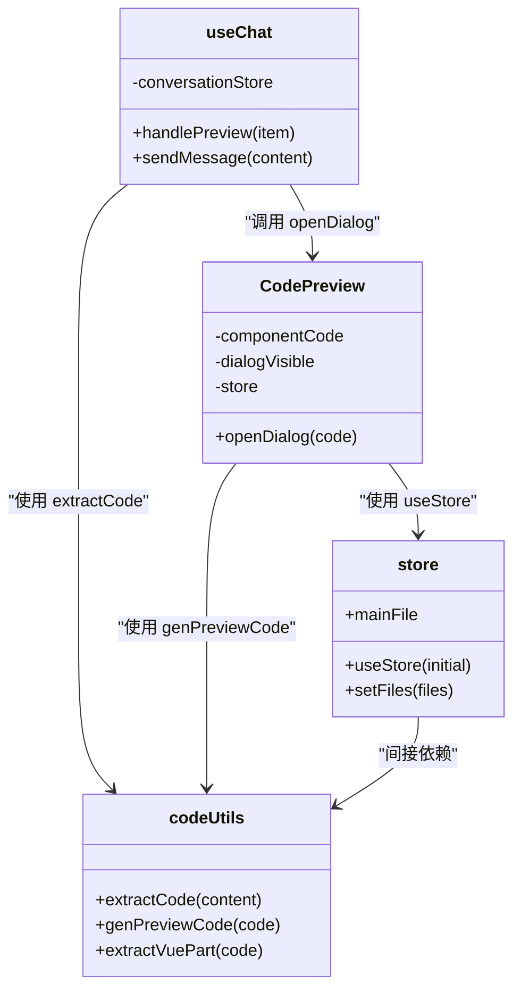

# 实时代码预览

<cite>
**本文档引用的文件**   
- [CodePreview.vue](file://app/components/CodePreview.vue)
- [code.ts](file://shared/utils/code.ts)
- [useChat.ts](file://app/composables/useChat.ts)
- [store.ts](file://app/composables/store.ts)
</cite>

## 目录
1. [项目结构](#项目结构)
2. [核心组件](#核心组件)
3. [架构概述](#架构概述)
4. [详细组件分析](#详细组件分析)
5. [依赖分析](#依赖分析)
6. [性能考虑](#性能考虑)
7. [故障排除指南](#故障排除指南)

## 项目结构

本项目采用基于Nuxt的分层架构，主要分为以下几个模块：

- `app/components`：存放可复用的UI组件，如`CodePreview.vue`
- `app/composables`：组合式函数，封装可复用的逻辑，如`useChat.ts`和`store.ts`
- `shared/utils`：跨项目共享的工具函数，如代码解析与安全校验
- `app/stores`：状态管理模块，使用Pinia管理会话状态
- `app/pages`：页面路由组件，如聊天主界面



**图示来源**
- [CodePreview.vue](file://app/components/CodePreview.vue)
- [useChat.ts](file://app/composables/useChat.ts)
- [store.ts](file://app/composables/store.ts)
- [code.ts](file://shared/utils/code.ts)

**本节来源**
- [CodePreview.vue](file://app/components/CodePreview.vue)
- [useChat.ts](file://app/composables/useChat.ts)

## 核心组件

`CodePreview.vue` 是实现**实时代码预览**功能的核心组件。它通过集成Vue REPL（Read-Eval-Print Loop）技术栈，实现了对AI生成代码的即时渲染与交互式预览。

该组件接收由AI生成的代码字符串，利用`genPreviewCode`工具函数进行预处理，然后通过Vue REPL的`Repl`组件在沙箱环境中运行，最终在对话框中展示可交互的组件实例。

**本节来源**
- [CodePreview.vue](file://app/components/CodePreview.vue#L0-L81)
- [code.ts](file://shared/utils/code.ts#L0-L199)

## 架构概述

实时代码预览功能的实现依赖于多个组件的协同工作，其整体架构如下：



**图示来源**
- [CodePreview.vue](file://app/components/CodePreview.vue)
- [useChat.ts](file://app/composables/useChat.ts)
- [code.ts](file://shared/utils/code.ts)

## 详细组件分析

### CodePreview.vue 分析

`CodePreview.vue` 是一个基于Vue 3的组合式API组件，其主要职责是提供一个可复用的代码预览对话框。

#### 组件初始化与状态管理

组件通过`useStore`初始化一个Vue REPL的存储实例，用于管理预览环境中的文件、编译器状态和依赖项。

```vue
<script setup lang="ts">
const store = useStore({
  serializedState: location.hash.slice(1),
  initialized: () => {
    loading.value = false;
  },
});
</script>
```

#### 代码预览逻辑

组件通过`openDialog`方法接收外部传入的代码，并触发预览流程：

1. 调用`genPreviewCode`对原始代码进行增强处理
2. 将处理后的代码设置到`store`中
3. 显示预览对话框

```mermaid
flowchart TD
A[调用 openDialog(code)] --> B[componentCode.value = genPreviewCode(code)]
B --> C[dialogVisible.value = true]
C --> D[watch 触发]
D --> E[store.setFiles 设置文件]
E --> F[Vue REPL 渲染预览]
```

**图示来源**
- [CodePreview.vue](file://app/components/CodePreview.vue#L48-L80)

**本节来源**
- [CodePreview.vue](file://app/components/CodePreview.vue#L0-L81)

### shared/utils/code.ts 分析

该文件提供了代码解析与安全校验的核心工具函数。

#### extractCode 函数

从包含代码块的文本中提取指定语言的代码内容。

```typescript
export const extractCode = (
  content: string,
  language?: string,
  index: number = 0,
): string => {
  const codeRegex = language
    ? new RegExp(`\`\`\`${language}[\\s\\S]*?\`\`\``, 'g')
    : /```[\s\S]*?```/g;
  // ... 提取逻辑
};
```

#### genPreviewCode 函数

创建可预览的代码，自动检测并补充缺失的Vue API导入。



**图示来源**
- [code.ts](file://shared/utils/code.ts#L115-L160)

**本节来源**
- [code.ts](file://shared/utils/code.ts#L0-L394)

### useChat.ts 分析

`useChat.ts` 是聊天功能的组合式函数，负责处理AI响应并触发预览更新。

#### handlePreview 函数

这是从聊天消息到代码预览的关键调用链。

```typescript
const handlePreview = (item: ChatMessage): void => {
  if (item.role !== 'assistant') return;
  const sourceCode = extractCode(item.content);
  if (sourceCode) {
    previewRef.value?.openDialog(sourceCode);
  } else {
    ElMessage.warning('未提取到组件源码');
  }
};
```

该函数首先检查消息是否来自AI助手，然后使用`extractCode`从消息内容中提取代码块，最后通过`previewRef`调用`CodePreview`组件的`openDialog`方法。

**本节来源**
- [useChat.ts](file://app/composables/useChat.ts#L312-L361)
- [code.ts](file://shared/utils/code.ts#L0-L41)

## 依赖分析

实时代码预览功能依赖于多个关键模块，其依赖关系如下：



**图示来源**
- [CodePreview.vue](file://app/components/CodePreview.vue)
- [useChat.ts](file://app/composables/useChat.ts)
- [code.ts](file://shared/utils/code.ts)
- [store.ts](file://app/composables/store.ts)

**本节来源**
- [CodePreview.vue](file://app/components/CodePreview.vue)
- [useChat.ts](file://app/composables/useChat.ts)
- [code.ts](file://shared/utils/code.ts)
- [store.ts](file://app/composables/store.ts)

## 性能考虑

为确保大型代码文件的预览性能，建议采取以下优化措施：

1. **虚拟滚动**：对于包含大量代码行的文件，应在编辑器中启用虚拟滚动，避免一次性渲染所有行。
2. **代码分割**：对于复杂的Vue组件，可以考虑将`template`、`script`、`style`部分拆分为独立文件，按需加载。
3. **防抖处理**：在代码更新时，对`store.setFiles`操作进行防抖，避免频繁的编译和渲染。
4. **错误边界**：在`Repl`组件外层包裹错误边界，防止预览环境中的JavaScript错误导致整个应用崩溃。

## 故障排除指南

### 常见问题

1. **预览对话框无法打开**
   - 检查`previewRef`是否正确绑定
   - 确认`handlePreview`函数接收到的消息角色为`assistant`

2. **代码无法正确高亮或运行**
   - 检查`genPreviewCode`是否正确补充了Vue API导入
   - 确认`import-map.json`中的依赖版本是否正确

3. **XSS安全风险**
   - `extractCode`函数通过正则表达式严格匹配代码块，避免执行非代码内容
   - Vue REPL在沙箱环境中运行，隔离了潜在的恶意代码

**本节来源**
- [code.ts](file://shared/utils/code.ts#L0-L41)
- [CodePreview.vue](file://app/components/CodePreview.vue#L0-L81)