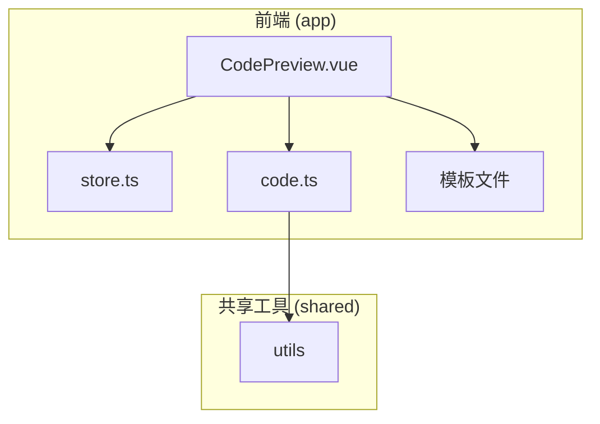
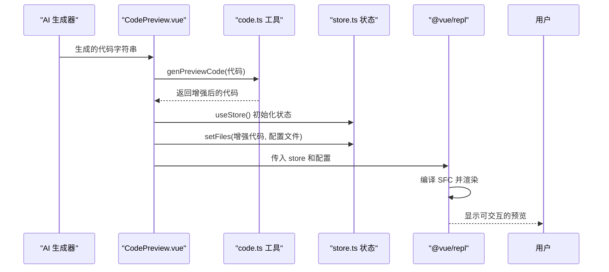
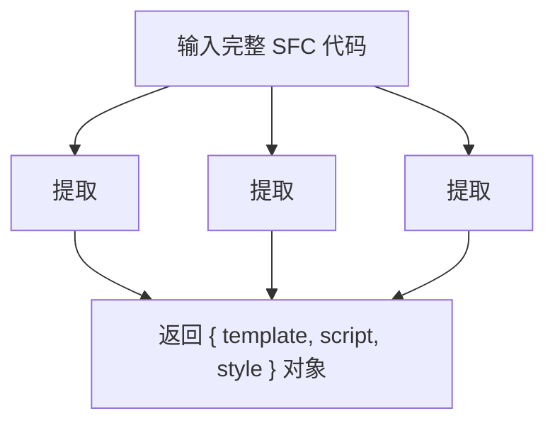
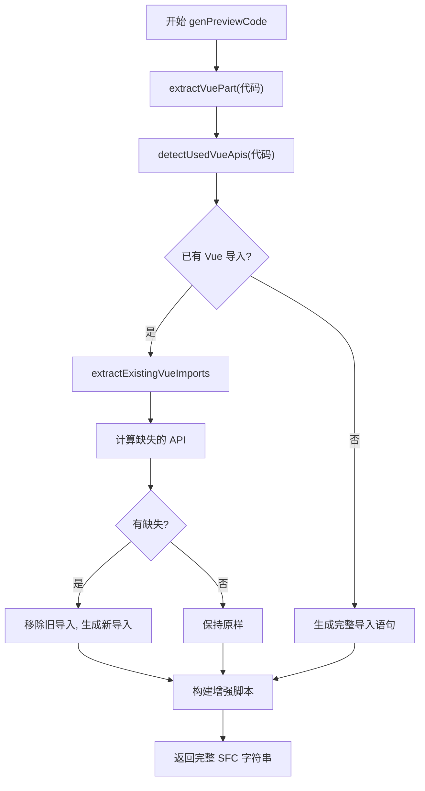

# 预览渲染机制

<cite>
**本文档引用的文件**  
- [CodePreview.vue](file://app/components/CodePreview.vue)
- [code.ts](file://shared/utils/code.ts)
- [store.ts](file://app/composables/store.ts)
- [main.vue](file://app/template/main.vue)
- [element-plus.js](file://app/template/element-plus.js)
- [tsconfig.json](file://app/template/tsconfig.json)
</cite>

## 目录
1. [简介](#简介)
2. [项目结构](#项目结构)
3. [核心组件](#核心组件)
4. [架构概览](#架构概览)
5. [详细组件分析](#详细组件分析)
6. [依赖分析](#依赖分析)
7. [性能考虑](#性能考虑)
8. [故障排除指南](#故障排除指南)
9. [结论](#结论)

## 简介
本文档深入分析 `CodePreview.vue` 组件的渲染流程，重点阐述其如何接收 AI 生成的代码字符串，并通过集成 `@vue/repl` 实现安全、可交互的 Vue 组件预览。文档详细说明了组件如何自动处理 Vue API 导入、构建完整的运行时环境、确保代码安全性，并支持主题切换与大型代码块的性能优化。

## 项目结构
项目采用基于功能的模块化结构，主要分为 `app`（应用逻辑）、`shared`（共享工具）、`server`（后端 API）和 `public`（静态资源）四大目录。`CodePreview.vue` 位于 `app/components` 目录下，是前端用于预览 AI 生成代码的核心组件。其依赖的代码处理工具函数位于 `shared/utils/code.ts`，状态管理逻辑位于 `app/composables/store.ts`。



**图示来源**  
- [CodePreview.vue](file://app/components/CodePreview.vue)
- [code.ts](file://shared/utils/code.ts)
- [store.ts](file://app/composables/store.ts)

**本节来源**  
- [CodePreview.vue](file://app/components/CodePreview.vue)
- [project_structure](file://project_structure)

## 核心组件
`CodePreview.vue` 的核心功能是作为一个对话框容器，利用 `@vue/repl` 组件动态加载和渲染由 AI 生成的 Vue 代码。它通过 `openDialog` 方法接收外部传入的代码字符串，经过预处理后，在一个隔离的沙箱环境中进行实时编译和展示。

**本节来源**  
- [CodePreview.vue](file://app/components/CodePreview.vue#L1-L81)

## 架构概览
`CodePreview.vue` 的工作流程是一个典型的“接收-预处理-配置-渲染”模式。它不直接进行语法高亮或 DOM 渲染，而是作为协调者，将 AI 生成的代码交给 `@vue/repl` 这个专业的在线 REPL（Read-Eval-Print Loop）引擎来处理。`@vue/repl` 内部集成了 Monaco 编辑器（提供语法高亮、智能提示）和 Vue 编译器（负责 SFC 编译），从而实现了完整的开发环境模拟。



**图示来源**  
- [CodePreview.vue](file://app/components/CodePreview.vue#L1-L81)
- [code.ts](file://shared/utils/code.ts#L158-L208)
- [store.ts](file://app/composables/store.ts#L1-L295)

## 详细组件分析

### CodePreview.vue 组件分析
`CodePreview.vue` 是一个 `<script setup>` 风格的 Vue 3 组件，其主要职责是提供一个用户界面来展示 `@vue/repl` 的渲染结果。

#### 组件初始化与状态管理
组件通过 `useStore` 函数（来自 `store.ts`）创建一个持久化的 REPL 状态仓库。这个仓库管理着所有文件（代码、配置）、编译器版本和错误信息。

```typescript
const store = useStore({
  serializedState: location.hash.slice(1), // 支持从 URL 恢复状态
  initialized: () => {
    loading.value = false; // 初始化完成后隐藏加载动画
  },
});
```

**本节来源**  
- [CodePreview.vue](file://app/components/CodePreview.vue#L15-L20)

#### 代码预处理与文件注入
组件的核心逻辑在于 `watch` 监听器。每当 `componentCode`（从 `openDialog` 接收）发生变化时，它会调用 `genPreviewCode` 函数对原始代码进行增强，然后将生成的文件（包括主组件、Element Plus 配置、主入口文件等）注入到 `store` 中。

```typescript
watch(
  componentCode,
  () => {
    if (!componentCode.value) return;

    store.setFiles({
      'src/App.vue': componentCode.value, // 注入用户代码
      'src/element-plus.js': buildElementPlusSetup(elementPlusVersion), // 注入 UI 库配置
      'src/PlaygroundMain.vue': buildPlaygroundMain(), // 注入主入口
      'import-map.json': JSON.stringify(generateImportMap(...)), // 注入依赖映射
      'tsconfig.json': buildTsconfig(), // 注入 TypeScript 配置
    });

    store.mainFile = 'src/PlaygroundMain.vue'; // 设置主文件
    store.activeFilename = 'src/App.vue'; // 设置活动文件
  },
  { immediate: true }
);
```

**本节来源**  
- [CodePreview.vue](file://app/components/CodePreview.vue#L22-L59)

#### 用户界面与交互
组件使用 `el-dialog`（Element Plus 对话框）作为容器，通过 `Repl` 组件（来自 `@vue/repl`）进行渲染。`previewOptions` 中的 `headHTML` 由 `buildHeadHtml` 函数生成，用于在预览环境中加载 Element Plus 的 CSS 样式。

```vue
<template>
  <el-dialog v-model="dialogVisible" title="组件预览" ...>
    <div style="height: 70vh; overflow: hidden">
      <Repl
        :preview-theme="true"
        :store="store"
        :editor="Monaco"
        :preview-options="previewOptions"
      />
    </div>
  </el-dialog>
</template>
```

**本节来源**  
- [CodePreview.vue](file://app/components/CodePreview.vue#L61-L79)

### 代码预处理机制分析
`shared/utils/code.ts` 文件中的工具函数是确保 AI 生成代码可运行的关键。

#### Vue 组件结构提取
`extractVuePart` 函数使用基于字符串索引和嵌套深度计算的算法，精确地从单文件组件（SFC）字符串中提取出 `<template>`、`<script setup>` 和 `<style scoped>` 三个部分的内容，有效避免了正则表达式在处理嵌套标签时的局限性。



**图示来源**  
- [code.ts](file://shared/utils/code.ts#L215-L271)

#### Vue API 自动导入
`genPreviewCode` 函数是预处理的核心。它首先调用 `detectUsedVueApis`，该函数通过遍历预定义的 `VUE_APIS` 列表（如 `ref`, `reactive`, `computed` 等），并使用 `\b` 边界匹配的正则表达式来检测代码中实际使用了哪些 API。

```typescript
const VUE_APIS = ['ref', 'reactive', 'computed', ...]; // 支持超过 30 个 API
```

接着，它检查原始代码中是否已存在 `import { ... } from 'vue'` 语句。如果存在，则调用 `extractExistingVueImports` 解析出已导入的 API，然后合并缺失的 API；如果不存在，则直接生成一个包含所有必需 API 的导入语句，并将其插入到脚本开头。



**图示来源**  
- [code.ts](file://shared/utils/code.ts#L158-L208)
- [code.ts](file://shared/utils/code.ts#L91-L104)
- [code.ts](file://shared/utils/code.ts#L46-L65)

#### 运行时环境构建
`buildPlaygroundMain` 函数生成一个简单的主入口文件，它导入用户组件 `App.vue` 和 `element-plus.js`，并调用 `setupElementPlus()` 来全局注册 Element Plus 组件，确保预览环境的 UI 库正常工作。

```typescript
export const buildPlaygroundMain = () => {
  return `
<script setup>
import App from './App.vue'
import { setupElementPlus } from './element-plus.js'
setupElementPlus()
</script>

<template>
  <App />
</template>
`;
};
```

`buildHeadHtml` 和 `generateImportMap` 函数则负责构建预览环境的 HTML 头部和模块导入映射，确保所有依赖（Vue, Element Plus, TypeScript）都能通过 CDN 正确加载。

**本节来源**  
- [code.ts](file://shared/utils/code.ts#L327-L371)
- [main.vue](file://app/template/main.vue)
- [element-plus.js](file://app/template/element-plus.js)

## 依赖分析
`CodePreview.vue` 的功能依赖于一个精心设计的依赖链。

```mermaid
graph LR
CP[CodePreview.vue] --> REPL[@vue/repl]
CP --> CU[code.ts]
CP --> ST[store.ts]
CU --> ST
ST --> REPL
CU --> TM[模板文件]
ST --> TM
```

**图示来源**  
- [CodePreview.vue](file://app/components/CodePreview.vue)
- [code.ts](file://shared/utils/code.ts)
- [store.ts](file://app/composables/store.ts)

**本节来源**  
- [CodePreview.vue](file://app/components/CodePreview.vue)
- [code.ts](file://shared/utils/code.ts)
- [store.ts](file://app/composables/store.ts)

## 性能考虑
虽然 `CodePreview.vue` 本身没有实现懒加载或虚拟滚动，但其依赖的 `@vue/repl` 引擎在设计上是高效的。它利用 Monaco 编辑器的增量编译和 Web Worker 进行后台编译，避免了阻塞主线程。对于大型代码块，其性能主要由 `@vue/repl` 的内部优化决定。`watch` 监听器使用了 `immediate: true` 选项，确保状态变化能立即响应，同时 `useDebounceFn` 在 `store.ts` 中被用于防抖编译请求，防止过于频繁的编译操作。

**本节来源**  
- [store.ts](file://app/composables/store.ts#L150-L153)

## 故障排除指南
- **问题：预览窗口空白或报错。**
  - **检查：** 确认 AI 生成的代码是有效的 Vue SFC 格式。
  - **检查：** 查看浏览器开发者工具的控制台，是否有来自 `@vue/repl` 的编译错误。
- **问题：Element Plus 组件样式不生效。**
  - **检查：** 确认 `buildHeadHtml` 函数生成的 CDN 链接是否有效。
  - **检查：** `element-plus.js` 文件中的 `loadStyle` 函数是否成功执行。
- **问题：某些 Vue API 报错未定义。**
  - **检查：** `genPreviewCode` 函数的 `detectUsedVueApis` 是否正确识别了 API。确认 `VUE_APIS` 列表是否完整。

**本节来源**  
- [code.ts](file://shared/utils/code.ts#L91-L104)
- [code.ts](file://shared/utils/code.ts#L327-L344)
- [element-plus.js](file://app/template/element-plus.js)

## 结论
`CodePreview.vue` 组件通过巧妙地组合 `@vue/repl` 的强大功能与自定义的代码预处理逻辑，成功实现了对 AI 生成代码的安全、可靠预览。其核心价值在于 `genPreviewCode` 函数，它解决了 AI 代码片段不完整的问题，通过自动检测和注入 Vue API 导入，极大地提升了代码的可运行性。整个架构清晰、职责分明，前端组件负责 UI 和协调，共享工具负责代码处理，状态管理负责持久化，共同构建了一个健壮的代码预览系统。