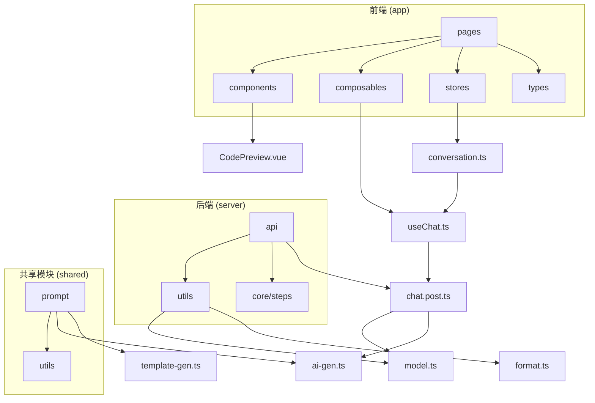
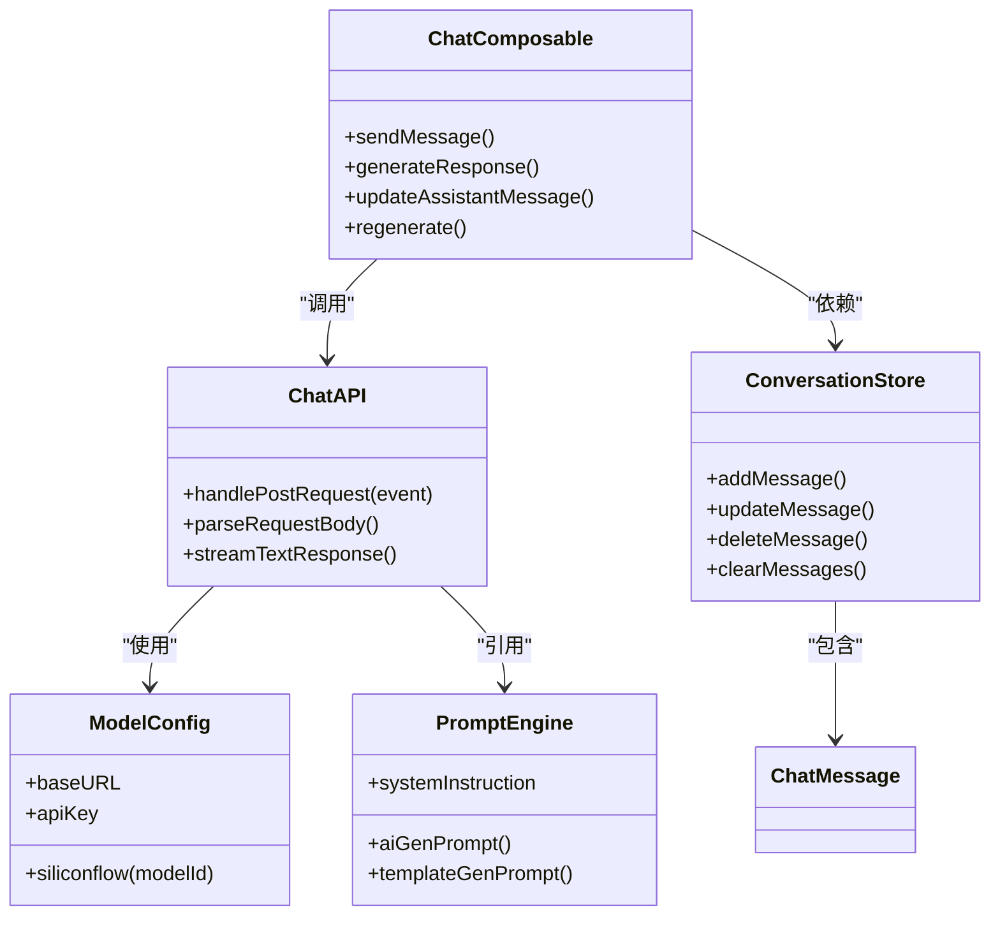
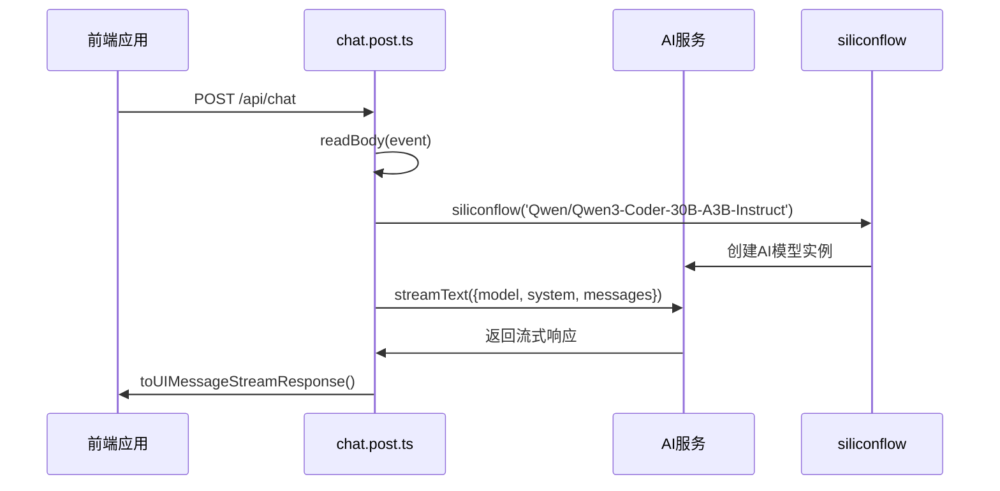
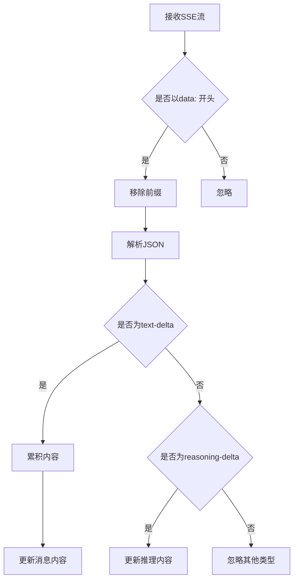
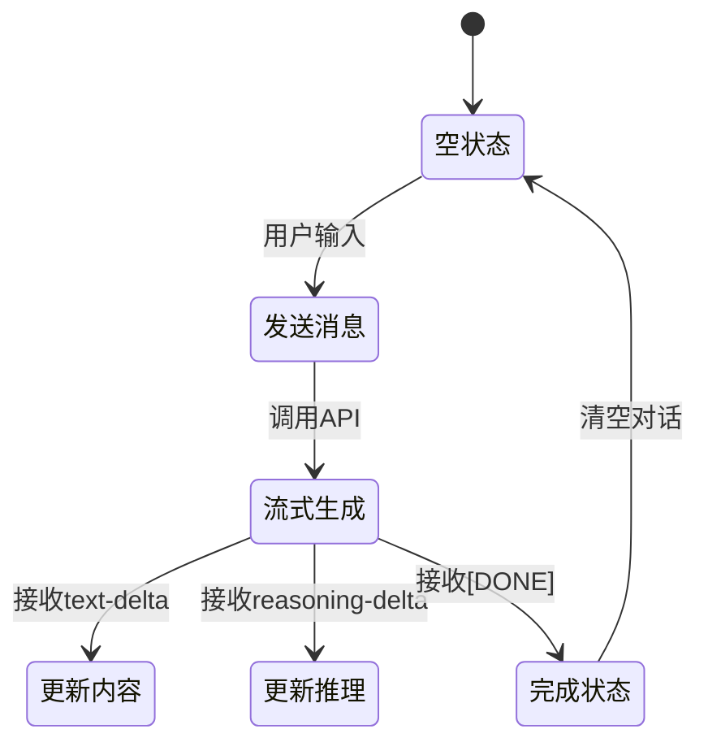

# API集成与服务调用

<cite>
**本文档引用的文件**  
- [chat.post.ts](file://server/api/chat.post.ts)
- [model.ts](file://server/utils/model.ts)
- [format.ts](file://server/utils/format.ts)
- [useChat.ts](file://app/composables/useChat.ts)
- [ai-gen.ts](file://shared/prompt/ai-gen.ts)
- [template-gen.ts](file://shared/prompt/template-gen.ts)
- [chat.ts](file://app/types/chat.ts)
- [conversation.ts](file://app/stores/conversation.ts)
- [index.vue](file://app/pages/chat/index.vue)
</cite>

## 目录
1. [项目结构分析](#项目结构分析)
2. [核心组件分析](#核心组件分析)
3. [API接口实现与请求处理](#api接口实现与请求处理)
4. [模型配置与AI服务集成](#模型配置与ai服务集成)
5. [响应格式化与流式处理](#响应格式化与流式处理)
6. [错误处理与异常恢复](#错误处理与异常恢复)
7. [提示词工程与代码生成规范](#提示词工程与代码生成规范)
8. [前端交互与状态管理](#前端交互与状态管理)
9. [性能与可靠性机制](#性能与可靠性机制)
10. [常见问题与排查指南](#常见问题与排查指南)

## 项目结构分析

本项目采用Nuxt 3框架构建，采用分层架构设计，主要分为前端（app）、后端API（server）和共享模块（shared）三大部分。



**图示来源**  
- [chat.post.ts](file://server/api/chat.post.ts)
- [useChat.ts](file://app/composables/useChat.ts)
- [model.ts](file://server/utils/model.ts)
- [ai-gen.ts](file://shared/prompt/ai-gen.ts)

**本节来源**  
- [chat.post.ts](file://server/api/chat.post.ts)
- [useChat.ts](file://app/composables/useChat.ts)

## 核心组件分析

系统核心由API接口、模型配置、提示词工程和前端交互四大部分构成，通过清晰的职责划分实现AI代码生成服务。



**图示来源**  
- [chat.post.ts](file://server/api/chat.post.ts)
- [model.ts](file://server/utils/model.ts)
- [ai-gen.ts](file://shared/prompt/ai-gen.ts)
- [useChat.ts](file://app/composables/useChat.ts)
- [conversation.ts](file://app/stores/conversation.ts)

**本节来源**  
- [chat.post.ts](file://server/api/chat.post.ts)
- [model.ts](file://server/utils/model.ts)
- [ai-gen.ts](file://shared/prompt/ai-gen.ts)
- [useChat.ts](file://app/composables/useChat.ts)

## API接口实现与请求处理

### POST接口路由配置

`chat.post.ts`文件定义了`/api/chat`的POST接口，采用Nuxt的懒加载事件处理器实现，确保按需加载。

```typescript
export default defineLazyEventHandler(async () => {
  return defineEventHandler(async (event: any) => {
    const { messages } = await readBody(event);
    // ...
  });
});
```

该接口通过`defineLazyEventHandler`实现延迟加载，仅在首次请求时初始化，提升应用启动性能。

### 请求体解析流程

接口通过`readBody(event)`解析请求体，期望接收包含`messages`字段的JSON对象：

```json
{
  "messages": [
    {
      "role": "user",
      "content": "请生成一个按钮组件"
    }
  ]
}
```

消息数组遵循标准的对话格式，包含角色（role）和内容（content）两个必填字段。

### AI服务调用流程



**图示来源**  
- [chat.post.ts](file://server/api/chat.post.ts)
- [model.ts](file://server/utils/model.ts)

**本节来源**  
- [chat.post.ts](file://server/api/chat.post.ts#L0-L24)

## 模型配置与AI服务集成

### 模型封装机制

`model.ts`文件通过`@ai-sdk/openai-compatible`创建与OpenAI兼容的AI服务客户端，实现对SiliconFlow平台的适配。

```typescript
export const siliconflow = createOpenAICompatible<
  SiliconflowChatModelIds,
  SiliconflowCompletionModelIds,
  SiliconflowEmbeddingModelIds,
  SiliconflowImageModelIds
>({
  baseURL: useRuntimeConfig().siliconFlowApiUrl,
  apiKey: useRuntimeConfig().siliconFlowApiKey,
  name: 'siliconflow',
});
```

### 供应商适配逻辑

系统通过`createOpenAICompatible`函数实现供应商抽象，将SiliconFlow API封装为标准的AI SDK接口，支持以下特性：

- **统一接口**：提供与OpenAI兼容的API调用方式
- **配置注入**：从运行时配置（runtime config）读取API地址和密钥
- **类型安全**：通过泛型约束支持的模型ID类型

### 支持的模型列表

```typescript
type SiliconflowChatModelIds =
  | 'deepseek-ai/DeepSeek-R1'
  | 'deepseek-ai/DeepSeek-V3.1'
  | 'Qwen/Qwen2.5-72B-Instruct-128K'
  | 'Qwen/Qwen3-Coder-480B-A35B-Instruct'
  | 'Qwen/Qwen3-Coder-30B-A3B-Instruct';
```

当前接口默认使用`Qwen/Qwen3-Coder-30B-A3B-Instruct`模型，专为代码生成任务优化。

### 参数标准化

虽然当前实现未显式设置temperature、maxTokens等参数，但可通过`streamText`函数的options参数进行标准化配置：

```typescript
const result = streamText({
  model: siliconflow('Qwen/Qwen3-Coder-30B-A3B-Instruct'),
  system: templateGenPrompt(),
  messages,
  temperature: 0.7,
  maxTokens: 2048
});
```

**本节来源**  
- [model.ts](file://server/utils/model.ts#L0-L33)

## 响应格式化与流式处理

### 流式响应机制

系统采用`streamText`和`toUIMessageStreamResponse`实现流式响应，确保用户能够实时看到AI生成的内容。

```typescript
return result.toUIMessageStreamResponse();
```

该方法将AI的流式输出转换为前端友好的消息流格式，支持SSE（Server-Sent Events）。

### 前端流式处理

`useChat.ts`中的`generateResponse`函数处理流式响应：

```typescript
const reader = response.body?.getReader();
const decoder = new TextDecoder();
let accumulatedContent = '';

while (true) {
  const { done, value } = await reader.read();
  if (done) break;

  const chunk = decoder.decode(value, { stream: true });
  const lines = chunk.split('\n');

  for (const line of lines) {
    if (line.startsWith('data: ') && !line.includes('[DONE]')) {
      const jsonStr = line.slice(6);
      const data = JSON.parse(jsonStr);

      if (data.type === 'text-delta' && data.delta) {
        accumulatedContent += data.delta;
        updateAssistantMessage(assistantMessageId, accumulatedContent);
      }
    }
  }
}
```

### 响应数据格式

流式响应遵循以下格式：
```
data: {"type":"text-delta","delta":"生成的代码片段"}
data: {"type":"reasoning-delta","delta":"思考过程"}
data: [DONE]
```

### 结构化清洗过程

虽然`format.ts`文件当前为空，但实际的格式化工作在前端完成，包括：

- 移除`data: `前缀
- 解析JSON数据
- 累积文本片段
- 实时更新UI



**图示来源**  
- [useChat.ts](file://app/composables/useChat.ts#L134-L170)
- [chat.post.ts](file://server/api/chat.post.ts)

**本节来源**  
- [useChat.ts](file://app/composables/useChat.ts#L134-L170)
- [format.ts](file://server/utils/format.ts)

## 错误处理与异常恢复

### HTTP错误处理

前端在调用API时检查响应状态：

```typescript
if (!response.ok) {
  throw new Error(`HTTP error! status: ${response.status}`);
}
```

### 客户端异常处理

`useChat.ts`中的`sendMessage`函数包含完整的错误处理逻辑：

```typescript
try {
  await generateResponse(assistantMessageId);
} catch (err) {
  error.value = err instanceof Error ? err.message : '发送消息失败';
  
  // 错误恢复逻辑
  if (lastMessage?.role === 'assistant') {
    if (lastMessage.content === '') {
      conversationStore.deleteMessage(conversationId, lastMessage.id);
    } else {
      conversationStore.updateMessage(conversationId, lastMessage.id, lastMessage.content, true);
    }
  }
} finally {
  loading.value = false;
}
```

### 错误恢复策略

1. **空消息处理**：如果助手消息为空，则删除该消息
2. **非空消息处理**：保留已有内容，标记为完成状态
3. **状态重置**：确保加载状态被正确重置

### 常见错误码

| 错误码 | 含义 | 排查方法 |
|-------|------|---------|
| 400 | 请求体格式错误 | 检查messages数组格式，确保包含role和content字段 |
| 401 | 认证失败 | 检查SiliconFlow API密钥配置 |
| 429 | 请求过于频繁 | 检查限流策略，降低请求频率 |
| 502 | 后端服务错误 | 检查AI服务可用性，查看服务端日志 |
| 504 | 网关超时 | 检查网络连接，确认AI服务响应时间 |

**本节来源**  
- [useChat.ts](file://app/composables/useChat.ts#L208-L248)
- [useChat.ts](file://app/composables/useChat.ts#L286-L325)

## 提示词工程与代码生成规范

### AI生成提示词

`ai-gen.ts`定义了前端组件生成的提示词，明确要求：

```typescript
export const aiGenPrompt = () => {
  return `
你是一个专业的前端开发专家，专门负责生成高质量的Vue3 UI组件代码。
...
技术栈限定为：
- Vue3.5 (Composition API)
- JavaScript (ES6+)
- Element Plus UI组件库
- <script setup> 语法糖
...
请生成完整、可直接使用的Vue3组件代码，生成的代码使用 markdown 代码块格式包裹（\`\`\`vue）
`;
};
```

### 模板生成提示词

`template-gen.ts`定义了通用代码生成的提示词框架：

```typescript
export const templateGenPrompt = () => {
  return `
# 角色
你是一个代码生成器，你需要根据用户的需求，生成对应的代码。

# 目标
...
# 可用模板列表
- **domain**: Domain 实体类模板
- **mapper**: Mapper 接口模板
...
# 工作流程
1. 解析用户需求
2. 使用数据库相关工具解析用户需求
3. 生成对应的实体类
...
`;
};
```

### 代码生成要求

系统对生成的代码有严格要求：

- **技术栈一致性**：必须使用Vue3、Composition API、Element Plus
- **代码结构**：遵循template-script-style顺序
- **注释规范**：包含完整的JSDoc注释
- **错误处理**：实现必要的错误处理机制
- **性能优化**：考虑计算属性、监听器等性能因素
- **格式规范**：遵循ESLint规范，保持风格统一

**本节来源**  
- [ai-gen.ts](file://shared/prompt/ai-gen.ts#L0-L33)
- [template-gen.ts](file://shared/prompt/template-gen.ts#L0-L65)

## 前端交互与状态管理

### 聊天功能组合式函数

`useChat.ts`提供了完整的聊天功能：

```typescript
export const useChat = () => {
  const conversationStore = useConversationStore();
  const loading = ref(false);
  const error = ref<string | undefined>();
  const messages = computed(() => conversationStore.activeMessages);
  
  return {
    messages,
    loading: readonly(loading),
    error: readonly(error),
    sendMessage,
    regenerate,
    clearMessages,
    deleteMessage
  };
};
```

### 消息状态管理

`ChatMessage`类型定义了消息的完整结构：

```typescript
export type ChatMessage = BubbleProps & {
  id: string;
  content: string;
  role: 'user' | 'assistant' | 'system';
  timestamp: Date;
  reasoningContent?: string;
  reasoningStatus?: 'start' | 'thinking' | 'end' | 'error';
};
```

### 会话状态管理

`conversationStore`管理会话状态，提供以下方法：

- `addMessage`：添加消息
- `updateMessage`：更新消息
- `deleteMessage`：删除消息
- `clearMessages`：清空会话
- `setActiveConversation`：切换会话



**图示来源**  
- [useChat.ts](file://app/composables/useChat.ts)
- [conversation.ts](file://app/stores/conversation.ts)
- [chat.ts](file://app/types/chat.ts)

**本节来源**  
- [useChat.ts](file://app/composables/useChat.ts)
- [conversation.ts](file://app/stores/conversation.ts)

## 性能与可靠性机制

### 流式传输优势

系统采用流式传输而非一次性响应，具有以下优势：

- **低延迟**：用户可立即看到生成内容
- **内存效率**：避免在服务端累积完整响应
- **用户体验**：模拟"打字"效果，提升交互感

### 超时处理

虽然代码中未显式设置超时，但依赖的底层库可能包含默认超时机制。建议在生产环境中配置合理的超时：

```typescript
// 建议的超时配置
const controller = new AbortController();
const timeoutId = setTimeout(() => controller.abort(), 30000); // 30秒超时

const response = await fetch('/api/chat', {
  signal: controller.signal,
  // ...
});
```

### 重试机制

当前实现未包含自动重试机制，但可通过以下方式实现：

```typescript
async function fetchWithRetry(url, options, maxRetries = 3) {
  for (let i = 0; i < maxRetries; i++) {
    try {
      return await fetch(url, options);
    } catch (error) {
      if (i === maxRetries - 1) throw error;
      await new Promise(resolve => setTimeout(resolve, 1000 * (i + 1)));
    }
  }
}
```

### 限流策略

系统依赖SiliconFlow平台的限流机制，未在应用层实现额外的限流。建议在生产环境中添加：

- **客户端限流**：防止用户频繁点击发送
- **服务端限流**：基于IP或用户ID的请求频率限制
- **队列机制**：对高并发请求进行排队处理

**本节来源**  
- [pnpm-lock.yaml](file://pnpm-lock.yaml)
- [useChat.ts](file://app/composables/useChat.ts)

## 常见问题与排查指南

### 请求格式错误（400）

**问题现象**：返回400错误，提示请求体格式不正确

**排查步骤**：
1. 检查请求是否为POST方法
2. 确认Content-Type为`application/json`
3. 验证请求体包含`messages`字段
4. 确保每个消息对象包含`role`和`content`属性

**正确示例**：
```bash
curl -X POST http://localhost:3000/api/chat \
  -H "Content-Type: application/json" \
  -d '{
    "messages": [
      {
        "role": "user",
        "content": "请生成一个按钮组件"
      }
    ]
  }'
```

### 认证失败（401）

**问题现象**：返回401错误，认证失败

**排查步骤**：
1. 检查`.env`文件中`SILICON_FLOW_API_URL`和`SILICON_FLOW_API_KEY`配置
2. 确认API密钥有效且未过期
3. 验证API地址是否正确

### 响应缓慢或超时

**问题现象**：请求长时间无响应或超时

**排查步骤**：
1. 检查网络连接是否正常
2. 验证SiliconFlow服务是否可用
3. 检查模型是否过于复杂导致处理时间过长
4. 考虑优化提示词，减少生成内容长度

### 流式响应中断

**问题现象**：流式响应中途停止，内容不完整

**排查步骤**：
1. 检查服务端日志，查看是否有异常
2. 验证客户端网络连接稳定性
3. 确认AI服务未因内容安全策略中断生成
4. 检查是否达到模型的最大输出长度限制

### 前端显示异常

**问题现象**：生成的代码未正确显示或格式错误

**排查步骤**：
1. 检查`updateAssistantMessage`是否被正确调用
2. 验证消息内容是否包含正确的Markdown代码块标记
3. 确认`CodePreview.vue`组件能正确渲染代码

**本节来源**  
- [useChat.ts](file://app/composables/useChat.ts)
- [chat.post.ts](file://server/api/chat.post.ts)
- [index.vue](file://app/pages/chat/index.vue)