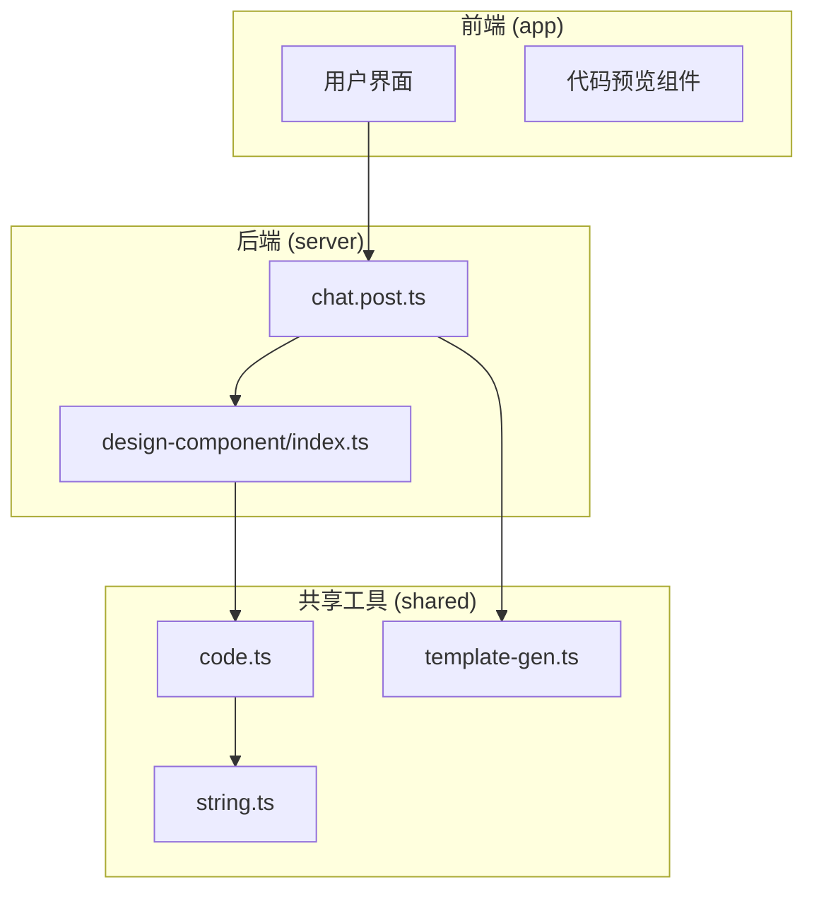
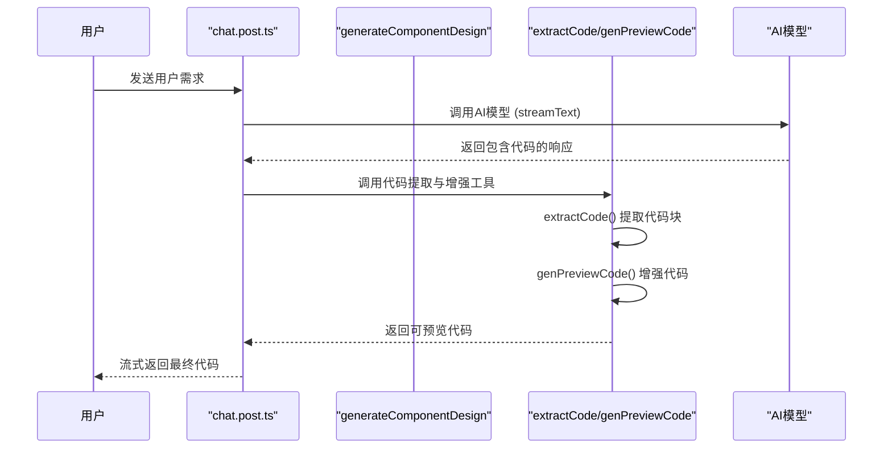
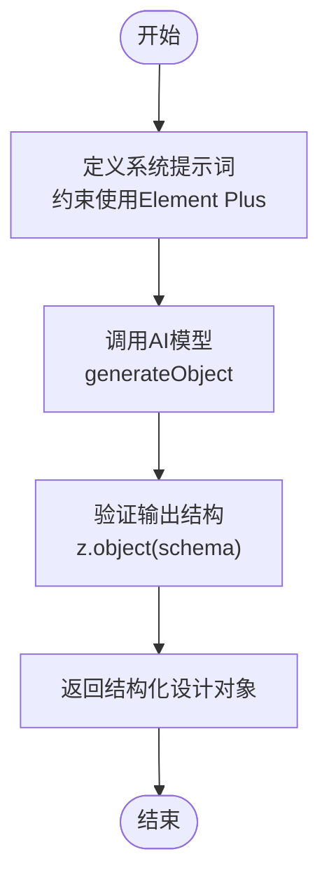
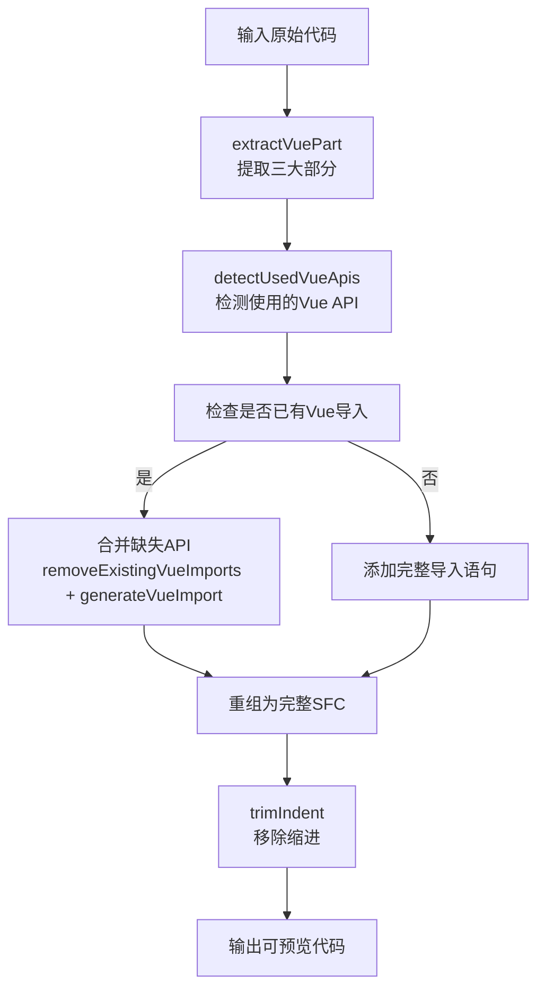
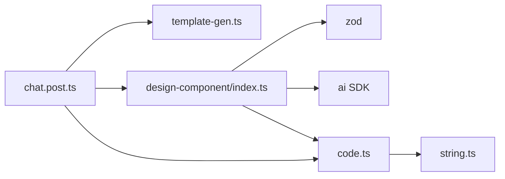

# 代码解析与生成逻辑

<cite>
**本文档引用的文件**
- [index.ts](file://server/core/steps/design-component/index.ts)
- [code.ts](file://shared/utils/code.ts)
- [string.ts](file://shared/utils/string.ts)
- [chat.post.ts](file://server/api/chat.post.ts)
- [template-gen.ts](file://shared/prompt/template-gen.ts)
</cite>

## 目录
1. [简介](#简介)
2. [项目结构](#项目结构)
3. [核心组件](#核心组件)
4. [架构概述](#架构概述)
5. [详细组件分析](#详细组件分析)
6. [依赖分析](#依赖分析)
7. [性能考量](#性能考量)
8. [故障排除指南](#故障排除指南)
9. [结论](#结论)

## 简介
本项目是一个基于AI的代码生成系统，专注于根据用户需求自动生成前端UI组件代码。系统通过自然语言理解用户请求，结合Element Plus组件库规范，生成符合标准的Vue单文件组件（SFC）。核心流程包括：需求解析、组件设计、代码生成、结构化提取与自动补全。本文档深入分析其代码解析与生成的核心逻辑，重点解析如何从AI响应中提取可执行代码，并通过工具函数增强其完整性和可运行性。

## 项目结构
项目采用分层架构，主要分为前端界面、后端服务与共享工具库三大部分。后端服务位于`server`目录，负责处理AI请求与代码生成逻辑；共享工具位于`shared`目录，提供跨模块复用的工具函数；前端位于`app`目录，负责用户交互与代码预览。



**图示来源**
- [index.ts](file://server/core/steps/design-component/index.ts)
- [code.ts](file://shared/utils/code.ts)
- [chat.post.ts](file://server/api/chat.post.ts)

**本节来源**
- [index.ts](file://server/core/steps/design-component/index.ts)
- [code.ts](file://shared/utils/code.ts)

## 核心组件
系统的核心功能由`server/core/steps/design-component/index.ts`中的`generateComponentDesign`函数驱动。该函数接收用户自然语言查询，通过AI模型生成结构化的组件设计信息，包括组件名称、描述、基本功能和样式要求。此设计信息作为后续代码生成的输入，确保生成的代码符合业务需求和UI规范。

**本节来源**
- [index.ts](file://server/core/steps/design-component/index.ts#L11-L40)

## 架构概述
系统整体架构遵循“请求-处理-响应”模式。用户请求通过`chat.post.ts`进入，系统根据预设提示词（prompt）调用AI模型。AI返回的响应可能包含原始代码块或设计描述，随后由共享工具模块进行解析、提取和增强，最终返回可直接运行的Vue组件代码。



**图示来源**
- [chat.post.ts](file://server/api/chat.post.ts#L1-L24)
- [index.ts](file://server/core/steps/design-component/index.ts#L11-L40)
- [code.ts](file://shared/utils/code.ts#L17-L208)

## 详细组件分析
### 组件设计逻辑分析
`generateComponentDesign`函数是代码生成流程的第一步。它不直接生成代码，而是生成一个结构化的组件设计文档。该函数使用`zod`库定义了严格的输出模式（schema），确保AI返回的数据包含`componentName`、`componentDescription`等关键字段。这为后续的代码生成提供了可靠的数据基础。



**图示来源**
- [index.ts](file://server/core/steps/design-component/index.ts#L11-L40)

**本节来源**
- [index.ts](file://server/core/steps/design-component/index.ts#L11-L40)

### 代码解析与提取逻辑
`shared/utils/code.ts`文件中的`extractCode`函数负责从AI返回的文本中提取代码块。它采用正则表达式匹配Markdown格式的代码块（```language ... ```），支持按语言（如`vue`、`ts`）和索引进行精确提取。

```typescript
export const extractCode = (
  content: string,
  language?: string,
  index: number = 0,
): string => {
  const codeRegex = language
    ? new RegExp(`\`\`\`${language}[\\s\\S]*?\`\`\``, 'g')
    : /```[\s\S]*?```/g;
  const matches = content.match(codeRegex);
  if (!matches || matches.length <= index) return '';
  const codeBlock = matches[index];
  const code = (codeBlock || '')
    .replace(/^```(?:\w+)?\s*/, '')
    .replace(/\s*```$/, '');
  return code.trim();
};
```

**本节来源**
- [code.ts](file://shared/utils/code.ts#L17-L41)

### 代码增强与自动补全逻辑
`genPreviewCode`函数是代码生成的核心增强模块。它接收原始代码，执行以下关键操作：
1.  **结构提取**：使用`extractVuePart`函数精确提取`<template>`、`<script setup>`和`<style>`部分，处理嵌套标签。
2.  **API检测**：扫描代码中使用的Vue Composition API（如`ref`、`onMounted`）。
3.  **导入管理**：检查现有导入，自动合并缺失的API导入，避免重复。
4.  **结构重组**：将处理后的代码重新组合成完整的SFC格式，并移除多余缩进。



**图示来源**
- [code.ts](file://shared/utils/code.ts#L158-L208)
- [code.ts](file://shared/utils/code.ts#L215-L271)
- [string.ts](file://shared/utils/string.ts#L15-L27)

**本节来源**
- [code.ts](file://shared/utils/code.ts#L158-L395)
- [string.ts](file://shared/utils/string.ts#L15-L27)

## 依赖分析
系统各模块间依赖关系清晰。`chat.post.ts`作为入口，依赖`template-gen.ts`的提示词和`design-component`的设计逻辑。`design-component`模块依赖AI SDK和Zod库。`shared/utils`模块提供基础工具，被上层业务逻辑广泛依赖，形成了低耦合、高内聚的架构。



**图示来源**
- [chat.post.ts](file://server/api/chat.post.ts)
- [index.ts](file://server/core/steps/design-component/index.ts)
- [code.ts](file://shared/utils/code.ts)
- [string.ts](file://shared/utils/string.ts)

**本节来源**
- [chat.post.ts](file://server/api/chat.post.ts)
- [code.ts](file://shared/utils/code.ts)

## 性能考量
- **正则表达式效率**：`extractCode`和`extractVuePart`中的正则表达式经过优化，避免回溯灾难，确保在大文本中也能快速匹配。
- **字符串操作**：`trimIndent`通过一次遍历计算最小缩进，时间复杂度为O(n)，效率较高。
- **AI调用延迟**：主要性能瓶颈在于AI模型的响应时间，系统采用流式响应（`streamText`）以改善用户体验。

## 故障排除指南
- **问题：生成的代码缺少Vue API导入**
  - **原因**：`genPreviewCode`未能正确检测到使用的API。
  - **解决方案**：检查`VUE_APIS`常量列表是否完整，确保正则表达式`\b${api}\b`能准确匹配。

- **问题：代码块提取失败**
  - **原因**：AI返回的代码块格式不规范（如缺少```）。
  - **解决方案**：在`extractCode`函数中增加容错逻辑，或在系统提示词中强制要求AI使用标准Markdown代码块。

- **问题：嵌套标签提取错误**
  - **原因**：`extractTagContent`的深度匹配逻辑在极端情况下可能失效。
  - **解决方案**：增加边界条件检查，或考虑引入轻量级HTML解析器。

**本节来源**
- [code.ts](file://shared/utils/code.ts#L17-L271)

## 结论
本系统通过`generateComponentDesign`进行需求结构化，再结合`extractCode`和`genPreviewCode`等工具函数，实现了从自然语言到可执行Vue代码的完整转换。其核心优势在于利用正则表达式和字符串操作，高效地解析、提取并增强AI生成的代码，自动补全导入和结构，极大提升了生成代码的可用性。未来可考虑引入AST解析以进一步提高代码分析的准确性。