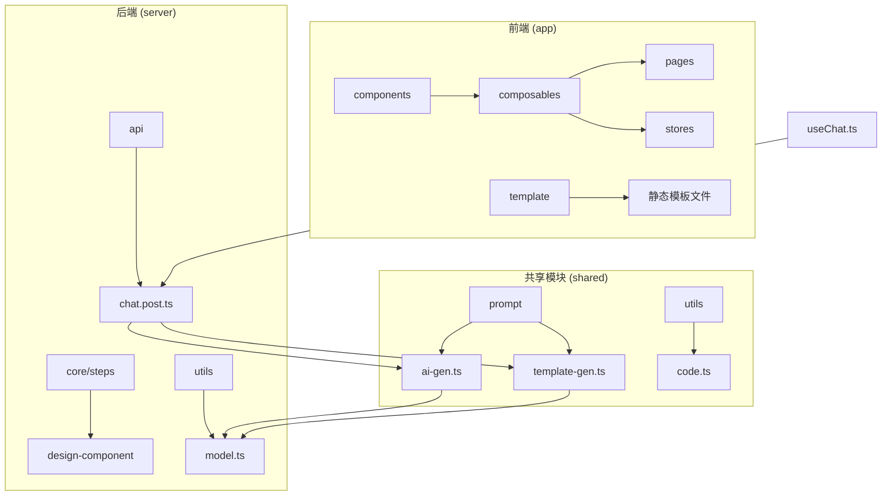
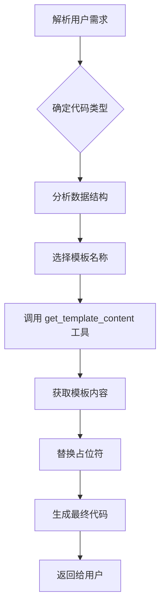
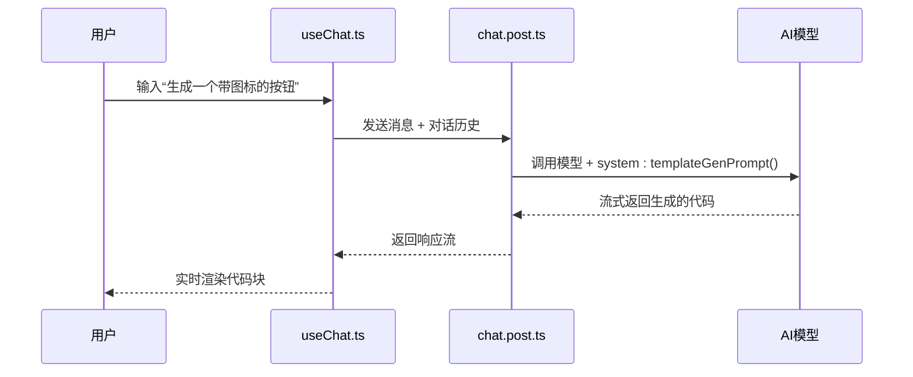
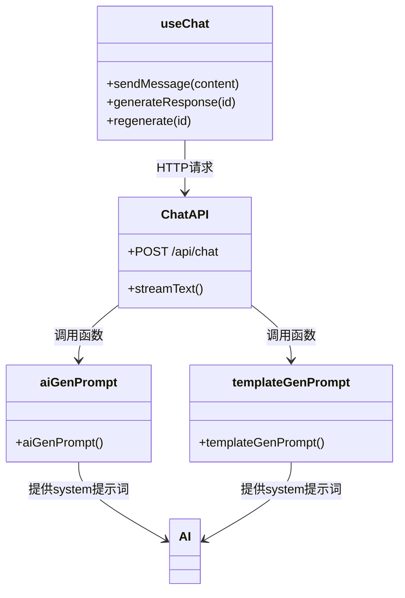

# 提示词构造

<cite>
**本文档中引用的文件**  
- [ai-gen.ts](file://shared/prompt/ai-gen.ts)
- [template-gen.ts](file://shared/prompt/template-gen.ts)
- [chat.post.ts](file://server/api/chat.post.ts)
- [useChat.ts](file://app/composables/useChat.ts)
- [element-plus.js](file://app/template/element-plus.js)
- [welcome.vue](file://app/template/welcome.vue)
- [main.vue](file://app/template/main.vue)
</cite>

## 目录
1. [项目结构](#项目结构)  
2. [核心提示词生成机制](#核心提示词生成机制)  
3. [ai-gen.ts：AI提示词构造器](#ai-gents-ai提示词构造器)  
4. [template-gen.ts：模板驱动提示词生成](#template-gents-模板驱动提示词生成)  
5. [系统工作流程与集成](#系统工作流程与集成)  
6. [模板文件与资源管理](#模板文件与资源管理)  
7. [提示词工程最佳实践](#提示词工程最佳实践)  
8. [扩展与维护指南](#扩展与维护指南)

## 项目结构

本项目采用分层架构设计，主要分为前端（`app`）、后端API（`server`）和共享逻辑（`shared`）三大模块。整体结构清晰，职责分离明确。



**图示来源**  
- [ai-gen.ts](file://shared/prompt/ai-gen.ts)
- [template-gen.ts](file://shared/prompt/template-gen.ts)
- [chat.post.ts](file://server/api/chat.post.ts)
- [useChat.ts](file://app/composables/useChat.ts)

**本节来源**  
- [project_structure](file://workspace_path)

## 核心提示词生成机制

系统通过两个核心提示词生成器 `ai-gen.ts` 和 `template-gen.ts` 实现不同场景下的代码生成能力。前者专注于高质量Vue3组件的直接生成，后者支持多技术栈的模板化代码生成。

提示词生成流程如下：
1. 用户输入自然语言需求
2. 前端通过 `useChat.ts` 收集对话上下文
3. 请求发送至 `/api/chat` 接口
4. 后端根据配置选择合适的提示词模板（`ai-gen` 或 `template-gen`）
5. 调用大模型生成响应
6. 流式返回结果至前端渲染

该机制实现了提示词的集中管理与动态注入，确保输出一致性与可维护性。

**本节来源**  
- [ai-gen.ts](file://shared/prompt/ai-gen.ts)
- [template-gen.ts](file://shared/prompt/template-gen.ts)
- [chat.post.ts](file://server/api/chat.post.ts)

## ai-gen.ts：AI提示词构造器

`ai-gen.ts` 定义了一个专用于生成Vue3组件的提示词模板，其核心目标是确保生成的代码符合生产环境标准。

### 系统角色设定

提示词明确设定了AI的角色为“专业的前端开发专家”，专注于生成高质量的Vue3 UI组件代码，技术栈限定为：
- Vue3.5 (Composition API)
- JavaScript (ES6+)
- Element Plus UI组件库
- `<script setup>` 语法糖

### 上下文注入与约束规则

提示词中注入了详细的编码规范和最佳实践要求：

```typescript
export const aiGenPrompt = () => {
  return `
你是一个专业的前端开发专家，专门负责生成高质量的Vue3 UI组件代码。

你的任务是根据用户的具体需求，生成符合生产环境要求的Vue3组件代码，技术栈限定为：
- Vue3.5 (Composition API)
- JavaScript (ES6+)
- Element Plus UI组件库
- <script setup> 语法糖

请严格按照以下要求生成代码:
1. 代码结构清晰，遵循Vue3最佳实践
2. 使用Composition API，合理组织代码逻辑
3. 包含完整的JSDoc注释
4. 实现必要的错误处理机制
5. 考虑性能优化
6. 遵循ESLint规范
7. 组件具有良好的可读性和可维护性
8. 使用Element Plus组件
9. 代码块顺序：template - script - style
10. 显示导入组件、vue的相关api
11. 不要使用任何样式预处理器，直接使用原生css

在生成代码时，请深度理解用户需求，并考虑以下方面：
- 组件的输入(props)和输出(events)
- 状态管理(reactive, ref)
- 生命周期钩子的合理使用
- 表单验证(如适用)
- 响应式设计适配

请生成完整、可直接使用的Vue3组件代码，生成的代码使用 markdown 代码块格式包裹（\`\`\`vue）
`;
};
```

### 安全与风格约束

该提示词通过以下方式确保输出质量：
- **技术栈锁定**：防止AI使用非指定框架或语法
- **结构化输出**：强制要求 `template-script-style` 顺序
- **注释要求**：提升代码可维护性
- **安全过滤**：禁止使用样式预处理器，避免依赖问题

**本节来源**  
- [ai-gen.ts](file://shared/prompt/ai-gen.ts)

## template-gen.ts：模板驱动提示词生成

`template-gen.ts` 提供了一种基于模板的通用代码生成机制，适用于前后端多种技术栈。

### 预定义模板组织结构

该文件定义了完整的模板分类体系，映射到具体的技术栈：

```typescript
export const templateGenPrompt = () => {
  return `
# 角色
你是一个代码生成器，你需要根据用户的需求，生成对应的代码。

# 目标
你会尝试解析用户的需求，使用适当的工具了解用户数据结构，生成相关的实体代码。
你在生成代码时会优先参考下面的模板文件，生成相应的代码。

# 可用模板列表

## 后端代码
- **domain**: Domain 实体类模板
- **mapper**: Mapper 接口模板
- **service**: Service 接口模板
- **serviceImpl**: Service 实现类模板
- **controller**: Controller 控制器模板
- **mapper_xml**: MyBatis XML 映射文件模板
- **sub_domain**: 子表 Domain 实体类模板

## 前端代码
- **api**: API 接口文件模板
- **vue_index**: Vue 页面组件模板
- **vue_form**: Vue 表单组件模板
- **vue_tree**: Vue 树形页面组件模板
- **vue_v3_index**: Vue3 页面组件模板
- **vue_v3_tree**: Vue3 树形页面组件模板

## 数据库脚本
- **sql**: 菜单 SQL 脚本模板

## 使用说明
使用 \`get_template_content\` 工具，传入模板名称即可获取对应的模板文件内容。
`;
};
```

### 模板与技术栈映射关系

| 模板名称 | 技术栈 | 用途 |
|---------|--------|------|
| `vue_v3_index` | Vue3 + Element Plus | 生成Vue3页面组件 |
| `api` | JavaScript/TypeScript | 生成API接口调用代码 |
| `domain` | Java/Spring Boot | 生成后端实体类 |
| `controller` | Java/Spring Boot | 生成Spring MVC控制器 |

### 工作流程



**图示来源**  
- [template-gen.ts](file://shared/prompt/template-gen.ts)

**本节来源**  
- [template-gen.ts](file://shared/prompt/template-gen.ts)

## 系统工作流程与集成

### 从自然语言到结构化提示词的完整流程

以“生成一个带图标的按钮”为例，展示完整的转换流程：



**图示来源**  
- [useChat.ts](file://app/composables/useChat.ts)
- [chat.post.ts](file://server/api/chat.post.ts)

### 组件间调用关系



**图示来源**  
- [useChat.ts](file://app/composables/useChat.ts)
- [chat.post.ts](file://server/api/chat.post.ts)
- [ai-gen.ts](file://shared/prompt/ai-gen.ts)
- [template-gen.ts](file://shared/prompt/template-gen.ts)

**本节来源**  
- [useChat.ts](file://app/composables/useChat.ts)
- [chat.post.ts](file://server/api/chat.post.ts)

## 模板文件与资源管理

系统通过 `app/template` 目录集中管理前端所需的静态模板资源。

### 关键模板文件

#### element-plus.js
用于动态加载Element Plus样式和注册组件：

```javascript
import ElementPlus from 'element-plus';
import { getCurrentInstance } from 'vue';

let installed = false;
await loadStyle();

export function setupElementPlus() {
  if (installed) return;
  const instance = getCurrentInstance();
  instance.appContext.app.use(ElementPlus);
  installed = true;
}

export function loadStyle() {
  const styles = ['#STYLE#', '#DARKSTYLE#'].map(style => {
    return new Promise((resolve, reject) => {
      const link = document.createElement('link');
      link.rel = 'stylesheet';
      link.href = style;
      link.addEventListener('load', resolve);
      link.addEventListener('error', reject);
      document.body.append(link);
    });
  });
  return Promise.allSettled(styles);
}
```

#### welcome.vue
初始欢迎页面模板，展示基础Element Plus组件用法：

```vue
<script setup lang="ts">
import { ElementPlus } from '@element-plus/icons-vue'
import { version as epVersion } from 'element-plus'
import { ref, version as vueVersion } from 'vue'

const msg = ref('Hello World!')
</script>

<template>
  <h1>{{ msg }}</h1>
  <el-input v-model="msg" />

  <p>
    <el-icon color="var(--el-color-primary)"><ElementPlus /></el-icon>
    Element Plus {{ epVersion }} + Vue {{ vueVersion }}
  </p>
</template>
```

#### main.vue
应用主入口模板：

```vue
<script setup>
import App from './App.vue'
import { setupElementPlus } from './element-plus.js'
setupElementPlus()
</script>

<template>
  <App />
</template>
```

这些模板文件通过 `store.ts` 中的 `initFiles()` 函数动态加载，确保运行时环境一致性。

**本节来源**  
- [element-plus.js](file://app/template/element-plus.js)
- [welcome.vue](file://app/template/welcome.vue)
- [main.vue](file://app/template/main.vue)
- [store.ts](file://app/composables/store.ts)

## 提示词工程最佳实践

### Few-shot 示例设计

虽然当前系统未显式使用few-shot示例，但可通过增强 `ai-gen.ts` 实现：

```text
示例：生成一个提交按钮

```vue
<template>
  <el-button type="primary" :loading="loading" @click="handleSubmit">
    提交
  </el-button>
</template>

<script setup>
import { ref } from 'vue'

const loading = ref(false)

const handleSubmit = () => {
  loading.value = true
  // 提交逻辑...
  setTimeout(() => {
    loading.value = false
  }, 2000)
}
</script>
```
```

### 指令清晰度优化

当前提示词已具备高清晰度，建议进一步优化：
- 明确输入/输出格式
- 增加边界条件说明
- 提供错误处理模板

### 避免歧义表达

通过以下方式减少歧义：
- 使用具体术语（如“Composition API”而非“现代Vue语法”）
- 限定技术版本（Vue3.5）
- 禁用模糊词汇（“美观的”、“现代化的”）

### 安全性与一致性保障

- **代码沙箱**：前端运行在Vue REPl环境中，隔离执行
- **依赖锁定**：通过 `import-map.json` 固定版本
- **格式统一**：强制ESLint规范和代码结构

**本节来源**  
- [ai-gen.ts](file://shared/prompt/ai-gen.ts)
- [template-gen.ts](file://shared/prompt/template-gen.ts)

## 扩展与维护指南

### 添加新框架支持

要添加对新前端框架（如React）的支持：

1. 在 `template-gen.ts` 中新增模板：
```ts
## 前端代码
- **react_component**: React 函数组件模板
- **react_hook**: 自定义Hook模板
```

2. 创建对应模板文件于 `app/template/react/` 目录

3. 更新 `get_template_content` 工具支持新模板（需实现）

### 添加新语言支持

1. 在 `template-gen.ts` 中增加后端模板：
```ts
## 后端代码
- **python_fastapi**: FastAPI 路由模板
- **go_handler**: Go HTTP处理器模板
```

2. 实现对应的模板文件

3. 确保 `chat.post.ts` 能正确路由请求

### 提示词版本管理

建议为提示词增加版本控制：

```ts
export const aiGenPrompt_v2 = () => {
  // 新版本提示词
}
```

并通过配置文件切换版本，便于A/B测试。

### 监控与反馈机制

可集成以下改进：
- 记录生成失败案例
- 用户评分反馈
- 自动生成单元测试

**本节来源**  
- [template-gen.ts](file://shared/prompt/template-gen.ts)
- [ai-gen.ts](file://shared/prompt/ai-gen.ts)