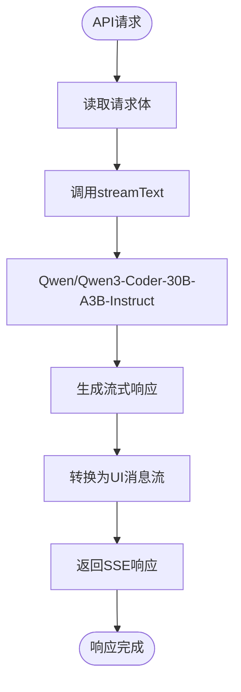

# 流式响应处理

<cite>
**本文档引用的文件**   
- [useChat.ts](file://app/composables/useChat.ts)
- [conversation.ts](file://app/stores/conversation.ts)
- [chat.post.ts](file://server/api/chat.post.ts)
- [chat.ts](file://app/types/chat.ts)
- [index.vue](file://app/pages/chat/index.vue)
- [id.ts](file://shared/utils/id.ts)
</cite>

## 目录
1. [项目结构](#项目结构)
2. [核心组件](#核心组件)
3. [流式响应前端实现](#流式响应前端实现)
4. [会话状态管理](#会话状态管理)
5. [服务器端流式响应](#服务器端流式响应)
6. [数据流与事件解析](#数据流与事件解析)
7. [错误处理机制](#错误处理机制)
8. [用户体验优化](#用户体验优化)

## 项目结构

本项目采用分层架构设计，主要分为前端（app）、后端（server）和共享（shared）三个模块。前端使用Nuxt框架，通过组合式函数（composables）管理业务逻辑，Pinia存储（stores）管理状态。后端提供API接口，利用AI SDK实现流式响应。共享模块包含跨平台工具函数。


**图示来源**
- [useChat.ts](file://app/composables/useChat.ts)
- [conversation.ts](file://app/stores/conversation.ts)
- [chat.post.ts](file://server/api/chat.post.ts)
- [id.ts](file://shared/utils/id.ts)

**本节来源**
- [useChat.ts](file://app/composables/useChat.ts)
- [conversation.ts](file://app/stores/conversation.ts)
- [chat.post.ts](file://server/api/chat.post.ts)

## 核心组件

系统核心由三个关键组件构成：`useChat.ts` 提供聊天业务逻辑，`conversation.ts` 管理会话状态，`chat.post.ts` 处理服务器端AI响应。这些组件通过清晰的职责分离，实现了高效的流式响应机制。

**本节来源**
- [useChat.ts](file://app/composables/useChat.ts#L1-L365)
- [conversation.ts](file://app/stores/conversation.ts#L1-L318)
- [chat.post.ts](file://server/api/chat.post.ts#L1-L26)

## 流式响应前端实现

`useChat.ts` 文件中的 `generateResponse` 函数是流式响应的核心。该函数通过 `fetch` 调用 `/api/chat` 接口，获取服务器发送的SSE（Server-Sent Events）流。使用 `response.body.getReader()` 创建读取器，逐块读取响应数据。


**图示来源**
- [useChat.ts](file://app/composables/useChat.ts#L134-L213)
- [conversation.ts](file://app/stores/conversation.ts#L128-L175)

**本节来源**
- [useChat.ts](file://app/composables/useChat.ts#L84-L213)

## 会话状态管理

`conversation.ts` 使用Pinia定义了会话状态管理。通过 `Map` 结构存储各会话的消息列表，确保高效的数据访问。`updateMessage` 函数在接收到流式数据时，实时更新指定消息的内容，并在响应完成后关闭加载状态和打字机动画。


**图示来源**
- [conversation.ts](file://app/stores/conversation.ts#L1-L318)
- [chat.ts](file://app/types/chat.ts#L1-L21)

**本节来源**
- [conversation.ts](file://app/stores/conversation.ts#L1-L318)
- [chat.ts](file://app/types/chat.ts#L1-L21)

## 服务器端流式响应

服务器端通过 `ai` SDK的 `streamText` 函数实现流式响应。`chat.post.ts` 文件定义了API处理器，接收客户端消息，调用Qwen大模型，并将响应转换为UI消息流。`toUIMessageStreamResponse()` 方法将AI流转换为前端可解析的SSE格式。



**图示来源**
- [chat.post.ts](file://server/api/chat.post.ts#L1-L26)

**本节来源**
- [chat.post.ts](file://server/api/chat.post.ts#L1-L26)

## 数据流与事件解析

前端通过解析SSE事件流实现增量渲染。服务器发送的数据格式为 `data: {json}`，前端按行分割，解析JSON数据。根据 `type` 字段区分不同类型的事件，如 `text-delta` 表示文本增量，`reasoning-delta` 表示推理过程。

```mermaid
flowchart TD
A[接收SSE流] --> B{数据行}
B --> C{以"data: "开头?}
C --> |是| D{包含"[DONE]"?}
D --> |否| E[提取JSON字符串]
E --> F[解析JSON]
F --> G{type类型}
G --> |text-delta| H[拼接文本内容]
G --> |reasoning-start| I[初始化推理内容]
G --> |reasoning-delta| J[拼接推理内容]
G --> |text-start| K[结束推理显示]
H --> L[更新消息内容]
I --> L
J --> L
K --> L
L --> M[继续读取]
C --> |否| M
D --> |是| N[流结束]
M --> O{流是否完成?}
O --> |否| A
O --> |是| P[完成响应]
```

**图示来源**
- [useChat.ts](file://app/composables/useChat.ts#L150-L170)
- [chat.ts](file://app/types/chat.ts#L1-L21)

**本节来源**
- [useChat.ts](file://app/composables/useChat.ts#L134-L213)
- [chat.ts](file://app/types/chat.ts#L1-L21)

## 错误处理机制

系统实现了多层次的错误处理。在 `generateResponse` 中，若无法获取响应流则抛出异常。在 `sendMessage` 和 `regenerate` 函数的 `try-catch` 块中捕获错误，设置错误状态，并清理异常的助手消息。对于流数据解析失败，使用 `console.warn` 记录警告而不中断主流程。


**图示来源**
- [useChat.ts](file://app/composables/useChat.ts#L208-L248)
- [useChat.ts](file://app/composables/useChat.ts#L168-L213)

**本节来源**
- [useChat.ts](file://app/composables/useChat.ts#L200-L364)

## 用户体验优化

系统通过多种方式优化用户体验。首先，使用打字机动画（typing）模拟AI思考过程，通过在 `addAssistantMessage` 中设置 `typing` 配置实现。其次，实现消息ID生成机制，确保每条消息的唯一性。最后，通过防抖和滚动定位，确保新消息出现时视图自动滚动到底部。


**图示来源**
- [useChat.ts](file://app/composables/useChat.ts#L40-L89)
- [conversation.ts](file://app/stores/conversation.ts#L128-L175)
- [id.ts](file://shared/utils/id.ts#L1-L28)

**本节来源**
- [useChat.ts](file://app/composables/useChat.ts#L40-L89)
- [conversation.ts](file://app/stores/conversation.ts#L128-L175)
- [id.ts](file://shared/utils/id.ts#L1-L28)