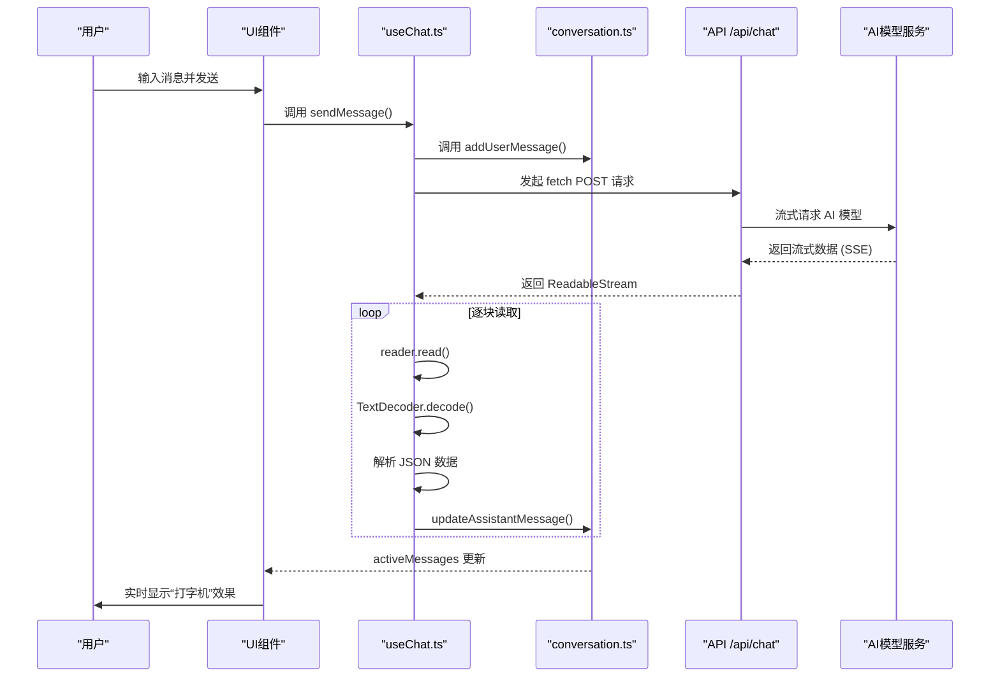
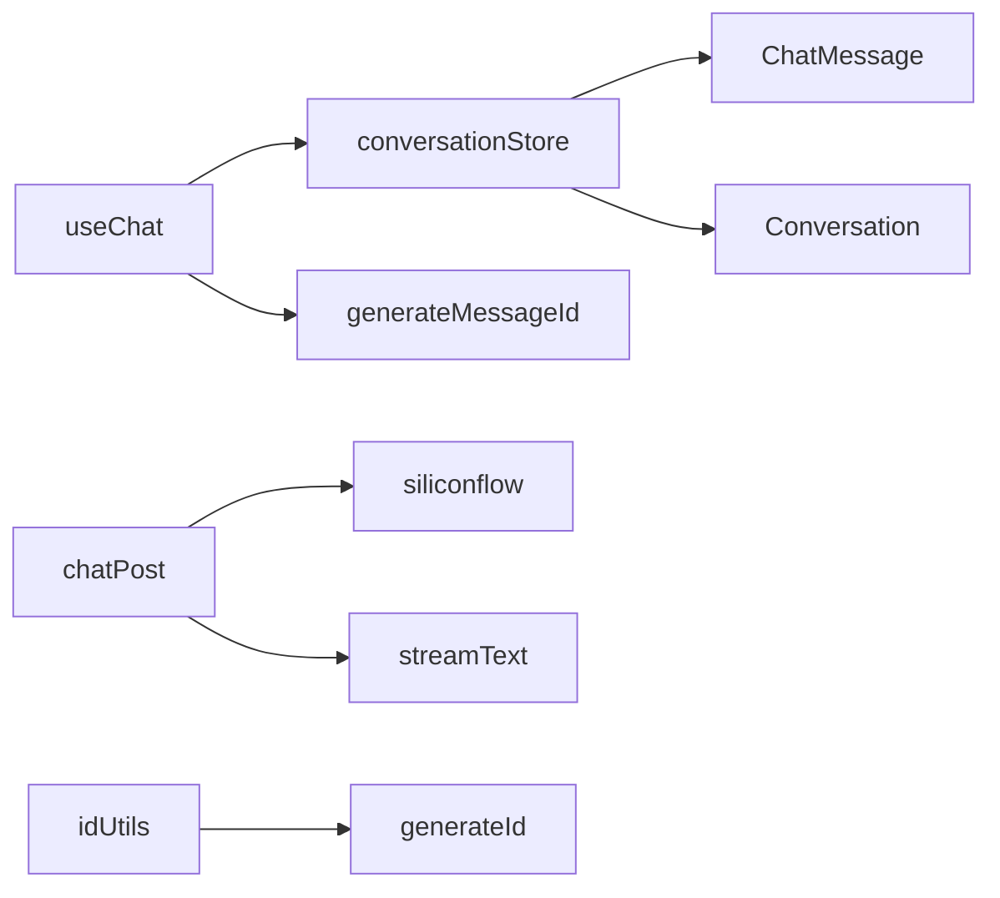

# 客户端流处理

<cite>
**本文档引用的文件**  
- [useChat.ts](file://app/composables/useChat.ts#L1-L365)
- [conversation.ts](file://app/stores/conversation.ts#L1-L318)
- [chat.ts](file://app/types/chat.ts#L1-L21)
- [conversation.ts](file://app/types/conversation.ts#L1-L79)
- [chat.post.ts](file://server/api/chat.post.ts#L1-L26)
- [model.ts](file://server/utils/model.ts#L1-L34)
- [id.ts](file://shared/utils/id.ts#L1-L28)
</cite>

## 目录
1. [简介](#简介)
2. [项目结构](#项目结构)
3. [核心组件](#核心组件)
4. [架构概览](#架构概览)
5. [详细组件分析](#详细组件分析)
6. [依赖分析](#依赖分析)
7. [性能考量](#性能考量)
8. [故障排除指南](#故障排除指南)
9. [结论](#结论)

## 简介
本文档详细说明了客户端如何接收并处理来自服务器的流式响应。重点分析了 `useChat.ts` 中如何通过 `fetch` 请求获取 `ReadableStream`，并使用 `TextDecoder` 逐步解析 SSE（Server-Sent Events）事件流。文档还描述了增量文本片段如何实时更新到 `conversation.ts` 的状态管理中，实现“打字机”效果的 UI 更新。同时涵盖消息合并策略、防抖机制、DOM 更新优化、浏览器兼容性处理方案，以及在 Vue 3 组合式 API 中安全管理异步流的实践模式。

## 项目结构
项目采用基于功能的模块化结构，主要分为 `app`（前端）、`server`（后端）和 `shared`（共享工具）三大目录。前端使用 Nuxt 3 框架，状态管理基于 Pinia，UI 组件库为 Element Plus。

```mermaid
graph TB
subgraph "前端 (app)"
A[components]
B[composables]
C[stores]
D[pages]
E[types]
F[utils]
end
subgraph "后端 (server)"
G[api]
H[utils]
I[core]
end
subgraph "共享 (shared)"
J[prompt]
K[utils]
end
B --> C : "使用"
B --> G : "调用 /api/chat"
G --> I : "调用设计组件"
K --> B : "提供ID生成"
```

**Diagram sources**
- [useChat.ts](file://app/composables/useChat.ts#L1-L365)
- [conversation.ts](file://app/stores/conversation.ts#L1-L318)
- [chat.post.ts](file://server/api/chat.post.ts#L1-L26)

**Section sources**
- [useChat.ts](file://app/composables/useChat.ts#L1-L365)
- [conversation.ts](file://app/stores/conversation.ts#L1-L318)

## 核心组件
核心组件包括 `useChat.ts`（组合式函数，处理聊天逻辑）和 `conversation.ts`（Pinia Store，管理会话状态）。`useChat.ts` 负责发起流式请求、解析响应并更新状态；`conversation.ts` 负责持久化消息和会话数据。

**Section sources**
- [useChat.ts](file://app/composables/useChat.ts#L1-L365)
- [conversation.ts](file://app/stores/conversation.ts#L1-L318)

## 架构概览
系统采用典型的前后端分离架构。客户端通过组合式函数发起流式请求，服务器端使用 AI SDK 生成流式响应。客户端通过 `ReadableStream` 逐块接收数据，解析后更新状态，触发 UI 实时渲染。



**Diagram sources**
- [useChat.ts](file://app/composables/useChat.ts#L1-L365)
- [conversation.ts](file://app/stores/conversation.ts#L1-L318)
- [chat.post.ts](file://server/api/chat.post.ts#L1-L26)

## 详细组件分析

### useChat.ts 分析
`useChat.ts` 是处理客户端流式响应的核心组合式函数。它封装了发送消息、生成响应、管理错误等逻辑。

#### 流式请求与响应处理
`generateResponse` 函数是流式处理的核心。它使用 `fetch` 获取服务器响应的 `ReadableStream`，并通过 `getReader()` 创建一个读取器。

```mermaid
flowchart TD
A[调用 generateResponse] --> B[fetch('/api/chat')]
B --> C{响应成功?}
C --> |否| D[抛出HTTP错误]
C --> |是| E[获取 response.body.getReader()]
E --> F[创建 TextDecoder]
F --> G[循环 reader.read()]
G --> H{done?}
H --> |否| I[解码 chunk]
I --> J[按行分割]
J --> K{是否为 data: 行?}
K --> |是| L[解析JSON]
L --> M{是否为 text-delta?}
M --> |是| N[累加内容]
N --> O[更新状态]
M --> |否| P[处理其他类型]
P --> O
O --> G
H --> |是| Q[完成流处理]
Q --> R[更新最终状态]
```

**Diagram sources**
- [useChat.ts](file://app/composables/useChat.ts#L134-L213)

**Section sources**
- [useChat.ts](file://app/composables/useChat.ts#L134-L213)

#### 关键代码逻辑
```typescript
const generateResponse = async (assistantMessageId: string): Promise<string> => {
  const response = await fetch('/api/chat', { /* ... */ });
  const reader = response.body?.getReader();
  const decoder = new TextDecoder();
  let accumulatedContent = '';

  while (true) {
    const { done, value } = await reader.read();
    if (done) break;

    const chunk = decoder.decode(value, { stream: true });
    const lines = chunk.split('\n');

    for (const line of lines) {
      if (line.startsWith('data: ') && !line.includes('[DONE]')) {
        try {
          const jsonStr = line.slice(6);
          const data = JSON.parse(jsonStr);

          if (data.type === 'text-delta' && data.delta) {
            accumulatedContent += data.delta;
            // 实时更新状态
            updateAssistantMessage(assistantMessageId, accumulatedContent);
          }
        } catch (parseError) {
          console.warn('解析流数据失败:', parseError, '原始行:', line);
        }
      }
    }
  }

  // 流完成，更新最终状态
  updateAssistantMessage(assistantMessageId, accumulatedContent, true);
  return accumulatedContent;
};
```

此代码展示了完整的流处理流程：建立连接、逐块读取、解码、按行解析、提取增量内容、实时更新状态。

### conversation.ts 分析
`conversation.ts` 是基于 Pinia 的状态管理模块，负责存储和管理所有会话及消息。

#### 状态结构
```mermaid
classDiagram
class ConversationStore {
+conversations : Conversation[]
+activeConversationId : string
+conversationMessages : Map<string, ChatMessage[]>
+loading : boolean
+error : string | undefined
+activeConversation : ComputedRef
+activeMessages : ComputedRef
+addMessage(conversationId, message)
+updateMessage(conversationId, messageId, content, done)
+updateMessageReasoning(conversationId, messageId, content, status)
+deleteMessage(conversationId, messageId)
+clearMessages(conversationId)
}
class ChatMessage {
+id : string
+content : string
+role : 'user' | 'assistant'
+timestamp : Date
+typing : {step, interval, suffix} | false
+loading : boolean
+reasoningContent? : string
+reasoningStatus? : 'start' | 'thinking' | 'end'
}
class Conversation {
+id : string
+title : string
+group : string
+createdAt : Date
+updatedAt : Date
+lastMessage? : string
+config? : ConversationConfig
}
ConversationStore --> ChatMessage : "管理"
ConversationStore --> Conversation : "包含"
```

**Diagram sources**
- [conversation.ts](file://app/stores/conversation.ts#L1-L318)
- [chat.ts](file://app/types/chat.ts#L1-L21)

**Section sources**
- [conversation.ts](file://app/stores/conversation.ts#L1-L318)

#### 消息更新机制
`updateMessage` 方法是实现“打字机”效果的关键。它接收增量内容并直接更新消息对象。

```typescript
const updateMessage = (
  conversationId: string,
  messageId: string,
  content: string,
  done: boolean = false
): void => {
  const messages = conversationMessages.value.get(conversationId) || [];
  const messageIndex = messages.findIndex(msg => msg.id === messageId);
  if (messageIndex > -1) {
    const message = messages[messageIndex];
    if (message) {
      message.content = content; // 实时更新内容
      if (message.loading) message.loading = false;
      if (done) message.typing = false; // 流完成，停止打字机
    }
  }
};
```

### 服务器端实现分析
服务器端通过 `chat.post.ts` 处理 `/api/chat` 请求，使用 `ai` SDK 的 `streamText` 方法生成流式响应。

```typescript
export default defineLazyEventHandler(async () => {
  return defineEventHandler(async (event: any) => {
    const { messages } = await readBody(event);
    const result = streamText({
      model: siliconflow('Qwen/Qwen3-Coder-30B-A3B-Instruct'),
      system: templateGenPrompt(),
      messages,
    });
    return result.toUIMessageStreamResponse(); // 返回SSE流
  });
});
```

此实现利用了 AI SDK 的流式能力，将模型的逐字输出通过 HTTP 流（SSE）返回给客户端。

**Section sources**
- [chat.post.ts](file://server/api/chat.post.ts#L1-L26)

## 依赖分析
系统各组件间依赖关系清晰，耦合度低。



**Diagram sources**
- [useChat.ts](file://app/composables/useChat.ts#L1-L365)
- [conversation.ts](file://app/stores/conversation.ts#L1-L318)
- [chat.post.ts](file://server/api/chat.post.ts#L1-L26)
- [id.ts](file://shared/utils/id.ts#L1-L28)

**Section sources**
- [useChat.ts](file://app/composables/useChat.ts#L1-L365)
- [conversation.ts](file://app/stores/conversation.ts#L1-L318)

## 性能考量
- **流式解码**：使用 `TextDecoder` 的 `stream: true` 选项，确保多字节字符在块边界被正确处理。
- **状态更新优化**：通过 Pinia 的响应式系统，仅当消息内容变化时触发 UI 更新，避免不必要的重渲染。
- **内存管理**：`ReadableStream` 的逐块读取避免了将整个响应加载到内存中，适合处理长文本。
- **错误处理**：在 `try-catch` 块中解析流数据，防止单个坏数据块导致整个流中断。
- **性能监控建议**：
  - **流延迟**：在 `generateResponse` 开始和结束时记录时间戳，计算端到端延迟。
  - **内存使用**：监控 `accumulatedContent` 的增长，防止内存泄漏。
  - **网络性能**：使用 `PerformanceObserver` 监控 `fetch` 请求的各个阶段耗时。

## 故障排除指南
- **流无法启动**：检查 `fetch` 请求的 URL 和 CORS 配置。
- **乱码问题**：确保 `TextDecoder` 使用正确的编码（默认 UTF-8）。
- **解析失败**：检查服务器返回的 SSE 格式是否正确（`data: {...}\n\n`）。
- **UI 未更新**：确认 `updateAssistantMessage` 是否被调用，以及 Pinia 状态是否正确更新。
- **连接中断**：实现重连机制，在 `fetch` 失败时提示用户并提供重试选项。

**Section sources**
- [useChat.ts](file://app/composables/useChat.ts#L1-L365)
- [conversation.ts](file://app/stores/conversation.ts#L1-L318)

## 结论
本系统通过 `fetch` + `ReadableStream` + `TextDecoder` 的组合，实现了高效的客户端流式响应处理。`useChat.ts` 与 `conversation.ts` 的协同工作，确保了增量文本能够实时、可靠地更新到 UI 状态中，为用户提供流畅的“打字机”体验。该设计模式在 Vue 3 组合式 API 中安全且高效，具备良好的可维护性和扩展性。