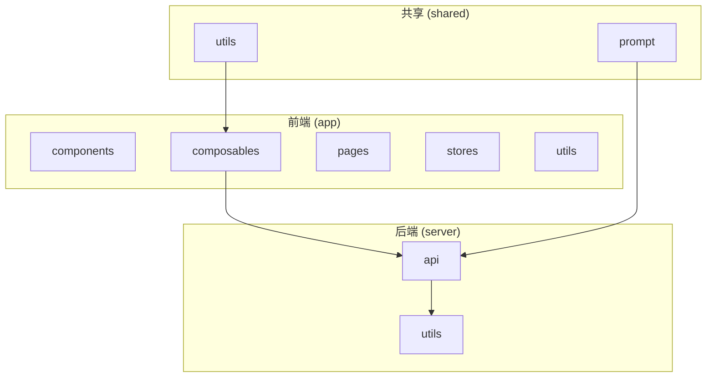
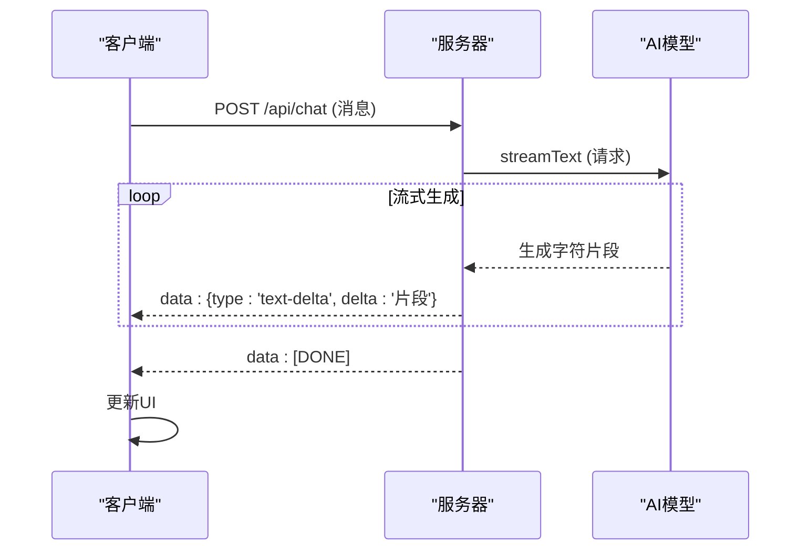
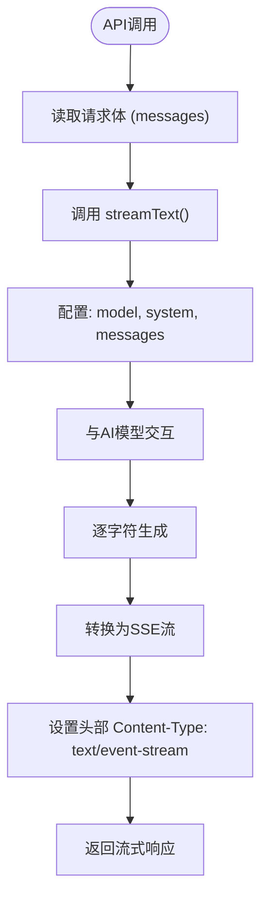
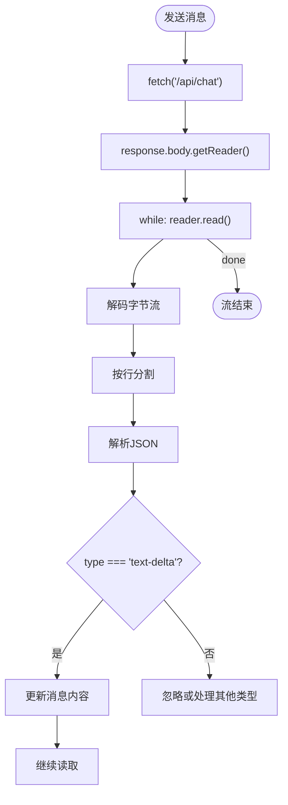
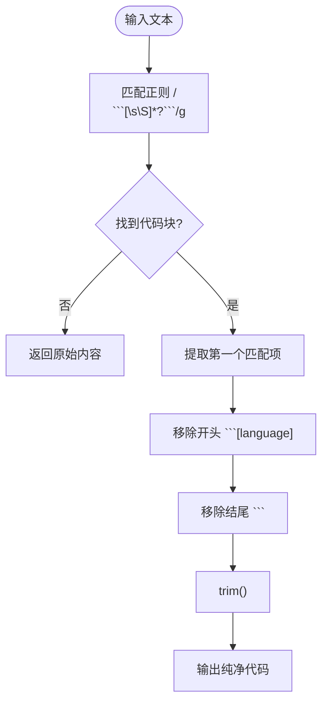

# 服务器端流式响应

<cite>
**本文档中引用的文件**  
- [chat.post.ts](file://server/api/chat.post.ts)
- [useChat.ts](file://app/composables/useChat.ts)
- [model.ts](file://server/utils/model.ts)
- [code.ts](file://shared/utils/code.ts)
</cite>

## 目录
1. [简介](#简介)
2. [项目结构](#项目结构)
3. [核心组件](#核心组件)
4. [架构概述](#架构概述)
5. [详细组件分析](#详细组件分析)
6. [依赖分析](#依赖分析)
7. [性能考虑](#性能考虑)
8. [故障排除指南](#故障排除指南)
9. [结论](#结论)

## 简介
本文档深入分析了服务器端流式响应的实现机制，重点阐述了如何利用Nuxt的服务器API结合AI SDK的流式能力，通过`ReadableStream`将AI模型生成的字符逐步推送给客户端。文档详细解释了`TransformStream`对原始流数据的分块处理、`code.ts`中代码块标记的识别与语法完整性保障、HTTP头部配置（如`Content-Type: text/event-stream`）和SSE协议的实现细节。同时提供了性能优化建议与调试方法，帮助开发者全面理解该系统的运作原理。

## 项目结构
项目采用分层架构，主要分为前端（`app`）、后端（`server`）和共享（`shared`）三个目录。前端负责用户界面和交互逻辑，后端提供API服务和业务逻辑，共享目录存放跨层复用的工具和提示词。服务器端流式响应的核心逻辑位于`server/api/chat.post.ts`，客户端处理逻辑位于`app/composables/useChat.ts`。



**图示来源**
- [chat.post.ts](file://server/api/chat.post.ts)
- [useChat.ts](file://app/composables/useChat.ts)
- [code.ts](file://shared/utils/code.ts)

## 核心组件
系统的核心组件包括服务器端的`chat.post.ts`、客户端的`useChat.ts`以及共享的`code.ts`。`chat.post.ts`作为API入口，利用AI SDK的`streamText`方法发起流式请求；`useChat.ts`负责在客户端消费流式响应并更新UI状态；`code.ts`则提供了从文本中提取代码块的工具函数，用于确保代码语法的完整性。

**组件来源**
- [chat.post.ts](file://server/api/chat.post.ts#L1-L24)
- [useChat.ts](file://app/composables/useChat.ts#L1-L364)
- [code.ts](file://shared/utils/code.ts#L1-L394)

## 架构概述
系统采用典型的客户端-服务器架构，通过SSE（Server-Sent Events）协议实现服务器向客户端的单向流式数据推送。当用户发送消息时，客户端调用`/api/chat`接口，服务器使用`streamText`方法与AI模型交互，并通过`toUIMessageStreamResponse`将结果转换为SSE流。客户端通过`ReadableStream`的`getReader()`方法逐块读取数据，实时更新消息内容。



**图示来源**
- [chat.post.ts](file://server/api/chat.post.ts#L1-L24)
- [useChat.ts](file://app/composables/useChat.ts#L84-L170)

## 详细组件分析
### 服务器端流式响应分析
服务器端的`chat.post.ts`文件是流式响应的起点。它使用`defineLazyEventHandler`定义了一个Nuxt服务器API，接收客户端的POST请求。核心是`streamText`函数，它接受模型配置、系统提示和消息历史，返回一个包含流式结果的对象。最终，`toUIMessageStreamResponse`方法将这个对象转换为符合SSE协议的响应流。



**图示来源**
- [chat.post.ts](file://server/api/chat.post.ts#L1-L24)

**组件来源**
- [chat.post.ts](file://server/api/chat.post.ts#L1-L24)

### 客户端流式处理分析
客户端的`useChat.ts`文件负责处理服务器推送的流式数据。`generateResponse`函数通过`fetch`请求`/api/chat`接口，获取`response.body`并调用`getReader()`创建一个`ReadableStreamDefaultReader`。通过循环调用`reader.read()`，客户端可以异步读取每一个数据块。数据块被解码后按行分割，每一行以`data: `开头，客户端解析JSON数据，根据`type`字段（如`text-delta`）更新累积的内容并实时刷新UI。



**图示来源**
- [useChat.ts](file://app/composables/useChat.ts#L84-L170)

**组件来源**
- [useChat.ts](file://app/composables/useChat.ts#L84-L170)

### 代码块格式化分析
虽然`server/utils/format.ts`文件为空，但`shared/utils/code.ts`文件提供了关键的代码块处理功能。`extractCode`函数使用正则表达式`/```[\s\S]*?```/g`来匹配文本中的所有代码块。它能够识别以```开头和结尾的代码块，并可选地指定语言标识。通过`replace`方法移除代码块的边界标记，提取出纯净的代码内容，从而确保了在流式响应中代码块的语法完整性。



**图示来源**
- [code.ts](file://shared/utils/code.ts#L1-L41)

**组件来源**
- [code.ts](file://shared/utils/code.ts#L1-L41)

## 依赖分析
系统依赖于多个关键库和模块。`ai` SDK提供了`streamText`和`toUIMessageStreamResponse`等核心流式API。`@ai-sdk/openai-compatible`用于创建与OpenAI兼容的模型客户端，如`siliconflow`。Nuxt框架的`defineEventHandler`和`readBody`处理服务器端的HTTP请求和响应。客户端则依赖浏览器的`fetch` API和`ReadableStream` API来处理流式数据。

```mermaid
graph LR
A[chat.post.ts] --> B[ai SDK]
A --> C[@ai-sdk/openai-compatible]
A --> D[Nuxt Server API]
E[useChat.ts] --> F[fetch API]
E --> G[ReadableStream]
H[code.ts] --> I[正则表达式]
B --> J[AI模型]
C --> J
```

**图示来源**
- [chat.post.ts](file://server/api/chat.post.ts#L1-L24)
- [useChat.ts](file://app/composables/useChat.ts#L1-L364)
- [model.ts](file://server/utils/model.ts#L1-L33)

## 性能考虑
为了优化服务器端流式响应的性能，可以采取以下措施：
- **首字节时间（TTFB）优化**：确保AI模型服务响应迅速，减少网络延迟。
- **流控机制**：在客户端处理流时，避免过于频繁的UI更新，可使用防抖或节流。
- **缓冲策略**：适当增加客户端的缓冲区大小，平滑处理突发的数据流。
- **错误处理**：实现健壮的错误处理和重连机制，保证流的稳定性。

## 故障排除指南
调试流式响应问题时，可以采用以下方法：
- **日志追踪**：在`useChat.ts`的`generateResponse`函数中添加日志，打印每一行接收到的流数据，检查解析是否正确。
- **模拟慢速网络**：使用浏览器开发者工具的网络限速功能，测试在低速网络下流式响应的表现。
- **检查SSE头部**：确认服务器响应的`Content-Type`为`text/event-stream`，且没有被中间件修改。
- **验证流结束**：确保服务器在流结束时发送`[DONE]`标记，客户端能正确识别并结束读取。

**故障排除来源**
- [useChat.ts](file://app/composables/useChat.ts#L134-L170)
- [chat.post.ts](file://server/api/chat.post.ts#L1-L24)

## 结论
本文档详细解析了服务器端流式响应的实现机制。系统通过`chat.post.ts`利用AI SDK发起流式请求，`useChat.ts`在客户端消费SSE流并实时更新UI，`code.ts`确保了代码块的正确提取。整个流程高效地实现了AI生成内容的即时展示，为用户提供流畅的交互体验。未来可进一步优化流控和错误处理，提升系统的健壮性和性能。