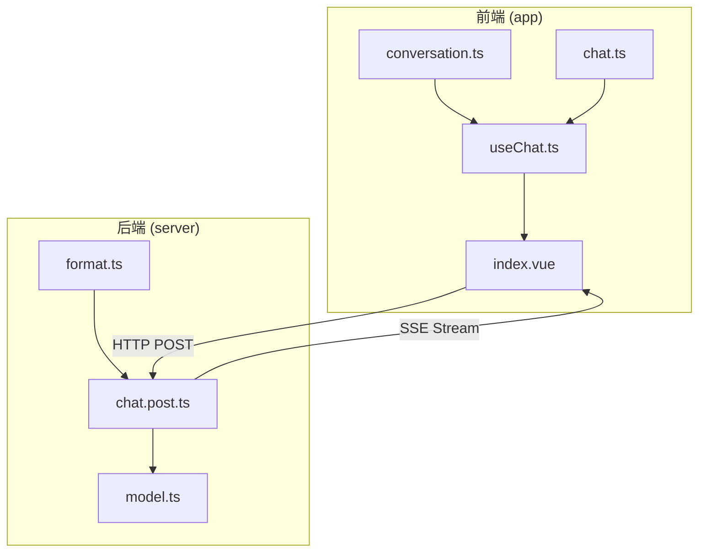
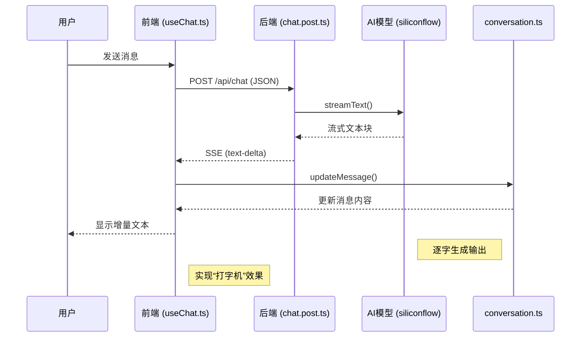
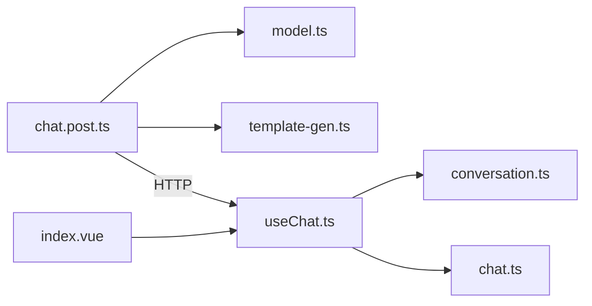

# 流式响应处理

<cite>
**本文档引用的文件**  
- [chat.post.ts](file://server/api/chat.post.ts)
- [useChat.ts](file://app/composables/useChat.ts)
- [format.ts](file://server/utils/format.ts)
- [conversation.ts](file://app/stores/conversation.ts)
- [conversation.ts](file://app/types/conversation.ts)
- [chat.ts](file://app/types/chat.ts)
- [model.ts](file://server/utils/model.ts)
- [index.vue](file://app/pages/chat/index.vue)
</cite>

## 目录
1. [项目结构分析](#项目结构分析)
2. [核心组件分析](#核心组件分析)
3. [流式响应架构概述](#流式响应架构概述)
4. [详细组件分析](#详细组件分析)
5. [依赖关系分析](#依赖关系分析)
6. [错误处理与恢复机制](#错误处理与恢复机制)
7. [性能优化建议](#性能优化建议)
8. [调试技巧](#调试技巧)

## 项目结构分析

本项目采用典型的前后端分离架构，前端基于Vue 3与Nuxt框架，后端通过Nuxt的API路由提供服务。流式响应的核心实现分布在前后端多个模块中。



**图示来源**  
- [chat.post.ts](file://server/api/chat.post.ts)
- [useChat.ts](file://app/composables/useChat.ts)
- [index.vue](file://app/pages/chat/index.vue)

**本节来源**  
- [chat.post.ts](file://server/api/chat.post.ts)
- [useChat.ts](file://app/composables/useChat.ts)

## 核心组件分析

流式响应的实现依赖于以下核心组件：

- **chat.post.ts**：后端API端点，使用`ai`库的`streamText`函数创建流式响应。
- **useChat.ts**：前端组合式函数，通过`fetch`和`ReadableStream`处理SSE事件。
- **conversation.ts**：Pinia状态管理，存储和更新聊天消息。
- **model.ts**：AI模型配置，指定使用的模型和API端点。

这些组件协同工作，实现了从用户输入到AI逐字输出的完整链路。

**本节来源**  
- [chat.post.ts](file://server/api/chat.post.ts)
- [useChat.ts](file://app/composables/useChat.ts)
- [conversation.ts](file://app/stores/conversation.ts)
- [model.ts](file://server/utils/model.ts)

## 流式响应架构概述



**图示来源**  
- [chat.post.ts](file://server/api/chat.post.ts#L10-L25)
- [useChat.ts](file://app/composables/useChat.ts#L116-L170)
- [conversation.ts](file://app/stores/conversation.ts#L150-L170)

## 详细组件分析

### 后端流式API实现 (chat.post.ts)

后端通过`defineEventHandler`创建API路由，利用`ai`库的`streamText`函数与AI模型交互，并将结果转换为UI友好的流式响应。

```typescript
export default defineLazyEventHandler(async () => {
  return defineEventHandler(async (event: any) => {
    const { messages } = await readBody(event);
    const result = streamText({
      model: siliconflow('Qwen/Qwen3-Coder-30B-A3B-Instruct'),
      system: templateGenPrompt(),
      messages,
    });

    return result.toUIMessageStreamResponse();
  });
});
```

该实现的关键在于`streamText`返回一个可读流，`toUIMessageStreamResponse`将其转换为SSE格式，每个文本增量以`data: {"type":"text-delta","delta":"..."}`形式发送。

**本节来源**  
- [chat.post.ts](file://server/api/chat.post.ts#L10-L25)

### 前端流式处理 (useChat.ts)

前端通过`fetch`获取响应流，使用`response.body.getReader()`读取数据块，并逐行解析SSE事件。

```mermaid
flowchart TD
A[调用 fetch('/api/chat')] --> B{响应正常?}
B --> |是| C[获取 reader = body.getReader()]
B --> |否| D[抛出 HTTP 错误]
C --> E[循环读取数据块]
E --> F{done?}
F --> |否| G[解码文本块]
G --> H[按行分割]
H --> I{行以 "data: " 开头?}
I --> |是| J[解析 JSON]
J --> K{type 为 text-delta?}
K --> |是| L[累加内容并更新消息]
K --> |否| M[处理其他类型事件]
I --> |否| N[跳过]
F --> |是| O[流结束，完成更新]
```

**图示来源**  
- [useChat.ts](file://app/composables/useChat.ts#L116-L170)

**本节来源**  
- [useChat.ts](file://app/composables/useChat.ts#L84-L213)

### 消息状态管理 (conversation.ts)

`conversation.ts`使用Pinia管理会话状态，`updateMessage`方法支持动态更新助手消息内容，实现“打字机”效果。

```typescript
const updateMessage = (
  conversationId: string,
  messageId: string,
  content: string,
  done: boolean = false
): void => {
  const messages = conversationMessages.value.get(conversationId) || [];
  const messageIndex = messages.findIndex(msg => msg.id === messageId);
  if (messageIndex > -1) {
    const message = messages[messageIndex];
    if (message) {
      message.content = content;
      if (message.loading) {
        message.loading = false;
      }
      if (done) {
        message.typing = false; // 完成时停止打字效果
      }
    }
  }
};
```

**本节来源**  
- [conversation.ts](file://app/stores/conversation.ts#L150-L170)

### AI模型配置 (model.ts)

`model.ts`使用`@ai-sdk/openai-compatible`创建与SiliconFlow兼容的模型客户端，配置了API基础URL和密钥。

```typescript
export const siliconflow = createOpenAICompatible<...>({
  baseURL: useRuntimeConfig().siliconFlowApiUrl,
  apiKey: useRuntimeConfig().siliconFlowApiKey,
  name: 'siliconflow',
});
```

**本节来源**  
- [model.ts](file://server/utils/model.ts#L20-L30)

## 依赖关系分析



**图示来源**  
- [chat.post.ts](file://server/api/chat.post.ts)
- [useChat.ts](file://app/composables/useChat.ts)
- [model.ts](file://server/utils/model.ts)

**本节来源**  
- [chat.post.ts](file://server/api/chat.post.ts)
- [useChat.ts](file://app/composables/useChat.ts)

## 错误处理与恢复机制

系统实现了多层次的错误处理：

1. **网络请求错误**：在`useChat.ts`中检查`response.ok`，抛出HTTP错误。
2. **流读取错误**：捕获`reader.read()`异常，确保流关闭。
3. **JSON解析错误**：使用`try-catch`处理SSE数据解析，避免中断流处理。
4. **前端错误恢复**：在`catch`块中清理错误状态，删除空的助手消息或确保消息状态正确。

```typescript
} catch (err) {
  error.value = err instanceof Error ? err.message : '发送消息失败';
  // 清理错误的助手消息
  if (lastMessage?.role === 'assistant' && lastMessage.content === '') {
    conversationStore.deleteMessage(...);
  } else {
    conversationStore.updateMessage(..., true);
  }
} finally {
  loading.value = false;
}
```

**本节来源**  
- [useChat.ts](file://app/composables/useChat.ts#L214-L245)

## 性能优化建议

1. **减少首字节时间(TTFB)**：
   - 优化AI模型推理延迟
   - 确保后端快速建立与AI服务的连接
   - 减少前置处理逻辑

2. **流式分块优化**：
   - 后端应尽快发送第一个数据块
   - 避免在`streamText`前进行耗时操作

3. **前端渲染优化**：
   - 使用虚拟滚动处理长消息
   - 防抖消息更新以减少DOM操作

## 调试技巧

1. **使用Chrome DevTools**：
   - 在Network标签页监控`/api/chat`请求
   - 查看Streaming响应的实时数据块
   - 检查SSE事件的`data:`字段

2. **日志调试**：
   - 在`useChat.ts`的`parseError`处添加详细日志
   - 监控`console.warn`中的流解析失败信息

3. **模拟流测试**：
   - 使用工具模拟慢速流以测试用户体验
   - 验证网络中断后的错误处理流程