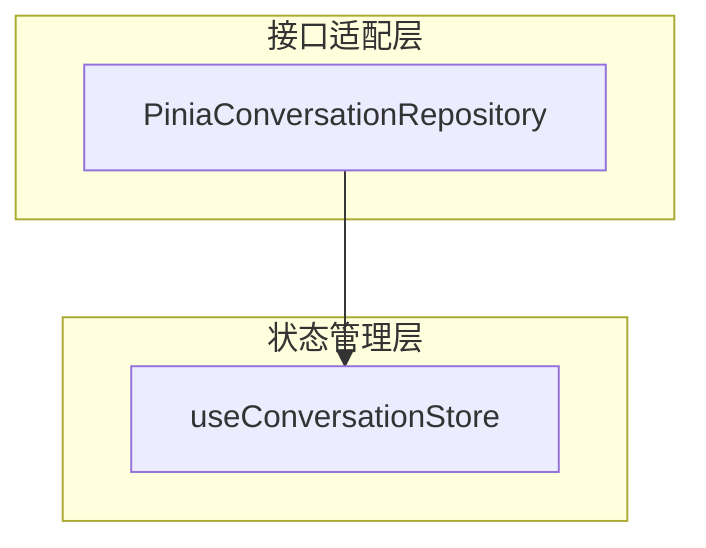
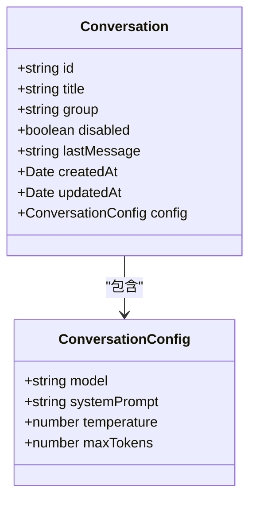
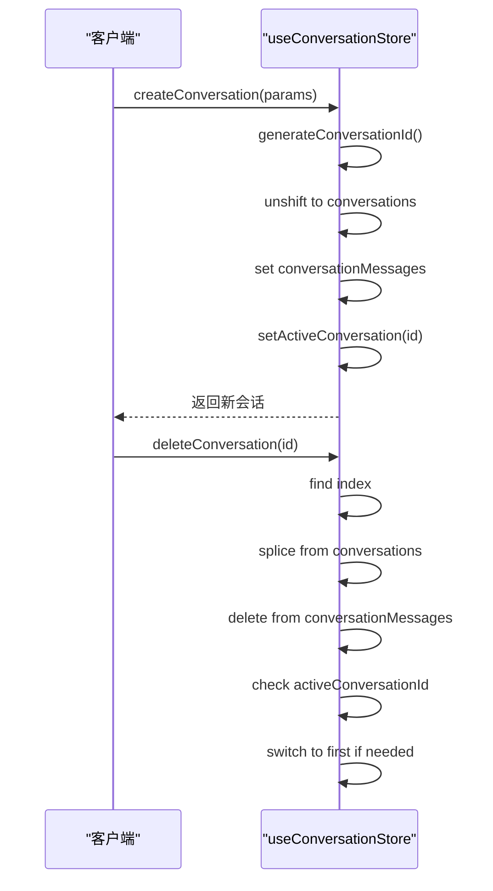
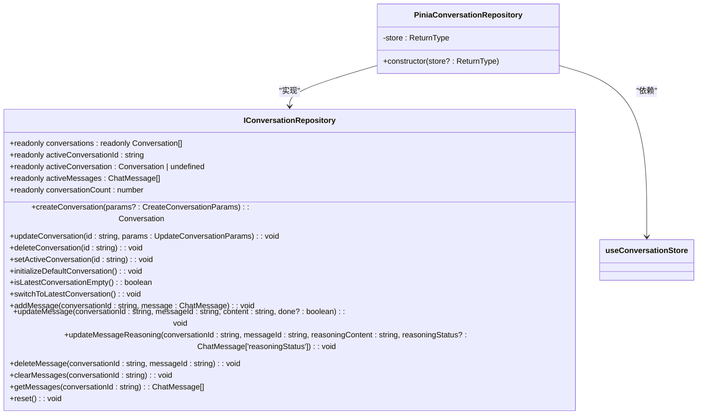
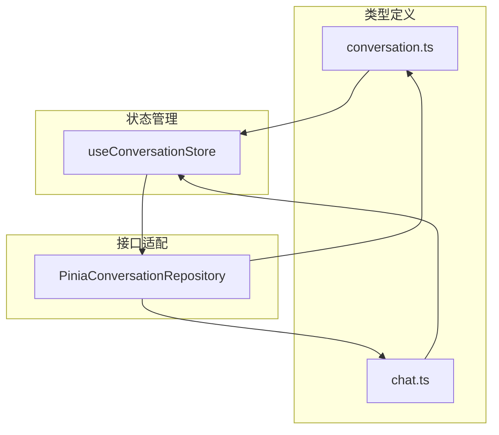

# 会话管理策略

<cite>
**本文档引用文件**  
- [conversation.ts](file://app/stores/conversation.ts)
- [pinia-conv-repos.ts](file://app/utils/pinia-conv-repos.ts)
- [conversation.ts](file://app/types/conversation.ts)
- [conv-repos.ts](file://app/types/conv-repos.ts)
</cite>

## 目录
1. [引言](#引言)
2. [项目结构](#项目结构)
3. [核心组件](#核心组件)
4. [架构概览](#架构概览)
5. [详细组件分析](#详细组件分析)
6. [依赖关系分析](#依赖关系分析)
7. [性能考虑](#性能考虑)
8. [故障排除指南](#故障排除指南)
9. [结论](#结论)

## 引言
本文档系统性地介绍会话管理的设计与实现，聚焦于 `conversation.ts` 中的 Pinia store 结构设计与 `pinia-conv-repos.ts` 中的持久化机制。通过分析会话对象的数据模型、内存组织方式、操作逻辑及与 localStorage 的同步机制，帮助开发者全面掌握会话生命周期控制。

## 项目结构
会话管理相关代码分布在以下目录中：
- `app/stores/conversation.ts`：定义会话状态管理的 Pinia store
- `app/utils/pinia-conv-repos.ts`：实现会话仓库接口，适配 Pinia store
- `app/types/conversation.ts`：定义会话相关的类型
- `app/types/conv-repos.ts`：定义会话存储仓库接口

**Section sources**
- [conversation.ts](file://app/stores/conversation.ts#L1-L314)
- [pinia-conv-repos.ts](file://app/utils/pinia-conv-repos.ts#L1-L114)
- [conversation.ts](file://app/types/conversation.ts#L1-L78)
- [conv-repos.ts](file://app/types/conv-repos.ts#L1-L129)

## 核心组件
会话管理的核心组件包括：
- `useConversationStore`：基于 Pinia 的会话状态管理器，负责会话的创建、更新、删除和激活。
- `PiniaConversationRepository`：实现 `IConversationRepository` 接口，提供统一的会话操作接口。
- `Conversation` 类型：定义会话对象的数据模型。

**Section sources**
- [conversation.ts](file://app/stores/conversation.ts#L1-L314)
- [pinia-conv-repos.ts](file://app/utils/pinia-conv-repos.ts#L1-L114)
- [conversation.ts](file://app/types/conversation.ts#L1-L78)

## 架构概览
会话管理采用分层架构，分为状态管理层和接口适配层。状态管理层使用 Pinia store 管理会话状态，接口适配层通过 `PiniaConversationRepository` 实现统一的会话操作接口。

**Diagram sources**
- [pinia-conv-repos.ts](file://app/utils/pinia-conv-repos.ts#L1-L114)
- [conversation.ts](file://app/stores/conversation.ts#L1-L314)

## 详细组件分析

### 会话数据模型分析
`Conversation` 接口定义了会话对象的数据模型，包含以下字段：
- `id`：会话唯一标识
- `title`：会话标题
- `group`：会话分组
- `disabled`：是否禁用
- `lastMessage`：最后一条消息内容
- `createdAt`：创建时间
- `updatedAt`：更新时间
- `config`：会话配置

**Diagram sources**
- [conversation.ts](file://app/types/conversation.ts#L1-L78)

**Section sources**
- [conversation.ts](file://app/types/conversation.ts#L1-L78)

### 会话操作逻辑分析
会话的创建、激活、重命名与删除操作由 `useConversationStore` 提供的方法实现：
- `createConversation`：创建新会话，插入到会话列表头部，并设置为活跃会话。
- `setActiveConversation`：切换活跃会话，检查会话是否存在。
- `updateConversation`：更新会话信息，合并新参数并更新时间戳。
- `deleteConversation`：删除会话，从列表中移除，并清理消息映射，若删除的是活跃会话则切换到第一个会话。

**Diagram sources**
- [conversation.ts](file://app/stores/conversation.ts#L1-L314)

**Section sources**
- [conversation.ts](file://app/stores/conversation.ts#L1-L314)

### 持久化机制分析
`PiniaConversationRepository` 实现了 `IConversationRepository` 接口，将 `useConversationStore` 的状态和方法暴露为统一的接口。该类通过构造函数注入 store 实例，提供对会话状态的访问和操作方法。

**Diagram sources**
- [pinia-conv-repos.ts](file://app/utils/pinia-conv-repos.ts#L1-L114)
- [conv-repos.ts](file://app/types/conv-repos.ts#L1-L129)

**Section sources**
- [pinia-conv-repos.ts](file://app/utils/pinia-conv-repos.ts#L1-L114)
- [conv-repos.ts](file://app/types/conv-repos.ts#L1-L129)

## 依赖关系分析
会话管理模块的依赖关系如下：
- `useConversationStore` 依赖 `Conversation` 和 `ChatMessage` 类型。
- `PiniaConversationRepository` 依赖 `useConversationStore` 和 `IConversationRepository` 接口。
- 外部组件通过 `PiniaConversationRepository` 访问会话状态，避免直接依赖 Pinia store。

**Diagram sources**
- [conversation.ts](file://app/stores/conversation.ts#L1-L314)
- [pinia-conv-repos.ts](file://app/utils/pinia-conv-repos.ts#L1-L114)
- [conversation.ts](file://app/types/conversation.ts#L1-L78)
- [conv-repos.ts](file://app/types/conv-repos.ts#L1-L129)

**Section sources**
- [conversation.ts](file://app/stores/conversation.ts#L1-L314)
- [pinia-conv-repos.ts](file://app/utils/pinia-conv-repos.ts#L1-L114)

## 性能考虑
- **懒加载**：会话消息按需加载，避免一次性加载所有消息。
- **批量更新**：在 `updateConversation` 中使用 `Object.assign` 批量更新属性。
- **内存管理**：删除会话时清理消息映射，避免内存泄漏。
- **自动保存**：通过监听状态变化实现自动保存，减少手动保存操作。

## 故障排除指南
- **空会话处理**：使用 `isLatestConversationEmpty` 检查最新会话是否为空，避免重复创建。
- **大量会话下的性能**：通过 `switchToLatestConversation` 快速切换到最新会话，减少遍历开销。
- **状态恢复**：在会话切换时，通过 `setActiveConversation` 恢复会话状态。

**Section sources**
- [conversation.ts](file://app/stores/conversation.ts#L1-L314)

## 结论
本文档详细介绍了会话管理的设计与实现，涵盖了数据模型、操作逻辑、持久化机制和性能优化。通过 `PiniaConversationRepository` 提供统一的接口，实现了会话状态的高效管理和持久化同步，帮助开发者全面掌握会话生命周期控制。