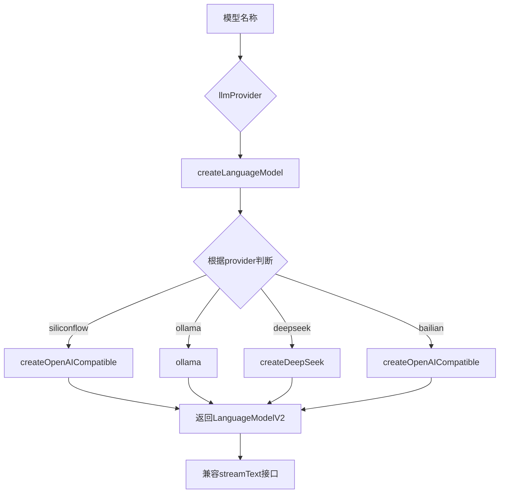
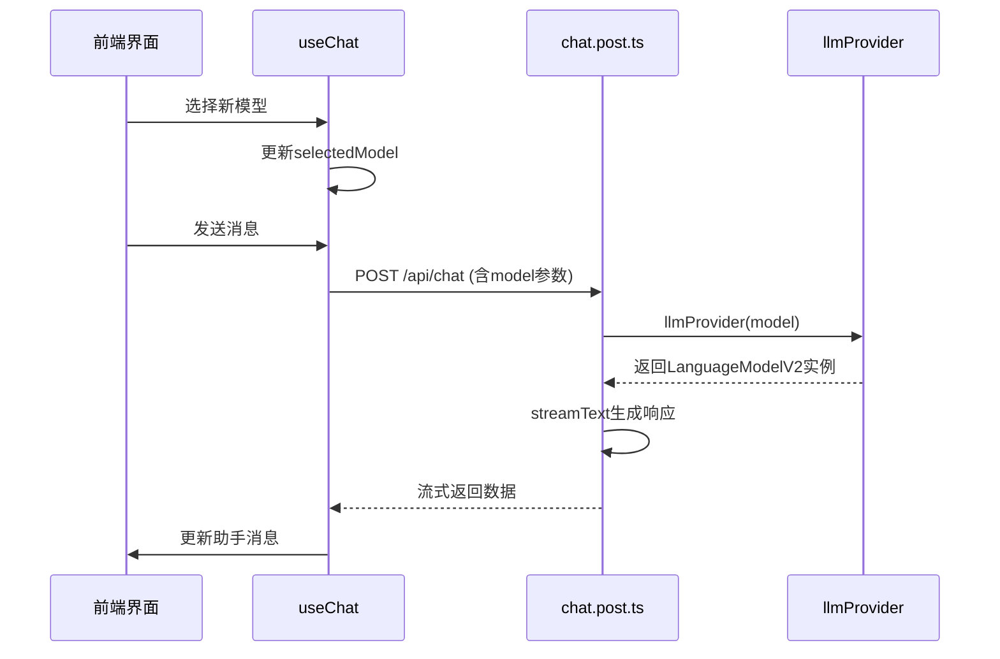

# 模型切换机制

<cite>
**本文档引用文件**  
- [ModelSelect.vue](file://app/components/ModelSelect.vue)
- [model.ts](file://server/utils/model.ts)
- [model.ts](file://shared/types/model.ts)
- [chat.post.ts](file://server/api/chat.post.ts)
- [useChat.ts](file://app/composables/useChat.ts)
- [conversation.ts](file://app/stores/conversation.ts)
- [nuxt.config.ts](file://nuxt.config.ts)
</cite>

## 目录
1. [简介](#简介)
2. [前端模型选择组件](#前端模型选择组件)
3. [模型工厂与动态实例化](#模型工厂与动态实例化)
4. [支持的模型类型与配置要求](#支持的模型类型与配置要求)
5. [自定义模型注册方法](#自定义模型注册方法)
6. [运行时模型切换与会话上下文处理](#运行时模型切换与会话上下文处理)
7. [调试技巧与常见问题解决方案](#调试技巧与常见问题解决方案)
8. [总结](#总结)

## 简介
本文档详细说明多AI模型动态切换的实现原理与集成方式。从前端组件到后端模型工厂函数，系统性地解析模型切换机制的各个关键环节。文档涵盖模型选择、实例化、配置管理、会话上下文处理及调试策略，确保开发者能够灵活配置和扩展模型支持。

## 前端模型选择组件

`ModelSelect.vue` 是一个基于 Element Plus 的下拉选择器组件，用于在用户界面中选择当前使用的 AI 模型。该组件通过 `defineModel` 实现双向绑定，将选中的模型名称同步到父组件或组合式函数中。

组件使用 `AvailableModels` 列表渲染可选模型项，并通过 `selectModel` 方法更新绑定值。选择后自动关闭弹出层，提供良好的用户体验。模型描述通过 `displayDescription` 方法格式化，显示提供商和简要说明。

该组件通过响应式机制触发全局配置变更，当模型选择改变时，会立即反映在后续的聊天请求中。

**Section sources**
- [ModelSelect.vue](file://app/components/ModelSelect.vue#L1-L161)

## 模型工厂与动态实例化

`server/utils/model.ts` 文件中的 `llmProvider` 函数是模型切换机制的核心。它是一个模型工厂函数，根据传入的模型名称动态实例化对应的 AI SDK 客户端。

工厂函数通过 `createModelProvider` 创建一个自定义提供器，遍历 `AvailableModels` 列表，为每个模型配置创建相应的语言模型实例。支持的提供商包括硅基流动（siliconflow）、Ollama、DeepSeek 和阿里百炼（bailian）。

对于不同提供商，使用对应的 SDK 封装函数：
- 硅基流动和阿里百炼使用 `createOpenAICompatible`
- Ollama 使用 `ollama` 提供器
- DeepSeek 使用专用的 `createDeepSeek`

模型实例统一实现 `LanguageModelV2` 接口，确保输出兼容 `streamText` 流式响应。此外，支持中间件配置，如 `think` 模式，通过 `wrapLanguageModel` 包装基础模型以添加推理能力。



**Diagram sources**
- [model.ts](file://server/utils/model.ts#L45-L121)

**Section sources**
- [model.ts](file://server/utils/model.ts#L1-L121)

## 支持的模型类型与配置要求

系统支持多种AI模型，按提供商分类如下：

### 硅基流动（SiliconFlow）
- **DeepSeek-R1**：擅长数学和编程
- **DeepSeek-V3.1**：通用对话模型
- **Qwen2.5-72B**：大参数模型，支持128K上下文
- **Qwen3-Coder系列**：专业代码生成模型
- **Kimi-Dev-72B**：开源编程大模型

### Ollama
- **Qwen2.5-7B**：支持32K上下文
- **Qwen2.5-Coder-7B**：轻量级代码生成
- **Qwen3-4B**：支持256K上下文，含思考模式

### DeepSeek
- **DeepSeek-Chat**：非思考模式
- **DeepSeek-Reasoner**：思考模式

### 阿里百炼（Bailian）
- **Qwen3-Coder-Plus**：支持1M上下文
- **Qwen3-Plus**：融合思考与非思考模式
- **DeepSeek-V3**：自研MoE模型，671B参数

#### 配置要求
所有模型需要在 `nuxt.config.ts` 中配置相应的API密钥和基础URL：

- `siliconFlowApiUrl` 和 `siliconFlowApiKey`
- `deepseekApiKey`
- `bailianApiUrl` 和 `bailianApiKey`

这些配置通过 `useRuntimeConfig()` 在运行时注入，确保安全性。

**Section sources**
- [model.ts](file://shared/types/model.ts#L1-L148)
- [nuxt.config.ts](file://nuxt.config.ts#L1-L27)

## 自定义模型注册方法

要注册新的自定义模型，需遵循以下步骤：

1. 在 `shared/types/model.ts` 的 `AvailableModels` 数组中添加新模型配置对象
2. 确保提供 `id`、`name`、`description`、`provider` 四个必填字段
3. 若需特殊处理，可添加 `middleware` 字段
4. 确保 `provider` 值与后端支持的提供商匹配

例如，添加一个新的Ollama模型：
```typescript
{
  id: 'my-custom-model:latest',
  name: 'MyCustomModel',
  description: '自定义本地模型',
  provider: 'ollama',
  middleware: undefined,
}
```

添加后，该模型将自动被 `llmProvider` 工厂函数识别并实例化，无需修改其他代码。

**Section sources**
- [model.ts](file://shared/types/model.ts#L50-L148)

## 运行时模型切换与会话上下文处理

运行时模型切换通过前端组件与组合式函数的响应式系统实现。`useChat.ts` 中的 `selectedModel` 引用被绑定到 `ModelSelect.vue`，当用户选择新模型时，该值自动更新。

在发送聊天请求时，`generateResponse` 函数将当前 `selectedModel.value` 作为参数传递给 `/api/chat` 接口。后端 `chat.post.ts` 接收模型名称，通过 `llmProvider(model)` 获取对应模型实例进行推理。

模型切换对会话上下文的影响：
- **历史消息保留**：切换模型不会清除现有对话历史
- **上下文连续性**：新模型基于完整历史生成回复
- **性能差异**：不同模型的响应速度和质量可能不同
- **上下文长度限制**：需注意各模型的最大上下文长度

系统通过Pinia状态管理确保会话数据的一致性。`conversation.ts` 中的 `useConversationStore` 管理所有会话和消息，无论模型如何切换，上下文数据保持完整。



**Diagram sources**
- [useChat.ts](file://app/composables/useChat.ts#L1-L391)
- [chat.post.ts](file://server/api/chat.post.ts#L1-L43)

**Section sources**
- [useChat.ts](file://app/composables/useChat.ts#L1-L391)
- [conversation.ts](file://app/stores/conversation.ts#L1-L314)

## 调试技巧与常见问题解决方案

### 调试技巧
1. **启用DevTools**：Nuxt配置中已启用devtools，可实时监控状态变化
2. **检查网络请求**：查看 `/api/chat` 请求中的model参数是否正确
3. **日志输出**：在 `model.ts` 中添加console.log观察模型实例化过程
4. **流式响应调试**：监听SSE事件类型（text-delta, reasoning-delta等）

### 常见问题及解决方案

#### 模型不可用
- **现象**：请求返回404或500错误
- **原因**：API密钥无效或基础URL配置错误
- **解决方案**：检查 `nuxt.config.ts` 中的运行时配置，确保密钥正确

#### 响应格式不一致
- **现象**：前端解析流数据失败
- **原因**：不同模型返回的SSE格式有差异
- **解决方案**：在 `generateResponse` 中增强JSON解析容错能力，添加try-catch

#### 模型切换无效果
- **现象**：切换模型后仍使用旧模型
- **原因**：`selectedModel` 未正确绑定或未传递到API
- **解决方案**：检查 `useChat` 返回的 `selectedModel` 是否被正确使用

#### 上下文丢失
- **现象**：新模型未获取完整对话历史
- **原因**：消息映射未正确传递
- **解决方案**：确保 `messages.value.map()` 正确序列化所有历史消息

#### 性能问题
- **现象**：响应延迟严重
- **原因**：模型本身响应慢或网络延迟
- **解决方案**：实现超时机制，提供取消请求功能

**Section sources**
- [useChat.ts](file://app/composables/useChat.ts#L200-L300)
- [chat.post.ts](file://server/api/chat.post.ts#L20-L40)

## 总结
本文档全面解析了多AI模型动态切换的实现机制。从前端组件到后端工厂函数，系统展示了如何通过响应式设计和模块化架构实现灵活的模型管理。通过标准化的接口和配置体系，开发者可以轻松扩展支持新的AI模型，满足多样化的应用场景需求。