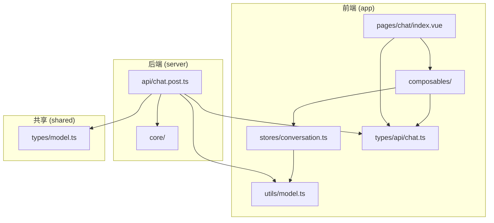
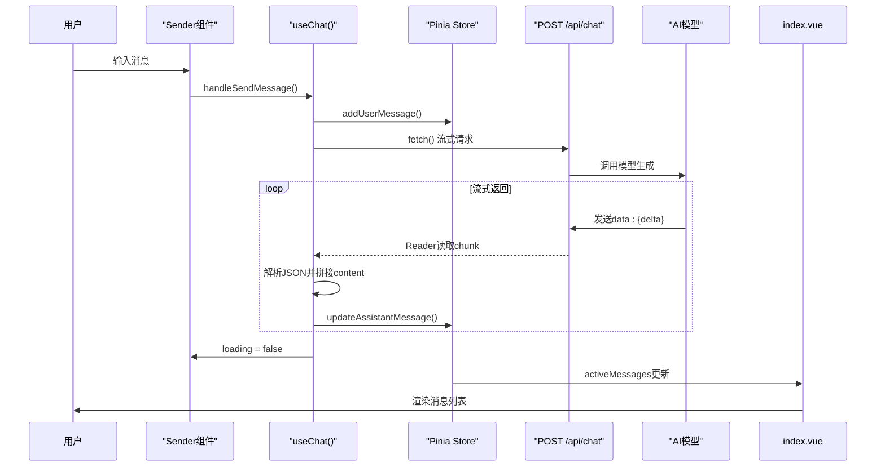
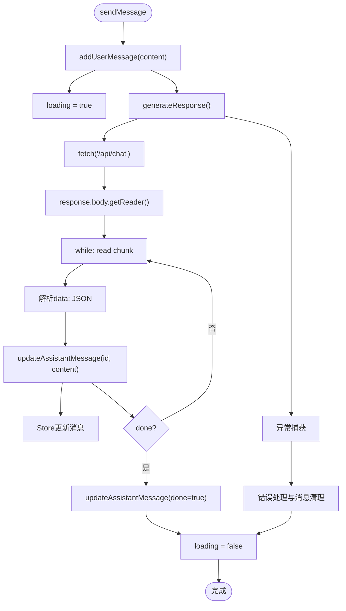
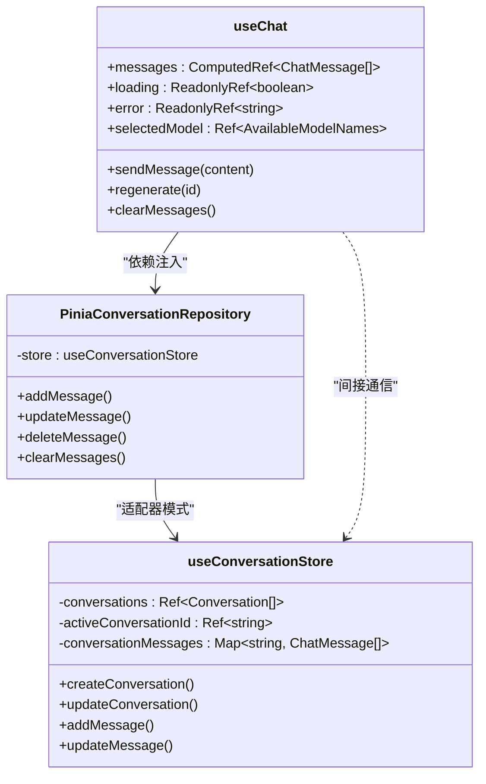

# 聊天交互功能

<cite>
**本文档引用文件**  
- [useChat.ts](file://app/composables/useChat.ts)
- [index.vue](file://app/pages/chat/index.vue)
- [chat.post.ts](file://server/api/chat.post.ts)
- [conversation.ts](file://app/stores/conversation.ts)
- [pinia-conv-repos.ts](file://app/utils/pinia-conv-repos.ts)
- [chat.ts](file://shared/types/api/chat.ts)
- [model.ts](file://shared/types/model.ts)
- [chat.ts](file://app/types/chat.ts)
- [conversation.ts](file://app/types/conversation.ts)
- [conv-repos.ts](file://app/types/conv-repos.ts)
</cite>

## 目录
1. [简介](#简介)
2. [项目结构](#项目结构)
3. [核心组件](#核心组件)
4. [架构概览](#架构概览)
5. [详细组件分析](#详细组件分析)
6. [依赖分析](#依赖分析)
7. [性能考虑](#性能考虑)
8. [故障排除指南](#故障排除指南)
9. [结论](#结论)

## 简介
本文档深入解析基于Vue 3与Pinia的聊天交互功能实现机制，重点围绕`useChat.ts`组合式函数与`chat/index.vue`页面组件的协作关系。详细说明用户输入消息的发送流程、流式响应的接收与拼接逻辑、错误重试机制及加载状态管理。结合代码示例展示如何通过H3事件流从POST /api/chat获取实时token并逐步更新UI。文档涵盖`useChat`中核心方法如`send`、`regenerate`、`stop`的调用链与状态控制逻辑，阐明与Pinia store的数据同步机制。同时提供异常处理策略（如网络中断、模型超时）和性能优化建议（如流控、防抖），并给出典型使用场景的代码片段，帮助开发者理解并扩展聊天交互行为。

## 项目结构
项目采用分层架构设计，主要分为应用层、服务层与共享类型定义层。前端逻辑集中于`app`目录，包含组合式函数、页面组件、状态管理与类型定义；后端API位于`server`目录，处理流式响应生成；共享类型定义在`shared`目录，确保前后端类型一致性。



**图示来源**  
- [index.vue](file://app/pages/chat/index.vue)
- [useChat.ts](file://app/composables/useChat.ts)
- [conversation.ts](file://app/stores/conversation.ts)
- [chat.post.ts](file://server/api/chat.post.ts)

**本节来源**  
- [index.vue](file://app/pages/chat/index.vue)
- [useChat.ts](file://app/composables/useChat.ts)
- [conversation.ts](file://app/stores/conversation.ts)
- [chat.post.ts](file://server/api/chat.post.ts)

## 核心组件
本系统的核心组件包括：
- `useChat.ts`：提供聊天功能的组合式函数，封装了消息发送、流式接收、错误处理等核心逻辑。
- `index.vue`：聊天页面主组件，负责UI渲染与用户交互。
- `conversation.ts`：Pinia状态管理模块，维护会话与消息数据。
- `pinia-conv-repos.ts`：适配器模式实现，将Pinia Store暴露为统一接口。
- `chat.post.ts`：服务器端API处理流式响应生成。

这些组件通过清晰的职责划分与松耦合设计，实现了高可维护性与可扩展性。

**本节来源**  
- [useChat.ts](file://app/composables/useChat.ts#L1-L391)
- [index.vue](file://app/pages/chat/index.vue#L1-L838)
- [conversation.ts](file://app/stores/conversation.ts#L1-L314)

## 架构概览
系统采用前后端分离架构，前端通过组合式函数封装业务逻辑，后端通过H3事件流返回AI生成的token。数据流从用户输入开始，经`useChat`处理后发送至`/api/chat`，服务端流式返回响应，前端逐步拼接并更新UI。



**图示来源**  
- [useChat.ts](file://app/composables/useChat.ts#L150-L350)
- [index.vue](file://app/pages/chat/index.vue#L200-L250)
- [chat.post.ts](file://server/api/chat.post.ts#L10-L40)

## 详细组件分析

### useChat组合式函数分析
`useChat`是聊天功能的核心逻辑封装，通过依赖注入支持不同的会话存储实现。

#### 核心方法调用链


**图示来源**  
- [useChat.ts](file://app/composables/useChat.ts#L250-L350)

#### 状态管理与数据同步
`useChat`通过`PiniaConversationRepository`与Pinia Store进行数据同步，确保UI与状态一致。



**图示来源**  
- [useChat.ts](file://app/composables/useChat.ts#L1-L100)
- [pinia-conv-repos.ts](file://app/utils/pinia-conv-repos.ts#L1-L114)
- [conversation.ts](file://app/stores/conversation.ts#L1-L314)

**本节来源**  
- [useChat.ts](file://app/composables/useChat.ts#L1-L391)
- [pinia-conv-repos.ts](file://app/utils/pinia-conv-repos.ts#L1-L114)

### index.vue页面组件分析
`index.vue`是聊天功能的UI入口，负责渲染消息列表、输入框及交互控件。

#### UI组件协作关系
```mermaid
flowchart LR
Sender --> useChat : "handleSendMessage"
useChat --> conversationStore : "addMessage/updateMessage"
conversationStore --> messages : "activeMessages"
messages --> BubbleList : "formattedMessages"
BubbleList --> Thinking : "推理内容展示"
BubbleList --> XMarkdown : "Markdown渲染"
BubbleList --> Sender : "重新生成/预览"
```

**图示来源**  
- [index.vue](file://app/pages/chat/index.vue#L50-L150)

#### 消息格式化逻辑
```mermaid
flowchart TD
RawMessages["原始消息列表"] --> Format["formattedMessages computed"]
Format --> Map["messages.map()"]
Map --> IsUser{"role === 'user'?"}
IsUser --> |是| UserStyle["placement='end'", "variant='outlined'"]
IsUser --> |否| AssistantStyle["placement='start'", "variant='filled'"]
UserStyle --> Output
AssistantStyle --> Output
Output --> BubbleList["BubbleList组件渲染"]
```

**图示来源**  
- [index.vue](file://app/pages/chat/index.vue#L180-L200)

**本节来源**  
- [index.vue](file://app/pages/chat/index.vue#L1-L838)

## 依赖分析
系统各组件间存在清晰的依赖关系，通过接口抽象降低耦合度。

```mermaid
dependency-graph
useChat --> pinia-conv-repos
useChat --> conversation
useChat --> chat-types
index.vue --> useChat
index.vue --> conversation
index.vue --> pinia-conv-repos
chat.post.ts --> model-utils
chat.post.ts --> template-gen
chat.post.ts --> mcp-tools
shared-types --> all
```

**图示来源**  
- [useChat.ts](file://app/composables/useChat.ts)
- [index.vue](file://app/pages/chat/index.vue)
- [chat.post.ts](file://server/api/chat.post.ts)

**本节来源**  
- [useChat.ts](file://app/composables/useChat.ts)
- [index.vue](file://app/pages/chat/index.vue)
- [chat.post.ts](file://server/api/chat.post.ts)

## 性能考虑
### 流式响应优化
- 采用`TextDecoder`流式解码，避免内存堆积
- 分块处理H3事件流，实时更新UI
- 使用`requestAnimationFrame`优化渲染性能

### 防抖与节流
- 输入框支持防抖，避免频繁请求
- 滚动监听使用`ResizeObserver`，减少重排

### 内存管理
- 使用`Map`存储会话消息，支持高效增删
- 组件卸载时清理`ResizeObserver`，防止内存泄漏

**本节来源**  
- [useChat.ts](file://app/composables/useChat.ts#L200-L250)
- [index.vue](file://app/pages/chat/index.vue#L400-L500)

## 故障排除指南
### 常见错误处理
- **网络中断**：`fetch`失败时捕获异常，设置`error.value`
- **模型超时**：服务端`stopWhen: stepCountIs(5)`限制步骤
- **空响应**：检查`reader`是否存在，避免空指针

### 异常恢复策略
- 消息发送失败时，保留用户输入内容
- 助手消息为空时自动删除，避免残留
- 错误提示5秒后自动消失，提升用户体验

### 调试建议
- 启用`console.warn`查看流数据解析失败
- 检查`/api/chat`返回的`Content-Type`是否为`text/event-stream`
- 验证`PiniaConversationRepository`是否正确注入

**本节来源**  
- [useChat.ts](file://app/composables/useChat.ts#L250-L300)
- [chat.post.ts](file://server/api/chat.post.ts#L20-L30)

## 结论
本文档全面解析了聊天交互功能的实现机制，展示了从用户输入到AI响应的完整数据流。系统通过组合式函数封装业务逻辑，Pinia管理状态，H3事件流实现实时响应，形成了高内聚、低耦合的架构设计。开发者可基于此框架扩展更多功能，如多模型切换、对话记忆、工具调用等。