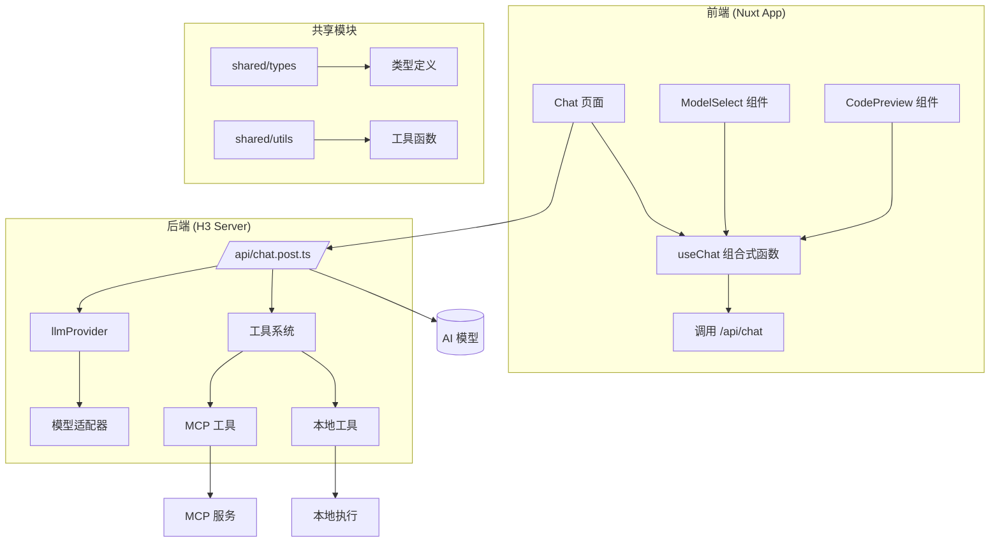
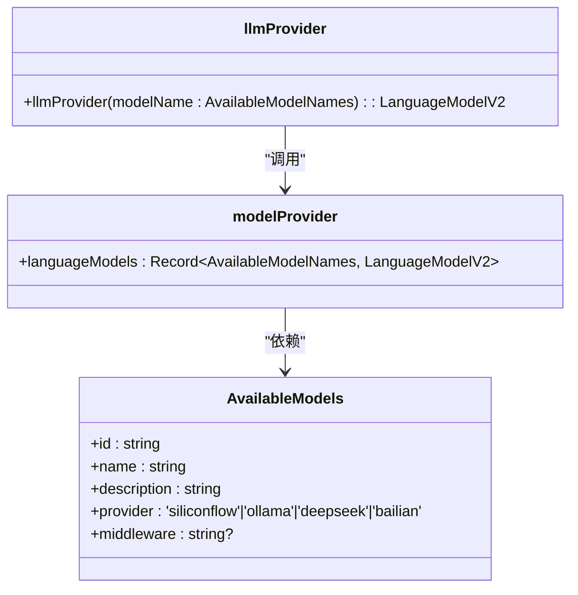
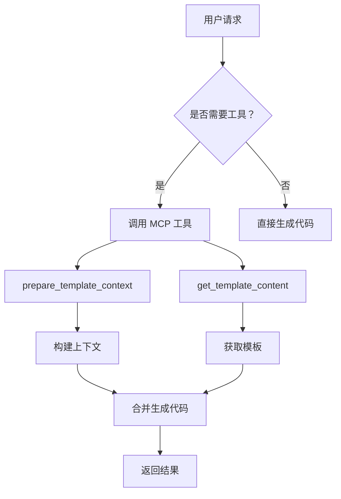
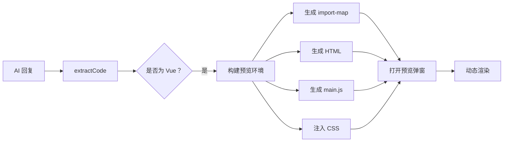

# 系统概述

<cite>
**本文档引用文件**  
- [README.md](file://README.md)
- [app/pages/chat/index.vue](file://app/pages/chat/index.vue)
- [server/api/chat.post.ts](file://server/api/chat.post.ts)
- [app/composables/useChat.ts](file://app/composables/useChat.ts)
- [shared/types/model.ts](file://shared/types/model.ts)
- [server/utils/model.ts](file://server/server/utils/model.ts)
- [server/core/prompt/template-gen.ts](file://server/core/prompt/template-gen.ts)
- [server/core/tools/mcp-tools.ts](file://server/core/tools/mcp-tools.ts)
- [server/core/tools/local-tools.ts](file://server/core/tools/local-tools.ts)
- [shared/utils/code.ts](file://shared/utils/code.ts)
</cite>

## 目录

1. [项目简介](#项目简介)  
2. [核心架构设计](#核心架构设计)  
3. [技术栈与模块划分](#技术栈与模块划分)  
4. [核心功能详解](#核心功能详解)  
5. [模型管理与多源支持](#模型管理与多源支持)  
6. [工具调用机制](#工具调用机制)  
7. [代码生成流程](#代码生成流程)  
8. [会话与状态管理](#会话与状态管理)  
9. [代码预览与交互能力](#代码预览与交互能力)  
10. [应用场景与开发者价值](#应用场景与开发者价值)

## 项目简介

`code_gen` 是一个基于自然语言交互的全栈 AI 代码生成应用，旨在通过智能化方式提升开发者效率。用户可通过自然语言描述需求，系统将自动生成前端或后端代码，并支持实时预览、源码提取、下载及重新生成等交互功能。

该项目采用 Nuxt 3 作为全栈框架，结合 Vue 3 构建现代化用户界面，后端通过 H3 提供 API 接口，前后端共享类型定义与工具函数，形成统一的开发体验。系统支持多模型切换、流式响应输出、会话持久化管理，适用于快速原型开发、组件生成、教学演示等多种场景。

**Section sources**  
- [README.md](file://README.md#L1-L109)

## 核心架构设计

**Diagram sources**  
- [app/pages/chat/index.vue](file://app/pages/chat/index.vue#L1-L799)
- [server/api/chat.post.ts](file://server/api/chat.post.ts#L1-L43)
- [app/composables/useChat.ts](file://app/composables/useChat.ts#L1-L391)

**Section sources**  
- [app/pages/chat/index.vue](file://app/pages/chat/index.vue#L1-L799)
- [server/api/chat.post.ts](file://server/api/chat.post.ts#L1-L43)

## 技术栈与模块划分

`code_gen` 项目采用清晰的三层架构设计：

- **前端层**：基于 Nuxt 3 + Vue 3 实现响应式 UI，使用 Element Plus X 组件库构建会话管理、消息气泡、输入框等交互组件。
- **服务层**：通过 H3 框架提供 RESTful API 接口，处理聊天请求并调用 AI SDK 进行流式响应。
- **共享层**：`shared/` 目录存放跨前后端复用的类型定义与工具函数，确保类型安全与逻辑一致性。

项目目录结构体现了模块化设计理念，各部分职责明确：
- `app/`：Nuxt 应用主体，包含页面、组件、组合式函数等。
- `server/`：服务端逻辑，包括 API 接口、提示词工程、工具集成等。
- `shared/`：共享类型与工具，避免重复定义。

**Section sources**  
- [README.md](file://README.md#L1-L109)

## 核心功能详解

### 自然语言驱动的代码生成

用户在聊天界面输入自然语言需求（如“生成一个带搜索框的表格组件”），系统将该请求转发至后端 `/api/chat` 接口，由 AI 模型解析意图并生成对应代码。

### 流式响应与实时渲染

前端通过 `fetch` 调用后端接口，接收流式数据（SSE），逐字显示 AI 回复过程，提升交互体验。消息内容以 Markdown 格式渲染，支持代码高亮。

### 会话管理

系统支持多会话切换、重命名、删除、清空等操作，所有会话数据本地存储，便于用户组织不同项目或任务。

### 代码交互操作

每条 AI 生成的消息下方提供四个操作按钮：
- **重新生成**：重新生成该响应。
- **复制源码**：提取代码块并复制到剪贴板。
- **预览组件**：在弹窗中实时预览 Vue 组件效果。
- **下载源码**：将代码保存为文件。

**Section sources**  
- [app/pages/chat/index.vue](file://app/pages/chat/index.vue#L1-L799)
- [app/composables/useChat.ts](file://app/composables/useChat.ts#L1-L391)

## 模型管理与多源支持

系统支持多种大模型来源，用户可通过 `.env` 文件配置不同平台的 API 密钥：

- **硅基流动（SiliconFlow）**：支持 DeepSeek、Qwen 等多个厂商模型。
- **DeepSeek 官方 API**：提供更稳定的官方模型访问。
- **Ollama 本地模型**：支持 `qwen2.5:7b` 等本地部署模型，实现离线使用。

模型选择通过 `ModelSelect` 组件实现，前端将选中的模型名称传递给后端，后端根据配置动态加载对应模型实例。

**Diagram sources**  
- [shared/types/model.ts](file://shared/types/model.ts#L1-L148)
- [server/utils/model.ts](file://server/utils/model.ts#L1-L121)

**Section sources**  
- [shared/types/model.ts](file://shared/types/model.ts#L1-L148)
- [server/utils/model.ts](file://server/utils/model.ts#L1-L121)

## 工具调用机制

系统集成了 MCP（Model Context Protocol）工具系统，允许 AI 模型调用外部能力以增强生成准确性。

### MCP 工具集成

- `template_mcp`：提供模板内容获取功能，支持多种前后端模板（如 Vue、Service、Controller 等）。
- `mysql_mcp`：连接数据库，根据表名生成模板上下文（字段、类型、关系等）。

这些工具通过 `initMcpTools()` 初始化，并在 `chat.post.ts` 中注入为 AI 的可用工具。

### 本地工具

系统内置本地工具，如 `dateTime`，用于获取当前日期时间，展示本地扩展能力。

**Diagram sources**  
- [server/core/tools/mcp-tools.ts](file://server/core/tools/mcp-tools.ts#L1-L93)
- [server/core/tools/local-tools.ts](file://server/core/tools/local-tools.ts#L1-L19)

**Section sources**  
- [server/core/tools/mcp-tools.ts](file://server/core/tools/mcp-tools.ts#L1-L93)
- [server/core/tools/local-tools.ts](file://server/core/tools/local-tools.ts#L1-L19)

## 代码生成流程

1. 用户输入需求并选择模型。
2. 前端调用 `/api/chat` 接口，携带消息历史与模型名称。
3. 后端根据模型名称通过 `llmProvider` 获取对应语言模型。
4. 设置系统提示词 `templateGenPrompt`，指导 AI 使用 Velocity 模板引擎生成代码。
5. 若需数据库上下文，则调用 `prepare_template_context` 工具准备数据。
6. 若需模板文件，则调用 `get_template_content` 获取模板。
7. AI 模型结合上下文与模板，生成完整代码并以流式返回。
8. 前端接收流式数据，实时渲染消息内容。

系统提示词严格规定了模板处理规则，特别是对 `#[[...]]#` 字面块的处理，确保生成代码的完整性与正确性。

**Section sources**  
- [server/api/chat.post.ts](file://server/api/chat.post.ts#L1-L43)
- [server/core/prompt/template-gen.ts](file://server/core/prompt/template-gen.ts#L1-L237)

## 会话与状态管理

会话状态通过 Pinia 存储管理，`PiniaConversationRepository` 类实现会话的增删改查与消息持久化。

`useChat` 组合式函数封装了聊天核心逻辑：
- `sendMessage()`：发送消息并启动流式接收。
- `regenerate()`：重新生成某条消息后的所有回复。
- `clearMessages()`：清空当前会话。
- `addUserMessage()` / `addAssistantMessage()`：添加消息。

所有状态（消息列表、加载状态、错误信息、当前模型）均通过响应式变量暴露，供组件使用。

**Section sources**  
- [app/composables/useChat.ts](file://app/composables/useChat.ts#L1-L391)
- [app/utils/pinia-conv-repos.ts](file://app/utils/pinia-conv-repos.ts)

## 代码预览与交互能力

系统通过 `CodePreview` 组件实现 Vue 组件的实时预览功能。其原理如下：

1. 调用 `extractCode()` 工具函数从 AI 回复中提取 Vue 代码。
2. 构建完整的预览环境，包括：
   - `element-plus.js`：自动加载 Element Plus 样式与组件。
   - `main.vue`：入口模板。
   - `index.html`：包含 CDN 资源与容器。
   - `import-map.json`：模块映射。
   - `tsconfig.json`：TypeScript 配置。
3. 使用浏览器内置模块系统动态加载并渲染组件。

相关工具函数位于 `shared/utils/code.ts`，如 `buildPlaygroundMain()`、`generateImportMap()` 等。

**Diagram sources**  
- [shared/utils/code.ts](file://shared/utils/code.ts#L1-L227)
- [app/components/CodePreview.vue](file://app/components/CodePreview.vue)

**Section sources**  
- [shared/utils/code.ts](file://shared/utils/code.ts#L1-L227)
- [app/pages/chat/index.vue](file://app/pages/chat/index.vue#L1-L799)

## 应用场景与开发者价值

`code_gen` 项目适用于以下场景：

- **快速原型开发**：通过自然语言快速生成页面或组件代码，缩短开发周期。
- **学习辅助**：帮助开发者理解特定模式的实现方式，如表格、表单、CRUD 接口等。
- **跨技术栈支持**：支持前后端代码生成，降低全栈开发门槛。
- **AI 编程教学**：展示 AI 如何结合模板、工具与上下文生成高质量代码。
- **企业级代码标准化**：通过统一模板确保生成代码符合团队规范。

对于开发者而言，该项目不仅提升了编码效率，还展示了现代 AI 编程工具链的完整形态：自然语言交互、多模型支持、工具增强、流式反馈、可视化预览，是 AI 辅助开发的典型范例。