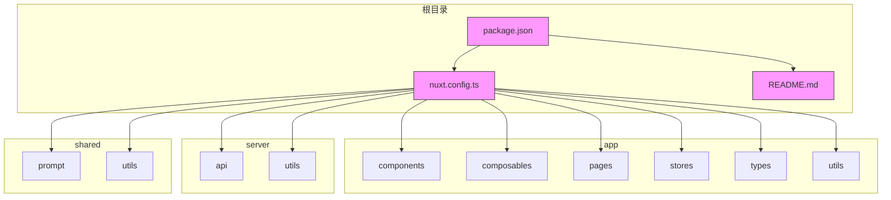
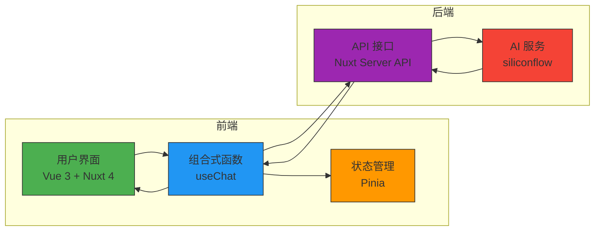
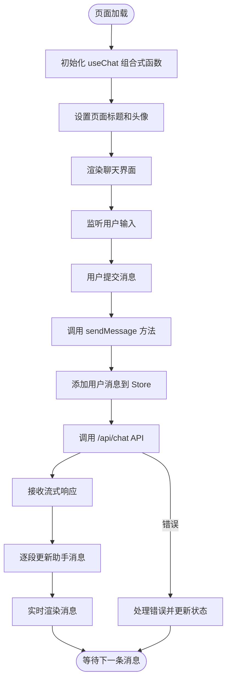
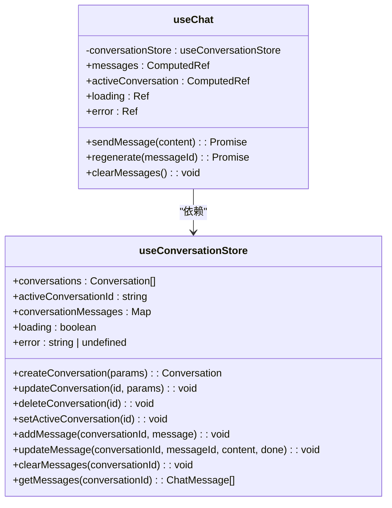
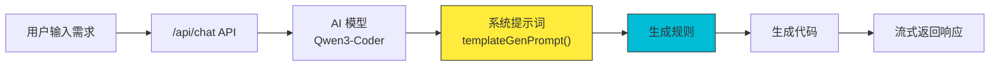
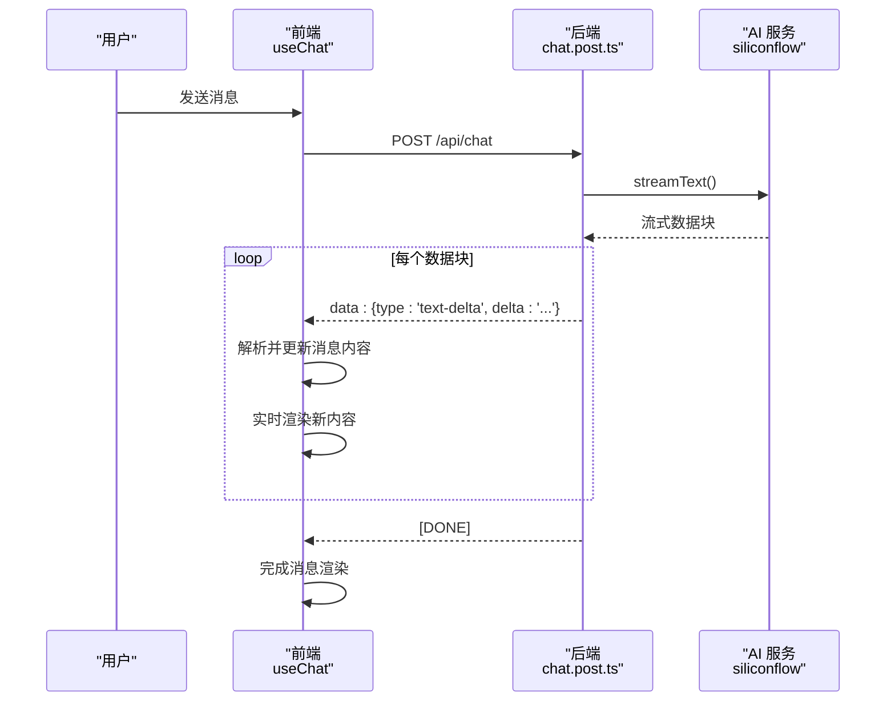
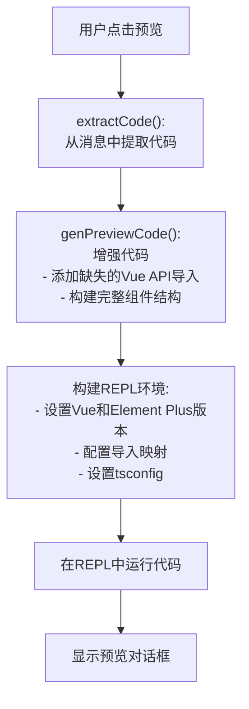
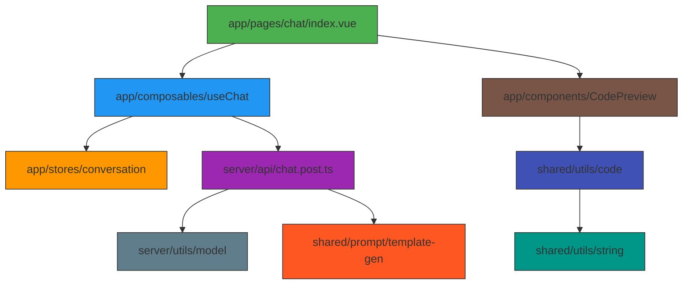

# 项目概述

<cite>
**本文档引用的文件**   
- [README.md](file://README.md)
- [app/pages/index.vue](file://app/pages/index.vue)
- [app/pages/chat/index.vue](file://app/pages/chat/index.vue)
- [app/stores/conversation.ts](file://app/stores/conversation.ts)
- [app/composables/useChat.ts](file://app/composables/useChat.ts)
- [app/components/CodePreview.vue](file://app/components/CodePreview.vue)
- [server/api/chat.post.ts](file://server/api/chat.post.ts)
- [server/utils/model.ts](file://server/utils/model.ts)
- [shared/prompt/template-gen.ts](file://shared/prompt/template-gen.ts)
- [shared/prompt/ai-gen.ts](file://shared/prompt/ai-gen.ts)
- [shared/utils/code.ts](file://shared/utils/code.ts)
- [app/types/chat.ts](file://app/types/chat.ts)
- [app/types/conversation.ts](file://app/types/conversation.ts)
</cite>

## 目录
1. [项目概述](#项目概述)
2. [项目结构](#项目结构)
3. [核心功能模块](#核心功能模块)
4. [系统架构](#系统架构)
5. [详细组件分析](#详细组件分析)
6. [数据流与状态管理](#数据流与状态管理)
7. [AI代码生成机制](#ai代码生成机制)
8. [实时响应与流式处理](#实时响应与流式处理)
9. [代码预览功能](#代码预览功能)
10. [依赖关系分析](#依赖关系分析)

## 项目概述

`code_gen` 是一个基于 Nuxt 4 的全栈 AI 代码生成工具，旨在通过智能提示和流式 AI 响应，帮助开发者快速生成前端、后端代码以及数据库脚本等开发资产。项目采用现代化的前端技术栈，结合强大的 AI 服务，为开发者提供高效的代码生成体验。

该项目的核心定位是提升开发效率，目标用户为需要快速构建应用的前端与全栈开发者。通过简洁直观的用户界面，开发者可以与 AI 助手进行自然语言对话，描述其代码需求，AI 助手将实时生成高质量的代码片段，并提供即时预览功能。

项目整体架构采用前后端分离模式。前端基于 Vue 3 组合式 API 和 Nuxt 框架构建，使用 Pinia 进行全局状态管理；后端通过 Nuxt Server API 提供服务，集成 siliconflow 等 AI 服务，实现流式文本生成。主要功能模块包括智能代码生成、多会话管理、实时代码预览和流式响应显示，为用户提供流畅、高效的开发辅助体验。

**Section sources**
- [README.md](file://README.md)
- [app/pages/index.vue](file://app/pages/index.vue)

## 项目结构

项目遵循 Nuxt 4 的标准目录结构，并根据功能进行了模块化组织。主要目录包括 `app`（前端应用）、`server`（后端 API）、`shared`（共享资源）和 `public`（静态资源）。

**Diagram sources**
- [nuxt.config.ts](file://nuxt.config.ts)
- [package.json](file://package.json)

**Section sources**
- [project_structure](file://workspace_path)

## 核心功能模块

`code_gen` 项目围绕 AI 代码生成的核心功能，构建了多个关键模块，共同协作以提供完整的开发辅助体验。

### 智能代码生成
该模块是项目的核心，用户通过聊天界面输入需求（如“创建一个带有搜索功能的用户列表组件”），AI 助手会根据预设的提示模板（Prompt）生成相应的代码。生成的代码覆盖前端（Vue 组件）、后端（如 Controller、Service）和数据库脚本（SQL）等多种类型。

### 会话管理
系统支持多会话管理，用户可以创建、切换、删除不同的对话。每个会话独立保存其聊天历史和生成的代码，方便用户针对不同项目或功能进行组织。会话状态由 Pinia store 统一管理。

### 实时代码预览
当 AI 生成代码后，用户可以一键预览代码的实际运行效果。系统利用 `@vue/repl` 在浏览器中动态运行生成的 Vue 组件，无需离开当前页面即可查看 UI 效果，极大地提升了开发效率。

### 流式响应显示
AI 生成的响应以流式（streaming）方式返回，前端能够逐字逐句地显示生成过程，模拟“思考”和“打字”的效果，提供更自然、更流畅的交互体验。

**Section sources**
- [app/pages/chat/index.vue](file://app/pages/chat/index.vue)
- [server/api/chat.post.ts](file://server/api/chat.post.ts)

## 系统架构

`code_gen` 项目采用典型的前后端分离架构，结合 Nuxt 的服务端渲染能力，构建了一个高效、可扩展的全栈应用。

**Diagram sources**
- [app/pages/chat/index.vue](file://app/pages/chat/index.vue)
- [app/composables/useChat.ts](file://app/composables/useChat.ts)
- [server/api/chat.post.ts](file://server/api/chat.post.ts)

**Section sources**
- [app/pages/chat/index.vue](file://app/pages/chat/index.vue)
- [app/composables/useChat.ts](file://app/composables/useChat.ts)
- [server/api/chat.post.ts](file://server/api/chat.post.ts)

## 详细组件分析

### 聊天页面组件分析

`app/pages/chat/index.vue` 是应用的核心交互界面，负责整合所有功能模块。

**Diagram sources**
- [app/pages/chat/index.vue](file://app/pages/chat/index.vue#L181-L231)
- [app/composables/useChat.ts](file://app/composables/useChat.ts#L200-L364)

**Section sources**
- [app/pages/chat/index.vue](file://app/pages/chat/index.vue)

## 数据流与状态管理

项目使用 Pinia 作为状态管理库，`useConversationStore` 是核心的 store，负责管理所有会话相关的状态。

**Diagram sources**
- [app/stores/conversation.ts](file://app/stores/conversation.ts#L0-L43)
- [app/composables/useChat.ts](file://app/composables/useChat.ts#L0-L44)

**Section sources**
- [app/stores/conversation.ts](file://app/stores/conversation.ts)
- [app/composables/useChat.ts](file://app/composables/useChat.ts)

## AI代码生成机制

AI 代码生成的核心在于精心设计的提示模板（Prompt），它指导 AI 模型如何生成符合要求的代码。

### 提示模板分析

项目定义了两个主要的提示模板：

1.  **`templateGenPrompt`**: 位于 `shared/prompt/template-gen.ts`，这是一个通用的代码生成器角色，能够根据需求生成后端、前端和数据库脚本，并遵循特定的工作流程。
2.  **`aiGenPrompt`**: 位于 `shared/prompt/ai-gen.ts`，这是一个专业的前端开发专家角色，专门生成高质量的 Vue3 组件代码，技术栈限定为 Vue3.5、Element Plus 和 `<script setup>` 语法。

**Diagram sources**
- [server/api/chat.post.ts](file://server/api/chat.post.ts#L0-L24)
- [shared/prompt/template-gen.ts](file://shared/prompt/template-gen.ts#L0-L65)
- [shared/prompt/ai-gen.ts](file://shared/prompt/ai-gen.ts#L0-L33)

**Section sources**
- [server/api/chat.post.ts](file://server/api/chat.post.ts)
- [shared/prompt/template-gen.ts](file://shared/prompt/template-gen.ts)
- [shared/prompt/ai-gen.ts](file://shared/prompt/ai-gen.ts)

## 实时响应与流式处理

项目通过流式 API 实现了实时的 AI 响应显示，为用户提供近乎即时的反馈。

### 流式处理流程

**Diagram sources**
- [server/api/chat.post.ts](file://server/api/chat.post.ts#L0-L24)
- [app/composables/useChat.ts](file://app/composables/useChat.ts#L84-L170)

**Section sources**
- [server/api/chat.post.ts](file://server/api/chat.post.ts)
- [app/composables/useChat.ts](file://app/composables/useChat.ts)

## 代码预览功能

`CodePreview` 组件利用 `@vue/repl` 在浏览器中安全地运行和预览生成的 Vue 代码。

### 代码预览流程

**Diagram sources**
- [app/components/CodePreview.vue](file://app/components/CodePreview.vue#L0-L53)
- [shared/utils/code.ts](file://shared/utils/code.ts#L200-L394)

**Section sources**
- [app/components/CodePreview.vue](file://app/components/CodePreview.vue)
- [shared/utils/code.ts](file://shared/utils/code.ts)

## 依赖关系分析

项目依赖关系清晰，各模块职责分明。

**Diagram sources**
- [app/pages/chat/index.vue](file://app/pages/chat/index.vue)
- [app/composables/useChat.ts](file://app/composables/useChat.ts)
- [server/api/chat.post.ts](file://server/api/chat.post.ts)
- [shared/utils/code.ts](file://shared/utils/code.ts)

**Section sources**
- [app/pages/chat/index.vue](file://app/pages/chat/index.vue)
- [app/composables/useChat.ts](file://app/composables/useChat.ts)
- [server/api/chat.post.ts](file://server/api/chat.post.ts)
- [shared/utils/code.ts](file://shared/utils/code.ts)