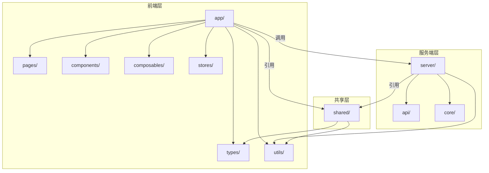
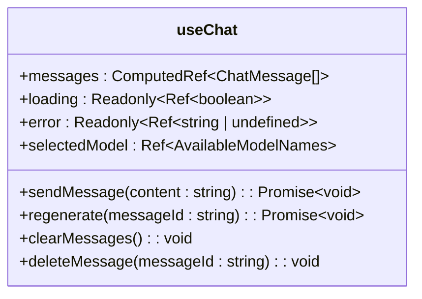
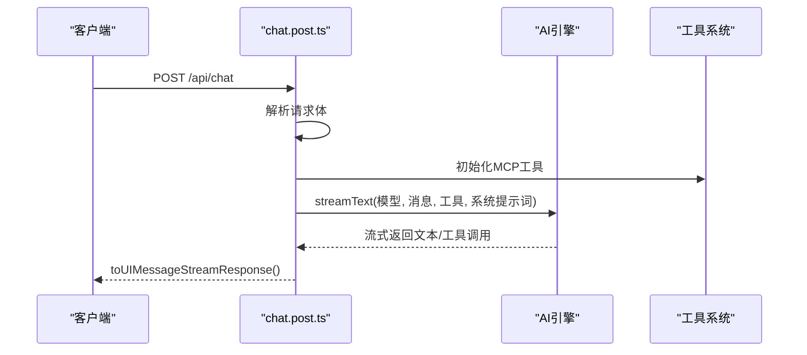
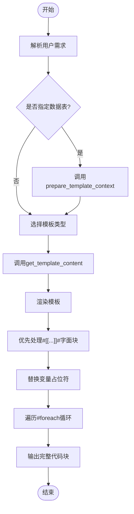
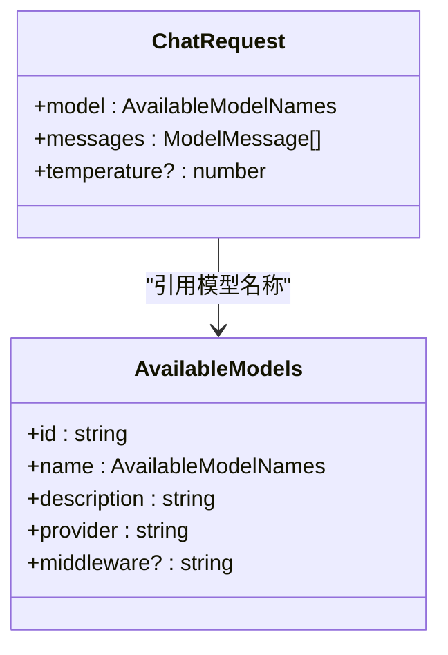

# 项目目录结构详解

<cite>
**本文档引用的文件**
- [nuxt.config.ts](file://nuxt.config.ts)
- [useChat.ts](file://app/composables/useChat.ts)
- [chat.post.ts](file://server/api/chat.post.ts)
- [template-gen.ts](file://server/core/prompt/template-gen.ts)
- [chat.ts](file://shared/types/api/chat.ts)
- [model.ts](file://shared/types/model.ts)
- [mcp-tools.ts](file://server/core/tools/mcp-tools.ts)
- [local-tools.ts](file://server/core/tools/local-tools.ts)
- [chat.ts](file://app/types/chat.ts)
- [conversation.ts](file://app/types/conversation.ts)
</cite>

## 目录结构概览

本项目采用清晰的分层架构设计，通过 `app/`、`server/` 和 `shared/` 三大核心目录实现关注点分离。整体结构遵循现代全栈应用的最佳实践，前端与后端逻辑解耦，共享类型与工具集中管理，提升代码可维护性与团队协作效率。



**Diagram sources**
- [app](file://app)
- [server](file://server)
- [shared](file://shared)

## 前端模块：app/ 目录解析

`app/` 目录作为前端源码中心，承载所有用户界面逻辑，采用 Nuxt 3 的模块化组织方式，包含页面、组件、组合式函数、状态管理及类型定义。

### 页面路由：pages/ 子目录

`app/pages/` 实现基于文件系统的路由机制。`index.vue` 为首页入口，`chat/index.vue` 对应 `/chat` 路由，支持嵌套路由结构，自动映射为应用导航路径。

**Section sources**
- [app/pages](file://app/pages)

### 可复用逻辑：composables/ 子目录

`app/composables/` 存放组合式函数（Composables），封装可跨组件复用的业务逻辑。例如 `useChat.ts` 提供完整的聊天会话管理能力，包括消息发送、AI响应流处理、会话状态维护等。



**Diagram sources**
- [useChat.ts](file://app/composables/useChat.ts#L15-L391)

**Section sources**
- [useChat.ts](file://app/composables/useChat.ts#L15-L391)

### 状态管理：stores/ 子目录

`app/stores/` 使用 Pinia 实现状态管理，`conversation.ts` 定义了会话数据结构与操作接口，支持会话的增删改查及消息持久化，为 `useChat` 提供底层数据支撑。

**Section sources**
- [conversation.ts](file://app/stores/conversation.ts)

### 类型定义：types/ 子目录

`app/types/` 定义前端专用类型，如 `chat.ts` 中的 `ChatMessage` 接口扩展了气泡样式属性与推理状态，`conversation.ts` 定义会话实体与配置结构，确保类型安全。

**Section sources**
- [chat.ts](file://app/types/chat.ts#L1-L19)
- [conversation.ts](file://app/types/conversation.ts#L1-L79)

## 后端模块：server/ 目录解析

`server/` 目录承载服务端核心逻辑，包括 REST API 接口、AI 提示工程实现及工具系统，通过 Nuxt 的服务器端功能提供动态服务。

### API 接口：api/ 子目录

`server/api/` 实现 RESTful 接口，`chat.post.ts` 处理 `/api/chat` 的 POST 请求，接收用户消息并流式返回 AI 生成结果。该接口集成 LLM 提供商、工具系统与提示词模板。



**Diagram sources**
- [chat.post.ts](file://server/api/chat.post.ts#L1-L44)

**Section sources**
- [chat.post.ts](file://server/api/chat.post.ts#L1-L44)

### 核心逻辑：core/ 子目录

`server/core/` 包含核心业务逻辑，分为 `prompt`、`steps` 和 `tools` 三个子模块。

#### AI 提示工程：core/prompt/ 子目录

`core/prompt/template-gen.ts` 定义了代码生成的系统提示词，采用中文版 `templateGenPrompt` 函数，详细规定了 Velocity 模板解析规则、字面量输出优先级、循环处理要求等，确保生成代码的准确性。



**Diagram sources**
- [template-gen.ts](file://server/core/prompt/template-gen.ts#L1-L238)

**Section sources**
- [template-gen.ts](file://server/core/prompt/template-gen.ts#L1-L238)

#### 工具系统：core/tools/ 子目录

`core/tools/` 实现 AI 助手的工具调用能力。`mcp-tools.ts` 集成外部 MCP（Model Context Protocol）服务，提供模板获取与数据库上下文准备功能；`local-tools.ts` 定义本地工具如时间获取，扩展 AI 能力边界。

**Section sources**
- [mcp-tools.ts](file://server/core/tools/mcp-tools.ts#L1-L94)
- [local-tools.ts](file://server/core/tools/local-tools.ts#L1-L20)

## 共享模块：shared/ 目录解析

`shared/` 目录存放跨前后端共享的类型定义与工具函数，确保类型一致性，避免重复定义。

### 共享类型：types/ 子目录

`shared/types/` 下的 `api/chat.ts` 定义 `ChatRequest` 接口，与前端 `useChat` 和后端 `chat.post.ts` 共享请求结构；`model.ts` 统一管理可用模型列表与类型，支持类型安全的模型选择。



**Diagram sources**
- [chat.ts](file://shared/types/api/chat.ts#L1-L17)
- [model.ts](file://shared/types/model.ts#L1-L149)

**Section sources**
- [chat.ts](file://shared/types/api/chat.ts#L1-L17)
- [model.ts](file://shared/types/model.ts#L1-L149)

### 共享工具：utils/ 子目录

`shared/utils/` 提供跨层通用函数，如 `code.ts`、`id.ts`、`string.ts` 等，避免逻辑重复，提升代码复用率。

**Section sources**
- [shared/utils](file://shared/utils)

## 模块导入机制：路径别名配置

`nuxt.config.ts` 中通过 `alias` 配置路径别名 `#server`，指向 `./server` 目录，允许在代码中使用 `#server/utils/model` 等简洁导入路径，提升可读性与维护性。

```ts
alias: {
  '#server': fileURLToPath(new URL('./server', import.meta.url)),
}
```

此配置使得服务端模块可在前端安全引用（如类型导入），同时保持运行时隔离。

**Section sources**
- [nuxt.config.ts](file://nuxt.config.ts#L1-L28)

## 架构优势与开发指引

该目录结构通过严格的分层设计实现了：
- **关注点分离**：前端 UI、后端逻辑、共享类型各司其职
- **可维护性**：模块边界清晰，修改影响范围可控
- **可扩展性**：新增页面、API 或工具均可按约定扩展
- **类型安全**：共享类型确保前后端数据契约一致

开发者可依据此结构快速定位：
- 页面开发 → `app/pages/`
- 组件开发 → `app/components/`
- 业务逻辑 → `app/composables/`
- API 实现 → `server/api/`
- AI 提示词 → `server/core/prompt/`
- 工具集成 → `server/core/tools/`
- 类型定义 → `shared/types/`