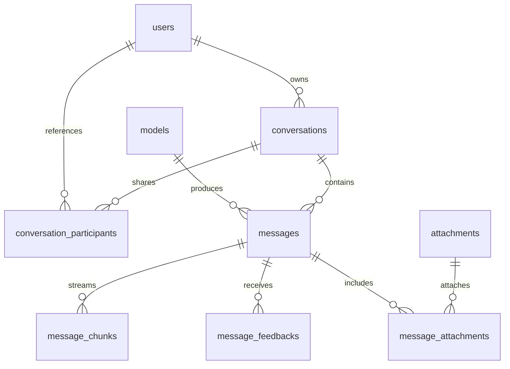
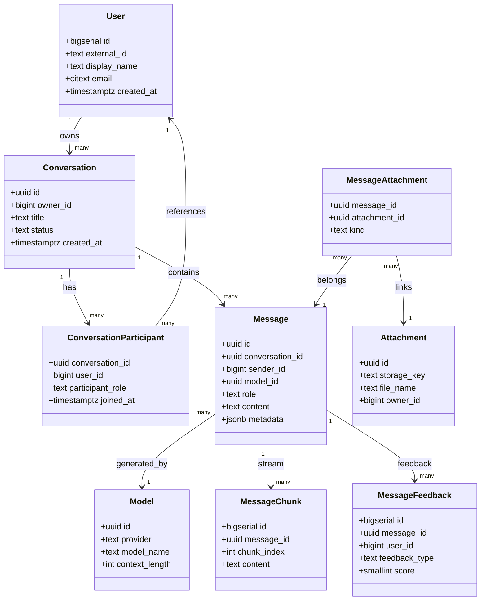
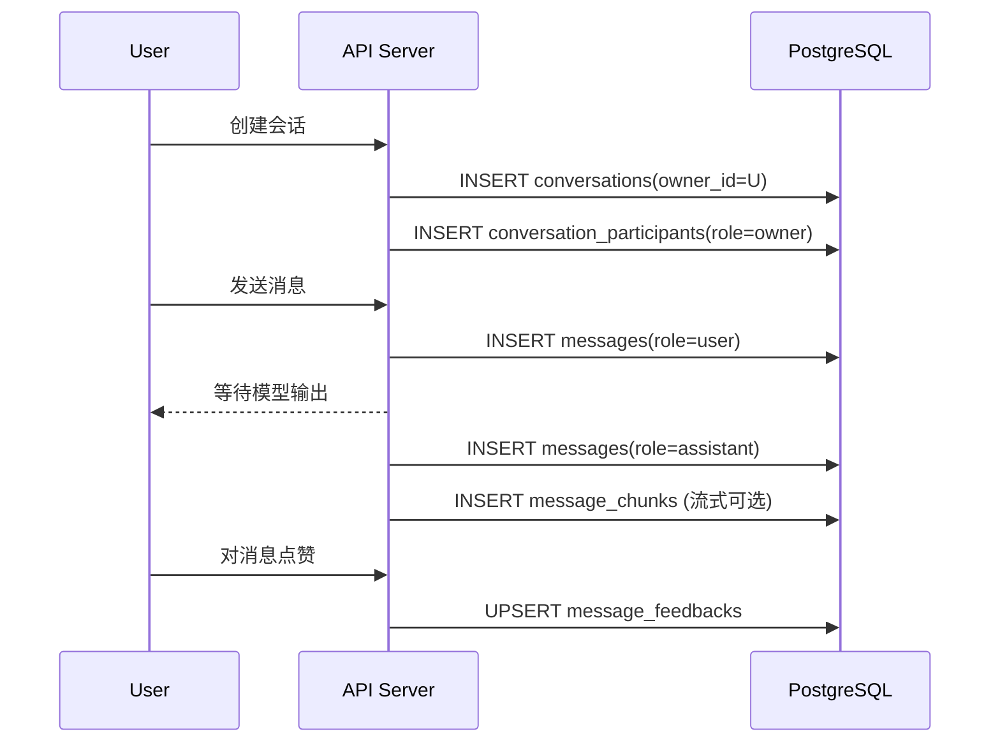

# Chat 数据库设计总览

本文档梳理支持当前 AI 会话体验的关系型数据库方案，默认运行在 PostgreSQL 15+。整体目标：

- 支撑多租户、多人协作与高频对话的扩展能力。
- 兼容文本、富文本、流式生成等多种消息形态。
- 为计费、审计、分析和离线训练留出扩展位。

## 全局结构

> 说明：在支持 Mermaid 的平台（GitHub、GitLab、VS Code 插件等）可直接渲染图形。

## UML 视图

## 关键表结构速览

| 表名 | 侧重点 | 关键字段 |
| --- | --- | --- |
| `users` | 账号与个人资料 | `id`, `external_id`, `display_name`, `email`, `locale` |
| `models` | 语言模型目录 | `id`, `provider`, `model_name`, `context_length`, `max_output_tokens`, `pricing_payload` |
| `conversations` | 会话元信息 | `id`, `owner_id`, `title`, `status`, `visibility`, `last_message_id` |
| `conversation_participants` | 会话成员与权限 | `conversation_id`, `user_id`, `participant_role`, `joined_at`, `extra` |
| `messages` | 单条消息 | `id`, `conversation_id`, `sender_id`, `role`, `content`, `rich_content`, `token_input`, `token_output` |
| `message_chunks` | 流式分片（可选） | `message_id`, `chunk_index`, `content`, `metadata` |
| `message_feedbacks` | 点赞/评分/举报 | `message_id`, `user_id`, `feedback_type`, `score`, `extra` |
| `attachments` | 上传的原始文件 | `id`, `storage_key`, `file_name`, `mime_type`, `file_size` |
| `message_attachments` | 消息与附件的多对多关系 | `message_id`, `attachment_id`, `kind`, `ordering` |

字段定义详见 `docs/sql/chat/schema.sql`。

## 会话成员表的设计动机

`conversation_participants` 用来解耦「会话归属」与「访问控制」，满足以下场景：

1. **多人协作**：允许将同一会话共享给多个用户，并按 `participant_role`（owner/editor/viewer 等）限制他们的编辑、查看、再次生成权限。
2. **外部访客**：支持向临时账号或第三方嵌入分享链接，只需插入新成员记录即可，无需复制会话或转移所有权。
3. **审计与撤权**：成员加入时间、额外属性（`extra`）可追踪权限变更；删除记录即可即时收回访问。
4. **后续拓展**：可以扩展为团队/组织维度、设置消息可见范围、统计协作活跃度等，而不污染 `conversations` 表。

如果仅依赖 `conversations.owner_id`，会导致共享能力缺失，无法表达多角色协作，也难以记录历史；因此需要单独的成员表。

## 典型流程示意

## 设计细节与建议

- **数据一致性**：`conversations.last_message_id` 作为外键回指 `messages`，允许快速查询最近消息，无需额外表。
- **扩展字段**：`metadata`/`extra` 使用 `jsonb`，既可记录上下文（提示词、工具调用等），也便于后续扩展。
- **索引策略**：高频查询建议围绕 `(conversation_id, created_at DESC)`、`(user_id, participant_role)`、`(message_id, chunk_index)` 建联合索引。`schema.sql` 已提供基础索引，可按实际负载调整。
- **软删除策略**：`deleted_at` 出现在多张表中，通过补充视图或条件索引可屏蔽已删除数据，满足审计与恢复需求。
- **迁移工具**：推荐结合 Prisma Migrate / Flyway / Liquibase 等维护 DDL 版本，与应用发布流程绑定。

## 后续可扩展方向

- 引入 `message_events` 或 `tool_invocations` 表追踪调用链与工具输出。
- 在 `conversation_participants` 之上增加团队/空间概念，实现一键分享。
- 结合 `message_feedbacks` 与 `models` 做推理成本、偏好分析，为自治调度提供依据。
- 若存在高并发写入，可考虑把只读分析型指标（token usage）拆分到独立表或时序系统。

