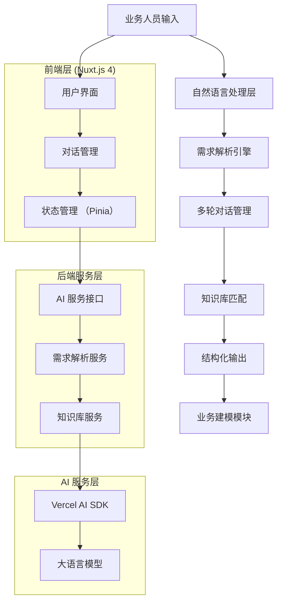
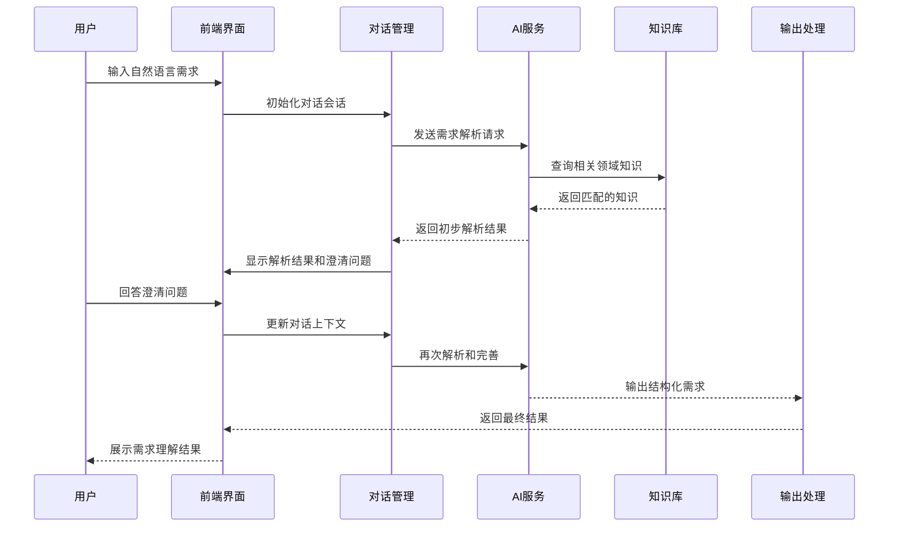

%%  %%

## 1. 项目概述

### 1.1 开发目标

需求理解引擎是智能代码生成系统的核心入口模块，负责将业务人员的自然语言描述转换为结构化的技术需求。本引擎将基于 Nuxtjs4 全栈框架和 Vercel AI SDK 构建，实现智能化的需求理解和多轮对话澄清机制。

### 1.2 核心功能

**自然语言处理**：理解业务人员用自然语言描述的需求，提取关键业务信息。

**多轮会话澄清**：通过智能对话机制，主动询问模糊需求，确保需求完整性。

**需求结构化**：将自然语言需求转换为标准化的业务模型输入格式。

**方案设计输出**：生成初步的设计方案文档，为下一步业务建模提供基础。

### 1.3 技术选型

**前端框架**：Nuxtjs4（Vue3 + SSR/SSG）
**AI 服务**：Vercel AI SDK
**状态管理**：Pinia
**UI 组件**：Nuxt UI 或 Element Plus
**开发语言**：TypeScript
**部署平台**：Vercel

## 2. 系统架构设计

### 2.1 整体架构



### 2.2 核心组件

**用户界面层**：基于 Nuxt.js 4 构建的响应式交互界面，支持多轮对话和实时反馈。

**对话管理组件**：管理用户与系统的多轮对话，维护上下文信息和对话状态。

**需求解析引擎**：使用 Vercel AI SDK 调用大语言模型，实现自然语言理解和意图识别。

**知识库服务**：存储和管理业务领域知识，支持语义检索和智能匹配。

### 2.3 数据流设计



## 3. 开发任务分解

### 3.1 第一阶段：项目初始化与基础架构（2 周）

#### 3.1.1 环境搭建

**任务列表**：

- 初始化 Nuxt.js 4 项目结构
- 配置 TypeScript 支持
- 集成 Vercel AI SDK
- 搭建开发环境和部署流程

**关键配置**：

```typescript
// nuxt.config.ts
export default defineNuxtConfig({
  modules: ["@pinia/nuxt", "@nuxt/ui", "@vercel/ai"],
  typescript: {
    strict: true,
  },
  runtimeConfig: {
    openaiApiKey: process.env.OPENAI_API_KEY,
    public: {
      baseUrl: process.env.NUXT_PUBLIC_BASE_URL || "http://localhost:3000",
    },
  },
});
```

#### 3.1.2 核心类型定义

**需求类型接口**：

```typescript
// types/requirement.ts
export interface UserRequirement {
  id: string;
  content: string;
  timestamp: Date;
  userId?: string;
}

export interface ParsedRequirement {
  id: string;
  originalText: string;
  entities: BusinessEntity[];
  relationships: EntityRelationship[];
  businessRules: BusinessRule[];
  clarificationNeeded: ClarificationQuestion[];
  confidence: number;
}

export interface BusinessEntity {
  name: string;
  type: "model" | "service" | "controller" | "view";
  attributes: EntityAttribute[];
  description: string;
}

export interface EntityAttribute {
  name: string;
  type: string;
  required: boolean;
  validation?: ValidationRule[];
  description: string;
}

export interface ClarificationQuestion {
  id: string;
  question: string;
  context: string;
  priority: "high" | "medium" | "low";
  suggestedAnswers?: string[];
}
```

#### 3.1.3 项目结构

```
project-root/
├── components/
│   ├── chat/
│   │   ├── ChatInterface.vue
│   │   ├── MessageBubble.vue
│   │   └── RequirementInput.vue
│   └── requirement/
│       ├── RequirementAnalyzer.vue
│       └── ClarificationPanel.vue
├── composables/
│   ├── useAI.ts
│   ├── useRequirementParser.ts
│   └── useChatSession.ts
├── stores/
│   ├── requirement.ts
│   └── chat.ts
├── server/
│   └── api/
│       ├── parse-requirement.post.ts
│       └── clarify.post.ts
└── types/
    ├── requirement.ts
    └── chat.ts
```

### 3.2 第二阶段：自然语言处理模块（3 周）

#### 3.2.1 AI 服务集成

**Vercel AI SDK 集成**：

```typescript
// composables/useAI.ts
import { openai } from "@ai-sdk/openai";
import { generateObject, generateText } from "ai";
import { z } from "zod";

export const useAI = () => {
  const parseRequirement = async (userInput: string) => {
    try {
      const result = await generateObject({
        model: openai("gpt-4-turbo"),
        prompt: `
作为业务分析师，请分析以下用户需求：
"${userInput}"

请提取关键业务信息：
1. 业务实体和属性
2. 实体之间的关系
3. 业务规则和约束
4. 需要澄清的模糊点
        `,
        schema: z.object({
          entities: z.array(
            z.object({
              name: z.string(),
              type: z.enum(["model", "service", "controller", "view"]),
              attributes: z.array(
                z.object({
                  name: z.string(),
                  type: z.string(),
                  required: z.boolean(),
                  description: z.string(),
                })
              ),
              description: z.string(),
            })
          ),
          relationships: z.array(
            z.object({
              from: z.string(),
              to: z.string(),
              type: z.enum(["one-to-one", "one-to-many", "many-to-many"]),
              description: z.string(),
            })
          ),
          businessRules: z.array(
            z.object({
              rule: z.string(),
              entity: z.string(),
              priority: z.enum(["high", "medium", "low"]),
            })
          ),
          clarificationQuestions: z.array(
            z.object({
              question: z.string(),
              context: z.string(),
              priority: z.enum(["high", "medium", "low"]),
              suggestedAnswers: z.array(z.string()).optional(),
            })
          ),
          confidence: z.number().min(0).max(1),
        }),
      });

      return result.object;
    } catch (error) {
      console.error("AI parsing error:", error);
      throw error;
    }
  };

  const generateClarificationQuestions = async (
    context: string,
    previousAnswers: Record<string, string>
  ) => {
    const result = await generateText({
      model: openai("gpt-4-turbo"),
      prompt: `
基于以下上下文和已有答案，生成进一步的澄清问题：

上下文：${context}
已有答案：${JSON.stringify(previousAnswers)}

请生成 3-5 个具体的澄清问题，帮助进一步明确需求细节。
      `,
    });

    return result.text;
  };

  return {
    parseRequirement,
    generateClarificationQuestions,
  };
};
```

#### 3.2.2 需求解析服务

**后端 API 端点**：

```typescript
// server/api/parse-requirement.post.ts
export default defineEventHandler(async (event) => {
  const { userInput, sessionId } = await readBody(event);

  try {
    const { parseRequirement } = useAI();
    const parsedResult = await parseRequirement(userInput);

    // 存储到会话管理
    await saveToChatSession(sessionId, {
      userInput,
      parsedResult,
      timestamp: new Date(),
    });

    return {
      success: true,
      data: parsedResult,
    };
  } catch (error) {
    throw createError({
      statusCode: 500,
      statusMessage: "需求解析失败",
    });
  }
});
```

### 3.3 第三阶段：多轮对话管理（2 周）

#### 3.3.1 对话状态管理

**Pinia Store 设计**：

```typescript
// stores/chat.ts
export const useChatStore = defineStore("chat", () => {
  const sessions = ref<Map<string, ChatSession>>(new Map());
  const currentSessionId = ref<string | null>(null);

  interface ChatSession {
    id: string;
    messages: ChatMessage[];
    currentRequirement: ParsedRequirement | null;
    clarificationAnswers: Record<string, string>;
    status: "analyzing" | "clarifying" | "completed";
    createdAt: Date;
    updatedAt: Date;
  }

  interface ChatMessage {
    id: string;
    type: "user" | "assistant" | "system";
    content: string;
    metadata?: any;
    timestamp: Date;
  }

  const createSession = (): string => {
    const sessionId = generateId();
    const session: ChatSession = {
      id: sessionId,
      messages: [],
      currentRequirement: null,
      clarificationAnswers: {},
      status: "analyzing",
      createdAt: new Date(),
      updatedAt: new Date(),
    };

    sessions.value.set(sessionId, session);
    currentSessionId.value = sessionId;
    return sessionId;
  };

  const addMessage = (
    sessionId: string,
    message: Omit<ChatMessage, "id" | "timestamp">
  ) => {
    const session = sessions.value.get(sessionId);
    if (!session) return;

    const newMessage: ChatMessage = {
      ...message,
      id: generateId(),
      timestamp: new Date(),
    };

    session.messages.push(newMessage);
    session.updatedAt = new Date();
  };

  const updateRequirement = (
    sessionId: string,
    requirement: ParsedRequirement
  ) => {
    const session = sessions.value.get(sessionId);
    if (!session) return;

    session.currentRequirement = requirement;
    session.status =
      requirement.clarificationNeeded.length > 0 ? "clarifying" : "completed";
    session.updatedAt = new Date();
  };

  const addClarificationAnswer = (
    sessionId: string,
    questionId: string,
    answer: string
  ) => {
    const session = sessions.value.get(sessionId);
    if (!session) return;

    session.clarificationAnswers[questionId] = answer;
    session.updatedAt = new Date();
  };

  return {
    sessions: readonly(sessions),
    currentSessionId: readonly(currentSessionId),
    createSession,
    addMessage,
    updateRequirement,
    addClarificationAnswer,
  };
});
```

#### 3.3.2 对话界面组件

**主聊天界面**：

```vue
<!-- components/chat/ChatInterface.vue -->
<template>
  <div class="flex flex-col h-screen bg-gray-50">
    <!-- 聊天消息区域 -->
    <div class="flex-1 overflow-y-auto p-4 space-y-4">
      <MessageBubble
        v-for="message in currentMessages"
        :key="message.id"
        :message="message"
      />

      <!-- 澄清问题区域 -->
      <ClarificationPanel
        v-if="needsClarification"
        :questions="clarificationQuestions"
        @answer="handleClarificationAnswer"
      />
    </div>

    <!-- 输入区域 -->
    <div class="border-t bg-white p-4">
      <RequirementInput @submit="handleUserInput" :disabled="isProcessing" />
    </div>
  </div>
</template>

<script setup lang="ts">
const chatStore = useChatStore();
const { parseRequirement } = useRequirementParser();

const currentMessages = computed(() => {
  const session = chatStore.sessions.get(chatStore.currentSessionId!);
  return session?.messages || [];
});

const needsClarification = computed(() => {
  const session = chatStore.sessions.get(chatStore.currentSessionId!);
  return session?.status === "clarifying";
});

const clarificationQuestions = computed(() => {
  const session = chatStore.sessions.get(chatStore.currentSessionId!);
  return session?.currentRequirement?.clarificationNeeded || [];
});

const isProcessing = ref(false);

const handleUserInput = async (input: string) => {
  if (!chatStore.currentSessionId) {
    chatStore.createSession();
  }

  // 添加用户消息
  chatStore.addMessage(chatStore.currentSessionId!, {
    type: "user",
    content: input,
  });

  isProcessing.value = true;

  try {
    // 解析需求
    const result = await parseRequirement(input, chatStore.currentSessionId!);

    // 添加系统回复
    chatStore.addMessage(chatStore.currentSessionId!, {
      type: "assistant",
      content: "我已经理解了您的需求，让我确认一些细节...",
      metadata: result,
    });

    // 更新需求状态
    chatStore.updateRequirement(chatStore.currentSessionId!, result);
  } catch (error) {
    console.error("Error processing requirement:", error);
    chatStore.addMessage(chatStore.currentSessionId!, {
      type: "system",
      content: "抱歉，处理您的需求时发生错误，请稍后再试。",
    });
  } finally {
    isProcessing.value = false;
  }
};

const handleClarificationAnswer = async (
  questionId: string,
  answer: string
) => {
  if (!chatStore.currentSessionId) return;

  // 记录答案
  chatStore.addClarificationAnswer(
    chatStore.currentSessionId,
    questionId,
    answer
  );

  // 添加对话消息
  chatStore.addMessage(chatStore.currentSessionId, {
    type: "user",
    content: answer,
    metadata: { questionId },
  });

  // 检查是否所有问题都已回答
  const session = chatStore.sessions.get(chatStore.currentSessionId);
  const allQuestionsAnswered =
    session?.currentRequirement?.clarificationNeeded.every(
      (q) => session.clarificationAnswers[q.id]
    );

  if (allQuestionsAnswered) {
    // 重新分析完整需求
    await refineRequirement(chatStore.currentSessionId);
  }
};

const refineRequirement = async (sessionId: string) => {
  // 基于澄清答案重新分析需求
  // 实现逻辑...
};

// 初始化会话
onMounted(() => {
  if (!chatStore.currentSessionId) {
    chatStore.createSession();
  }
});
</script>
```

### 3.4 第四阶段：知识库与输出模块（2 周）

#### 3.4.1 业务知识库设计

**知识库结构**：

```typescript
// types/knowledge.ts
export interface KnowledgeBase {
  domains: BusinessDomain[];
  templates: RequirementTemplate[];
  patterns: BusinessPattern[];
  rules: ValidationRule[];
}

export interface BusinessDomain {
  id: string;
  name: string;
  description: string;
  entities: string[];
  commonPatterns: string[];
  keywords: string[];
}

export interface RequirementTemplate {
  id: string;
  domain: string;
  pattern: string;
  entityMapping: Record<string, string>;
  exampleRequirements: string[];
}

export interface BusinessPattern {
  id: string;
  name: string;
  description: string;
  applicableScenarios: string[];
  implementation: {
    entities: BusinessEntity[];
    relationships: EntityRelationship[];
    businessRules: BusinessRule[];
  };
}
```

**知识库服务**：

```typescript
// composables/useKnowledgeBase.ts
export const useKnowledgeBase = () => {
  const knowledgeBase = ref<KnowledgeBase>({
    domains: [],
    templates: [],
    patterns: [],
    rules: [],
  });

  const loadKnowledgeBase = async () => {
    // 从本地或远程加载知识库
    const response = await $fetch("/api/knowledge/load");
    knowledgeBase.value = response.data;
  };

  const findMatchingDomain = (keywords: string[]): BusinessDomain | null => {
    return (
      knowledgeBase.value.domains.find((domain) =>
        keywords.some((keyword) =>
          domain.keywords.some((dk) =>
            dk.toLowerCase().includes(keyword.toLowerCase())
          )
        )
      ) || null
    );
  };

  const findMatchingTemplates = (
    domain: string,
    entities: string[]
  ): RequirementTemplate[] => {
    return knowledgeBase.value.templates.filter(
      (template) =>
        template.domain === domain &&
        entities.some((entity) =>
          Object.values(template.entityMapping).includes(entity)
        )
    );
  };

  const findMatchingPatterns = (scenario: string): BusinessPattern[] => {
    return knowledgeBase.value.patterns.filter((pattern) =>
      pattern.applicableScenarios.some((s) =>
        s.toLowerCase().includes(scenario.toLowerCase())
      )
    );
  };

  const enrichRequirement = (
    parsedReq: ParsedRequirement
  ): ParsedRequirement => {
    // 基于知识库丰富需求信息
    const entityNames = parsedReq.entities.map((e) => e.name);
    const domain = findMatchingDomain(entityNames);

    if (domain) {
      const templates = findMatchingTemplates(domain.name, entityNames);
      const patterns = findMatchingPatterns(domain.description);

      // 添加遗漏的实体和关系
      patterns.forEach((pattern) => {
        pattern.implementation.entities.forEach((entity) => {
          if (!parsedReq.entities.find((e) => e.name === entity.name)) {
            parsedReq.entities.push(entity);
          }
        });

        pattern.implementation.relationships.forEach((rel) => {
          if (
            !parsedReq.relationships.find(
              (r) => r.from === rel.from && r.to === rel.to
            )
          ) {
            parsedReq.relationships.push(rel);
          }
        });
      });
    }

    return parsedReq;
  };

  return {
    knowledgeBase: readonly(knowledgeBase),
    loadKnowledgeBase,
    findMatchingDomain,
    findMatchingTemplates,
    findMatchingPatterns,
    enrichRequirement,
  };
};
```

#### 3.4.2 结构化输出模块

**设计方案生成器**：

```typescript
// composables/useDesignGenerator.ts
export const useDesignGenerator = () => {
  const generateDesignDocument = async (
    requirement: ParsedRequirement
  ): Promise<DesignDocument> => {
    const designDoc: DesignDocument = {
      id: generateId(),
      title: `${requirement.entities[0]?.name || "系统"}设计方案`,
      version: "1.0.0",
      createdAt: new Date(),
      sections: {
        overview: generateOverview(requirement),
        dataModel: generateDataModel(requirement),
        businessLogic: generateBusinessLogic(requirement),
        apiDesign: generateApiDesign(requirement),
        uiComponents: generateUIComponents(requirement),
      },
    };

    return designDoc;
  };

  const generateOverview = (req: ParsedRequirement): DesignSection => {
    return {
      title: "项目概述",
      content: `
## 业务目标
${req.originalText}

## 核心实体
${req.entities.map((e) => `- ${e.name}: ${e.description}`).join("\n")}

## 业务规则
${req.businessRules.map((r) => `- ${r.rule}`).join("\n")}
      `,
      diagrams: [],
    };
  };

  const generateDataModel = (req: ParsedRequirement): DesignSection => {
    const erDiagram = generateERDiagram(req.entities, req.relationships);

    return {
      title: "数据模型设计",
      content: `
## 实体定义

${req.entities
  .map(
    (entity) => `
### ${entity.name}

**描述**: ${entity.description}

**属性**:
${entity.attributes
  .map(
    (attr) =>
      `- ${attr.name} (${attr.type})${attr.required ? " *" : ""}: ${
        attr.description
      }`
  )
  .join("\n")}
`
  )
  .join("\n")}

## 实体关系

${req.relationships
  .map((rel) => `- ${rel.from} ${rel.type} ${rel.to}: ${rel.description}`)
  .join("\n")}
      `,
      diagrams: [erDiagram],
    };
  };

  const generateERDiagram = (
    entities: BusinessEntity[],
    relationships: EntityRelationship[]
  ): DiagramDefinition => {
    const mermaidCode = `
erDiagram
${entities
  .map(
    (entity) => `
  ${entity.name} {
${entity.attributes
  .map((attr) => `    ${attr.type} ${attr.name}${attr.required ? " PK" : ""}`)
  .join("\n")}
  }`
  )
  .join("\n")}

${relationships
  .map(
    (rel) =>
      `  ${rel.from} ||--${
        rel.type === "one-to-many"
          ? "o{"
          : rel.type === "many-to-many"
          ? "}o--o{"
          : "||"
      } ${rel.to} : "${rel.description}"`
  )
  .join("\n")}
    `;

    return {
      type: "mermaid",
      title: "实体关系图",
      code: mermaidCode,
    };
  };

  const generateApiDesign = (req: ParsedRequirement): DesignSection => {
    const apis = req.entities.map((entity) => generateCRUDApis(entity));

    return {
      title: "API 接口设计",
      content: `
## RESTful API 设计

${apis
  .flat()
  .map(
    (api) => `
### ${api.method} ${api.path}

**描述**: ${api.description}

**请求参数**:
\`\`\`json
${JSON.stringify(api.requestSchema, null, 2)}
\`\`\`

**响应结果**:
\`\`\`json
${JSON.stringify(api.responseSchema, null, 2)}
\`\`\`
`
  )
  .join("\n")}
      `,
      diagrams: [],
    };
  };

  const generateCRUDApis = (entity: BusinessEntity): ApiDefinition[] => {
    const entityLower = entity.name.toLowerCase();
    const entityPlural = `${entityLower}s`;

    return [
      {
        method: "GET",
        path: `/${entityPlural}`,
        description: `获取${entity.name}列表`,
        requestSchema: {
          query: {
            page: "number",
            limit: "number",
            search: "string",
          },
        },
        responseSchema: {
          data: [generateEntitySchema(entity)],
          total: "number",
          page: "number",
          limit: "number",
        },
      },
      {
        method: "GET",
        path: `/${entityPlural}/:id`,
        description: `获取${entity.name}详情`,
        requestSchema: {
          params: { id: "string" },
        },
        responseSchema: {
          data: generateEntitySchema(entity),
        },
      },
      {
        method: "POST",
        path: `/${entityPlural}`,
        description: `创建${entity.name}`,
        requestSchema: {
          body: generateCreateSchema(entity),
        },
        responseSchema: {
          data: generateEntitySchema(entity),
        },
      },
      {
        method: "PUT",
        path: `/${entityPlural}/:id`,
        description: `更新${entity.name}`,
        requestSchema: {
          params: { id: "string" },
          body: generateUpdateSchema(entity),
        },
        responseSchema: {
          data: generateEntitySchema(entity),
        },
      },
      {
        method: "DELETE",
        path: `/${entityPlural}/:id`,
        description: `删除${entity.name}`,
        requestSchema: {
          params: { id: "string" },
        },
        responseSchema: {
          success: "boolean",
        },
      },
    ];
  };

  return {
    generateDesignDocument,
    generateOverview,
    generateDataModel,
    generateApiDesign,
  };
};
```

### 3.5 第五阶段：集成测试与优化（1 周）

#### 3.5.1 系统集成测试

**端到端测试用例**：

```typescript
// tests/e2e/requirement-engine.spec.ts
import { test, expect } from "@playwright/test";

test.describe("需求理解引擎测试", () => {
  test("完整的需求分析流程", async ({ page }) => {
    await page.goto("/");

    // 1. 输入需求
    const userInput =
      "我需要一个用户管理系统，包括用户注册、登录、个人信息管理功能";
    await page.fill('[data-testid="requirement-input"]', userInput);
    await page.click('[data-testid="submit-button"]');

    // 2. 等待 AI 分析结果
    await page.waitForSelector('[data-testid="analysis-result"]', {
      timeout: 30000,
    });

    // 3. 验证解析结果
    const entities = await page.locator(
      '[data-testid="entity-list"] .entity-item'
    );
    await expect(entities).toHaveCount.toBeGreaterThan(0);

    // 4. 回答澄清问题
    const clarificationQuestions = await page.locator(
      '[data-testid="clarification-questions"] .question-item'
    );
    if ((await clarificationQuestions.count()) > 0) {
      await page.click(
        '[data-testid="clarification-questions"] .question-item:first-child .answer-button'
      );
      await page.fill('[data-testid="answer-input"]', "包括邮箱和手机号注册");
      await page.click('[data-testid="submit-answer"]');
    }

    // 5. 验证最终输出
    await page.waitForSelector('[data-testid="design-document"]');
    const designDoc = await page.locator('[data-testid="design-document"]');
    await expect(designDoc).toBeVisible();

    // 6. 验证设计文档内容
    await expect(
      page.locator('[data-testid="data-model-section"]')
    ).toBeVisible();
    await expect(
      page.locator('[data-testid="api-design-section"]')
    ).toBeVisible();
  });

  test("多轮对话澄清机制", async ({ page }) => {
    // 测试多轮对话的正确性
  });

  test("知识库匹配功能", async ({ page }) => {
    // 测试知识库智能匹配
  });
});
```

## 4. 技术实现要点

### 4.1 Nuxt.js 4 全栈框架优势

**服务端渲染 (SSR)**：提供更好的 SEO 支持和首屏加载性能。

**文件系统路由**：自动生成路由，简化页面管理。

**内置 API 支持**：通过 `/server/api` 目录快速构建 API 端点。

**TypeScript 支持**：原生支持 TypeScript，提供类型安全保障。

### 4.2 Vercel AI SDK 集成策略

**模块化设计**：

```typescript
// composables/useAI.ts - AI 服务封装
interface AIService {
  parseRequirement(input: string): Promise<ParsedRequirement>;
  generateClarification(context: string): Promise<string[]>;
  enrichWithKnowledge(
    requirement: ParsedRequirement
  ): Promise<ParsedRequirement>;
}

class VercelAIService implements AIService {
  private model: any;

  constructor() {
    this.model = openai("gpt-4-turbo");
  }

  async parseRequirement(input: string): Promise<ParsedRequirement> {
    return await generateObject({
      model: this.model,
      prompt: this.buildPrompt(input),
      schema: this.getSchema(),
    });
  }

  private buildPrompt(input: string): string {
    return `
作为高级业务分析师，请对以下需求进行深入分析：

用户需求："${input}"

请按照以下维度分析：
1. 核心业务实体及其属性
2. 实体间的关系和依赖
3. 关键业务规则和约束
4. 可能的模糊点和需要澄清的问题
5. 预估的复杂度和实现难度
    `;
  }
}
```

**错误处理机制**：

```typescript
// utils/ai-error-handler.ts
export class AIErrorHandler {
  static handle(error: any): AIResponse {
    if (error.code === "RATE_LIMIT_EXCEEDED") {
      return {
        success: false,
        error: "请求过于频繁，请稍后再试",
        retryAfter: 60,
      };
    }

    if (error.code === "INVALID_API_KEY") {
      return {
        success: false,
        error: "AI 服务配置错误，请联系管理员",
      };
    }

    return {
      success: false,
      error: "系统繁忙，请稍后再试",
      details: error.message,
    };
  }
}
```

### 4.3 状态管理架构

**Pinia Store 设计模式**：

```typescript
// stores/index.ts - 全局状态管理
export const useAppStore = defineStore("app", () => {
  const isLoading = ref(false);
  const error = ref<string | null>(null);
  const user = ref<User | null>(null);

  const setLoading = (loading: boolean) => {
    isLoading.value = loading;
  };

  const setError = (errorMessage: string | null) => {
    error.value = errorMessage;
  };

  const clearError = () => {
    error.value = null;
  };

  return {
    isLoading: readonly(isLoading),
    error: readonly(error),
    user: readonly(user),
    setLoading,
    setError,
    clearError,
  };
});
```

**数据持久化策略**：

```typescript
// utils/storage.ts
export class LocalStorageManager {
  private static PREFIX = "requirement-engine:";

  static saveChatSession(sessionId: string, session: ChatSession): void {
    const key = `${this.PREFIX}session:${sessionId}`;
    localStorage.setItem(key, JSON.stringify(session));
  }

  static loadChatSession(sessionId: string): ChatSession | null {
    const key = `${this.PREFIX}session:${sessionId}`;
    const data = localStorage.getItem(key);
    return data ? JSON.parse(data) : null;
  }

  static saveRequirement(reqId: string, requirement: ParsedRequirement): void {
    const key = `${this.PREFIX}requirement:${reqId}`;
    localStorage.setItem(key, JSON.stringify(requirement));
  }

  static getAllSessions(): ChatSession[] {
    const sessions: ChatSession[] = [];
    for (let i = 0; i < localStorage.length; i++) {
      const key = localStorage.key(i);
      if (key?.startsWith(`${this.PREFIX}session:`)) {
        const data = localStorage.getItem(key);
        if (data) {
          sessions.push(JSON.parse(data));
        }
      }
    }
    return sessions.sort(
      (a, b) =>
        new Date(b.updatedAt).getTime() - new Date(a.updatedAt).getTime()
    );
  }
}
```

### 4.4 性能优化策略

**懒加载和代码分割**：

```typescript
// nuxt.config.ts - 性能优化配置
export default defineNuxtConfig({
  experimental: {
    payloadExtraction: false,
  },
  nitro: {
    compressPublicAssets: true,
  },
  vite: {
    build: {
      rollupOptions: {
        output: {
          manualChunks: {
            "ai-sdk": ["@ai-sdk/openai", "ai"],
            "chat-ui": ["./components/chat"],
            "requirement-parser": ["./composables/useRequirementParser"],
          },
        },
      },
    },
  },
});
```

**缓存策略**：

```typescript
// composables/useCache.ts
export const useCache = () => {
  const cache = new Map<
    string,
    { data: any; timestamp: number; ttl: number }
  >();

  const set = (key: string, data: any, ttl: number = 300000) => {
    // 5分钟默认TTL
    cache.set(key, {
      data,
      timestamp: Date.now(),
      ttl,
    });
  };

  const get = (key: string): any | null => {
    const item = cache.get(key);
    if (!item) return null;

    if (Date.now() - item.timestamp > item.ttl) {
      cache.delete(key);
      return null;
    }

    return item.data;
  };

  const has = (key: string): boolean => {
    return get(key) !== null;
  };

  const clear = () => {
    cache.clear();
  };

  return { set, get, has, clear };
};
```

## 5. 项目管理规划

### 5.1 开发时间表

| 阶段      | 任务        | 时间  | 主责人     | 交付物                 |
| --------- | ----------- | ----- | ---------- | ---------------------- |
| 第 1 周   | 项目初始化  | 5 天  | 全员       | 项目脚手架、环境配置   |
| 第 2 周   | 基础架构    | 5 天  | 架构师     | 核心类型定义、底层服务 |
| 第 3-5 周 | AI 服务集成 | 15 天 | AI 工程师  | 需求解析模块           |
| 第 6-7 周 | 对话管理    | 10 天 | 前端工程师 | 多轮对话界面           |
| 第 8-9 周 | 知识库服务  | 10 天 | 后端工程师 | 知识库与输出模块       |
| 第 10 周  | 集成测试    | 5 天  | 测试工程师 | 完整系统交付           |

### 5.2 质量保证措施

**代码审查规范**：

- 所有 Pull Request 必须经过至少 2 人审查
- 关键模块需要架构师参与审查
- 代码覆盖率不低于 80%

**测试策略**：

- 单元测试：所有核心逻辑函数
- 集成测试：API 端点和数据流
- E2E 测试：完整的用户场景

**性能监控**：

- AI 调用延迟监控
- 前端渲染性能监控
- 用户体验指标跟踪

### 5.3 风险管理

**技术风险**：

- AI 服务不可用：建立数据缓存和降级机制
- 性能问题：建立性能基准和监控系统
- 兼容性问题：跨浏览器测试和适配

**业务风险**：

- 需求变更：灵活的架构设计和模块化开发
- 用户反馈：建立反馈收集和快速响应机制

### 5.4 交付标准

**功能完整性**：

- 自然语言需求输入与解析
- 多轮对话澄清机制
- 知识库智能匹配
- 结构化设计文档输出

**性能指标**：

- AI 响应时间 < 10 秒
- 页面加载时间 < 3 秒
- 系统可用性 > 99%

**用户体验**：

- 界面直观易用
- 流程顺畅无阻塞
- 错误提示明确有用
- 支持移动端访问
